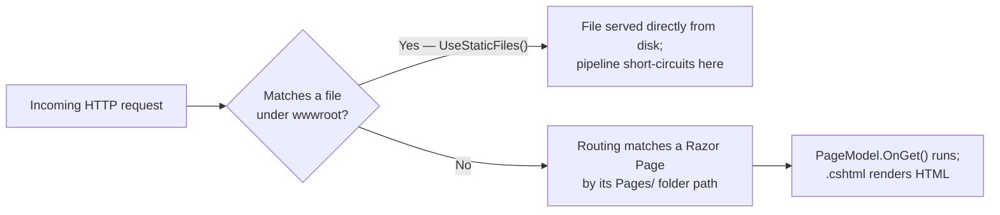
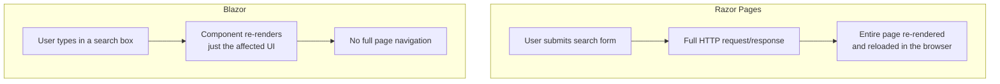

# Razor Pages and Static Files

## Introduction

Before reading this lesson, you should already be comfortable with **[Logging in ASP.NET Core](../10-aspnetcore/10-20-logging-in-aspnetcore.md)** and, more broadly, with the minimal API style this module has used throughout — routing, middleware, dependency injection, configuration, and logging, all serving JSON to callers that are themselves programs. This lesson is a deliberate change of pace, and a brief one: it introduces Razor Pages, ASP.NET Core's page-focused way of rendering actual HTML for a human sitting in a browser, and `wwwroot`, where the CSS, images, and scripts those pages depend on actually live. This curriculum's center of gravity is APIs, not server-rendered web pages — so treat this lesson as an orientation, not a deep specialization. When you need a genuinely rich, interactive browser UI later, Module 15 introduces Blazor, which is where this curriculum's real UI investment goes.

By the end of this lesson, you will be able to:

- Explain what a Razor Page is, and how a `.cshtml` file paired with a `PageModel` differs from a minimal API endpoint
- Create a simple Razor Page that handles a `GET` request and renders HTML back to the browser
- Serve static assets — CSS, images, client-side scripts — from the `wwwroot` folder using `UseStaticFiles()`
- Explain, at a conceptual level, why the request pipeline checks for a static file before it ever reaches a Razor Page
- Recognize when Razor Pages is a reasonable choice, and when a pure API or Blazor (Module 15) is a better fit
- Build a small Library/Inventory catalog page that combines a Razor Page with a linked static stylesheet

## Razor Pages and Static Files — A Layman's Perspective

Picture a library's front lobby. Taped to one wall is a laminated poster: the library's hours, a map of the floor plan, the fine schedule. It's the same poster for every single visitor who walks in — the building doesn't produce a fresh one for each person, doesn't ask who you are, doesn't change a single word based on your visit. It was printed once, hung on the wall, and every visitor who glances at it simply sees exactly what's there. If a librarian needed to update the fine schedule, they'd print a new poster and replace the old one — but at any given moment, what's on that wall is fixed, identical for everyone, and handed out completely as-is.

Now picture the librarian's front desk a few feet away. A visitor walks up and asks, "what books do you have by this author, and are any of them checked in right now?" The librarian doesn't hand over a laminated poster for that — there isn't one, because the answer depends entirely on who's asking and what's true *right now*. Instead, the librarian checks the current catalog, checks which copies are actually on the shelf at this exact moment, and writes out a fresh, personalized answer on the spot — one that would be completely different if a different visitor with a different question walked up five minutes later, or if the same visitor asked again after someone returned a book.

That's the entire difference between a static file and a Razor Page. The poster on the wall is a static file: `wwwroot` is that wall, and `UseStaticFiles()` is the policy of "if someone asks for exactly what's already hanging there, just hand it to them unchanged — don't bother the librarian at all." A CSS stylesheet, a logo image, a client-side script — none of these change based on who's asking or when they ask, so there's no reason to run any code to produce them; they're served byte-for-byte, exactly as they sit on disk.

A Razor Page is the librarian at the desk. Every time someone asks for `/catalog`, the page runs its own logic — checks the current book list, applies whatever search term was typed in, decides what HTML to build — and hands back a freshly assembled answer, every single time, even if the previous answer looked almost identical. Two different visitors asking for the same page at the same moment might see two different results, because the page actually *does something* on each request rather than simply handing over a fixed, unchanging file.

A well-run lobby needs both, and in the right order: it makes far more sense to glance at the wall first — "is this exactly a poster we already have hanging?" — before walking all the way to the desk and interrupting the librarian's actual work. ASP.NET Core's request pipeline follows that same instinct: it checks `wwwroot` for a matching static file before it ever bothers routing the request to a Razor Page, because handing over an unchanged file is far cheaper than running a page's logic from scratch.

## Razor Pages and Static Files — A Programming Language Perspective

A Razor Page is a `.cshtml` file — HTML markup interleaved with Razor syntax (`@` followed by C# expressions or blocks) — paired with an optional code-behind class, conventionally named `<PageName>.cshtml.cs`, that derives from `PageModel` and defines handler methods such as `OnGet` or `OnPost`. Unlike MVC, where one controller typically serves many actions and views live in a separate folder, Razor Pages colocates a page's markup and its handling logic one-to-one, with the page's file path under the `Pages` folder determining its URL by convention — `Pages/Books/Index.cshtml` maps to `/Books`. Registering `builder.Services.AddRazorPages()` and calling `app.MapRazorPages()` wires this convention-based routing into the same endpoint system minimal APIs use. Static files are handled entirely separately, by the `UseStaticFiles()` middleware, which serves any file found under the project's `wwwroot` folder directly from disk, matched against the request path, and — because it's placed early in the middleware pipeline — short-circuits the request before routing or a Razor Page ever runs.

## How to Add Razor Pages and Serve Static Files in ASP.NET Core

Enabling both features takes two service/middleware registrations: `AddRazorPages()`/`MapRazorPages()` for pages, and `UseStaticFiles()` for anything sitting under `wwwroot`. The middleware order matters — `UseStaticFiles()` should run before routing reaches a Razor Page, so an exact file match is served immediately without involving the routing system at all.


*Figure 1: A static file match short-circuits the pipeline before a Razor Page's own logic ever runs.*

```csharp
// Program.cs — .NET 10 / C# 14
var builder = WebApplication.CreateBuilder(args);
builder.Services.AddRazorPages();
var app = builder.Build();

app.UseStaticFiles();
app.MapRazorPages();

app.Run();
```

```html
<!-- Pages/Index.cshtml -->
@page
@model IndexModel
<!DOCTYPE html>
<html>
<head>
    <title>Hello Razor Pages</title>
    <link rel="stylesheet" href="/css/site.css" />
</head>
<body>
    <h1>@Model.Greeting</h1>
</body>
</html>
```

```csharp
// Pages/Index.cshtml.cs — .NET 10 / C# 14
using Microsoft.AspNetCore.Mvc.RazorPages;

public class IndexModel : PageModel
{
    public string Greeting { get; private set; } = string.Empty;

    public void OnGet()
    {
        Greeting = $"Hello from Razor Pages, rendered at {DateTime.Now:t}";
    }
}
```

```css
/* wwwroot/css/site.css */
body { font-family: sans-serif; margin: 2rem; }
h1 { color: #2c3e50; }
```

Because this is an ASP.NET Core app, "Console Output" below shows the actual startup log lines and the HTTP requests/responses this code produces — not a `Console.WriteLine` trace from a console application.

**Console Output** *(startup, then two incoming requests):*

```text
info: Microsoft.Hosting.Lifetime[14]
      Now listening on: http://localhost:5000
info: Microsoft.Hosting.Lifetime[0]
      Application started. Press Ctrl+C to shut down.

GET / HTTP/1.1
--> HTTP/1.1 200 OK
    Content-Type: text/html; charset=utf-8
    <h1>Hello from Razor Pages, rendered at 9:41 AM</h1>   (full HTML page)

GET /css/site.css HTTP/1.1
--> HTTP/1.1 200 OK
    Content-Type: text/css
    Content-Length: 66   (served directly from wwwroot/css/site.css)
```

The first request never touches `wwwroot` at all — there's no file at `/`, so routing hands it to `IndexModel.OnGet()`, which runs, builds `Greeting`, and the `.cshtml` file renders full HTML around it. The second request matches `wwwroot/css/site.css` exactly, so `UseStaticFiles()` serves it directly from disk with a `text/css` content type — no Razor Page, no `PageModel`, and no C# code of yours runs for that second request at all.

## Real-Time Example: A Catalog Page for Library/Inventory Management

We extend the Library/Inventory Management case study with a small, human-facing catalog page: a Razor Page at `/` that lists the current book catalog and supports an optional search query, backed by an in-memory `LibraryCatalog` registered in DI, and styled by a static `site.css` served from `wwwroot`.

```csharp
// Program.cs — .NET 10 / C# 14 — Real-Time Example
var builder = WebApplication.CreateBuilder(args);
builder.Services.AddRazorPages();
builder.Services.AddSingleton<LibraryCatalog>();
var app = builder.Build();

app.UseStaticFiles();
app.MapRazorPages();

app.Run();

public record Book(string Sku, string Title, string Author, int CopiesAvailable);

public class LibraryCatalog
{
    public List<Book> AllBooks { get; } =
    [
        new("BK-1001", "The Pragmatic Programmer", "David Thomas", 4),
        new("BK-1002", "Clean Code", "Robert C. Martin", 0),
        new("BK-1003", "Design Patterns", "Erich Gamma", 2),
    ];
}
```

```csharp
// Pages/Index.cshtml.cs — .NET 10 / C# 14 — Real-Time Example
using Microsoft.AspNetCore.Mvc.RazorPages;

public class IndexModel(LibraryCatalog catalog) : PageModel
{
    public IReadOnlyList<Book> Books { get; private set; } = [];
    public string? Search { get; private set; }

    public void OnGet(string? search)
    {
        Search = search;
        Books = string.IsNullOrWhiteSpace(search)
            ? catalog.AllBooks
            : catalog.AllBooks
                .Where(b => b.Title.Contains(search, StringComparison.OrdinalIgnoreCase))
                .ToList();
    }
}
```

```html
<!-- Pages/Index.cshtml -->
@page
@model IndexModel
<!DOCTYPE html>
<html>
<head>
    <title>Library Catalog</title>
    <link rel="stylesheet" href="/css/site.css" />
</head>
<body>
    <h1>Library Catalog</h1>
    <form method="get">
        <input type="text" name="search" value="@Model.Search" placeholder="Search by title" />
        <button type="submit">Search</button>
    </form>
    <ul>
    @foreach (var book in Model.Books)
    {
        <li>@book.Title by @book.Author — @book.CopiesAvailable available</li>
    }
    </ul>
</body>
</html>
```

**HTTP Requests and Console Output:**

```text
GET / HTTP/1.1
--> HTTP/1.1 200 OK  (renders all 3 books, including "Clean Code" with 0 available)

GET /?search=clean HTTP/1.1
--> HTTP/1.1 200 OK  (renders exactly one <li>: "Clean Code by Robert C. Martin — 0 available")

GET /css/site.css HTTP/1.1
--> HTTP/1.1 200 OK  Content-Type: text/css   (served unchanged from wwwroot/css/site.css)
```

Notice that `OnGet(string? search)` binds the `search` query string parameter automatically — Razor Pages performs the same model-binding minimal APIs use for query parameters, just against a page's handler method instead of an endpoint delegate. In a real internal tool, a page like this is exactly the kind of low-effort, staff-facing screen — a librarian checking stock during a phone call — that doesn't justify building a full single-page application for; it's also exactly the kind of screen that starts feeling limiting the moment it needs to update live without a full page reload, which is precisely where Blazor, in Module 15, picks up.

## Razor Pages vs Blazor

Razor Pages renders a complete HTML document on the server for every single request — including this lesson's search box, where submitting the form triggers a full page reload just to show a filtered list. That's a perfectly reasonable trade for simple, occasional-use screens, but it means every interaction, no matter how small, pays the cost of a full round trip and a full page re-render. Blazor, covered in Module 15, takes a fundamentally different approach: UI is built from components that can update just the piece of the page that actually changed, either running interactively in the browser via WebAssembly or maintaining a live connection back to the server, without a full navigation for every click.


*Figure 2: Razor Pages reloads the whole page per interaction; Blazor updates only the piece of UI that actually changed.*

| Aspect | Razor Pages | Blazor (Module 15) |
|---|---|---|
| Rendering model | Full server-rendered HTML per request | Component-based, partial UI updates |
| Interactivity per action | Full page navigation/reload | No reload — component re-renders in place |
| Best fit in this curriculum | Small, occasional internal/staff-facing screens | Genuinely interactive browser applications |
| Client-side state | None — every request starts fresh | Maintained across interactions |

## Types of Page-Rendering Approaches in ASP.NET Core

Razor Pages and static files sit alongside a few related concepts worth knowing by name, even at this introductory depth:

1. **MVC Controllers and Views** — the older, more separated alternative to Razor Pages, where one controller's actions map to several separate view files rather than a page owning its own markup and logic.
2. **Tag Helpers** (`asp-for`, `asp-page`) — server-side attributes inside `.cshtml` markup that generate correct HTML, such as building a link to another page's URL without hardcoding the route.
3. **Layouts and partial views (`_Layout.cshtml`)** — shared page structure (headers, navigation, footers) that individual Razor Pages render into, rather than repeating the same HTML shell on every page.
4. **`StaticFileOptions`** — configuration passed to `UseStaticFiles()` for serving additional directories beyond `wwwroot`, or setting custom cache headers on static responses.
5. **[Logging in ASP.NET Core](../10-aspnetcore/10-20-logging-in-aspnetcore.md)** — this lesson's direct prerequisite; the same `ILogger<T>` you used there is just as available inside a `PageModel`'s handler methods.
6. **Blazor** — Module 15's component-based UI model, the recommended path in this curriculum for anything more interactive than the simple pages this lesson covers.

## What You've Learned & What's Next

Razor Pages pairs a `.cshtml` file with a `PageModel` code-behind class to render server-generated HTML per request, routed by convention from the `Pages` folder's own file structure — a lightweight, page-focused alternative to full MVC that's worth knowing but isn't this curriculum's main focus. `UseStaticFiles()` serves anything under `wwwroot` unchanged and, placed early in the pipeline, does so before a request ever reaches routing or a page at all.

Continue your learning journey with **[HTTPS and Certificates](../10-aspnetcore/10-22-https-and-certificates.md)**, the capstone of Module 10, where this module's routing, middleware, dependency injection, configuration, and logging all come together — secured over HTTPS — in one small, realistic API.

---
*Applies to: .NET 10 / C# 14. Last reviewed 2026-08-16.*
