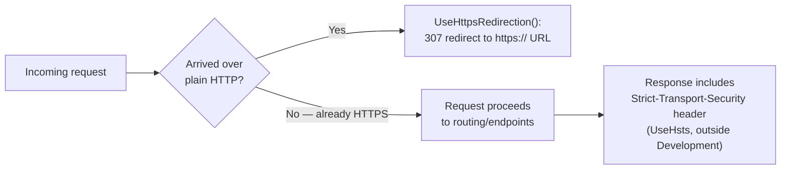
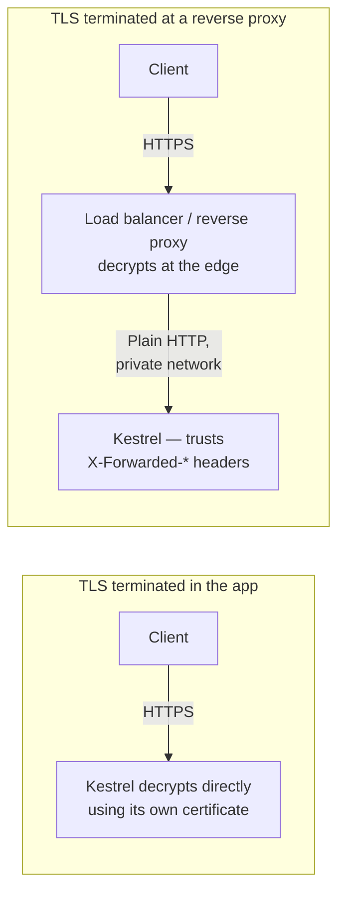

# HTTPS and Certificates

## Introduction

Before reading this lesson, you should already be comfortable with **[Razor Pages and Static Files](../10-aspnetcore/10-21-razor-pages-and-static-files.md)** and, really, with the entire arc of Module 10: routing requests to handlers, composing a middleware pipeline, registering and resolving services through dependency injection, reading configuration and strongly typed options, and logging what actually happened. This lesson is Module 10's capstone, and it asks a question that's been quietly sitting underneath every single example so far — every `http://localhost` URL you've typed while testing this module's endpoints was, in a real deployment, a security problem waiting to happen. This lesson closes that gap: how ASP.NET Core enforces HTTPS, how the certificate that makes HTTPS possible actually gets trusted during local development, and where TLS is typically handled once an app leaves your machine. It ends with a small but complete Banking/ATM API that pulls every one of this module's concepts together in one place.

By the end of this lesson, you will be able to:

- Explain what `UseHttpsRedirection()` and `UseHsts()` each do, and why an app typically needs both
- Trust the ASP.NET Core development certificate locally using `dotnet dev-certs https --trust`
- Explain, at a conceptual level, why production TLS is often terminated at a load balancer or reverse proxy rather than inside the app itself
- Recognize why an app behind such a proxy still needs to know the original request was HTTPS, even though the proxy — not the app — decrypted it
- Assemble routing, middleware, dependency injection, configuration, logging, and HTTPS into one realistic Banking/ATM minimal API

## HTTPS and Certificates — A Layman's Perspective

Imagine a bank that moves sensitive paperwork between a branch and its head office by courier. For years, the branch used the cheapest option: an ordinary, unsealed envelope, handed to whichever courier showed up. Anyone who intercepted that envelope along the route — another courier, someone at a rest stop, anyone who got their hands on it even briefly — could open it and read every account number and balance inside, and the recipient at head office would have no way to know whether the envelope had been tampered with before it arrived. That's a plain HTTP request: readable by anyone positioned along the route, with no way to verify it wasn't altered in transit.

The fix the bank adopts is a sealed, tamper-evident security pouch, closed with a wax seal stamped by a recognized security vendor. Anyone intercepting the pouch now sees nothing but a locked box; anyone tampering with it breaks the seal in a way the recipient can immediately detect. Just as importantly, the seal itself proves the pouch actually came from a real branch of *this* bank — not an impersonator wearing a courier's uniform — because the seal was issued by a vendor both branch and head office already trust. That seal is a certificate, and using a sealed pouch instead of an open envelope is HTTPS instead of HTTP.

Two policies keep this from depending on every single courier remembering to grab a sealed pouch on their own. First, the loading dock refuses any open envelope on sight: if a courier shows up without a sealed pouch, the dock hands it straight back and insists on a proper one before accepting the delivery at all. That's `UseHttpsRedirection()` — an incoming plain HTTP request gets redirected to the HTTPS version of the same address rather than served insecurely. Second, once a route has proven it always uses sealed pouches, head office tells every dock along that route, permanently: "never accept even one open envelope from this branch again — don't wait to be asked each time, just refuse it automatically going forward." That's `UseHsts()` — it tells the browser, in a response header, to remember for a period of time that this specific site should only ever be reached over HTTPS, even before the browser tries the insecure version first.

Now, before this bank ever ships a real security vendor's seals to a new branch that's still being built out, the construction crew still needs to test that the pouch-and-seal system works at all — locking, checking, unlocking — without waiting for an official vendor contract to be signed. So the bank issues a temporary, internally recognized seal, good only for testing on-site, and tells its own staff to treat it as valid *for now*, even though a courier from outside the bank would never recognize it. That's the ASP.NET Core development certificate: self-signed, good for `localhost` only, and meaningless to the outside world until you explicitly tell your own machine to trust it for testing.

Finally, a bank with hundreds of branches doesn't have each individual branch verify every incoming pouch's seal independently — that would be slow and duplicated everywhere. Instead, a single, heavily secured regional checkpoint verifies the seal once, then relays the now-verified contents the rest of the way through the bank's own guarded internal corridors, where a second seal check would just be redundant. That checkpoint is a reverse proxy or load balancer terminating TLS at the edge — a pattern this lesson introduces and Module 16's Azure networking coverage builds on directly.

## HTTPS and Certificates — A Programming Language Perspective

`UseHttpsRedirection()` is ASP.NET Core middleware that inspects each incoming request and, if it arrived over plain HTTP, responds with a redirect (by default, a `307 Temporary Redirect`) to the equivalent HTTPS URL rather than processing the request insecurely. `UseHsts()` adds a `Strict-Transport-Security` response header instructing the browser to *skip* the insecure HTTP attempt entirely for a configured duration on future visits, closing the small window where even the first request to a site could still go out over plain HTTP before a redirect ever happens; it is typically applied only outside `Development`, since it can make locally testing plain HTTP awkward. The ASP.NET Core HTTPS development certificate is a self-signed X.509 certificate generated per machine by the `dotnet dev-certs` CLI tool; running `dotnet dev-certs https --trust` adds it to the local operating system and browser trust stores so that `https://localhost` doesn't trigger a certificate warning while developing. In production, TLS is frequently terminated upstream — by Azure App Service's platform-managed certificate, an Nginx/YARP reverse proxy, or an Azure Application Gateway/Front Door — which decrypts the request at the network edge and forwards it to the app over plain HTTP inside a private, trusted network; the app reads the `Forwarded Headers` middleware's parsed `X-Forwarded-Proto`/`X-Forwarded-Host` headers to still correctly perceive the original request as HTTPS.

## How to Enforce HTTPS in ASP.NET Core

A default ASP.NET Core Web API project already enables HTTPS redirection out of the box; understanding what it's actually doing — and trusting the certificate that makes it possible locally — is what turns that default from a line you ignore into a setting you can reason about.


*Figure 1: A plain HTTP request is redirected before it ever reaches routing; `UseHsts` tells the browser to skip that first insecure attempt on future visits.*

```csharp
// Program.cs — .NET 10 / C# 14
var builder = WebApplication.CreateBuilder(args);
var app = builder.Build();

if (!app.Environment.IsDevelopment())
{
    app.UseHsts();
}

app.UseHttpsRedirection();

app.MapGet("/api/ping", () => Results.Ok(new { status = "pong" }));

app.Run();
```

Trusting the local development certificate is a one-time command, run from a terminal, separate from the app's own code:

```text
$ dotnet dev-certs https --trust
Trusting the HTTPS development certificate was requested.
A confirmation prompt will be displayed if the certificate was not previously trusted.
Click yes on the prompt to trust the certificate.
Successfully created and trusted a new HTTPS development certificate.
```

Because this is an ASP.NET Core app, the "Console Output" below is startup log lines and actual HTTP request/response traffic — not a plain console app's trace.

**Console Output** *(startup, then a plain-HTTP request followed by its HTTPS redirect target):*

```text
info: Microsoft.Hosting.Lifetime[14]
      Now listening on: https://localhost:5001
info: Microsoft.Hosting.Lifetime[14]
      Now listening on: http://localhost:5000
info: Microsoft.Hosting.Lifetime[0]
      Application started. Press Ctrl+C to shut down.

GET http://localhost:5000/api/ping HTTP/1.1
--> HTTP/1.1 307 Temporary Redirect
    Location: https://localhost:5001/api/ping

GET https://localhost:5001/api/ping HTTP/1.1
--> HTTP/1.1 200 OK
    Content-Type: application/json; charset=utf-8
    {"status":"pong"}
```

The plain HTTP request on port 5000 never reaches `MapGet` at all — `UseHttpsRedirection()` intercepts it and sends back a `307` pointing at the HTTPS port instead, and only the follow-up request against `https://localhost:5001` actually runs the endpoint. Because this run happened in the Development environment, `UseHsts()` never executed, so no `Strict-Transport-Security` header appears on the response — exactly as the code above is written to do.

## Real-Time Example: A Banking/ATM Balance API — the Module 10 Capstone

We close Module 10 with a small, realistic Banking/ATM minimal API that assembles this module's concepts into one program: routing (`/api/accounts/{id}/balance`), a custom logging middleware, dependency injection (an `AccountService` singleton), the options pattern (a configurable low-balance threshold), structured logging with `ILogger<T>`, and HTTPS enforcement — the same discipline a real ATM balance-check service would need in production.

```mermaid
sequenceDiagram
    participant Client
    participant MW as Middleware pipeline
    participant Endpoint as GET /api/accounts/{id}/balance
    participant Accounts as AccountService
    participant Logger as ILogger&lt;Program&gt;
    Client->>MW: HTTP request (redirected to HTTPS if needed)
    MW->>Logger: LogInformation("Handling GET ...")
    MW->>Endpoint: next()
    Endpoint->>Accounts: TryGetBalance(id)
    Accounts-->>Endpoint: balance or not found
    Endpoint->>Logger: LogInformation / LogWarning
    Endpoint-->>Client: 200 OK or 404 Not Found
```
*Figure 2: One request passes through HTTPS enforcement, a logging middleware, DI-resolved services, and configuration-driven options before a response is built.*

```csharp
// Program.cs — .NET 10 / C# 14 — Real-Time Example (Module 10 Capstone)
using Microsoft.Extensions.Options;

var builder = WebApplication.CreateBuilder(args);

builder.Services.Configure<BankingApiOptions>(builder.Configuration.GetSection("BankingApi"));
builder.Services.AddSingleton<AccountService>();

var app = builder.Build();

if (!app.Environment.IsDevelopment())
{
    app.UseHsts();
}

app.UseHttpsRedirection();

app.Use(async (context, next) =>
{
    ILogger<Program> logger = context.RequestServices.GetRequiredService<ILogger<Program>>();
    logger.LogInformation("Handling {Method} {Path}", context.Request.Method, context.Request.Path);
    await next();
});

app.MapGet("/api/accounts/{id}/balance", (
    string id,
    AccountService accounts,
    IOptions<BankingApiOptions> options,
    ILogger<Program> logger) =>
{
    if (!accounts.TryGetBalance(id, out decimal balance, out string maskedId))
    {
        logger.LogWarning("Balance lookup failed: account {MaskedAccountId} not found", maskedId);
        return Results.NotFound(new { message = "Account not found." });
    }

    bool lowBalanceAlert = balance < options.Value.LowBalanceAlertThreshold;
    logger.LogInformation("Balance retrieved for account {MaskedAccountId}: {Balance:C}", maskedId, balance);

    return Results.Ok(new { accountId = maskedId, balance, lowBalanceAlert });
});

app.Run();

class BankingApiOptions
{
    public decimal LowBalanceAlertThreshold { get; set; } = 50.00m;
}

class AccountService
{
    private readonly Dictionary<string, decimal> _balancesByAccountId = new()
    {
        ["ACC-1001"] = 1250.75m,
        ["ACC-1002"] = 32.10m,
    };

    public bool TryGetBalance(string accountId, out decimal balance, out string maskedAccountId)
    {
        maskedAccountId = accountId.Length >= 4 ? $"****{accountId[^4..]}" : accountId;
        return _balancesByAccountId.TryGetValue(accountId, out balance);
    }
}
```

```json
// appsettings.json
{
  "BankingApi": {
    "LowBalanceAlertThreshold": 50.00
  },
  "Logging": {
    "LogLevel": {
      "Default": "Information",
      "Microsoft.AspNetCore": "Warning"
    }
  }
}
```

**HTTP Requests and Console Output:**

```text
GET http://localhost:5000/api/accounts/ACC-1001/balance HTTP/1.1
--> HTTP/1.1 307 Temporary Redirect
    Location: https://localhost:5001/api/accounts/ACC-1001/balance

GET https://localhost:5001/api/accounts/ACC-1001/balance HTTP/1.1
info: Program[0]
      Handling GET /api/accounts/ACC-1001/balance
info: Program[0]
      Balance retrieved for account ****1001: $1,250.75
--> HTTP/1.1 200 OK
    {"accountId":"****1001","balance":1250.75,"lowBalanceAlert":false}

GET https://localhost:5001/api/accounts/ACC-1002/balance HTTP/1.1
info: Program[0]
      Handling GET /api/accounts/ACC-1002/balance
info: Program[0]
      Balance retrieved for account ****1002: $32.10
--> HTTP/1.1 200 OK
    {"accountId":"****1002","balance":32.10,"lowBalanceAlert":true}

GET https://localhost:5001/api/accounts/ACC-9999/balance HTTP/1.1
info: Program[0]
      Handling GET /api/accounts/ACC-9999/balance
warn: Program[0]
      Balance lookup failed: account ****9999 not found
--> HTTP/1.1 404 Not Found
    {"message":"Account not found."}
```

Every piece of this module shows up in that trace: the first request never reaches the endpoint at all because `UseHttpsRedirection()` catches it first; the custom middleware logs every request before routing decides where it goes; `AccountService` was resolved through DI rather than constructed by hand; `LowBalanceAlertThreshold` came from `appsettings.json` through the options pattern, not a hardcoded `50.00m` scattered through the endpoint; and every log line uses a structured template with a masked account ID, never the raw one. This is, in miniature, what a real ASP.NET Core app looks like once every piece of Module 10 is actually assembled together, rather than demonstrated one concept at a time.

## Where TLS Terminates: In the App vs at a Reverse Proxy

Every example in this lesson so far has ASP.NET Core's own Kestrel server handling the TLS handshake directly — decrypting the request itself, using a certificate it loads at startup. That's exactly right for local development and for small, self-hosted deployments. In most real cloud deployments, though, the app never sees an encrypted request at all: a load balancer or reverse proxy sitting in front of it — an Azure Application Gateway, an Azure Front Door, or a YARP/Nginx reverse proxy — terminates TLS at the network edge, decrypts the request, and forwards it to the app over plain HTTP across a private, trusted network the public internet can't reach directly. This is the pattern Module 16's Azure networking coverage explores in depth.


*Figure 3: Behind a reverse proxy, the app receives plain HTTP on a trusted internal network and relies on forwarded headers to know the original request was HTTPS.*

| Aspect | TLS terminated in the app (Kestrel) | TLS terminated at a reverse proxy/load balancer |
|---|---|---|
| Certificate management | The app loads and renews its own certificate | Centralized at the proxy/gateway, one place for many apps |
| What the app actually receives | The encrypted request, decrypted by Kestrel itself | Plain HTTP, over a private trusted network |
| Needs Forwarded Headers middleware | No | Yes — to correctly see the original scheme/host |
| Typical use case | Local development, small self-hosted services | Production cloud deployments (Module 16: Azure networking) |

## Types of HTTPS and Certificate Concerns in ASP.NET Core

A handful of related pieces round out what this lesson introduced, several of which extend well beyond Module 10:

1. **`UseHttpsRedirection()` and `UseHsts()`** — this lesson's two core middleware components, redirecting insecure requests and instructing browsers to skip the insecure attempt entirely on future visits.
2. **The `dotnet dev-certs` CLI** — generating, trusting, and (if needed) cleaning a machine's local development certificate.
3. **Forwarded Headers middleware (`UseForwardedHeaders`)** — how an app behind a reverse proxy still perceives the original request's scheme and host correctly.
4. **Certificate Authorities and automated renewal** (Let's Encrypt, a cloud provider's managed certificates) — how a production certificate is actually issued and kept from expiring, unlike the dev certificate's simple local trust.
5. **Azure networking: Application Gateway and Front Door** — Module 16's coverage of exactly the reverse-proxy TLS termination pattern this lesson introduced conceptually.
6. **[Configuration and the Options Pattern](../10-aspnetcore/10-19-configuration-and-options-pattern.md)** — the same pattern this lesson's `BankingApiOptions` used to keep the low-balance threshold out of hardcoded application logic.

## What You've Learned & What's Next

`UseHttpsRedirection()` refuses to let a request proceed over plain HTTP, `UseHsts()` tells the browser to stop even trying HTTP in the first place, and `dotnet dev-certs https --trust` makes both of those workable on your own machine during development — while in production, that same TLS handshake is frequently handled by a reverse proxy or load balancer instead, a pattern Module 16 builds on directly. That closes out Module 10: routing, middleware, dependency injection, configuration, logging, and now HTTPS, all assembled into one small, realistic Banking/ATM API in this lesson's capstone example.

Continue your learning journey with **[Introduction to Entity Framework Core](../11-efcore/11-01-introduction-to-ef-core.md)**, the first lesson of Module 11, where the in-memory dictionaries this module's examples have used as stand-in "databases" — including this lesson's `AccountService` — finally get replaced with a real, persistent data store.

---
*Applies to: .NET 10 / C# 14. Last reviewed 2026-08-16.*
