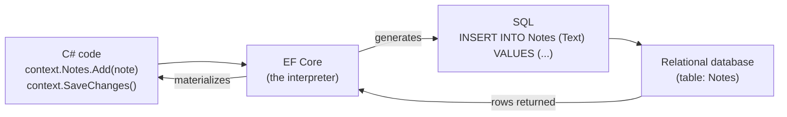
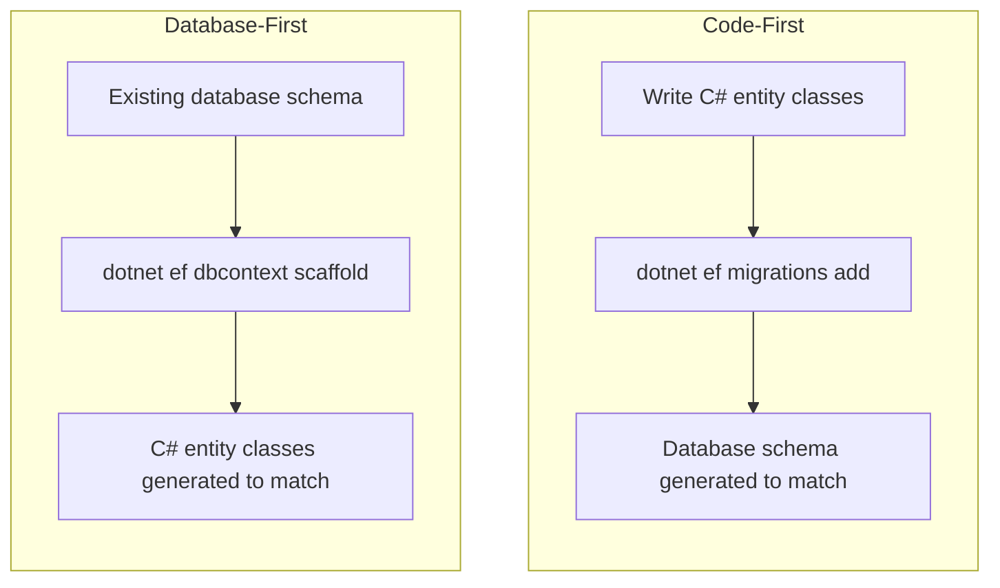

# Introduction to Entity Framework Core

## Introduction

Before reading this lesson, you should already be comfortable with **[HTTPS and Certificates](../10-aspnetcore/10-22-https-and-certificates.md)** and, more broadly, with building an ASP.NET Core app that has routing, middleware, dependency injection, configuration, and logging all working together. What that Module 10 capstone's `AccountService` was still missing, though, is a real database — its account balances lived in a `Dictionary<string, decimal>` that reset every time the app restarted. Module 11 fixes that. Over the next several lessons, you'll replace those in-memory dictionaries with an actual, persistent relational store, using Entity Framework Core (EF Core) — Microsoft's current object-relational mapper for .NET. This first lesson answers the question that has to come before any code: what does an ORM actually do for you, and why would you choose one over just writing SQL by hand?

By the end of this lesson, you will be able to:

- Explain what an ORM is and the specific hand-written-SQL problem it solves
- Describe EF Core as Microsoft's current, cross-platform ORM for .NET, and where it sits relative to raw ADO.NET
- Contrast the Code-First and Database-First approaches to modeling a database
- Set up and run a minimal EF Core project using the SQLite in-memory provider
- Preview Module 11's roadmap — `DbContext`/`DbSet<T>`, migrations, relationships, and querying with LINQ

## Entity Framework Core — A Layman's Perspective

Picture two business executives sitting across a table from each other, each successful, each fluent — but in two completely different languages that share no common ground. One executive only speaks in terms of objects: a "customer" is a rounded, complete thing with a name and an address and a list of orders attached to it. The other executive — the database — only speaks in a rigid, tabular dialect: rows, columns, foreign keys, joins. Left to negotiate directly, either the object-speaking executive has to painstakingly learn to phrase every single request as a formal SQL statement, or the meeting simply doesn't happen. For years, that's exactly what application developers did: they wrote the SQL by hand, string by string, for every single insert, update, delete, and select their application needed.

An ORM is the professional interpreter hired to sit between those two executives. You, the developer, get to keep speaking your native language the whole time — you write `customer.Orders.Add(newOrder)` and `context.SaveChanges()`, exactly the kind of object-oriented sentence you'd write anywhere else in a C# program. The interpreter listens to that sentence, silently translates it into the precise `INSERT INTO Orders (...) VALUES (...)` statement the database actually needs, sends it across the table, and then translates the database's response — rows and columns — back into an object you can call `.CustomerName` on without a second thought. Neither executive ever has to learn the other's language. That translation service, running continuously and invisibly underneath your object-oriented code, is what an object-relational mapper does: it maps your objects to relational tables and back, so that the common, repetitive 80% of database work — create this row, read that row, update this one, delete that one — never needs a hand-written SQL statement at all.

That doesn't mean the interpreter is magic, or that you stop needing to understand the room you're negotiating in. A skilled interpreter still needs a floor plan of how the two languages correspond — which object properties map to which table columns, which object relationships map to which foreign keys — and building that floor plan is most of what this module teaches. There are two different ways to build it. In one approach, you sketch out the objects first — describing customers and orders and products the way your application actually thinks about them — and hand the interpreter your sketch; the interpreter then goes and builds (or updates) the actual room, the actual tables, to match what you described. That's called **Code-First**: your C# classes are the source of truth, and the database schema is generated and evolved from them. In the other approach, someone has already built the room — a database already exists, built by a DBA or inherited from a legacy system — and the interpreter instead walks through that existing room, table by table, and hands you back a matching sketch of objects to work with. That's **Database-First**: the existing database is the source of truth, and your classes are reverse-engineered from it.

Both approaches produce the same interpreter doing the same job day to day, and this curriculum focuses on Code-First — writing plain C# classes and letting EF Core keep the database schema in sync with them — because it's the approach most new .NET applications, including the case-study examples running through this module, are built around today.

## Entity Framework Core — A Programming Language Perspective

An **object-relational mapper (ORM)** is a library that translates between an object-oriented data model in application code and a relational data model in a database — mapping classes to tables, properties to columns, and object references to foreign keys — so that common CRUD (Create, Read, Update, Delete) operations can be expressed as ordinary object manipulation rather than hand-written SQL. **Entity Framework Core** is Microsoft's current, open-source, cross-platform ORM for .NET, built from the ground up (distinct from the older, Windows-only Entity Framework 6) to run anywhere .NET 10 runs and to support multiple database providers — SQL Server, PostgreSQL, SQLite, and others — through one consistent API surface. It sits *above* ADO.NET, the lower-level .NET data-access API that talks directly to a database via raw commands and connections; EF Core still uses ADO.NET underneath to actually execute the SQL it generates, but application code interacts only with EF Core's higher-level, object-oriented API — `DbContext` and `DbSet<T>`, covered starting next lesson — and rarely touches ADO.NET directly. EF Core's current major version is versioned alongside .NET itself, so EF Core 10 targets and is fully supported on the .NET 10 LTS runtime this curriculum uses throughout.

## How to Set Up a Minimal EF Core Project

A working EF Core setup needs three things: an entity class describing what you want to persist, a `DbContext` subclass that represents your session with the database, and a database provider package registered so EF Core knows *which* database dialect to translate into. This lesson uses the `Microsoft.EntityFrameworkCore.Sqlite` provider pointed at an **in-memory SQLite database** (`DataSource=:memory:`) — an approach that needs no database server at all, so you can copy this example and run it exactly as written. The only trick with SQLite's in-memory mode is that the database exists only for as long as its single connection stays open, so the example opens that connection explicitly and keeps it open for the app's whole lifetime, rather than letting EF Core open and close a connection per query as it would against a real server. Everything about the `DbContext`/`DbSet<T>` API you'll write against stays identical if you swap this provider for `Microsoft.EntityFrameworkCore.SqlServer` or `Npgsql.EntityFrameworkCore.PostgreSQL` against a real server later.


*Figure 1: EF Core translates object operations into SQL in one direction, and materializes SQL result rows back into objects in the other.*

```csharp
// Program.cs — .NET 10 / C# 14
using Microsoft.Data.Sqlite;
using Microsoft.EntityFrameworkCore;

// Keep one connection open for the app's lifetime — required for SQLite ":memory:".
using SqliteConnection connection = new("DataSource=:memory:");
connection.Open();

DbContextOptions<NotesContext> options = new DbContextOptionsBuilder<NotesContext>()
    .UseSqlite(connection)
    .Options;

using NotesContext context = new(options);
context.Database.EnsureCreated(); // Creates the schema for this quick demo (see Lesson 3 for why production apps use migrations instead).

context.Notes.Add(new Note { Text = "Learn what an ORM does" });
context.Notes.Add(new Note { Text = "Set up EF Core with SQLite in-memory" });
context.SaveChanges();

foreach (Note note in context.Notes)
{
    Console.WriteLine($"[{note.NoteId}] {note.Text}");
}

class NotesContext(DbContextOptions<NotesContext> options) : DbContext(options)
{
    public DbSet<Note> Notes => Set<Note>();
}

class Note
{
    public int NoteId { get; set; }
    public string Text { get; set; } = string.Empty;
}
```

**Console Output:**

```text
[1] Learn what an ORM does
[2] Set up EF Core with SQLite in-memory
```

Nothing in that program contains a single SQL statement, yet two rows were inserted into a real SQLite table and read back out again. `EnsureCreated()` built the `Notes` table's schema on the fly from the `Note` class's shape; `SaveChanges()` translated the two `Add` calls into `INSERT` statements; and the `foreach` loop, iterating `context.Notes` directly, triggered a `SELECT` behind the scenes and handed back fully formed `Note` objects rather than raw rows. That round trip — objects in, SQL out, rows back, objects out — is the entire job of an ORM, demonstrated end to end in about fifteen lines of application code.

## Real-Time Example: Starting an E-Commerce Product Catalog

We start this module's recurring **E-Commerce Order Processing** case study with the simplest piece it needs: a `Product` catalog, persisted for real instead of living in a `List<Product>` that vanishes on restart. This is deliberately the smallest possible EF Core program that still looks like production code — a `Product` entity with the fields a catalog actually needs, and a query a storefront would realistically run.

```csharp
// Program.cs — .NET 10 / C# 14 — Real-Time Example
using Microsoft.Data.Sqlite;
using Microsoft.EntityFrameworkCore;

using SqliteConnection connection = new("DataSource=:memory:");
connection.Open();

DbContextOptions<CatalogContext> options = new DbContextOptionsBuilder<CatalogContext>()
    .UseSqlite(connection)
    .Options;

using CatalogContext context = new(options);
context.Database.EnsureCreated();

context.Products.AddRange(
    new Product { Sku = "SKU-1001", Name = "Wireless Mouse", Price = 24.99m },
    new Product { Sku = "SKU-1002", Name = "Mechanical Keyboard", Price = 89.50m },
    new Product { Sku = "SKU-1003", Name = "USB-C Hub", Price = 39.00m }
);
context.SaveChanges();

Console.WriteLine("Products under $50:");
foreach (Product product in context.Products.Where(p => p.Price < 50m))
{
    Console.WriteLine($"  {product.Sku} — {product.Name}: {product.Price:C}");
}

class CatalogContext(DbContextOptions<CatalogContext> options) : DbContext(options)
{
    public DbSet<Product> Products => Set<Product>();
}

class Product
{
    public int ProductId { get; set; }
    public string Sku { get; set; } = string.Empty;
    public string Name { get; set; } = string.Empty;
    public decimal Price { get; set; }
}
```

**Console Output:**

```text
Products under $50:
  SKU-1001 — Wireless Mouse: $24.99
  SKU-1003 — USB-C Hub: $39.00
```

Notice that `context.Products.Where(p => p.Price < 50m)` is ordinary LINQ — the same syntax you'd use to filter a `List<Product>` in Module 4. EF Core translated that LINQ expression into a SQL `WHERE` clause and ran it *inside* the SQLite database, rather than pulling every row into memory first and filtering in C#; Lesson 6 of this module goes much deeper into exactly how much of a LINQ query EF Core can push down into SQL this way. For now, the point is simpler: the `Product` class above, and the persisted rows behind it, are the same `Product` entity the rest of this module's E-Commerce examples will keep extending — adding a `Customer` who places `Order`s against this catalog starting in Lesson 4.

## Code-First vs Database-First

Both examples above used **Code-First**: the `Note` and `Product` classes were written first, and `EnsureCreated()` (and, from Lesson 3 onward, migrations) generated the database schema to match them. The alternative, **Database-First**, starts from an existing database — one a DBA already built, or one inherited from a legacy application — and uses the `dotnet ef dbcontext scaffold` command to reverse-engineer matching C# entity classes and a `DbContext` from it automatically. Code-First puts your C# model in charge and treats the schema as generated output; Database-First puts the schema in charge and treats your C# model as generated output. Most new applications, including every example in this curriculum, use Code-First, because it keeps the single source of truth in version-controlled C# code rather than in a database that has to be inspected to understand what changed. Database-First still matters in the real world, though — it's the practical starting point whenever EF Core is being introduced onto a database that already existed long before EF Core did.


*Figure 2: Code-First generates the schema from your classes; Database-First generates your classes from an existing schema.*

| Aspect | Code-First | Database-First |
|---|---|---|
| Source of truth | C# entity classes | The existing relational schema |
| Typical starting point | A brand-new application | An application built around a pre-existing database |
| How the schema is produced | Generated/evolved via migrations (Lesson 3) | Inspected and reverse-engineered via `dotnet ef dbcontext scaffold` |
| Change history | Tracked in version-controlled migration files | Tracked wherever the DBA's schema-change process tracks it |

## Types of ORM and Data-Access Approaches in .NET

EF Core is the main tool this module teaches, but it sits among a handful of related approaches worth knowing by name:

1. **[DbContext and DbSet<T>](../11-efcore/11-02-dbcontext-and-dbset.md)** — the two core EF Core types every example above already used, covered properly next lesson.
2. **[Code-First Migrations](../11-efcore/11-03-code-first-migrations.md)** — the production-grade replacement for this lesson's `EnsureCreated()` shortcut.
3. **[Querying with EF Core and LINQ](../11-efcore/11-06-querying-with-ef-core-linq.md)** — how much of a LINQ query, like this lesson's `Where(p => p.Price < 50m)`, actually gets translated into SQL.
4. **Database-First scaffolding (`dotnet ef dbcontext scaffold`)** — generating entity classes from an existing database, the mirror image of everything in this module.
5. **Raw ADO.NET** — the lower-level API EF Core itself is built on; still used directly for the rare query too performance-critical or exotic for an ORM to express well.
6. **Dapper and other micro-ORMs** — a lighter-weight alternative that maps query results to objects but leaves you writing the SQL by hand, trading EF Core's abstraction for more direct control.

## What You've Learned & What's Next

An ORM like EF Core exists to eliminate hand-written SQL for the repetitive CRUD work every application needs, by translating between your C# objects and the database's rows and tables in both directions; Code-First — writing the classes and letting EF Core generate the schema — is this curriculum's approach, in contrast to Database-First's reverse-engineering of an existing schema. You've now run a real, working EF Core program against a real (if temporary) SQLite database, using nothing but object-oriented C# code.

Continue your learning journey with **[DbContext and DbSet<T>](../11-efcore/11-02-dbcontext-and-dbset.md)**, where we look properly at the `NotesContext`/`CatalogContext` and `DbSet<Product>` this lesson used somewhat informally — what they actually represent, how to register a `DbContext` with dependency injection, and how to configure entities with the Fluent API instead of relying purely on convention.

---
*Applies to: .NET 10 / C# 14. Last reviewed 2026-08-16.*
