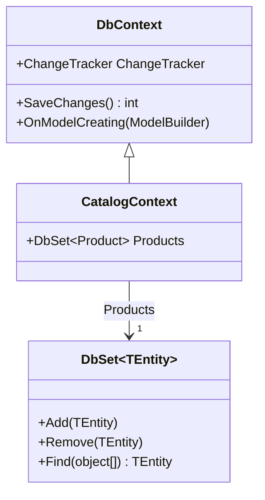
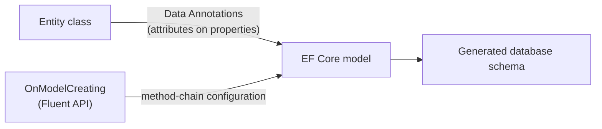

# DbContext and DbSet<T>

## Introduction

Before reading this lesson, you should already be comfortable with **[Introduction to Entity Framework Core](../11-efcore/11-01-introduction-to-ef-core.md)** — what an ORM does, and the fact that EF Core needs an entity class and a `DbContext` subclass before it can do anything. Last lesson used `NotesContext` and `CatalogContext` somewhat informally, just enough to get a working example on screen. This lesson slows down and looks at those two pieces properly: what a `DbContext` actually represents while your app is running, what a `DbSet<TEntity>` gives you beyond "a place to put objects," how to register a `DbContext` the way a real ASP.NET Core app does — through dependency injection — and how to configure an entity's mapping with Data Annotations or the Fluent API when EF Core's default conventions aren't quite what you need.

By the end of this lesson, you will be able to:

- Explain what a `DbContext` represents: a session with the database and a unit of work that batches changes together
- Explain what `DbSet<TEntity>` represents: a queryable, change-tracked collection mapped to one entity type
- Register a `DbContext` with dependency injection using `AddDbContext`, and state its default service lifetime
- Configure entity mapping using Data Annotations attributes directly on properties
- Configure entity mapping using the Fluent API inside `OnModelCreating`, and explain when it's necessary instead of Data Annotations

## DbContext and DbSet<T> — A Layman's Perspective

Think about a single trip through a well-organized grocery store. The moment you grab a shopping cart at the entrance, you've started something with a clear beginning and a clear end: everything that happens between grabbing that cart and reaching the checkout register belongs to *this* trip, and none of it becomes final until the cashier actually rings it up. That cart, and the trip it represents, is a `DbContext`. It's not the store itself — it's your one supervised session inside it, watching everything you add to the cart, everything you decide to put back, and everything you're carrying out, right up until the moment you check out.

Now look inside the cart. You don't just have one big undifferentiated pile — you naturally keep the produce together, the dairy together, the canned goods together, even if the cart doesn't have literal dividers. Each of those informal groupings, one per category of item, is a `DbSet<TEntity>`: a labeled section of the cart, one per kind of thing the store sells, that you can look through, add to, or pull items back out of, all while the trip is still in progress. `context.Products` is the produce section; `context.Customers`, in this lesson's example, is a different section entirely — but both live inside the same one cart, the same one `DbContext`, for the same one trip.

Here's the part that makes a shopping cart a genuinely good analogy rather than just a container: the cart *remembers* what you did. If you toss three apples in, then take one back out because it's bruised, the cart doesn't just show "two apples" as if that's all that ever happened — behind the scenes, it's kept track of the fact that this was an addition, followed by a partial removal, so that when you finally reach the register, the cashier can rings up exactly what needs ringing up, no more, no less. That quiet bookkeeping — remembering every addition, change, and removal you've made since the trip started — is what EF Core calls **change tracking**, and it's a `DbContext`'s job, not a `DbSet<TEntity>`'s; the labeled sections just organize *what kind* of item you're holding, while the cart as a whole tracks *everything that changed* across every section, together, as one trip.

And "reaching the checkout register" is `SaveChanges()`: the one moment where every tracked addition, update, and deletion across every `DbSet<TEntity>` in the cart gets reconciled against the store's actual shelves — the database — all at once, as a single unit. That's why a `DbContext` is often described as a **unit of work**: it doesn't send the database one instruction the instant you call `Add`; it quietly accumulates everything you've done during the trip and settles the whole trip's worth of changes together, in one deliberate, final step. Just as importantly, once you're through checkout and you walk out of the store, that particular cart is done — you don't wheel the same cart back in for tomorrow's shopping trip. A `DbContext` is meant to live for one unit of work and then be discarded, which is exactly why, in a real app, you'll see one created fresh for each incoming web request rather than kept around for the whole lifetime of the application.

## DbContext and DbSet<T> — A Programming Language Perspective

`DbContext` is the EF Core class representing a session with the database: it maintains a `ChangeTracker` that records every entity it's currently aware of and what has changed about each one, and its `SaveChanges()`/`SaveChangesAsync()` methods translate all of that accumulated change into the appropriate `INSERT`, `UPDATE`, and `DELETE` statements, executed together as a single unit of work. `DbSet<TEntity>` is a property on your `DbContext` subclass, one per entity type, implementing `IQueryable<TEntity>` — which means writing `context.Products.Where(...)` builds a LINQ expression tree that EF Core translates into SQL rather than executing in memory, and also gives you `Add`, `Remove`, `Update`, and `Find` for registering changes with that `DbSet`'s tracker. In an ASP.NET Core app, `builder.Services.AddDbContext<TContext>(options => ...)` registers your `DbContext` subclass with the DI container using a **scoped** lifetime by default — one fresh instance per HTTP request, mirroring the "one cart per trip" idea above — the same scoped lifetime introduced in **[Dependency Injection and Service Lifetimes](../10-aspnetcore/10-08-di-and-service-lifetimes.md)**. Entity mapping — which property is the key, which are required, how long a string column can be — is configured either declaratively with **Data Annotations** attributes (`[Key]`, `[Required]`, `[MaxLength]`) directly on entity properties, or imperatively with the **Fluent API**, by overriding `OnModelCreating(ModelBuilder modelBuilder)` and calling methods like `modelBuilder.Entity<T>().Property(...)`.

## How to Register and Configure a DbContext

A `DbContext` subclass is a plain class that inherits from `DbContext`, exposes one `DbSet<TEntity>` per entity type, and optionally overrides `OnModelCreating` to configure mapping details Data Annotations can't express (like a unique index across a column, shown in the Real-Time Example below). Registering it with `AddDbContext` — rather than constructing it directly, as the previous lesson briefly did — is what lets ASP.NET Core hand your endpoints a properly scoped instance automatically.


*Figure 1: `CatalogContext` inherits `DbContext`'s change tracking and `SaveChanges`, and exposes one `DbSet<Product>` — one labeled section of the cart.*

```csharp
// Program.cs — .NET 10 / C# 14
using Microsoft.Data.Sqlite;
using Microsoft.EntityFrameworkCore;
using Microsoft.Extensions.DependencyInjection;
using Microsoft.Extensions.Hosting;
using System.ComponentModel.DataAnnotations;

HostApplicationBuilder builder = Host.CreateApplicationBuilder(args);

// Keep one connection open for the app's lifetime — required for SQLite ":memory:".
SqliteConnection connection = new("DataSource=:memory:");
connection.Open();

builder.Services.AddDbContext<CatalogContext>(options => options.UseSqlite(connection));

using IHost host = builder.Build();

using (IServiceScope scope = host.Services.CreateScope())
{
    CatalogContext context = scope.ServiceProvider.GetRequiredService<CatalogContext>();
    context.Database.EnsureCreated();

    context.Products.Add(new Product { Sku = "SKU-2001", Name = "Laptop Stand" });
    context.SaveChanges();

    foreach (Product product in context.Products)
    {
        Console.WriteLine($"[{product.ProductId}] {product.Sku} — {product.Name}");
    }
}

connection.Close();

class CatalogContext(DbContextOptions<CatalogContext> options) : DbContext(options)
{
    public DbSet<Product> Products => Set<Product>();

    protected override void OnModelCreating(ModelBuilder modelBuilder)
    {
        modelBuilder.Entity<Product>()
            .Property(p => p.Sku)
            .HasMaxLength(20)
            .IsRequired();
    }
}

class Product
{
    public int ProductId { get; set; }

    [Required]
    [MaxLength(100)]
    public string Name { get; set; } = string.Empty;

    public string Sku { get; set; } = string.Empty;
}
```

**Console Output:**

```text
[1] SKU-2001 — Laptop Stand
```

`AddDbContext<CatalogContext>` registered the context as a scoped DI service without ever calling `new CatalogContext(...)` directly; `host.Services.CreateScope()` created one scope to stand in for "one unit of work," and `GetRequiredService<CatalogContext>()` resolved a properly configured instance from it — the same mechanism an ASP.NET Core minimal API endpoint uses automatically when a handler simply takes a `CatalogContext` parameter, as the Real-Time Example below does. `Product.Name` was constrained through a Data Annotation directly on the property; `Product.Sku`'s length and required-ness were configured through the Fluent API instead, inside `OnModelCreating` — two different mechanisms producing the same kind of schema constraint.

## Real-Time Example: A Customer Endpoint for the E-Commerce API

We continue the **E-Commerce Order Processing** catalog from Lesson 1, adding a `Customer` entity and wiring it into a real ASP.NET Core minimal API — the natural next step now that `DbContext` registration is dependency-injected rather than constructed by hand. `StoreContext` uses the Fluent API to enforce something Data Annotations alone can't express on a single property: a **unique index** across `Customer.Email`, so two customers can never register with the same address.

```csharp
// Program.cs — .NET 10 / C# 14 — Real-Time Example
using Microsoft.Data.Sqlite;
using Microsoft.EntityFrameworkCore;
using System.ComponentModel.DataAnnotations;

var builder = WebApplication.CreateBuilder(args);

SqliteConnection connection = new("DataSource=:memory:");
connection.Open();

builder.Services.AddDbContext<StoreContext>(options => options.UseSqlite(connection));

var app = builder.Build();

using (IServiceScope scope = app.Services.CreateScope())
{
    StoreContext seedContext = scope.ServiceProvider.GetRequiredService<StoreContext>();
    seedContext.Database.EnsureCreated();
}

app.MapPost("/api/customers", (CustomerDto dto, StoreContext context) =>
{
    Customer customer = new() { Name = dto.Name, Email = dto.Email };
    context.Customers.Add(customer);
    context.SaveChanges();
    return Results.Created($"/api/customers/{customer.CustomerId}", customer);
});

app.MapGet("/api/customers", (StoreContext context) =>
    Results.Ok(context.Customers.OrderBy(c => c.Name).ToList()));

app.Run();

record CustomerDto(string Name, string Email);

class StoreContext(DbContextOptions<StoreContext> options) : DbContext(options)
{
    public DbSet<Customer> Customers => Set<Customer>();

    protected override void OnModelCreating(ModelBuilder modelBuilder)
    {
        modelBuilder.Entity<Customer>()
            .HasIndex(c => c.Email)
            .IsUnique();
    }
}

class Customer
{
    public int CustomerId { get; set; }

    [Required]
    [MaxLength(100)]
    public string Name { get; set; } = string.Empty;

    [Required]
    [EmailAddress]
    public string Email { get; set; } = string.Empty;
}
```

**HTTP Requests and Console Output:**

```text
POST /api/customers   { "name": "Priya Shah", "email": "priya.shah@example.com" }
--> HTTP/1.1 201 Created
    {"customerId":1,"name":"Priya Shah","email":"priya.shah@example.com"}

POST /api/customers   { "name": "Diego Ramirez", "email": "diego.ramirez@example.com" }
--> HTTP/1.1 201 Created
    {"customerId":2,"name":"Diego Ramirez","email":"diego.ramirez@example.com"}

GET /api/customers
--> HTTP/1.1 200 OK
    [{"customerId":2,"name":"Diego Ramirez","email":"diego.ramirez@example.com"},{"customerId":1,"name":"Priya Shah","email":"priya.shah@example.com"}]
```

Each `POST` request runs inside its own scoped `StoreContext`, resolved fresh by the minimal API's parameter binding — exactly the "one cart per trip" model this lesson opened with, just supplied automatically instead of constructed with `CreateScope()` by hand. The unique index on `Email`, configured through the Fluent API because it spans an index rather than a single column's own constraints, means a third `POST` reusing `priya.shah@example.com` would fail at the database level with a constraint violation — exactly the kind of guarantee an in-memory `Dictionary`-based stand-in service, like the one Module 10 used, could never enforce on its own.

## Data Annotations vs Fluent API

Both mechanisms configure the same underlying EF Core model — they're two different vocabularies for describing it, not two different features. Data Annotations are attributes placed directly on an entity's properties: quick to write, easy to read right next to the property they describe, but limited to what a single property's attribute can express on its own. The Fluent API is a fluent, method-chaining configuration written inside `OnModelCreating`, separate from the entity class itself: more verbose, but capable of expressing anything the EF Core model supports, including things no single-property attribute could — composite keys spanning multiple properties, the unique index across `Customer.Email` above, or the relationship configuration Lesson 4 introduces. When both configure the same property, the Fluent API wins, since it's evaluated after Data Annotations are applied.


*Figure 2: Data Annotations and the Fluent API are two different paths that both feed the same underlying EF Core model.*

| Aspect | Data Annotations | Fluent API |
|---|---|---|
| Where it's written | Attributes directly on entity properties | Inside `OnModelCreating`, separate from the entity class |
| Expressiveness | Limited to what one property's attribute can say | Can express anything EF Core's model supports |
| Good for | Simple, single-property rules (`[Required]`, `[MaxLength]`) | Relationships, composite keys, indexes, anything cross-property |
| Precedence if both configure the same thing | Overridden by Fluent API | Wins over Data Annotations |

## Types of DbContext and Model Configuration in EF Core

A few related pieces extend what this lesson introduced:

1. **[Code-First Migrations](../11-efcore/11-03-code-first-migrations.md)** — turning `OnModelCreating`'s configuration into versioned, applyable schema changes, replacing this lesson's `EnsureCreated()` shortcut.
2. **[Relationships: One-to-Many](../11-efcore/11-04-relationships-one-to-many.md)** — Fluent API configuration for navigation properties between entities, building directly on `OnModelCreating`.
3. **[Dependency Injection and Service Lifetimes](../10-aspnetcore/10-08-di-and-service-lifetimes.md)** — the scoped lifetime `AddDbContext` uses by default, and why a `DbContext` shouldn't be registered as a singleton.
4. **`AddDbContextPool`** — a pooling variant of `AddDbContext` that reuses `DbContext` instances across requests for reduced allocation overhead in high-throughput APIs.
5. **`IEntityTypeConfiguration<TEntity>`** — an alternative to writing all Fluent API calls inline in `OnModelCreating`, splitting each entity's configuration into its own class.
6. **Data Annotations attribute reference** (`[Key]`, `[Required]`, `[MaxLength]`, `[Column]`, `[ForeignKey]`) — the most commonly used attributes beyond the two this lesson demonstrated.

## What You've Learned & What's Next

A `DbContext` is your session with the database — a unit of work that tracks every change across all of its `DbSet<TEntity>` collections and commits them together in one `SaveChanges()` call — and registering it with `AddDbContext` lets ASP.NET Core hand out a correctly scoped instance per request automatically. Data Annotations and the Fluent API are two ways of configuring the same underlying model, with the Fluent API needed for anything a single property's attribute can't express alone.

Continue your learning journey with **[Code-First Migrations](../11-efcore/11-03-code-first-migrations.md)**, where this lesson's `EnsureCreated()` shortcut — fine for demos, unsafe for production — gets replaced with `dotnet ef migrations add` and `dotnet ef database update`, EF Core's real mechanism for evolving a schema safely over time.

---
*Applies to: .NET 10 / C# 14. Last reviewed 2026-08-16.*
