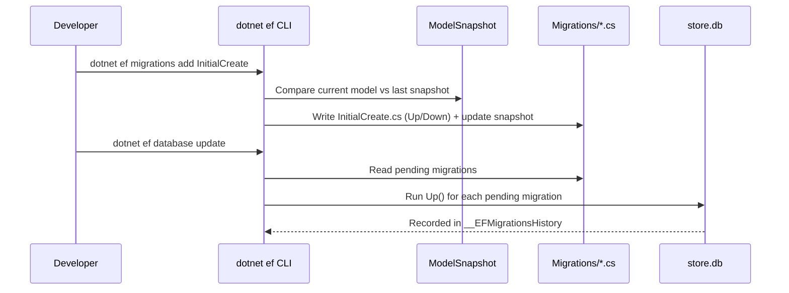
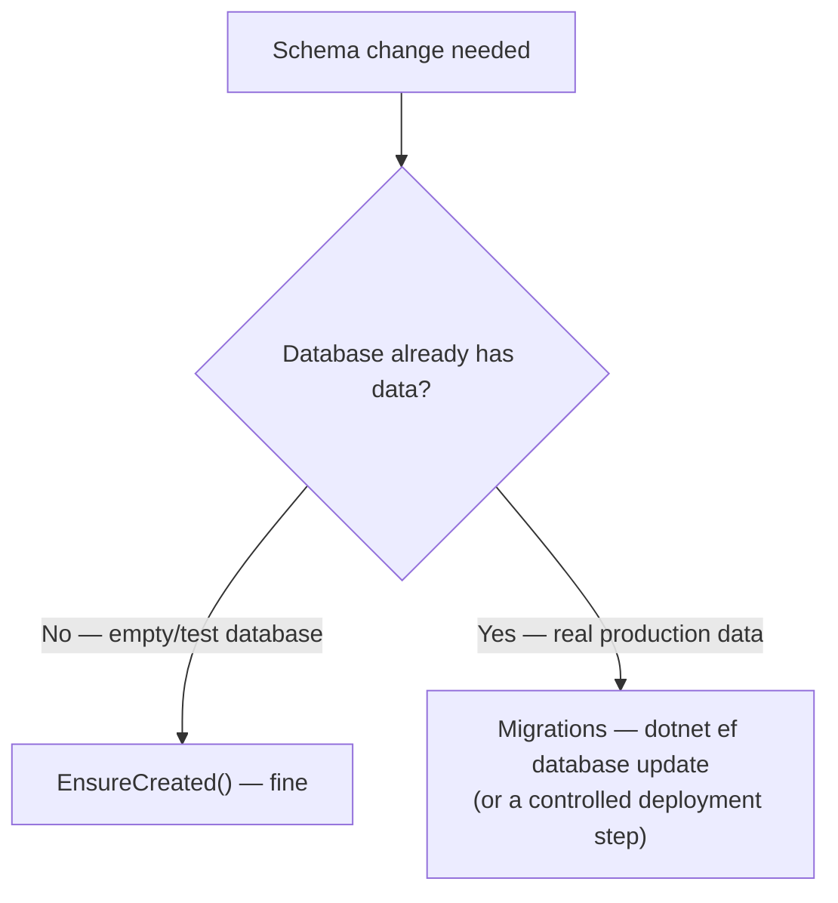

# Code-First Migrations

## Introduction

Before reading this lesson, you should already be comfortable with **[DbContext and DbSet<T>](../11-efcore/11-02-dbcontext-and-dbset.md)** — what a `DbContext` represents, and how `OnModelCreating`'s Fluent API and Data Annotations both feed the same underlying EF Core model. Every example so far has used `context.Database.EnsureCreated()` to get a schema on screen quickly, and every example so far has also quietly warned that this is a shortcut, not a real answer. This lesson gives you the real answer: **Code-First migrations**, the mechanism EF Core actually uses in production to evolve a database schema safely over time, as your C# entity classes themselves change.

By the end of this lesson, you will be able to:

- Explain what a migration is: a versioned C# file capturing one schema change, generated by diffing your current model against the last recorded snapshot
- Generate a migration from model changes using `dotnet ef migrations add`
- Apply pending migrations to a real database using `dotnet ef database update`
- Explain why `Database.EnsureCreated()` is unsuitable for a production application with existing data
- Apply migrations safely in a deployed application using `Database.Migrate()` or a dedicated migration step

## Code-First Migrations — A Layman's Perspective

Picture a house that people actually live in, and a homeowner who wants a sunroom added onto the back of it. A competent general contractor does not respond to that request by bulldozing the house and building an entirely new one that happens to include a sunroom — that would technically produce "a house with a sunroom," but it would also destroy the furniture, the family photos, and every occupant's actual bed, all of which were sitting inside the house that got demolished. Instead, the contractor drafts a specific, dated **change order**: "add a sunroom, dimensions X by Y, attached at this wall," files it, gets it approved, and then a crew executes exactly that one change against the house as it currently stands — every wall and every resident left untouched except for the one addition that was actually asked for.

A migration is that change order. Every time you change your C# entity classes — add a property, rename one, introduce a whole new entity — running `dotnet ef migrations add` is the moment the contractor drafts the change order: EF Core compares your model as it looks right now against a snapshot of how it looked after the last change order was filed, works out exactly what's different, and writes that difference down as a small, dated, numbered file. `dotnet ef database update` is dispatching the crew to actually go execute every change order that's been filed but not yet built — in order, one after another, against the real house, the real database, with real people — real rows of data — still living inside it.

Now think about what it would mean to skip the change-order process entirely and just tell a contractor, "whenever the blueprint changes, just make the building on the lot match the new blueprint, however you need to." If there's no building on the lot yet, that's harmless — an empty lot has nothing to protect, so building fresh from the current blueprint is perfectly fine. But the moment a real, occupied house already exists on that lot, "just make it match the new blueprint" stops being harmless and starts being nonsensical — the contractor has no instructions for *how* to get from the existing house to the new blueprint without destroying it, so any responsible contractor simply refuses the job outright rather than guess. That refusal is exactly what `Database.EnsureCreated()` does: it happily builds a schema from scratch against an empty database, but the moment a database already exists — in any shape at all, matching or not — it does nothing whatsoever. It was never designed to evolve an existing structure, only to erect a brand new one on an empty lot, which is precisely why it's fine for a quick demo (an empty lot every time you run it) and disqualifying for any real application whose database already has real data sitting inside it.

Migrations solve the actual problem a real, occupied building has: change, tracked one filed order at a time, applied against the structure exactly as it currently stands, with everyone still safely inside it while the sunroom goes up.

## Code-First Migrations — A Programming Language Perspective

A **migration** in EF Core is a generated C# class, placed in a `Migrations` folder, containing an `Up()` method (the schema changes to apply) and a `Down()` method (how to reverse them), produced by running `dotnet ef migrations add <MigrationName>` — a command from the `dotnet-ef` CLI tool that compares your current `DbContext`'s model against a serialized `ModelSnapshot` file recorded after the previous migration, and writes the difference between the two as the new migration's `Up()`/`Down()` bodies. `dotnet ef database update` connects to the target database, checks a special `__EFMigrationsHistory` table it maintains to see which migrations have already been applied, and runs the `Up()` method of every migration not yet recorded there, in chronological order, recording each as it succeeds. `Database.EnsureCreated()` builds a schema directly from the current model with **no migration history at all**, and is a no-op if any database already exists — appropriate only for throwaway tests and demos, never for an application with real, persisted data. `Database.Migrate()` is the programmatic equivalent of `dotnet ef database update`, callable from application code (typically at startup) rather than the CLI; whether to call it automatically at every app startup or run migrations as a separate, single, controlled deployment step is itself an important production decision, covered in the Comparison section below.

## How to Create and Apply a Migration

Because `dotnet ef` commands run as their own separate process, invoked separately from `dotnet run`, this workflow needs a database that persists between those separate invocations — this lesson uses the SQLite provider pointed at a **local file** (`Data Source=store.db`) rather than an in-memory connection, since an in-memory SQLite database would vanish the instant the process that opened it exits. A SQLite file still needs no server at all — it's just a file sitting next to your project, and the exact same `dotnet ef` commands below work identically against SQL Server or PostgreSQL in a real deployment.


*Figure 1: `migrations add` only ever writes a code file by comparing snapshots; `database update` is the separate step that actually touches the database.*

```csharp
// Program.cs — .NET 10 / C# 14
using Microsoft.EntityFrameworkCore;

using StoreContext context = new();
context.Database.Migrate(); // Applies any migrations not yet recorded in __EFMigrationsHistory.

if (!context.Products.Any())
{
    context.Products.Add(new Product { Sku = "SKU-3001", Name = "Desk Lamp", Price = 19.99m });
    context.SaveChanges();
}

foreach (Product product in context.Products)
{
    Console.WriteLine($"[{product.ProductId}] {product.Sku} — {product.Name}: {product.Price:C}");
}

class StoreContext : DbContext
{
    public DbSet<Product> Products => Set<Product>();

    protected override void OnConfiguring(DbContextOptionsBuilder optionsBuilder)
    {
        optionsBuilder.UseSqlite("Data Source=store.db");
    }
}

class Product
{
    public int ProductId { get; set; }
    public string Sku { get; set; } = string.Empty;
    public string Name { get; set; } = string.Empty;
    public decimal Price { get; set; }
}
```

Before that program's first successful run, the migration itself has to exist and be applied, from the terminal:

**Console Output** *(terminal, then `dotnet run`):*

```text
$ dotnet ef migrations add InitialCreate
Build started...
Build succeeded.
Done. To undo this action, use 'ef migrations remove'

$ dotnet ef database update
Build started...
Build succeeded.
Applying migration '20260816090500_InitialCreate'.
Done.

$ dotnet run
[1] SKU-3001 — Desk Lamp: $19.99
```

`migrations add` never touched `store.db` at all — it only compared the `Product` entity's shape against an (empty, first-time) snapshot and wrote `Migrations/20260816090500_InitialCreate.cs`. Only `database update` actually connected to `store.db` and ran that migration's `Up()` method, creating the `Products` table for real. `context.Database.Migrate()` inside `Program.cs` is a safety net for this specific demo — in a real deployment, whether the app itself should be the one calling `Migrate()` is exactly what this lesson's Comparison section addresses.

## Real-Time Example: Evolving a Library/Inventory Schema Over Time

We start this module's **Library/Inventory Management** case study — the domain Lesson 5's many-to-many relationships build on directly — with a `Book` entity, and use it to show a migration evolving a schema *after* it already has real data in it, which is the scenario `EnsureCreated()` can never handle. The book catalog first ships with just a title and a published year; a later requirement adds ISBN tracking, and a second migration adds that column without disturbing the row already sitting in the table.

```csharp
// Program.cs — .NET 10 / C# 14 — Real-Time Example
using Microsoft.EntityFrameworkCore;

using LibraryContext context = new();
context.Database.Migrate();

if (!context.Books.Any())
{
    context.Books.Add(new Book { Title = "The Pragmatic Programmer", PublishedYear = 1999, Isbn = "978-0135957059" });
    context.SaveChanges();
}

foreach (Book book in context.Books)
{
    Console.WriteLine($"[{book.BookId}] {book.Title} ({book.PublishedYear}) — ISBN {book.Isbn}");
}

class LibraryContext : DbContext
{
    public DbSet<Book> Books => Set<Book>();

    protected override void OnConfiguring(DbContextOptionsBuilder optionsBuilder)
    {
        optionsBuilder.UseSqlite("Data Source=library.db");
    }
}

class Book
{
    public int BookId { get; set; }
    public string Title { get; set; } = string.Empty;
    public int PublishedYear { get; set; }
    public string? Isbn { get; set; }
}
```

**Console Output** *(the full two-migration evolution, terminal then `dotnet run`):*

```text
$ dotnet ef migrations add InitialCreate
Build started...
Build succeeded.
Done. To undo this action, use 'ef migrations remove'

$ dotnet ef database update
Build started...
Build succeeded.
Applying migration '20260816091500_InitialCreate'.
Done.

$ dotnet run
[1] The Pragmatic Programmer (1999) — ISBN

--- Requirement changes: Book now needs an Isbn column ---

$ dotnet ef migrations add AddIsbnToBook
Build started...
Build succeeded.
Done. To undo this action, use 'ef migrations remove'

$ dotnet ef database update
Build started...
Build succeeded.
Applying migration '20260816092000_AddIsbnToBook'.
Done.

$ dotnet run
[1] The Pragmatic Programmer (1999) — ISBN 978-0135957059
```

Notice the row's `BookId` stayed `1` across both runs, and the title survived untouched — `AddIsbnToBook` only added a new nullable column onto the existing `Books` table, exactly the "sunroom onto an occupied house" change order this lesson's analogy described, never the destructive "rebuild the whole house" `EnsureCreated()` would have required. This is exactly the situation every real production database is in almost all the time: not empty, not brand new, but already holding data that a schema change has to work around rather than through.

## EnsureCreated() vs Migrations in Production

`Database.EnsureCreated()` and migrations solve visibly similar problems — getting a schema to match your model — but only one of them is safe once a database has real data in it. `EnsureCreated()` builds a schema in one shot from whatever the model looks like *right now*, keeps no history of how it got there, and refuses to do anything at all if a database already exists in any form; it's genuinely useful for unit tests and quick demos that always start from a fresh, empty database, which is exactly what most of this module's earlier `EnsureCreated()` examples were doing. Migrations, by contrast, keep a full, ordered history of every schema change as its own file, can be applied incrementally against a database that already holds real rows, and can be rolled back with `Down()` if a change needs to be reversed. In production, migrations are typically applied through a controlled deployment step — a CI/CD pipeline job running `dotnet ef database update`, or a dedicated one-off "migrator" process — rather than by calling `Database.Migrate()` inside the application's own startup path every time it boots, because a scaled-out app with several instances starting up simultaneously could otherwise race to apply the same migration concurrently.


*Figure 2: `EnsureCreated()` is safe only when there's no existing data to preserve; anything else needs migrations.*

| Aspect | `Database.EnsureCreated()` | Code-First Migrations |
|---|---|---|
| History of changes | None kept at all | Full ordered history, one file per change |
| Works against a database with existing data | No — it's a no-op if the database already exists | Yes — that's specifically what it's for |
| Can be reversed | No | Yes, via each migration's `Down()` |
| Appropriate for | Unit tests, quick demos | Any application with real, persisted data |

## Types of Schema Management in EF Core

A handful of related commands and tools round out this lesson's core workflow:

1. **[Relationships: One-to-Many](../11-efcore/11-04-relationships-one-to-many.md)** — the next schema concept migrations will need to capture, once a foreign key enters the picture.
2. **`dotnet ef migrations script`** — generates a plain `.sql` file of pending migrations instead of applying them directly, useful when a DBA needs to review changes before they run against production.
3. **`IDesignTimeDbContextFactory<TContext>`** — an alternative to this lesson's `OnConfiguring` override, needed when the `dotnet ef` CLI can't construct your `DbContext` on its own (common in ASP.NET Core apps that only configure it through `AddDbContext`).
4. **`dotnet ef migrations remove`** — undoes the most recently added, not-yet-applied migration, letting you fix a mistake before it's ever run against a real database.
5. **`dotnet ef database drop`** — deletes the target database entirely; useful in local development, never in production.
6. **Seed data via `HasData`** — configuring fixed reference rows (a starter set of categories, for example) to be inserted by a migration itself.

## What You've Learned & What's Next

A migration is a versioned code file capturing exactly one schema change, generated by `dotnet ef migrations add` and applied with `dotnet ef database update` (or, programmatically, `Database.Migrate()`); unlike `Database.EnsureCreated()`, migrations can evolve a schema that already holds real data without destroying it, which is exactly why every production EF Core application relies on them instead. You've now walked a schema through two real, incremental changes — adding a table, then adding a column to it — without losing the row sitting in between.

Continue your learning journey with **[Relationships: One-to-Many](../11-efcore/11-04-relationships-one-to-many.md)**, where the `Customer` and `Product` entities from earlier lessons finally connect to each other through a real `Order`, and migrations capture the foreign key that connection requires.

---
*Applies to: .NET 10 / C# 14. Last reviewed 2026-08-16.*
