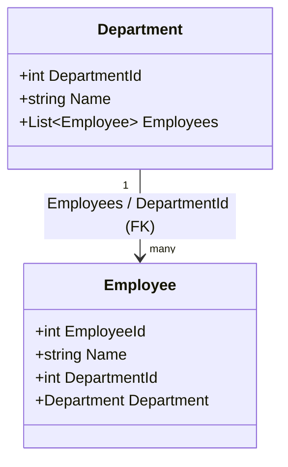
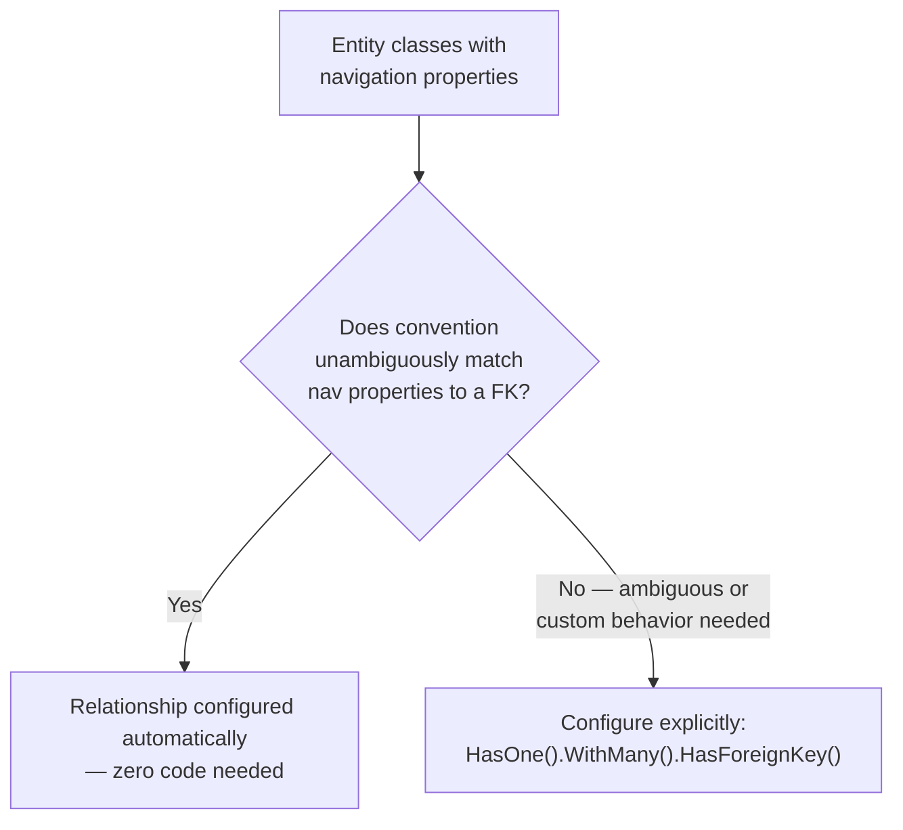

# Relationships: One-to-Many

## Introduction

Before reading this lesson, you should already be comfortable with **[Code-First Migrations](../11-efcore/11-03-code-first-migrations.md)** — how a schema change becomes a versioned, applyable code file. Every entity this module has used so far has stood entirely on its own: a `Product`, a `Customer`, a `Book`, each mapped to one isolated table with no connection to any other. Real data almost never looks like that. A customer places many orders; a department employs many people; a customer account and its history of purchases are two different tables that need to point at each other correctly. This lesson introduces how EF Core models exactly that kind of connection — a **one-to-many relationship** — using navigation properties, foreign keys, and, where convention isn't enough, explicit Fluent API configuration.

By the end of this lesson, you will be able to:

- Explain what a navigation property is, on both the "one" side and the "many" side of a relationship
- Identify the foreign key EF Core expects on the "many" side of a one-to-many relationship
- Describe how EF Core discovers a one-to-many relationship automatically from convention
- Configure a one-to-many relationship explicitly with the Fluent API when convention isn't sufficient
- Query related entities together using eager loading with `Include()`

## Relationships: One-to-Many — A Layman's Perspective

Picture a mail-order catalog company decades before anything was computerized. Every customer who's ever ordered from the company has exactly one manila folder sitting in a filing cabinet, labeled with their name and account number. Every time that customer places an order, a clerk fills out an order slip and clips it inside that customer's folder — right alongside every other order slip that customer has ever placed. Open any customer's folder and you can flip through every order they've made, front to back, without ever leaving that one folder. That folder, and its growing stack of clipped-in order slips, is a **navigation property** on the "one" side of the relationship: `Customer.Orders`, a whole collection reachable directly from the one customer who placed them.

But a stack of order slips clipped inside a folder isn't the only thing that has to be true for this filing system to work. Suppose a slip falls out, or gets handed to someone at a different desk entirely, away from the cabinet. If that slip doesn't independently say whose order it is, it's now just an anonymous scrap of paper — useless. So every order slip, from the moment it's filled out, also carries the customer's account number stamped in its own corner, completely independent of which folder it happens to be sitting in right now. That stamped account number is the **foreign key** — `Order.CustomerId` — and the ability to look at that one slip and say "this belongs to Customer #1042, folder or no folder" is the order's own navigation property back the other way: `Order.Customer`.

Most of the time, a new clerk figures out this filing system without anyone explaining it, just from looking at the labels: a slip stamped "CustomerId: 1042" obviously belongs in the folder for customer 1042, and a folder that has a whole labeled section for "Orders" obviously expects a stack of order slips inside it. EF Core works the same way — it looks at your `Customer` class having a `List<Order> Orders` collection and your `Order` class having both a `Customer Customer` reference and a plain `int CustomerId` property, and it infers, entirely from those names and shapes, that this must be a one-to-many relationship: one customer, many orders, connected by that `CustomerId` column. That's **convention-based discovery**, and it's why none of this lesson's relationship configuration is strictly required for the everyday case.

Every filing system eventually meets a case its usual labeling conventions can't resolve on their own, though. Suppose a single order slip needs to reference *two* different customer folders at once — a "bill this account" folder and a separate "ship to this account" folder for a gift order. Now a clerk genuinely cannot guess which stamped number goes with which folder just from a naming convention; someone has to write an explicit, unambiguous instruction: "the number stamped under 'Bill To' always files against the Billing folder; the number under 'Ship To' always files against the Shipping folder." That explicit instruction, written down rather than inferred, is exactly what the Fluent API's `HasOne().WithMany().HasForeignKey()` configuration provides EF Core when a relationship is too ambiguous — or too customized — for convention to resolve safely on its own.

## Relationships: One-to-Many — A Programming Language Perspective

A **navigation property** is a property on an entity class that points to a related entity (or collection of related entities) rather than to a scalar column value: on the "many" side, it's typically a single reference (`Order.Customer`); on the "one" side, it's typically a collection (`Customer.Orders`, usually typed as `List<T>` or `ICollection<T>`). The entity holding the foreign key is called the **dependent** entity (`Order`, which stores `CustomerId`); the entity being referenced is the **principal** entity (`Customer`, whose primary key `CustomerId` is what the foreign key points to). EF Core's model-building conventions discover a one-to-many relationship automatically when it finds a collection navigation on one entity, a matching reference navigation on the other, and a property on the dependent side named `<NavigationPropertyName>Id` or `<PrincipalEntityName>Id` — exactly the `Order.CustomerId` shape used throughout this lesson. When a relationship is ambiguous (multiple possible foreign keys between the same two types) or needs configuration convention can't express (a custom delete behavior, an unusually named FK column), it's configured explicitly inside `OnModelCreating` using `modelBuilder.Entity<TDependent>().HasOne(d => d.Principal).WithMany(p => p.Dependents).HasForeignKey(d => d.ForeignKeyProperty)`.

## How to Configure a One-to-Many Relationship

Most one-to-many relationships need no explicit configuration at all — write the navigation properties in the shape EF Core's conventions expect, and the relationship, its foreign key, and the generated schema all follow automatically. This example models a `Department` with many `Employee`s, entirely by convention, then reads the relationship back with eager loading.


*Figure 1: `Employee.DepartmentId` is the foreign key; `Department.Employees` and `Employee.Department` are the two navigation properties EF Core's conventions connect automatically.*

```csharp
// Program.cs — .NET 10 / C# 14
using Microsoft.Data.Sqlite;
using Microsoft.EntityFrameworkCore;

using SqliteConnection connection = new("DataSource=:memory:");
connection.Open();

DbContextOptions<CompanyContext> options = new DbContextOptionsBuilder<CompanyContext>()
    .UseSqlite(connection)
    .Options;

using CompanyContext context = new(options);
context.Database.EnsureCreated(); // A real app would use Lesson 3's migrations instead.

Department engineering = new() { Name = "Engineering" };
context.Departments.Add(engineering);
context.Employees.AddRange(
    new Employee { Name = "Amara Okafor", Department = engineering },
    new Employee { Name = "Liam Chen", Department = engineering }
);
context.SaveChanges();

foreach (Department department in context.Departments.Include(d => d.Employees))
{
    Console.WriteLine($"{department.Name}:");
    foreach (Employee employee in department.Employees)
    {
        Console.WriteLine($"  - {employee.Name}");
    }
}

class CompanyContext(DbContextOptions<CompanyContext> options) : DbContext(options)
{
    public DbSet<Department> Departments => Set<Department>();
    public DbSet<Employee> Employees => Set<Employee>();
}

class Department
{
    public int DepartmentId { get; set; }
    public string Name { get; set; } = string.Empty;
    public List<Employee> Employees { get; set; } = [];
}

class Employee
{
    public int EmployeeId { get; set; }
    public string Name { get; set; } = string.Empty;
    public int DepartmentId { get; set; }
    public Department? Department { get; set; }
}
```

**Console Output:**

```text
Engineering:
  - Amara Okafor
  - Liam Chen
```

Setting `Department = engineering` on each new `Employee` was enough for EF Core to also populate `DepartmentId` correctly when `SaveChanges()` ran — that fix-up between the two directions of the relationship is exactly what tracked navigation properties give you for free. `context.Departments.Include(d => d.Employees)` then performed **eager loading**: a single query that pulls back each department together with its employees already populated, rather than the employees needing a separate, later query per department.

## Real-Time Example: Customers and Orders in the E-Commerce API

We extend the `Customer` entity from **[DbContext and DbSet<T>](../11-efcore/11-02-dbcontext-and-dbset.md)** with a real `Order` history, connecting the two through a one-to-many relationship configured explicitly with the Fluent API — not because convention couldn't handle it, but to pin down a delete behavior (`DeleteBehavior.Cascade`) convention alone wouldn't make explicit in the code itself.

```csharp
// Program.cs — .NET 10 / C# 14 — Real-Time Example
using Microsoft.Data.Sqlite;
using Microsoft.EntityFrameworkCore;

using SqliteConnection connection = new("DataSource=:memory:");
connection.Open();

DbContextOptions<StoreContext> options = new DbContextOptionsBuilder<StoreContext>()
    .UseSqlite(connection)
    .Options;

using StoreContext context = new(options);
context.Database.EnsureCreated();

Customer priya = new() { Name = "Priya Shah", Email = "priya.shah@example.com" };
Customer diego = new() { Name = "Diego Ramirez", Email = "diego.ramirez@example.com" };

context.Customers.AddRange(priya, diego);
context.Orders.AddRange(
    new Order { Customer = priya, OrderDate = new DateOnly(2026, 8, 1), Total = 64.99m },
    new Order { Customer = priya, OrderDate = new DateOnly(2026, 8, 10), Total = 129.00m },
    new Order { Customer = diego, OrderDate = new DateOnly(2026, 8, 5), Total = 39.00m }
);
context.SaveChanges();

foreach (Customer customer in context.Customers.Include(c => c.Orders).OrderBy(c => c.Name))
{
    decimal lifetimeTotal = customer.Orders.Sum(o => o.Total);
    Console.WriteLine($"{customer.Name} — {customer.Orders.Count} order(s), lifetime total {lifetimeTotal:C}");
    foreach (Order order in customer.Orders.OrderBy(o => o.OrderDate))
    {
        Console.WriteLine($"  {order.OrderDate:yyyy-MM-dd}: {order.Total:C}");
    }
}

class StoreContext(DbContextOptions<StoreContext> options) : DbContext(options)
{
    public DbSet<Customer> Customers => Set<Customer>();
    public DbSet<Order> Orders => Set<Order>();

    protected override void OnModelCreating(ModelBuilder modelBuilder)
    {
        modelBuilder.Entity<Order>()
            .HasOne(o => o.Customer)
            .WithMany(c => c.Orders)
            .HasForeignKey(o => o.CustomerId)
            .OnDelete(DeleteBehavior.Cascade);
    }
}

class Customer
{
    public int CustomerId { get; set; }
    public string Name { get; set; } = string.Empty;
    public string Email { get; set; } = string.Empty;
    public List<Order> Orders { get; set; } = [];
}

class Order
{
    public int OrderId { get; set; }
    public DateOnly OrderDate { get; set; }
    public decimal Total { get; set; }

    public int CustomerId { get; set; }
    public Customer Customer { get; set; } = null!;
}
```

**Console Output:**

```text
Diego Ramirez — 1 order(s), lifetime total $39.00
  2026-08-05: $39.00
Priya Shah — 2 order(s), lifetime total $193.99
  2026-08-01: $64.99
  2026-08-10: $129.00
```

`.HasForeignKey(o => o.CustomerId).OnDelete(DeleteBehavior.Cascade)` makes explicit what happens to a customer's order history if that customer record is ever deleted — every order tied to it is deleted along with it, rather than being left behind pointing at a customer that no longer exists. This is precisely the kind of question a real e-commerce platform's data-retention policy needs answered in code, not left to whatever EF Core's convention happens to default to.

## Convention-Based Discovery vs Explicit Fluent API Configuration

Convention-based discovery is EF Core's default behavior: given navigation properties and a foreign-key-shaped property name it recognizes, it wires up the relationship, the foreign key, and the generated schema with zero configuration code, exactly as `Department`/`Employee` did above. It works well right up until a relationship becomes ambiguous or needs behavior convention can't express — most commonly, two separate relationships between the same pair of entity types (an `Order` with both a `BillingCustomerId` and a `ShippingCustomerId`, say), where EF Core has no way to guess which foreign key belongs to which navigation property without being told explicitly. Explicit Fluent API configuration inside `OnModelCreating` resolves exactly that ambiguity, and is also how you pin down details — like this lesson's cascade delete behavior — that convention would otherwise decide silently on your behalf.


*Figure 2: Convention handles the common case for free; explicit Fluent API configuration takes over exactly where convention can no longer guess safely.*

| Aspect | Convention-based discovery | Explicit Fluent API configuration |
|---|---|---|
| Code required | None — just shape the navigation properties correctly | `modelBuilder.Entity<T>().HasOne().WithMany().HasForeignKey()` |
| When it's sufficient | One clear relationship between two entity types, standard `<Nav>Id` naming | Multiple relationships between the same two types, or non-standard naming |
| Controls delete behavior | Uses EF Core's default (cascade for required relationships) | Set explicitly via `.OnDelete(DeleteBehavior...)` |
| Risk if relied on when ambiguous | EF Core may throw a configuration exception at startup | N/A — explicit configuration always resolves the ambiguity |

## Types of Entity Relationships in EF Core

A handful of related relationship shapes and querying techniques round out one-to-many:

1. **[Relationships: Many-to-Many](../11-efcore/11-05-relationships-many-to-many.md)** — the next relationship shape, where either side can relate to many of the other.
2. **[Querying with EF Core and LINQ](../11-efcore/11-06-querying-with-ef-core-linq.md)** — eager loading with `Include()`/`ThenInclude()` versus lazy and explicit loading, covered in full.
3. **One-to-one relationships** — configured with `HasOne().WithOne()`, used when exactly one entity extends another (a `Customer` and a single `CustomerProfile`, for example).
4. **Optional vs required relationships** — a nullable foreign key property (`int?`) makes the relationship optional; a non-nullable one makes it required.
5. **Delete behaviors** (`Cascade`, `Restrict`, `SetNull`, `NoAction`) — the full set of options `OnDelete()` accepts beyond this lesson's `Cascade` example.
6. **Shadow foreign key properties** — a foreign key column that exists in the database but has no corresponding CLR property on the entity class at all.

## What You've Learned & What's Next

A one-to-many relationship connects entities through a pair of navigation properties — a collection on the "one" side, a single reference plus a foreign key on the "many" side — and EF Core discovers that connection automatically from convention whenever the naming is unambiguous, falling back to explicit Fluent API configuration exactly when it isn't. You've now connected `Customer` and `Order` for real, with eager loading pulling both sides back together in a single query.

Continue your learning journey with **[Relationships: Many-to-Many](../11-efcore/11-05-relationships-many-to-many.md)**, where a single entity on either side can relate to many entities on the other — and where EF Core's modern skip-navigation support means you often don't need an explicit join entity class at all.

---
*Applies to: .NET 10 / C# 14. Last reviewed 2026-08-16.*
