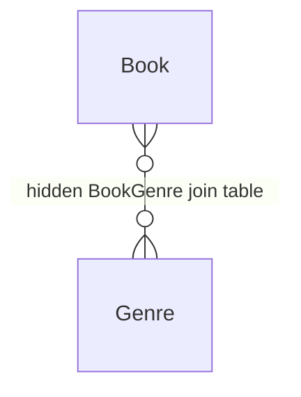
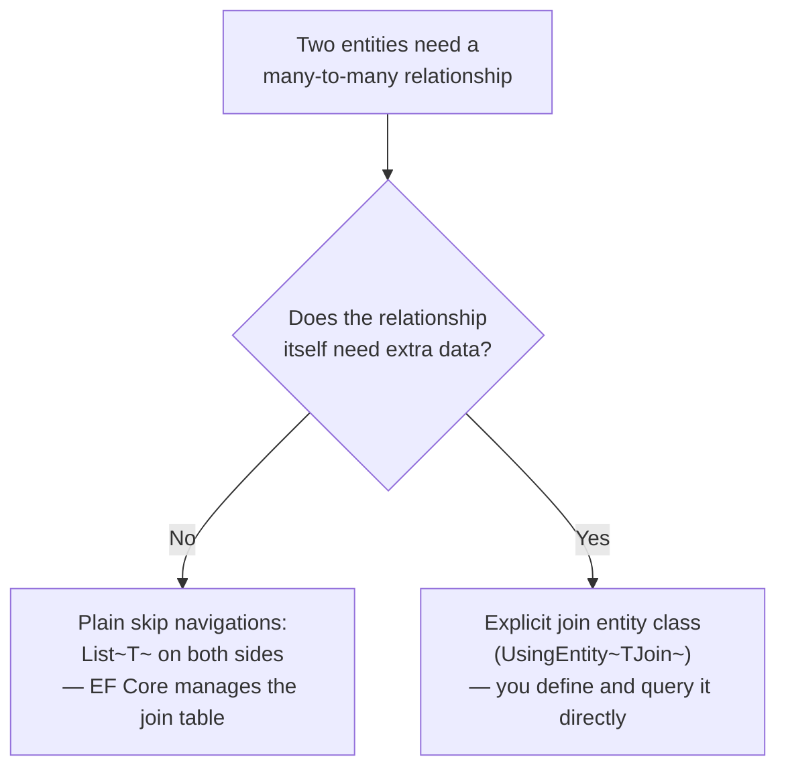

# Relationships: Many-to-Many

## Introduction

Before reading this lesson, you should already be comfortable with **[Relationships: One-to-Many](../11-efcore/11-04-relationships-one-to-many.md)** — navigation properties, foreign keys, and how EF Core discovers a relationship's shape from convention or explicit Fluent API configuration. A one-to-many relationship has one clear "many" side holding a foreign key back to a single "one." Some relationships don't fit that shape at all: a single library book can have several authors, and any one of those authors has likely written several other books, each possibly with yet other co-authors. Neither side can hold a simple foreign key back to just one row on the other, because neither side relates to just one row. This lesson covers exactly that shape — a **many-to-many relationship** — and how EF Core's modern skip-navigation support usually removes the need for an explicit join class, while still supporting one when the relationship itself carries extra data.

By the end of this lesson, you will be able to:

- Explain what a many-to-many relationship is, and why neither side can hold a single foreign key to the other
- Map a many-to-many relationship using EF Core's skip navigations, with no explicit join entity class required
- Configure an explicit join entity class when the relationship itself needs its own extra columns
- Query many-to-many data both through skip navigations and through an explicit join entity
- Apply both approaches to a Library/Inventory `Book`/`Author`/`Genre` case study

## Relationships: Many-to-Many — A Layman's Perspective

Picture the card catalog at the back of an old, well-run library — not the shelf labels, but the separate cross-reference index the librarian keeps specifically for tracking which books belong to which authors. A book like *Good Omens* doesn't belong to just one author's drawer; it has to be reachable from both Terry Pratchett's card and Neil Gaiman's card at once. Neither author's card can simply say "my one book is this," because neither of them has just one book, and this particular book doesn't have just one author either. So the librarian keeps a separate stack of small cross-reference cards, one card per (book, author) pairing, filed in its own dedicated drawer — not owned by either the book's section or the author's section, but bridging the two. Look up *Good Omens* in that drawer and you find two cards, one pointing to Pratchett, one pointing to Gaiman; look up either author and you find a card pointing back to that same book. That cross-reference drawer is the **join table**, and for years, actually building one meant explicitly designing a whole separate filing system for it — a real intermediate class in your code, standing in for that drawer, that you had to create and maintain by hand.

Modern EF Core mostly removes that busywork. If all you need is the plain fact that a book has some authors and an author has some books — nothing more, no extra detail about the pairing itself — EF Core will notice that a `Book` class has a `List<Author> Authors` property and an `Author` class has a matching `List<Book> Books` property, and it will quietly build and manage that cross-reference drawer for you, entirely behind the scenes, without you ever writing a class for it. You just write two ordinary-looking collection properties, one on each side, and the librarian's cross-reference drawer appears on its own, fully wired up.

But sometimes a plain cross-reference card genuinely isn't enough, because the *pairing itself* needs its own information that belongs to neither the book nor the author alone. Suppose the library wants to record not just *that* Pratchett and Gaiman wrote *Good Omens* together, but which of them is credited first on the cover — information that describes the collaboration itself, not either author individually and not the book on its own. At that point, a plain unlabeled cross-reference card can't hold what you need; the librarian has to start writing a note directly onto each specific card — "Pratchett, credited first" — turning what used to be an anonymous linking card into a small record with its own extra detail. That's exactly what an **explicit join entity class** is for in EF Core: the moment the relationship itself needs a property of its own, you stop letting EF Core manage an invisible cross-reference drawer and instead define that drawer's cards yourself, as a real class, with whatever extra columns the pairing actually needs.

## Relationships: Many-to-Many — A Programming Language Perspective

A **many-to-many relationship** connects two entity types where either side can be associated with any number of the other, with the association itself typically represented in a relational database by a separate **join table** holding a foreign key to each side. Since EF Core 5, **skip navigations** — a `List<TOther>`-shaped navigation property on each entity type pointing directly at the other, skipping over any intermediate class in your code — let EF Core infer and manage that join table entirely on its own, with no explicit join entity class required at all; this is the default, and simplest, way to map a many-to-many relationship today. When the relationship itself needs additional data — a property that belongs to the *pairing*, not to either entity individually — you instead define an explicit join entity class (with foreign key properties to both sides plus whatever extra columns you need) and configure it with `modelBuilder.Entity<TLeft>().HasMany(l => l.Rights).WithMany(r => r.Lefts).UsingEntity<TJoin>(...)`, which still keeps the two `List<T>` skip navigations available alongside direct access to the join entity's own extra properties.

## How to Map a Many-to-Many Relationship with Skip Navigations

The plain case needs nothing more than two matching `List<T>` navigation properties, one on each entity — no join class, no extra Fluent API configuration at all. This example connects `Book` and `Genre` for the **Library/Inventory Management** case study, where a single book (a fantasy-comedy like this one) can reasonably belong to more than one genre.


*Figure 1: EF Core infers and manages the `BookGenre` join table automatically from `Book.Genres` and `Genre.Books` alone — no class represents it in your code.*

```csharp
// Program.cs — .NET 10 / C# 14
using Microsoft.Data.Sqlite;
using Microsoft.EntityFrameworkCore;

using SqliteConnection connection = new("DataSource=:memory:");
connection.Open();

DbContextOptions<LibraryContext> options = new DbContextOptionsBuilder<LibraryContext>()
    .UseSqlite(connection)
    .Options;

using LibraryContext context = new(options);
context.Database.EnsureCreated(); // A real app would use Lesson 3's migrations instead.

Genre fiction = new() { Name = "Fiction" };
Genre fantasy = new() { Name = "Fantasy" };

Book goodOmens = new() { Title = "Good Omens" };
goodOmens.Genres.Add(fiction);
goodOmens.Genres.Add(fantasy);

context.Books.Add(goodOmens);
context.SaveChanges();

foreach (Book book in context.Books.Include(b => b.Genres))
{
    string genreNames = string.Join(", ", book.Genres.Select(g => g.Name));
    Console.WriteLine($"{book.Title}: {genreNames}");
}

class LibraryContext(DbContextOptions<LibraryContext> options) : DbContext(options)
{
    public DbSet<Book> Books => Set<Book>();
    public DbSet<Genre> Genres => Set<Genre>();
}

class Book
{
    public int BookId { get; set; }
    public string Title { get; set; } = string.Empty;
    public List<Genre> Genres { get; set; } = [];
}

class Genre
{
    public int GenreId { get; set; }
    public string Name { get; set; } = string.Empty;
    public List<Book> Books { get; set; } = [];
}
```

**Console Output:**

```text
Good Omens: Fiction, Fantasy
```

Neither `Book` nor `Genre` has a foreign key property anywhere in sight — `goodOmens.Genres.Add(fiction)` was the only instruction needed, and EF Core inferred, created, and populated a hidden `BookGenre` join table entirely on its own when `SaveChanges()` ran. `context.Books.Include(b => b.Genres)` then eagerly loaded each book together with its genres in one query, exactly as `Include()` did for the one-to-many relationship in the previous lesson.

## Real-Time Example: Crediting Co-Authors in the Library/Inventory Catalog

We extend the Library/Inventory case study with `Book` and `Author`, and this time the relationship itself needs its own data: which author is credited *first* on the cover. That extra detail belongs to the specific (book, author) pairing, not to either entity alone, so this relationship needs an explicit join entity — `BookAuthor`, carrying an `AuthorOrder` column — configured through `UsingEntity<BookAuthor>()` rather than left to a plain skip navigation.

```csharp
// Program.cs — .NET 10 / C# 14 — Real-Time Example
using Microsoft.Data.Sqlite;
using Microsoft.EntityFrameworkCore;

using SqliteConnection connection = new("DataSource=:memory:");
connection.Open();

DbContextOptions<LibraryContext> options = new DbContextOptionsBuilder<LibraryContext>()
    .UseSqlite(connection)
    .Options;

using LibraryContext context = new(options);
context.Database.EnsureCreated();

Book goodOmens = new() { Title = "Good Omens" };
Author pratchett = new() { Name = "Terry Pratchett" };
Author gaiman = new() { Name = "Neil Gaiman" };

context.Books.Add(goodOmens);
context.Authors.AddRange(pratchett, gaiman);
context.SaveChanges();

context.Set<BookAuthor>().AddRange(
    new BookAuthor { Book = goodOmens, Author = pratchett, AuthorOrder = 1 },
    new BookAuthor { Book = goodOmens, Author = gaiman, AuthorOrder = 2 }
);
context.SaveChanges();

List<BookAuthor> credits = context.Set<BookAuthor>()
    .Include(ba => ba.Author)
    .Where(ba => ba.Book.Title == "Good Omens")
    .OrderBy(ba => ba.AuthorOrder)
    .ToList();

Console.WriteLine($"{goodOmens.Title}:");
foreach (BookAuthor credit in credits)
{
    Console.WriteLine($"  {credit.AuthorOrder}. {credit.Author.Name}");
}

class LibraryContext(DbContextOptions<LibraryContext> options) : DbContext(options)
{
    public DbSet<Book> Books => Set<Book>();
    public DbSet<Author> Authors => Set<Author>();

    protected override void OnModelCreating(ModelBuilder modelBuilder)
    {
        modelBuilder.Entity<Book>()
            .HasMany(b => b.Authors)
            .WithMany(a => a.Books)
            .UsingEntity<BookAuthor>(
                j => j.HasOne(ba => ba.Author).WithMany().HasForeignKey(ba => ba.AuthorId),
                j => j.HasOne(ba => ba.Book).WithMany().HasForeignKey(ba => ba.BookId),
                j => j.HasKey(ba => new { ba.BookId, ba.AuthorId }));
    }
}

class Book
{
    public int BookId { get; set; }
    public string Title { get; set; } = string.Empty;
    public List<Author> Authors { get; set; } = [];
}

class Author
{
    public int AuthorId { get; set; }
    public string Name { get; set; } = string.Empty;
    public List<Book> Books { get; set; } = [];
}

class BookAuthor
{
    public int BookId { get; set; }
    public Book Book { get; set; } = null!;
    public int AuthorId { get; set; }
    public Author Author { get; set; } = null!;
    public int AuthorOrder { get; set; }
}
```

**Console Output:**

```text
Good Omens:
  1. Terry Pratchett
  2. Neil Gaiman
```

`Book` and `Author` still carry ordinary `List<T>` skip navigations — `Book.Authors` and `Author.Books` — so simple "which authors wrote this book, in no particular order" questions still need nothing more than `Include(b => b.Authors)`, exactly like the `Book`/`Genre` example above. What changed is that `AuthorOrder` needed a real column to live in, so the join itself became a real class, `BookAuthor`, queried here directly through `context.Set<BookAuthor>()` rather than through the skip navigations, specifically because this query cares about the pairing's own data, not just which books and authors are connected.

## Skip-Navigation Many-to-Many vs an Explicit Join Entity

Both approaches map the same kind of relationship and both still let you write `book.Genres` or `book.Authors` as ordinary `List<T>` navigation properties — the difference is entirely about whether the *pairing itself* needs to carry any data. A plain skip-navigation many-to-many is the right default: EF Core creates and manages the join table invisibly, and you never write a class for it. An explicit join entity becomes necessary the moment the relationship needs its own property — an `AuthorOrder`, a `RoyaltyPercentage`, a "date this genre tag was added" — because that data has nowhere else to live; it doesn't belong to either side of the relationship on its own.


*Figure 2: The join table is always there in the database either way; the only question is whether your code needs a class representing it.*

| Aspect | Plain skip navigations | Explicit join entity |
|---|---|---|
| Join table | Created and managed by EF Core automatically | Backed by a real class you define (`BookAuthor`) |
| Extra columns on the relationship itself | Not possible | Yes — any property the join entity declares |
| How you query it | Directly through `book.Genres` / `genre.Books` | Through `context.Set<TJoin>()`, or the skip navigations for simple cases |
| When to use | The relationship carries no data of its own | The pairing itself needs its own property |

## Types of Many-to-Many Configuration in EF Core

A handful of related pieces round out many-to-many mapping:

1. **[Querying with EF Core and LINQ](../11-efcore/11-06-querying-with-ef-core-linq.md)** — how much of a query against these navigation properties actually gets pushed down into SQL, covered next.
2. **[Relationships: One-to-Many](../11-efcore/11-04-relationships-one-to-many.md)** — the simpler relationship shape this lesson's join entity still ultimately relies on for its two foreign keys.
3. **Composite keys** — `HasKey(ba => new { ba.BookId, ba.AuthorId })`, the pattern this lesson's `BookAuthor` join entity used for its own primary key.
4. **Self-referencing many-to-many relationships** — an entity relating to many of its own type, such as a "related products" or "customers who bought this also bought" recommendation graph.
5. **Custom join table naming** — passing a table name string to `UsingEntity("BookGenres")` instead of relying on EF Core's default generated name.
6. **Many-to-many across providers** — skip navigations and explicit join entities both map identically whether the underlying provider is SQLite, SQL Server, or PostgreSQL; only the generated SQL dialect changes.

## What You've Learned & What's Next

A many-to-many relationship connects two entity types where either side can relate to many of the other, and EF Core's skip navigations — a `List<T>` on each side — let you map that connection with no explicit join class at all, right up until the relationship itself needs its own data, at which point an explicit join entity like `BookAuthor` takes over. You've now modeled both shapes in the same Library/Inventory catalog: a plain `Book`/`Genre` tagging relationship, and a `Book`/`Author` credit list that needed to remember its own ordering.

Continue your learning journey with **[Querying with EF Core and LINQ](../11-efcore/11-06-querying-with-ef-core-linq.md)**, where we look properly at how much of the LINQ this module has been writing all along — `.Where()`, `.Include()`, `.OrderBy()` — actually gets translated into SQL, and where that translation quietly breaks down.

---
*Applies to: .NET 10 / C# 14. Last reviewed 2026-08-16.*
