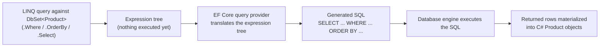
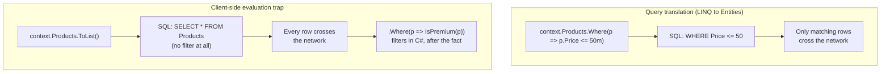

# Querying with EF Core and LINQ

## Introduction

Before reading this lesson, you should already be comfortable with **[Relationships: Many-to-Many](../11-efcore/11-05-relationships-many-to-many.md)** and, more broadly, with how EF Core maps `DbSet<T>` properties on a `DbContext` to tables and navigation properties to relationships. Every lesson up to this point has been about *shape* — how classes and foreign keys become tables, columns, and join tables. This lesson is about *asking questions* of that shape: writing ordinary-looking LINQ queries against a `DbSet<T>` and understanding that, unlike the `List<T>` and `IEnumerable<T>` queries from Module 04, these queries never run in your application's memory at all. They get inspected, translated, and executed as SQL, on the database server, and only the results travel back.

By the end of this lesson, you will be able to:

- Explain why a `DbSet<T>` is an `IQueryable<T>`, and why that distinction — not just naming — determines how a LINQ query actually executes
- Write filtering, ordering, and projection queries against a `DbSet<T>` and predict the SQL EF Core will generate
- Preview `Include()` for eager-loading a navigation property in the same query, ahead of next lesson's deep dive
- Recognize what client-side evaluation looks like, why it silently defeats the purpose of a database query, and how to avoid it
- Connect query translation directly back to Module 04's **[LINQ to Objects vs LINQ to Entities](../04-linq/04-21-linq-to-objects-vs-entities.md)** lesson, which foreshadowed everything this lesson now makes concrete

## Querying with EF Core and LINQ — A Layman's Perspective

Picture a busy restaurant with an open kitchen and a very literal-minded waiter. A customer tells the waiter, "I'd like something under $15, no shellfish, and nothing that takes more than twenty minutes to cook." A bad waiter would walk into the kitchen, carry out every single dish currently prepared or in progress, set the entire spread down in front of the customer, and let the customer sort through all of it personally to find something that fits. That approach technically works — the customer does eventually get a suitable dish — but it means hauling out food nobody asked for, dishes that were shellfish, dishes well over budget, all so the filtering can happen at the table instead of in the kitchen.

A good waiter does something different. They take the customer's exact criteria back into the kitchen, hand them to the kitchen staff exactly as stated, and the kitchen staff — who already know everything on the menu, what's in stock, and what's cooking — picks only the dishes that actually match before anything leaves the kitchen at all. The customer receives just the two or three dishes that fit. Nothing irrelevant ever makes the trip to the table.

That difference is the entire subject of this lesson. When you write a LINQ query against an in-memory `List<Product>`, you're the bad waiter's customer sorting through everything yourself — the whole list is already in front of you, in memory, and `.Where()` just walks it item by item. But when you write that same-looking LINQ query against a `DbSet<Product>` from a `DbContext`, you're handing your criteria to the kitchen. The query doesn't run against data sitting in your application's memory, because there isn't any yet. Instead, EF Core reads your criteria, translates it into the database's own language — SQL — and sends *that* to the database server, which does the actual filtering, sorting, and selecting using its own indexes and query optimizer, exactly the way a kitchen staff would use their own knowledge of the pantry. Only the matching rows travel back over the network into your application as objects.

The trap this lesson also covers is what happens when a waiter accidentally reverts to the bad habit — say, by grabbing every dish from the kitchen "just in case" before checking any criteria at all, and only then trying to apply the customer's requirements at the table. Even though the *end result* looks the same to the customer, the kitchen did far more work than it needed to, and so did the trip out to the table. In EF Core terms, that's client-side evaluation: pulling far more data across the wire than necessary, and filtering it in your own application's memory instead of letting the database do what it's good at.

## Querying with EF Core and LINQ — A Programming Language Perspective

`DbSet<T>` implements `IQueryable<T>`, not merely `IEnumerable<T>`. Where LINQ to Objects (Module 04) compiles a lambda like `p => p.Price > 50m` into an ordinary `Func<Product, bool>` delegate and runs it immediately against in-memory items, `IQueryable<T>`'s LINQ operators instead build an `Expression<Func<Product, bool>>` — a data structure *describing* the lambda's logic as a tree of nodes, rather than compiled, runnable code. Composing `.Where()`, `.OrderBy()`, and `.Select()` against a `DbSet<T>` chains these expression trees together without executing anything; this is deferred execution, the same principle from Module 04's **[Deferred vs. Immediate Execution](../04-linq/04-03-deferred-vs-immediate-execution.md)** lesson, just one layer further removed from immediate evaluation. Execution is triggered only when the query is enumerated — a `foreach`, or a call to `.ToList()`, `.First()`, `.Count()`, and similar. At that point, EF Core's query provider walks the accumulated expression tree, translates it into SQL appropriate for the configured database provider, executes it, and materializes the returned rows into `Product` instances.

## How to Query with LINQ Against a DbSet&lt;T&gt;

Writing a query against a `DbSet<T>` looks identical to writing one against a `List<T>` — the same `.Where()`, `.OrderBy()`, and `.Select()` methods are involved — but what happens underneath is entirely different, as the diagram below shows.


*Figure 1: A LINQ query against a `DbSet<T>` builds an expression tree first; only enumerating it triggers translation to SQL, execution, and materialization.*

The example below uses the EF Core SQLite in-memory provider (`Microsoft.EntityFrameworkCore.Sqlite`, connection string `"DataSource=:memory:"`, with the `SqliteConnection` kept open for the `DbContext`'s lifetime) so the query genuinely round-trips through real SQL rather than an in-memory collection. Everything shown works identically against `Microsoft.EntityFrameworkCore.InMemory`, or against a real relational provider such as SQL Server or PostgreSQL — swapping `UseSqlite(...)` for `UseSqlServer(...)` changes nothing about the LINQ code itself.

```csharp
// Program.cs — .NET 10 / C# 14
using Microsoft.Data.Sqlite;
using Microsoft.EntityFrameworkCore;

var connection = new SqliteConnection("DataSource=:memory:");
connection.Open();

var options = new DbContextOptionsBuilder<StoreContext>()
    .UseSqlite(connection)
    .Options;

using var context = new StoreContext(options);
context.Database.EnsureCreated();

context.Products.AddRange(
    new Product { Name = "Wireless Mouse", Price = 24.99m, StockQuantity = 120 },
    new Product { Name = "Mechanical Keyboard", Price = 89.50m, StockQuantity = 45 },
    new Product { Name = "USB-C Hub", Price = 34.00m, StockQuantity = 0 },
    new Product { Name = "4K Monitor", Price = 329.99m, StockQuantity = 15 });
context.SaveChanges();

// Still just an expression tree — nothing has executed yet.
IQueryable<Product> query = context.Products
    .Where(p => p.Price >= 30m && p.StockQuantity > 0)
    .OrderBy(p => p.Price)
    .Select(p => p);

Console.WriteLine("Products priced at $30+ that are in stock:");
foreach (Product product in query) // enumeration triggers translation + execution
{
    Console.WriteLine($"- {product.Name}: {product.Price:C} ({product.StockQuantity} in stock)");
}

// Preview: Include() eagerly loads a navigation property in the same SQL query.
// Module 11-07 covers this in depth — for now, just note it runs as one round trip.
var alice = new Customer { FullName = "Alice Nguyen", Email = "alice@example.com" };
context.Customers.Add(alice);
context.SaveChanges();

var monitor = context.Products.Single(p => p.Name == "4K Monitor");
context.Orders.Add(new Order
{
    CustomerId = alice.CustomerId,
    OrderDate = new DateTime(2026, 8, 10),
    Status = OrderStatus.Pending,
    OrderItems = { new OrderItem { ProductId = monitor.ProductId, Quantity = 1, UnitPrice = monitor.Price } }
});
context.SaveChanges();

Order? loadedOrder = context.Orders
    .Include(o => o.Customer)
    .FirstOrDefault(o => o.Status == OrderStatus.Pending);

Console.WriteLine($"\nOrder #{loadedOrder!.OrderId} placed by {loadedOrder.Customer.FullName}");

// The client-side evaluation trap: ToList() pulls every row into memory FIRST,
// then the second Where() runs as ordinary LINQ to Objects, in C#, on the client.
List<Product> allProductsInMemory = context.Products.ToList(); // SQL: SELECT * FROM Products (no filter)
List<Product> premiumInMemory = allProductsInMemory
    .Where(p => IsPremium(p))
    .ToList();

Console.WriteLine($"\nClient-side evaluation trap: pulled {allProductsInMemory.Count} rows into memory before filtering down to {premiumInMemory.Count}.");

static bool IsPremium(Product p) => p.Price >= 200m;

class Category
{
    public int CategoryId { get; set; }
    public string Name { get; set; } = string.Empty;
    public List<Product> Products { get; set; } = new();
}

class Product
{
    public int ProductId { get; set; }
    public string Name { get; set; } = string.Empty;
    public decimal Price { get; set; }
    public int StockQuantity { get; set; }
    public List<Category> Categories { get; set; } = new();
    public List<OrderItem> OrderItems { get; set; } = new();
}

class Customer
{
    public int CustomerId { get; set; }
    public string FullName { get; set; } = string.Empty;
    public string Email { get; set; } = string.Empty;
    public List<Order> Orders { get; set; } = new();
}

enum OrderStatus { Pending, Shipped, Delivered, Cancelled }

class Order
{
    public int OrderId { get; set; }
    public DateTime OrderDate { get; set; }
    public OrderStatus Status { get; set; }
    public int CustomerId { get; set; }
    public Customer Customer { get; set; } = null!;
    public List<OrderItem> OrderItems { get; set; } = new();
}

class OrderItem
{
    public int OrderItemId { get; set; }
    public int OrderId { get; set; }
    public Order Order { get; set; } = null!;
    public int ProductId { get; set; }
    public Product Product { get; set; } = null!;
    public int Quantity { get; set; }
    public decimal UnitPrice { get; set; }
}

class StoreContext(DbContextOptions<StoreContext> options) : DbContext(options)
{
    public DbSet<Customer> Customers => Set<Customer>();
    public DbSet<Order> Orders => Set<Order>();
    public DbSet<OrderItem> OrderItems => Set<OrderItem>();
    public DbSet<Product> Products => Set<Product>();
    public DbSet<Category> Categories => Set<Category>();
}
```

**Console Output:**

```text
Products priced at $30+ that are in stock:
- Mechanical Keyboard: $89.50 (45 in stock)
- 4K Monitor: $329.99 (15 in stock)

Order #1 placed by Alice Nguyen

Client-side evaluation trap: pulled 4 rows into memory before filtering down to 1.
```

The first block proves translation happened: only the two in-stock products priced $30 or above came back, already sorted, even though the database held four rows. The `Include()` preview resolved `Customer` in the very same query as `Order` — one round trip, no separate lookup — which is exactly what next lesson explores in depth. The final block is the trap: `IsPremium` is an ordinary C# method EF Core cannot translate into SQL, so calling `.ToList()` before filtering forces all four rows across the wire first, and the filtering that should have been a `WHERE` clause instead runs, pointlessly, in your application's memory.

## Real-Time Example: Product Catalog Search in E-Commerce Order Processing

We continue building on the `Product` and `Category` classes from the many-to-many relationship in the previous lesson. A realistic e-commerce catalog search feature lets a shopper filter by category, maximum price, and stock availability — but any given search might use only some of those filters. A `ProductCatalogService` builds up its query incrementally as an `IQueryable<Product>`, adding a `.Where()` clause only for the filters the caller actually supplied, and only calls `.ToList()` once, at the very end, after every applicable filter has been chained on.

```csharp
public record ProductSearchResult(string Name, decimal Price, int StockQuantity);

public class ProductCatalogService
{
    private readonly StoreContext _context;

    public ProductCatalogService(StoreContext context) => _context = context;

    public List<ProductSearchResult> Search(string? categoryName, decimal? maxPrice, bool inStockOnly)
    {
        IQueryable<Product> query = _context.Products.Include(p => p.Categories);

        if (!string.IsNullOrWhiteSpace(categoryName))
        {
            query = query.Where(p => p.Categories.Any(c => c.Name == categoryName));
        }

        if (maxPrice.HasValue)
        {
            query = query.Where(p => p.Price <= maxPrice.Value);
        }

        if (inStockOnly)
        {
            query = query.Where(p => p.StockQuantity > 0);
        }

        // Still nothing has executed — this is the single point where the
        // fully-composed expression tree is finally translated and run.
        return query
            .OrderBy(p => p.Price)
            .Select(p => new ProductSearchResult(p.Name, p.Price, p.StockQuantity))
            .ToList();
    }
}
```

```csharp
// Seeding and using ProductCatalogService
var electronics = new Category { Name = "Electronics" };
var accessories = new Category { Name = "Accessories" };

var mouse = new Product { Name = "Wireless Mouse", Price = 24.99m, StockQuantity = 120, Categories = { accessories } };
var keyboard = new Product { Name = "Mechanical Keyboard", Price = 89.50m, StockQuantity = 45, Categories = { accessories, electronics } };
var hub = new Product { Name = "USB-C Hub", Price = 34.00m, StockQuantity = 0, Categories = { accessories } };
var monitor = new Product { Name = "4K Monitor", Price = 329.99m, StockQuantity = 15, Categories = { electronics } };

context.Products.AddRange(mouse, keyboard, hub, monitor);
context.SaveChanges();

var catalog = new ProductCatalogService(context);

Console.WriteLine("Search: Electronics, no price cap, in stock only");
foreach (var r in catalog.Search("Electronics", maxPrice: null, inStockOnly: true))
{
    Console.WriteLine($"- {r.Name}: {r.Price:C} ({r.StockQuantity} in stock)");
}

Console.WriteLine("\nSearch: any category, max $50, in stock only");
foreach (var r in catalog.Search(null, 50m, true))
{
    Console.WriteLine($"- {r.Name}: {r.Price:C} ({r.StockQuantity} in stock)");
}
```

**Console Output:**

```text
Search: Electronics, no price cap, in stock only
- Mechanical Keyboard: $89.50 (45 in stock)
- 4K Monitor: $329.99 (15 in stock)

Search: any category, max $50, in stock only
- Wireless Mouse: $24.99 (120 in stock)
```

Each `Search()` call builds a different SQL `WHERE` clause depending on which arguments were supplied, but the database — not the application — still does every bit of the filtering. A naive alternative implementation that called `.ToList()` immediately and then filtered with `if` statements in C# would work identically for these four rows, but would collapse under a real catalog of a hundred thousand products, fetching all of them on every single search regardless of how narrow the filters were.

## Query Translation vs Client-Side Evaluation

The distinction this lesson keeps returning to is *where* filtering, sorting, and projecting logic actually executes: inside the database engine, as part of a translated SQL statement, or inside your own application process, after data has already been fetched. They can look deceptively similar in code — both are LINQ, both use `.Where()` — which is exactly why the trap is easy to fall into without noticing.


*Figure 2: The same-looking `.Where()` call executes as a SQL `WHERE` clause when composed on an `IQueryable<T>` before enumeration — or as ordinary LINQ to Objects, on already-fetched data, once `.ToList()` has run.*

| Aspect | Query Translation (LINQ to Entities) | Client-Side Evaluation (LINQ to Objects) |
|---|---|---|
| Where filtering executes | Inside the database, as a SQL `WHERE` clause | In application memory, after rows are already fetched |
| Data transferred over the network | Only the matching rows | The entire fetched result set, unfiltered |
| Typically triggered by | Composing `.Where()`/`.OrderBy()`/`.Select()` on an `IQueryable<T>` before enumerating | Calling `.ToList()`/`.AsEnumerable()` early, then continuing to filter in C# |
| Performance at scale | Scales with the size of the *matching* result set | Scales with the size of the *entire* fetched set, however few rows match |

## Types of Querying Concerns in EF Core

This lesson's filtering, ordering, and projection queries are just the entry point into how EF Core moves data between your objects and the database — several related concerns get their own dedicated lessons:

1. **[Eager Loading vs Lazy Loading](../11-efcore/11-07-eager-vs-lazy-loading.md)** — the deep dive on `Include()`/`ThenInclude()` this lesson only previewed, plus the lazy-loading alternative and its N+1 query risk.
2. **[Explicit Loading](../11-efcore/11-08-explicit-loading.md)** — loading a navigation property on demand, after the initial query, with `context.Entry(...).Load()`.
3. **[Change Tracking](../11-efcore/11-09-change-tracking.md)** — how EF Core knows which properties changed on entities returned by a query like this one, and how `AsNoTracking()` skips that overhead for read-only queries.
4. **[Raw SQL and Stored Procedures](../11-efcore/11-11-raw-sql-and-stored-procedures.md)** — for the cases where you bypass LINQ translation entirely and hand EF Core exact SQL to run.
5. **[LINQ to Objects vs LINQ to Entities](../04-linq/04-21-linq-to-objects-vs-entities.md)** — Module 04's conceptual foundation for the `IEnumerable<T>` vs `IQueryable<T>` distinction this lesson made concrete against a real database.
6. **[LINQ Performance Considerations](../04-linq/04-19-linq-performance-considerations.md)** — deferred-execution pitfalls like multiple enumeration that apply just as much once a query is backed by a real database round trip.

## What You've Learned & What's Next

A `DbSet<T>` is an `IQueryable<T>`: your `.Where()`, `.OrderBy()`, and `.Select()` calls build an expression tree that EF Core only translates into SQL — and only executes — once you enumerate it, and calling `.ToList()` too early is the single most common way to accidentally throw that translation away and fall back to filtering in application memory instead. `Include()` got its first mention here as the tool for pulling a navigation property into that same SQL round trip.

Continue your learning journey with **[Eager Loading vs Lazy Loading](../11-efcore/11-07-eager-vs-lazy-loading.md)**, where `Include()`/`ThenInclude()` get the full treatment, alongside the lazy-loading alternative EF Core deliberately does *not* enable by default.

---
*Applies to: .NET 10 / C# 14. Last reviewed 2026-08-16.*
