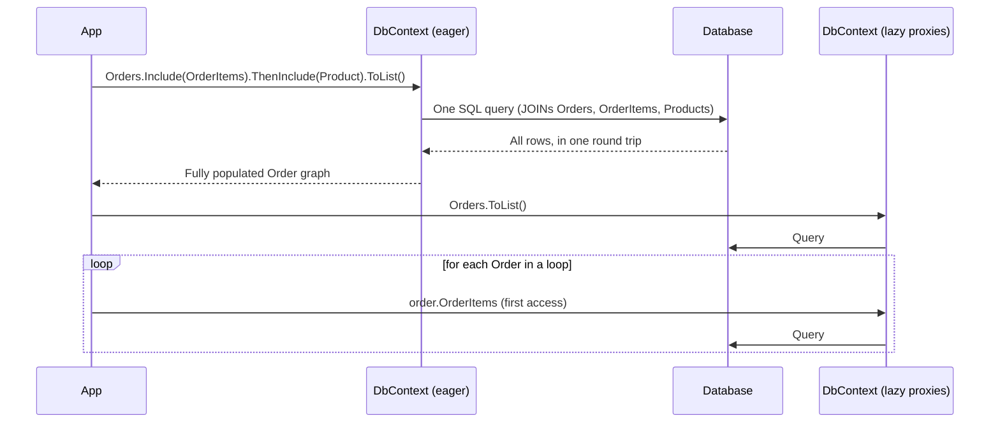
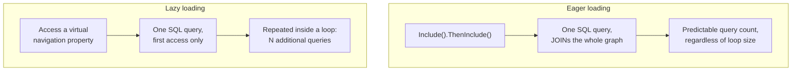

# Eager Loading vs Lazy Loading

## Introduction

Before reading this lesson, you should already be comfortable with **[Querying with EF Core and LINQ](../11-efcore/11-06-querying-with-ef-core-linq.md)**, including the brief preview of `Include()` that lesson ended on. This lesson gives that preview its full treatment and introduces its counterpart: instead of asking for related data up front, lazy loading fetches a navigation property automatically, behind the scenes, the moment your code first touches it. Both strategies solve the same underlying problem — a `Customer` object doesn't automatically know about its `Order`s until *something* goes and fetches them — but they solve it in opposite directions, with very different consequences for how many queries your application actually runs.

By the end of this lesson, you will be able to:

- Use `Include()` and `ThenInclude()` to eagerly load one or more levels of related navigation properties in a single SQL query
- Explain how lazy loading works through dynamic proxies and `virtual` navigation properties, and why it requires the `Microsoft.EntityFrameworkCore.Proxies` package and `UseLazyLoadingProxies()`
- Demonstrate, with an exact query count, how lazy loading inside a loop causes the N+1 query problem
- Explain why EF Core ships with lazy loading off by default — unlike some older ORMs — and why that default is a deliberate design choice, not an oversight
- Choose eager loading over lazy loading (or vice versa) for a given real scenario

## Eager Loading vs Lazy Loading — A Layman's Perspective

Picture two different ways of running errands before cooking a big family dinner. The first approach: before anyone leaves the house, you sit down and write out the entire shopping list — every vegetable, every spice, every cut of meat the whole meal will need — and hand that complete list to one person who makes exactly one trip to the store and comes back with everything at once. That's eager loading. You decide up front everything you're going to need, and it all arrives together, in one trip.

The second approach: nobody writes a list at all. You just start cooking, and the moment you reach for an ingredient that isn't in the kitchen, you stop what you're doing, send someone to the store *right then*, and wait for them to come back before you can continue. Need onions for the first dish? Someone runs to the store. Ten minutes later, the second dish needs garlic — nobody grabbed it the first trip, because nobody knew yet — so someone runs to the store again. By the time dinner's ready, you might have sent five separate trips to the same store, each one for a single item that could easily have been picked up together the first time. That's lazy loading: nothing is fetched until the exact moment your code reaches for it, and if your code reaches for five different things one at a time — say, inside a loop — you get five separate trips instead of one.

Lazy loading isn't automatically the worse approach; sometimes you genuinely don't know yet whether you'll need an ingredient at all, and it would be wasteful to buy everything on the list "just in case" you never use half of it. But it becomes a real problem the instant that reaching-for-ingredients-one-at-a-time pattern happens inside a loop — cooking twenty family dinners back-to-back, and sending someone to the store fresh for every single dinner's missing ingredient, when one well-planned trip up front could have covered all twenty meals at once. That repeated one-at-a-time pattern is exactly what programmers call the N+1 problem: one initial trip (the "1") to get a list of things, followed by N more trips — one per item — to get something related to each of them, when a single better-planned trip could have gotten everything together.

Now here's the detail that makes EF Core different from a lot of older kitchens: in this particular household, nobody is *allowed* to just wander off to the store on their own initiative whenever they notice something missing. Every single person in this kitchen has to be explicitly handed a "you may run to the store when needed" permission slip before they're allowed to do it — and by default, nobody has been handed one. If you want that automatic behavior, you have to deliberately opt into it, for every ingredient, ahead of time. That's `UseLazyLoadingProxies()`: a policy this household turns on only when someone has actually decided it's worth the risk of extra, unplanned trips.

## Eager Loading vs Lazy Loading — A Programming Language Perspective

Eager loading uses `Include()` to specify a navigation property EF Core should fetch as part of the *same* query, typically via a SQL `JOIN`; `ThenInclude()` chains onto an `Include()` to reach a navigation property one level further — for example, `Include(o => o.OrderItems).ThenInclude(oi => oi.Product)` loads an order's items and each item's product, all in one round trip. Lazy loading works differently: it requires the `Microsoft.EntityFrameworkCore.Proxies` NuGet package, a call to `UseLazyLoadingProxies()` on the `DbContextOptionsBuilder`, and every lazily-loaded navigation property declared `virtual`. With those in place, EF Core materializes query results as runtime-generated proxy subclasses of your entity classes; each proxy overrides its `virtual` navigation properties so that the *first* read of an unloaded navigation property transparently issues a new query to fetch it, caching the result on subsequent reads of that same instance. Unlike some older ORMs — including EF Core's own predecessor, Entity Framework 6, and NHibernate — where lazy loading was the historical default, EF Core (from its original 1.0 release) requires this explicit opt-in, precisely because unnoticed lazy-loaded navigation access inside a loop is one of the most common accidental performance regressions in a data-access layer.

## How to Use Include(), ThenInclude(), and Lazy Loading in EF Core

The example below uses the EF Core SQLite in-memory provider (`"DataSource=:memory:"`, connection kept open) so query counts are real, not simulated; a small `DbCommandInterceptor` counts every SQL command EF Core actually sends, making the contrast between one query and several impossible to miss. The same `Include()`/`ThenInclude()` calls work identically against `Microsoft.EntityFrameworkCore.InMemory` or any relational provider such as SQL Server.


*Figure 1: Eager loading resolves the whole graph in one query; lazy loading resolves `Orders` first, then issues one additional query per order the moment `OrderItems` is first touched inside the loop.*

```csharp
// Program.cs — .NET 10 / C# 14
using System.Data.Common;
using Microsoft.Data.Sqlite;
using Microsoft.EntityFrameworkCore;
using Microsoft.EntityFrameworkCore.Diagnostics;

var connection = new SqliteConnection("DataSource=:memory:");
connection.Open();

using var seedContext = new StoreContext(new DbContextOptionsBuilder<StoreContext>().UseSqlite(connection).Options);
seedContext.Database.EnsureCreated();

var mouse = new Product { Name = "Wireless Mouse", Price = 24.99m };
var keyboard = new Product { Name = "Mechanical Keyboard", Price = 89.50m };
seedContext.Products.AddRange(mouse, keyboard);

var alice = new Customer { FullName = "Alice Nguyen" };
var bob = new Customer { FullName = "Bob Ortiz" };
seedContext.Customers.AddRange(alice, bob);
seedContext.SaveChanges();

seedContext.Orders.AddRange(
    new Order
    {
        CustomerId = alice.CustomerId,
        OrderDate = new DateTime(2026, 8, 10),
        OrderItems =
        {
            new OrderItem { ProductId = mouse.ProductId, Quantity = 1, UnitPrice = mouse.Price },
            new OrderItem { ProductId = keyboard.ProductId, Quantity = 1, UnitPrice = keyboard.Price }
        }
    },
    new Order
    {
        CustomerId = bob.CustomerId,
        OrderDate = new DateTime(2026, 8, 11),
        OrderItems = { new OrderItem { ProductId = mouse.ProductId, Quantity = 2, UnitPrice = mouse.Price } }
    });
seedContext.SaveChanges();

// --- Eager loading: one query for the whole graph ---
var eagerCounter = new QueryCounterInterceptor();
using var eagerContext = new StoreContext(new DbContextOptionsBuilder<StoreContext>()
    .UseSqlite(connection)
    .AddInterceptors(eagerCounter)
    .Options);

Console.WriteLine("Eager loading: Include().ThenInclude() in one query");
List<Order> ordersEager = eagerContext.Orders
    .Include(o => o.OrderItems)
        .ThenInclude(oi => oi.Product)
    .ToList();

foreach (Order order in ordersEager)
{
    foreach (OrderItem item in order.OrderItems)
    {
        Console.WriteLine($"Order #{order.OrderId}: {item.Quantity} x {item.Product.Name} @ {item.UnitPrice:C}");
    }
}
Console.WriteLine($"Total SQL queries executed: {eagerCounter.QueryCount}");

// --- Lazy loading: each OrderItems access, inside the loop, is its own query ---
var lazyCounter = new QueryCounterInterceptor();
using var lazyContext = new StoreContext(new DbContextOptionsBuilder<StoreContext>()
    .UseSqlite(connection)
    .UseLazyLoadingProxies()
    .AddInterceptors(lazyCounter)
    .Options);

Console.WriteLine("\nLazy loading: accessing OrderItems inside a loop");
List<Order> ordersLazy = lazyContext.Orders.ToList(); // query #1: Orders only, no OrderItems yet
foreach (Order order in ordersLazy)
{
    decimal total = order.OrderItems.Sum(oi => oi.Quantity * oi.UnitPrice); // first access — triggers its own query
    Console.WriteLine($"Order #{order.OrderId}: {order.OrderItems.Count} item(s), total {total:C}");
}
Console.WriteLine($"Total SQL queries executed: {lazyCounter.QueryCount}");

class QueryCounterInterceptor : DbCommandInterceptor
{
    public int QueryCount { get; private set; }

    public override InterceptionResult<DbDataReader> ReaderExecuting(
        DbCommand command, CommandEventData eventData, InterceptionResult<DbDataReader> result)
    {
        QueryCount++;
        Console.WriteLine($"  [SQL query #{QueryCount} executed]");
        return result;
    }
}

class Customer
{
    public int CustomerId { get; set; }
    public string FullName { get; set; } = string.Empty;
    public virtual List<Order> Orders { get; set; } = new();
}

class Order
{
    public int OrderId { get; set; }
    public DateTime OrderDate { get; set; }
    public int CustomerId { get; set; }
    public virtual Customer Customer { get; set; } = null!;
    public virtual List<OrderItem> OrderItems { get; set; } = new();
}

class OrderItem
{
    public int OrderItemId { get; set; }
    public int OrderId { get; set; }
    public virtual Order Order { get; set; } = null!;
    public int ProductId { get; set; }
    public virtual Product Product { get; set; } = null!;
    public int Quantity { get; set; }
    public decimal UnitPrice { get; set; }
}

class Product
{
    public int ProductId { get; set; }
    public string Name { get; set; } = string.Empty;
    public decimal Price { get; set; }
}

class StoreContext(DbContextOptions<StoreContext> options) : DbContext(options)
{
    public DbSet<Customer> Customers => Set<Customer>();
    public DbSet<Order> Orders => Set<Order>();
    public DbSet<OrderItem> OrderItems => Set<OrderItem>();
    public DbSet<Product> Products => Set<Product>();
}
```

**Console Output:**

```text
Eager loading: Include().ThenInclude() in one query
  [SQL query #1 executed]
Order #1: 1 x Wireless Mouse @ $24.99
Order #1: 1 x Mechanical Keyboard @ $89.50
Order #2: 2 x Wireless Mouse @ $24.99
Total SQL queries executed: 1

Lazy loading: accessing OrderItems inside a loop
  [SQL query #1 executed]
  [SQL query #2 executed]
Order #1: 2 item(s), total $114.49
  [SQL query #3 executed]
Order #2: 1 item(s), total $49.98
Total SQL queries executed: 3
```

The eager section makes exactly one round trip no matter how many orders or items exist — `Include().ThenInclude()` folds the whole graph into one SQL statement. The lazy section starts with one query for the bare `Order` rows, then pays for one *additional* query every single time the loop touches `order.OrderItems` for an order it hasn't already loaded — two orders, two extra queries, three total. Scale that from two orders to two thousand, and eager loading still runs one query; lazy loading runs two thousand and one.

## Real-Time Example: An Order Receipt Service in E-Commerce Order Processing

We continue building on the `Order`, `OrderItem`, `Product`, and `Customer` classes from this lesson's model. A production order-confirmation feature needs a customer's name, the order date, every line item with its product name, and a grand total — all for a single order lookup, typically served from a web request where an extra unplanned round trip per line item would be a real, measurable latency cost. An `OrderReceiptService` uses eager loading deliberately, precisely because the caller already knows, up front, exactly what data the receipt will need.

```csharp
// Program.cs — .NET 10 / C# 14 — Real-Time Example
public class OrderReceiptService
{
    private readonly StoreContext _context;

    public OrderReceiptService(StoreContext context) => _context = context;

    public string BuildReceipt(int orderId)
    {
        Order? order = _context.Orders
            .Include(o => o.Customer)
            .Include(o => o.OrderItems)
                .ThenInclude(oi => oi.Product)
            .FirstOrDefault(o => o.OrderId == orderId);

        if (order is null)
        {
            return $"No such order: #{orderId}";
        }

        var lines = new List<string>
        {
            $"Receipt for Order #{order.OrderId} — {order.Customer.FullName}",
            $"Placed: {order.OrderDate:yyyy-MM-dd}"
        };

        decimal grandTotal = 0m;
        foreach (OrderItem item in order.OrderItems)
        {
            decimal lineTotal = item.Quantity * item.UnitPrice;
            grandTotal += lineTotal;
            lines.Add($"  {item.Quantity} x {item.Product.Name} @ {item.UnitPrice:C} = {lineTotal:C}");
        }

        lines.Add($"Grand total: {grandTotal:C}");
        return string.Join(Environment.NewLine, lines);
    }
}

// Usage, against the same seeded data as the How-To section above:
var receiptService = new OrderReceiptService(seedContext);
Console.WriteLine(receiptService.BuildReceipt(1));
```

**Console Output:**

```text
Receipt for Order #1 — Alice Nguyen
Placed: 2026-08-10
  1 x Wireless Mouse @ $24.99 = $24.99
  1 x Mechanical Keyboard @ $89.50 = $89.50
Grand total: $114.49
```

One call to `BuildReceipt()` results in exactly one SQL query, regardless of whether the order has one line item or fifty — a customer-facing receipt page built this way stays fast under load. Had `OrderReceiptService` instead relied on lazy loading and looped over `order.OrderItems` without an `Include()`, the *code* would look almost the same and the receipt would still render correctly, but every single receipt request would silently cost one extra database round trip per line item, invisible in testing with two items and painfully visible in production with fifty.

## Eager Loading vs Lazy Loading

Both strategies ultimately populate the same navigation properties with the same data — the difference is entirely in *when* the fetch happens and *how many* separate queries it costs to get there.


*Figure 2: Eager loading's query count is fixed by the `Include()` chain; lazy loading's query count grows with how many distinct entities the loop touches.*

| Aspect | Eager Loading (`Include`/`ThenInclude`) | Lazy Loading (proxies) |
|---|---|---|
| When the related data loads | Immediately, as part of the original query | On first access to the navigation property, whenever that happens |
| Number of SQL queries | Fixed, regardless of how many rows are returned | Original query, plus one more per not-yet-loaded entity accessed |
| Enabled by default in EF Core | No opt-in required beyond calling `Include()` | No — requires the `Proxies` package, `UseLazyLoadingProxies()`, and `virtual` navigations |
| Main risk | Over-fetching data the caller doesn't actually need | The N+1 problem when accessed inside a loop |
| Best suited for | Known, fixed-shape queries (a receipt, a report, a detail page) | Ad hoc traversal where it's genuinely unknown up front which navigations will be touched |

## Types of Loading Strategies in EF Core

`Include()`/`ThenInclude()` and lazy loading are the two ends of a spectrum; the rest of that spectrum, and some refinements on eager loading itself, are covered elsewhere in this module:

1. **[Explicit Loading](../11-efcore/11-08-explicit-loading.md)** — the deliberate middle ground: calling `context.Entry(entity).Collection(...).Load()` to load a navigation property on demand, with the "on demand" itself written explicitly in code rather than triggered implicitly by a proxy.
2. **Split queries (`AsSplitQuery()`)** — a variant of eager loading that issues one query per included collection instead of a single large `JOIN`, avoiding the row-multiplication a `JOIN` across multiple collection navigations can otherwise cause.
3. **Projection with `Select()` instead of `Include()`** — shaping a query to fetch only the specific fields a view actually needs, rather than the full related entities.
4. **[Change Tracking](../11-efcore/11-09-change-tracking.md)** — how EF Core tracks the entities that eager or lazy loading returns, and `AsNoTracking()` for when a query is read-only.
5. **[Raw SQL and Stored Procedures](../11-efcore/11-11-raw-sql-and-stored-procedures.md)** — for cases where hand-written SQL is a better fit than any loading strategy LINQ can express.
6. **[Querying with EF Core and LINQ](../11-efcore/11-06-querying-with-ef-core-linq.md)** — this module's previous lesson, where `Include()` first appeared as a preview.

## What You've Learned & What's Next

`Include()` and `ThenInclude()` fold related data into the same SQL query your original `Where()`/`OrderBy()` already builds, giving you a fixed, predictable number of round trips. Lazy loading, by contrast, only runs when you explicitly opt in with `UseLazyLoadingProxies()` and `virtual` navigation properties — a deliberate default in EF Core, because accessing a lazy navigation property inside a loop, as this lesson's interceptor proved with exact numbers, turns one query into N+1 without a single visible warning in your code.

Continue your learning journey with **[Explicit Loading](../11-efcore/11-08-explicit-loading.md)**, where you'll write the "go fetch this now" step yourself, rather than relying on either an `Include()` written up front or a proxy triggering automatically on first touch.

---
*Applies to: .NET 10 / C# 14. Last reviewed 2026-08-16.*
