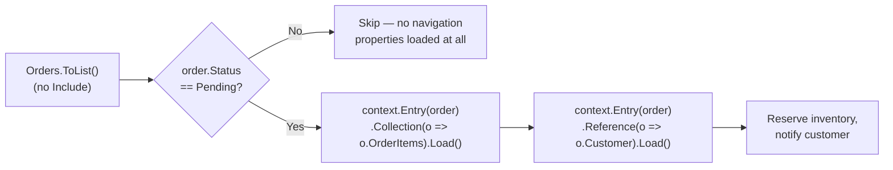
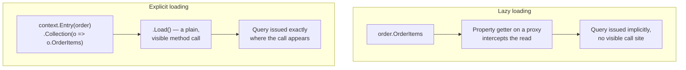

# Explicit Loading

## Introduction

Before reading this lesson, you should already be comfortable with **[Eager Loading vs Lazy Loading](../11-efcore/11-07-eager-vs-lazy-loading.md)** — in particular, why eager loading fetches everything up front in one query, why lazy loading fetches things automatically the first time your code touches them, and why that automatic behavior can quietly turn into the N+1 problem. This lesson introduces the third option, sitting deliberately between those two: explicit loading. Instead of declaring ahead of time what to fetch (`Include()`) or letting a proxy fetch it invisibly on first access, explicit loading has you write the exact line of code that says "load this navigation property, right now" — nothing happens until you say so, and nothing is hidden about when it happens.

By the end of this lesson, you will be able to:

- Use `context.Entry(entity).Reference(nav).Load()` to load a single-valued navigation property on demand
- Use `context.Entry(entity).Collection(nav).Load()` to load a collection navigation property on demand
- Check `IsLoaded` to avoid re-issuing a query for a navigation property that's already been loaded
- Explain how explicit loading differs from eager loading's upfront `Include()` and lazy loading's implicit, proxy-triggered fetch
- Recognize the real scenarios — conditional business logic, on-demand UI patterns — where explicit loading is the better middle-ground choice

## Explicit Loading — A Layman's Perspective

Picture a doctor reviewing a patient's chart during a short appointment. One extreme approach — call it the eager one — would have the front desk print out the patient's entire medical history before the doctor even walks in: every lab result ever recorded, every prescription ever filled, every visit going back a decade, whether today's visit needs any of it or not. Thorough, but almost always excessive, and slow to prepare.

The other extreme — the lazy one — has an assistant standing just outside the exam room, silently watching. The instant the doctor's eyes drift toward the folder tab marked "Allergies," the assistant sprints off without being asked and fetches it. The instant the doctor glances toward "Medication History," the assistant sprints off again. It's automatic, and it feels convenient in the moment, but nobody actually *decided*, out loud, to request either document — it just happened, reactively, because of where the doctor happened to look, and if the doctor's eyes wander across five folder tabs while thinking out loud, that's five separate unplanned trips.

Explicit loading is a third, more deliberate approach. The assistant does nothing at all on their own initiative — not everything up front, and nothing automatically triggered by a glance. Instead, the assistant simply waits by the door until the doctor says, out loud and specifically, "actually — go pull the immunization records." Only then does the assistant leave, and only to fetch exactly that one named thing. Nothing happens without an explicit, deliberate instruction identifying precisely what's needed, and that instruction is spoken at whatever moment in the appointment it actually becomes relevant — maybe five minutes in, maybe never, depending entirely on how the conversation unfolds.

This is exactly the shape of a real support or clinical workflow, which is precisely why explicit loading tends to show up in code that mirrors one: a screen that opens showing only a summary, where the details behind an "expand" button, a tab the user might never click, or a business rule that only sometimes needs a related record, get their data fetched only at the exact moment that specific branch of logic actually runs. Nothing is wasted preparing data nobody asked for, and — unlike lazy loading — nothing is hidden about *when* that data gets fetched, because the fetch is a plain, visible line of code sitting exactly where the decision to need it was made.

## Explicit Loading — A Programming Language Perspective

Explicit loading is invoked through `DbContext.Entry(entity)`, which returns an `EntityEntry<TEntity>` giving access to a tracked entity's change-tracking and navigation metadata. Calling `.Reference(e => e.SomeSingleNav)` returns a `ReferenceEntry` for a single-valued navigation property (a many-to-one or one-to-one relationship); calling `.Collection(e => e.SomeCollectionNav)` returns a `CollectionEntry` for a collection navigation property (a one-to-many or many-to-many relationship). Both expose a synchronous `.Load()` method — and an async `.LoadAsync()` counterpart for use in async code paths — that issues a query fetching just that navigation property for that specific tracked entity, and a boolean `.IsLoaded` property that reports whether it's already been fetched, letting you guard against redundant queries. Crucially, explicit loading requires none of lazy loading's prerequisites: no `Microsoft.EntityFrameworkCore.Proxies` package, no `virtual` navigation properties, and no `UseLazyLoadingProxies()` call — it works on any tracked entity from any `DbContext`, because the fetch is driven entirely by your own explicit method call rather than by runtime proxy interception.

## How to Load Navigation Properties Explicitly

The example below fetches `Order` rows with no `Include()` at all, then decides, based on ordinary business logic, exactly which navigation properties to load and for which orders — the kind of conditional fetching eager loading can't express and lazy loading would do unconditionally and invisibly. It again uses the EF Core SQLite in-memory provider (`"DataSource=:memory:"`, connection kept open) with a query-counting interceptor, so every claim about "on demand" is backed by an exact number.


*Figure 1: Explicit loading lets a runtime condition — here, order status — decide which navigation properties to fetch and for which rows, something neither `Include()` nor a lazy proxy can express.*

```csharp
// Program.cs — .NET 10 / C# 14
using System.Data.Common;
using Microsoft.Data.Sqlite;
using Microsoft.EntityFrameworkCore;
using Microsoft.EntityFrameworkCore.ChangeTracking;
using Microsoft.EntityFrameworkCore.Diagnostics;

var connection = new SqliteConnection("DataSource=:memory:");
connection.Open();

using var seedContext = new StoreContext(new DbContextOptionsBuilder<StoreContext>().UseSqlite(connection).Options);
seedContext.Database.EnsureCreated();

var mouse = new Product { Name = "Wireless Mouse", Price = 24.99m };
var keyboard = new Product { Name = "Mechanical Keyboard", Price = 89.50m };
seedContext.Products.AddRange(mouse, keyboard);

var alice = new Customer { FullName = "Alice Nguyen" };
var bob = new Customer { FullName = "Bob Ortiz" };
seedContext.Customers.AddRange(alice, bob);
seedContext.SaveChanges();

seedContext.Orders.AddRange(
    new Order
    {
        CustomerId = alice.CustomerId,
        OrderDate = new DateTime(2026, 8, 10),
        Status = OrderStatus.Pending,
        OrderItems = { new OrderItem { ProductId = mouse.ProductId, Quantity = 3, UnitPrice = mouse.Price } }
    },
    new Order
    {
        CustomerId = bob.CustomerId,
        OrderDate = new DateTime(2026, 8, 9),
        Status = OrderStatus.Shipped,
        OrderItems = { new OrderItem { ProductId = keyboard.ProductId, Quantity = 1, UnitPrice = keyboard.Price } }
    });
seedContext.SaveChanges();

var counter = new QueryCounterInterceptor();
using var context = new StoreContext(new DbContextOptionsBuilder<StoreContext>()
    .UseSqlite(connection)
    .AddInterceptors(counter)
    .Options);

Console.WriteLine("Fetching orders without Include()");
List<Order> orders = context.Orders.ToList(); // query #1 — Order rows only

foreach (Order order in orders)
{
    Console.WriteLine($"\nOrder #{order.OrderId} ({order.Status})");

    if (order.Status != OrderStatus.Pending)
    {
        Console.WriteLine("  Skipped: not pending, item detail not needed for shipment reservation.");
        continue;
    }

    EntityEntry<Order> entry = context.Entry(order);

    Console.WriteLine($"  OrderItems already loaded? {entry.Collection(o => o.OrderItems).IsLoaded}");
    entry.Collection(o => o.OrderItems).Load(); // explicit, on-demand query
    Console.WriteLine($"  OrderItems already loaded? {entry.Collection(o => o.OrderItems).IsLoaded}");

    decimal reserveTotal = order.OrderItems.Sum(oi => oi.Quantity * oi.UnitPrice);
    Console.WriteLine($"  Reserving inventory for {order.OrderItems.Count} item(s), value {reserveTotal:C}");

    entry.Reference(o => o.Customer).Load(); // explicit, on-demand query
    Console.WriteLine($"  Notify customer: {order.Customer.FullName}");
}

Console.WriteLine($"\nTotal SQL queries executed: {counter.QueryCount}");

class QueryCounterInterceptor : DbCommandInterceptor
{
    public int QueryCount { get; private set; }

    public override InterceptionResult<DbDataReader> ReaderExecuting(
        DbCommand command, CommandEventData eventData, InterceptionResult<DbDataReader> result)
    {
        QueryCount++;
        Console.WriteLine($"  [SQL query #{QueryCount} executed]");
        return result;
    }
}

class Customer
{
    public int CustomerId { get; set; }
    public string FullName { get; set; } = string.Empty;
    public List<Order> Orders { get; set; } = new();
}

enum OrderStatus { Pending, Shipped, Delivered, Cancelled }

class Order
{
    public int OrderId { get; set; }
    public DateTime OrderDate { get; set; }
    public OrderStatus Status { get; set; }
    public int CustomerId { get; set; }
    public Customer Customer { get; set; } = null!;
    public List<OrderItem> OrderItems { get; set; } = new();
}

class OrderItem
{
    public int OrderItemId { get; set; }
    public int OrderId { get; set; }
    public Order Order { get; set; } = null!;
    public int ProductId { get; set; }
    public Product Product { get; set; } = null!;
    public int Quantity { get; set; }
    public decimal UnitPrice { get; set; }
}

class Product
{
    public int ProductId { get; set; }
    public string Name { get; set; } = string.Empty;
    public decimal Price { get; set; }
}

class StoreContext(DbContextOptions<StoreContext> options) : DbContext(options)
{
    public DbSet<Customer> Customers => Set<Customer>();
    public DbSet<Order> Orders => Set<Order>();
    public DbSet<OrderItem> OrderItems => Set<OrderItem>();
    public DbSet<Product> Products => Set<Product>();
}
```

**Console Output:**

```text
Fetching orders without Include()
  [SQL query #1 executed]

Order #1 (Pending)
  OrderItems already loaded? False
  [SQL query #2 executed]
  OrderItems already loaded? True
  Reserving inventory for 1 item(s), value $74.97
  [SQL query #3 executed]
  Notify customer: Alice Nguyen

Order #2 (Shipped)
  Skipped: not pending, item detail not needed for shipment reservation.

Total SQL queries executed: 3
```

Notice what *didn't* happen: `Order #2` never triggered a single query for its items or its customer, because the code explicitly decided, based on its `Shipped` status, that it didn't need them — a decision neither `Include()` (which would have fetched both orders' items unconditionally) nor a lazy proxy (which would have fetched them the instant anything touched the property, status notwithstanding) could have made on its own. `IsLoaded` reporting `False` and then `True` around the `.Load()` call also makes visible exactly when the fetch happened — nothing about it is implicit.

## Real-Time Example: An Order Support Console in E-Commerce Order Processing

We continue building on the `Order`, `OrderItem`, `Product`, and `Customer` classes from this lesson's model. A realistic support-desk screen shows an order summary first — fast, minimal data — and only loads line-item detail or customer contact information when the support agent actually expands that section, mirroring how a real UI with collapsible panels avoids fetching data the agent might never look at. An `OrderSupportService` wraps explicit loading behind two intention-revealing methods, each guarded by `IsLoaded` so re-expanding an already-loaded panel costs nothing extra.

```csharp
// Program.cs — .NET 10 / C# 14 — Real-Time Example
public class OrderSupportService
{
    private readonly StoreContext _context;

    public OrderSupportService(StoreContext context) => _context = context;

    public Order? FindOrder(int orderId) =>
        _context.Orders.FirstOrDefault(o => o.OrderId == orderId); // summary view only — no Include

    public void LoadLineItemDetail(Order order)
    {
        EntityEntry<Order> entry = _context.Entry(order);
        if (!entry.Collection(o => o.OrderItems).IsLoaded)
        {
            entry.Collection(o => o.OrderItems).Load();
        }
    }

    public void LoadCustomerContact(Order order)
    {
        EntityEntry<Order> entry = _context.Entry(order);
        if (!entry.Reference(o => o.Customer).IsLoaded)
        {
            entry.Reference(o => o.Customer).Load();
        }
    }
}

// Usage, against the same seeded data as the How-To section above:
var counter2 = new QueryCounterInterceptor();
using var supportContext = new StoreContext(new DbContextOptionsBuilder<StoreContext>()
    .UseSqlite(connection)
    .AddInterceptors(counter2)
    .Options);

var supportService = new OrderSupportService(supportContext);

Console.WriteLine("Support agent opens order #1 (summary view)");
Order? order = supportService.FindOrder(1); // query #1
Console.WriteLine($"Order #{order!.OrderId}, status {order.Status}");

Console.WriteLine("\nAgent expands line item detail");
supportService.LoadLineItemDetail(order); // query #2
foreach (OrderItem item in order.OrderItems)
{
    Console.WriteLine($"  {item.Quantity} x product #{item.ProductId} @ {item.UnitPrice:C}");
}

Console.WriteLine("\nAgent expands line item detail again (already loaded)");
supportService.LoadLineItemDetail(order); // no new query — IsLoaded guard prevents it

Console.WriteLine("\nAgent looks up customer contact info");
supportService.LoadCustomerContact(order); // query #3
Console.WriteLine($"  Customer: {order.Customer.FullName}");

Console.WriteLine($"\nTotal SQL queries executed: {counter2.QueryCount}");
```

**Console Output:**

```text
Support agent opens order #1 (summary view)
  [SQL query #1 executed]
Order #1, status Pending

Agent expands line item detail
  [SQL query #2 executed]
  3 x product #1 @ $24.99

Agent expands line item detail again (already loaded)

Agent looks up customer contact info
  [SQL query #3 executed]
  Customer: Alice Nguyen

Total SQL queries executed: 3
```

Opening the order costs one query. Expanding line items costs exactly one more, the first time — expanding that same panel again, as an agent naturally would while double-checking something, costs nothing, because `IsLoaded` short-circuits the redundant call. This is the shape explicit loading is made for: a screen that starts cheap and only pays for exactly the sections a real user actually opens.

## Explicit Loading vs Lazy Loading

Both explicit and lazy loading fetch a navigation property after the initial query, on demand, rather than up front — the difference is entirely in what triggers the fetch, and how visible that trigger is in your source code.


*Figure 2: Lazy loading's trigger is an ordinary-looking property read on a proxy; explicit loading's trigger is a `.Load()` call you can find with a text search.*

| Aspect | Lazy Loading | Explicit Loading |
|---|---|---|
| What triggers the query | Implicit — the first read of a `virtual` navigation property on a proxy | Explicit — a direct call to `.Load()` in your own code |
| Requires proxies package + `virtual` navigations | Yes | No |
| Visible at the call site where the extra query happens | No — looks like ordinary property access | Yes — a `.Load()` call marks exactly where |
| Expressing conditional business logic ("only load if...") | Awkward — the property read itself can't easily be skipped | Natural — wrap the `.Load()` call in an `if` |
| Guarding against a redundant repeat query | Automatic (proxy caches after first load) | Manual, via `IsLoaded` |

## Types of Loading and Navigation-Property Concerns in EF Core

Explicit loading is one point on a spectrum this module has now covered end to end, alongside a few related refinements:

1. **[Eager Loading vs Lazy Loading](../11-efcore/11-07-eager-vs-lazy-loading.md)** — this lesson's two counterparts: `Include()`'s upfront single query, and a proxy's implicit fetch on first access.
2. **`CollectionEntry.Query()`** — a variant of explicit loading that lets you filter or project the related collection (e.g., only recent `OrderItems`) before calling `.Load()`, rather than always loading the entire collection.
3. **[Change Tracking](../11-efcore/11-09-change-tracking.md)** — how `EntityEntry<T>`, the same type this lesson used for `.Collection()`/`.Reference()`, also exposes each property's current and original values and the entity's overall state.
4. **Async explicit loading (`LoadAsync()`)** — the awaitable counterpart to `.Load()`, used the same way inside `async` methods so the query doesn't block a thread while it runs.
5. **[Raw SQL and Stored Procedures](../11-efcore/11-11-raw-sql-and-stored-procedures.md)** — for cases where even an explicit `.Load()` call isn't flexible enough and hand-written SQL is the better fit.
6. **[Querying with EF Core and LINQ](../11-efcore/11-06-querying-with-ef-core-linq.md)** — this module's starting point, where the `IQueryable<T>` querying that explicit loading's `.Load()` calls ultimately compile down to was first introduced.

## What You've Learned & What's Next

Explicit loading gives you exactly what eager loading and lazy loading don't: a fetch that happens neither always (`Include()`) nor automatically (a lazy proxy), but only when a specific, visible line of your own code — `context.Entry(entity).Collection(...).Load()` or `.Reference(...).Load()` — decides, based on whatever business logic is relevant, that the data is actually needed right now. `IsLoaded` keeps repeated calls cheap, and none of it requires the proxies package or `virtual` navigation properties lazy loading depends on.

Continue your learning journey with **[Change Tracking](../11-efcore/11-09-change-tracking.md)**, where the same `EntityEntry<T>` this lesson used for `.Collection()` and `.Reference()` gets its full treatment — how EF Core actually detects which properties changed on a tracked entity, and what `AsNoTracking()` skips when a query is read-only.

---
*Applies to: .NET 10 / C# 14. Last reviewed 2026-08-16.*
