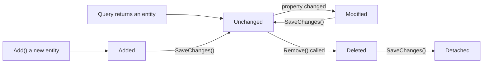
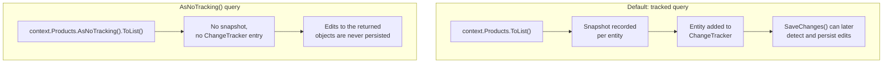

# Change Tracking

## Introduction

Before reading this lesson, you should already be comfortable with **[Explicit Loading](../11-efcore/11-08-explicit-loading.md)**, including the `EntityEntry<T>` type returned by `context.Entry(entity)` that lesson used for `.Collection()` and `.Reference()`. This lesson goes back to that same `EntityEntry<T>` and asks a more fundamental question: how does EF Core actually know, when you call `SaveChanges()`, which properties on which entities need an `UPDATE`, which brand-new objects need an `INSERT`, and which removed ones need a `DELETE` — when nothing you wrote looks like SQL at all? The answer is change tracking, and it's been quietly running underneath every example this entire module has shown so far.

By the end of this lesson, you will be able to:

- Explain snapshot-based change tracking: how EF Core detects which properties changed on a tracked entity by comparing current values against an original snapshot
- Enumerate the five entity states — `Added`, `Unchanged`, `Modified`, `Deleted`, `Detached` — and what causes an entity to enter each one
- Explain how `SaveChanges()` inspects every tracked entity's state to generate exactly the right `INSERT`/`UPDATE`/`DELETE` SQL
- Use `AsNoTracking()` to skip snapshot overhead entirely for queries whose results will never be saved
- Connect that performance trade-off back to Module 04's **[LINQ Performance Considerations](../04-linq/04-19-linq-performance-considerations.md)** lesson

## Change Tracking — A Layman's Perspective

Picture a library's checkout desk. When you check out a book, the librarian doesn't follow you home with a camera to watch what you do with it. Instead, at the moment you sign it out, they jot down a quick note of its condition on your checkout card — cover intact, no visible marks, all pages present — and then you're free to go. Nobody is monitoring the book while it's in your possession. The librarian only looks again at the very end, when you actually bring it back: they compare the book's condition *now* against what's written on that card, and whatever's different — a bent corner, a coffee ring, a torn page — is exactly, and only, what gets flagged as changed. If nothing's different, the book goes back on the shelf with no fuss at all, logged simply as "returned, no changes."

That checkout card is a snapshot, and it's the whole trick behind change tracking. EF Core doesn't watch your objects continuously as your code runs, reacting to every single property assignment the instant it happens. Instead, the moment an entity becomes tracked — usually the moment a query returns it — EF Core quietly records a snapshot of its property values, the same way the librarian jots down the book's condition at checkout. Your code is then free to change whatever it wants, however many times, with nobody watching. Only when you eventually call `SaveChanges()` does EF Core do the equivalent of the return-desk comparison: it walks every tracked entity, compares its current values against that original snapshot, and figures out — only at that moment, all at once — exactly which properties on which entities actually differ.

A checked-out book can end up in one of a few clear situations by the time it's dealt with, and entities work the same way. A book that's brand new to the collection, never checked out before, is a new arrival — that's an entity in the `Added` state. A book returned in exactly the condition it left in needs nothing written up at all — that's `Unchanged`. A book that comes back with something genuinely different from its checkout card gets an annotation describing exactly what changed — that's `Modified`. A book reported lost or damaged beyond repair gets pulled from circulation entirely — that's `Deleted`. And a book that was quietly removed from the checkout system's own records — maybe it was never actually registered, or its record was wiped — isn't being tracked by the desk at all anymore, so no comparison happens for it no matter what condition it's in; that's `Detached`.

Now imagine a completely different kind of book — the display copies sitting out in the reading room, free for absolutely anyone to flip through without ever signing anything at the front desk. Nobody photographs their condition at the start, because nobody's ever going to compare it against anything later; nobody's return process cares. That's a read-only query with `AsNoTracking()`: the objects come back to you, but no checkout card was ever written, no snapshot was ever taken, and none of the bookkeeping this section describes applies to them at all.

## Change Tracking — A Programming Language Perspective

Every entity returned by a tracking query becomes an `EntityEntry<T>` inside `context.ChangeTracker`, which records a snapshot of that entity's property values as they were when the entity became tracked. Calling `SaveChanges()` triggers `DetectChanges()`, which compares each tracked entity's current property values against its snapshot and assigns an `EntityState`: `Added` (a new entity attached via `Add()`, awaiting `INSERT`), `Unchanged` (matches its snapshot exactly, generates no SQL at all), `Modified` (differs from its snapshot, generates an `UPDATE` — for only the columns that actually changed, not every column), `Deleted` (marked via `Remove()`, generates a `DELETE`), or `Detached` (the entity instance exists in your application's memory, but the `DbContext` isn't tracking it — no `SaveChanges()` call will ever generate SQL for it, no matter what you change on it). After a successful `SaveChanges()`, `Added` and `Modified` entities become `Unchanged` again with a fresh snapshot, and `Deleted` entities become `Detached`. `AsNoTracking()` — or, less commonly, setting `context.ChangeTracker.QueryTrackingBehavior = QueryTrackingBehavior.NoTracking` for an entire context — instructs a query to skip snapshot creation and identity-map registration entirely, since a read-only result has nothing to compare against later.

## How to Observe Entity States and Change Detection

The example below queries, modifies, adds, and removes `Product` entities against the EF Core SQLite in-memory provider (`"DataSource=:memory:"`, connection kept open), printing each entity's `EntityState` at every step so the transitions this lesson describes are visible rather than theoretical.


*Figure 1: `SaveChanges()` is the moment every `Added`/`Modified`/`Deleted` entity resolves into its post-save state — `Unchanged` with a fresh snapshot, or `Detached` if it was deleted.*

```csharp
// Program.cs — .NET 10 / C# 14
using Microsoft.Data.Sqlite;
using Microsoft.EntityFrameworkCore;

var connection = new SqliteConnection("DataSource=:memory:");
connection.Open();

var options = new DbContextOptionsBuilder<StoreContext>().UseSqlite(connection).Options;

using var context = new StoreContext(options);
context.Database.EnsureCreated();

context.Products.AddRange(
    new Product { Name = "Wireless Mouse", Price = 24.99m, StockQuantity = 120 },
    new Product { Name = "Mechanical Keyboard", Price = 89.50m, StockQuantity = 45 });
context.SaveChanges();

// Query tracked entities — each gets a snapshot of its original values.
List<Product> products = context.Products.ToList();
Product mouse = products.Single(p => p.Name == "Wireless Mouse");
Console.WriteLine($"After query — mouse state: {context.Entry(mouse).State}");

// Modify: EF Core detects the change by comparing against the snapshot.
mouse.Price = 19.99m;
decimal originalPrice = (decimal)context.Entry(mouse).OriginalValues[nameof(Product.Price)]!;
decimal currentPrice = (decimal)context.Entry(mouse).CurrentValues[nameof(Product.Price)]!;
Console.WriteLine($"After changing price — mouse state: {context.Entry(mouse).State}");
Console.WriteLine($"  Original price: {originalPrice:C}");
Console.WriteLine($"  Current price:  {currentPrice:C}");

// Add a brand-new entity.
var hub = new Product { Name = "USB-C Hub", Price = 34.00m, StockQuantity = 60 };
context.Products.Add(hub);
Console.WriteLine($"New product — state: {context.Entry(hub).State}");

// Remove an existing tracked entity.
Product keyboard = products.Single(p => p.Name == "Mechanical Keyboard");
context.Products.Remove(keyboard);
Console.WriteLine($"Removed product — state: {context.Entry(keyboard).State}");

int rowsAffected = context.SaveChanges();
Console.WriteLine($"\nSaveChanges() wrote {rowsAffected} row(s).");
Console.WriteLine($"mouse state after save: {context.Entry(mouse).State}");
Console.WriteLine($"hub state after save: {context.Entry(hub).State}");
Console.WriteLine($"keyboard state after save: {context.Entry(keyboard).State}");

// AsNoTracking(): read-only, no snapshot, nothing added to the change tracker.
int trackedBefore = context.ChangeTracker.Entries().Count();
List<Product> readOnlyProducts = context.Products.AsNoTracking().ToList();
int trackedAfter = context.ChangeTracker.Entries().Count();
Console.WriteLine($"\nTracked entities before AsNoTracking query: {trackedBefore}");
Console.WriteLine($"Tracked entities after AsNoTracking query: {trackedAfter} (fetched {readOnlyProducts.Count} rows)");

class Product
{
    public int ProductId { get; set; }
    public string Name { get; set; } = string.Empty;
    public decimal Price { get; set; }
    public int StockQuantity { get; set; }
}

class StoreContext(DbContextOptions<StoreContext> options) : DbContext(options)
{
    public DbSet<Product> Products => Set<Product>();
}
```

**Console Output:**

```text
After query — mouse state: Unchanged
After changing price — mouse state: Modified
  Original price: $24.99
  Current price:  $19.99
New product — state: Added
Removed product — state: Deleted

SaveChanges() wrote 3 row(s).
mouse state after save: Unchanged
hub state after save: Unchanged
keyboard state after save: Detached

Tracked entities before AsNoTracking query: 2
Tracked entities after AsNoTracking query: 2 (fetched 2 rows)
```

`mouse` starts `Unchanged` straight out of the query, flips to `Modified` the instant its `Price` differs from its snapshot — with `OriginalValues` and `CurrentValues` proving both numbers are available side by side — and `SaveChanges()` writes exactly three rows: one `UPDATE` for `mouse`, one `INSERT` for `hub`, one `DELETE` for `keyboard`. After the save, `mouse` and `hub` settle back into `Unchanged` with fresh snapshots, while `keyboard` — now gone from the database — becomes `Detached` rather than `Unchanged`, because there's nothing left in the database to compare it against. The final `AsNoTracking()` query fetches two full rows without adding a single entry to the change tracker; the tracked-entity count doesn't move at all.

## Real-Time Example: Inventory Restock in E-Commerce Order Processing

We continue building on the `Product` class from this lesson's model. A warehouse restock job needs to update stock quantities for the products in an incoming shipment — a clear case for change tracking, since those updates genuinely need `SaveChanges()` to persist them. A low-stock report displayed alongside it, on the other hand, is purely informational: nobody is ever going to edit those `Product` objects and save them back, which makes it exactly the case `AsNoTracking()` was designed for — the same overhead-avoidance principle Module 04's **[LINQ Performance Considerations](../04-linq/04-19-linq-performance-considerations.md)** lesson raised for `IEnumerable<T>` pipelines applies here too, just at the level of EF Core's snapshot bookkeeping instead of deferred LINQ evaluation.

```csharp
// Program.cs — .NET 10 / C# 14 — Real-Time Example
public class InventoryRestockService
{
    private readonly StoreContext _context;

    public InventoryRestockService(StoreContext context) => _context = context;

    public int Restock(Dictionary<string, int> restockQuantitiesByProductName)
    {
        List<Product> productsToRestock = _context.Products
            .Where(p => restockQuantitiesByProductName.Keys.Contains(p.Name))
            .ToList(); // tracked — SaveChanges needs to know exactly what changed

        foreach (Product product in productsToRestock)
        {
            int addedStock = restockQuantitiesByProductName[product.Name];
            product.StockQuantity += addedStock;
            Console.WriteLine($"  {product.Name}: +{addedStock} units, state now {_context.Entry(product).State}");
        }

        return _context.SaveChanges();
    }

    public List<string> LowStockReport(int threshold)
    {
        // Read-only report — AsNoTracking() skips snapshotting for rows that will never be saved.
        return _context.Products
            .AsNoTracking()
            .Where(p => p.StockQuantity < threshold)
            .OrderBy(p => p.StockQuantity)
            .Select(p => $"{p.Name}: {p.StockQuantity} left")
            .ToList();
    }
}

static void PrintReport(List<string> lines)
{
    if (lines.Count == 0)
    {
        Console.WriteLine("  (none)");
        return;
    }
    foreach (string line in lines) Console.WriteLine($"  {line}");
}

// Usage
context.Products.AddRange(
    new Product { Name = "Wireless Mouse", Price = 24.99m, StockQuantity = 5 },
    new Product { Name = "Mechanical Keyboard", Price = 89.50m, StockQuantity = 2 },
    new Product { Name = "USB-C Hub", Price = 34.00m, StockQuantity = 40 });
context.SaveChanges();

var restockService = new InventoryRestockService(context);

Console.WriteLine("Low-stock report before restock:");
PrintReport(restockService.LowStockReport(threshold: 10));

Console.WriteLine("\nApplying restock shipment:");
int updated = restockService.Restock(new Dictionary<string, int>
{
    ["Wireless Mouse"] = 50,
    ["Mechanical Keyboard"] = 30
});
Console.WriteLine($"SaveChanges() updated {updated} row(s).");

Console.WriteLine("\nLow-stock report after restock:");
PrintReport(restockService.LowStockReport(threshold: 10));
```

**Console Output:**

```text
Low-stock report before restock:
  Mechanical Keyboard: 2 left
  Wireless Mouse: 5 left

Applying restock shipment:
  Wireless Mouse: +50 units, state now Modified
  Mechanical Keyboard: +30 units, state now Modified
SaveChanges() updated 2 row(s).

Low-stock report after restock:
  (none)
```

The restock path relies entirely on change tracking: loading the two affected products, changing `StockQuantity` on each, and letting `SaveChanges()` figure out that both need an `UPDATE` — no manual SQL, no explicit "mark this as changed" call anywhere. The reporting path never touches the change tracker at all; run this report against a catalog of a hundred thousand products instead of three, and `AsNoTracking()` is the difference between a report that stays fast and one that pays snapshot overhead for tens of thousands of rows nobody was ever going to save.

## Tracked Queries vs AsNoTracking() Queries

Both query styles return the exact same `Product` data — the difference is entirely in what EF Core does with the results afterward, and whether that bookkeeping is worth paying for.


*Figure 2: A tracked query pays snapshot and bookkeeping overhead so `SaveChanges()` can later detect edits; `AsNoTracking()` skips that overhead entirely, at the cost of edits silently never being saved.*

| Aspect | Tracked Query (default) | `AsNoTracking()` Query |
|---|---|---|
| Snapshot recorded per entity | Yes | No |
| Added to `ChangeTracker.Entries()` | Yes | No |
| Editing a returned object and calling `SaveChanges()` | Persists the edit | Edit is silently never persisted — nothing detects it |
| Memory/CPU overhead | Higher — one snapshot per entity | Lower — no snapshot, no identity-map bookkeeping |
| Best suited for | Data you intend to modify and save | Read-only display, reports, exports, dashboards |

## Types of Change Tracking Concerns in EF Core

Change tracking underlies every write this module has made so far; a handful of related tools and refinements round it out:

1. **[Explicit Loading](../11-efcore/11-08-explicit-loading.md)** — the same `EntityEntry<T>` returned by `context.Entry(entity)` that this lesson used for `.State`, `.OriginalValues`, and `.CurrentValues`.
2. **[Handling Concurrency Conflicts](../11-efcore/11-10-handling-concurrency-conflicts.md)** — what happens when two different `DbContext` instances each hold their own snapshot of the *same* database row, and both try to save a change.
3. **`ChangeTracker.Entries()` and `DetectChanges()`** — inspecting or forcing change detection across every tracked entity in a context at once, rather than one `EntityEntry<T>` at a time.
4. **`QueryTrackingBehavior.NoTrackingWithIdentityResolution`** — a middle ground between full tracking and `AsNoTracking()`: no snapshot overhead, but repeated queries for the same row still return the same object instance.
5. **[LINQ Performance Considerations](../04-linq/04-19-linq-performance-considerations.md)** — Module 04's broader discussion of avoiding unnecessary work in a query pipeline, which `AsNoTracking()` specializes for EF Core's own bookkeeping.
6. **[Raw SQL and Stored Procedures](../11-efcore/11-11-raw-sql-and-stored-procedures.md)** — queries that bypass LINQ translation, and how change tracking still (or doesn't) apply to their results.

## What You've Learned & What's Next

EF Core doesn't watch your entities live — it takes a snapshot when a query returns them, and only compares current values against that snapshot when `SaveChanges()` actually runs, at which point every entity's `Added`, `Unchanged`, `Modified`, or `Deleted` state tells `SaveChanges()` exactly which SQL statement, if any, that entity needs. `AsNoTracking()` skips the snapshot entirely for queries whose results will never be edited and saved, trading away change-detection ability for lower overhead — the right trade for reports and read-only views.

Continue your learning journey with **[Handling Concurrency Conflicts](../11-efcore/11-10-handling-concurrency-conflicts.md)**, where two different snapshots of the same database row, held by two different users at the same time, finally collide.

---
*Applies to: .NET 10 / C# 14. Last reviewed 2026-08-16.*
