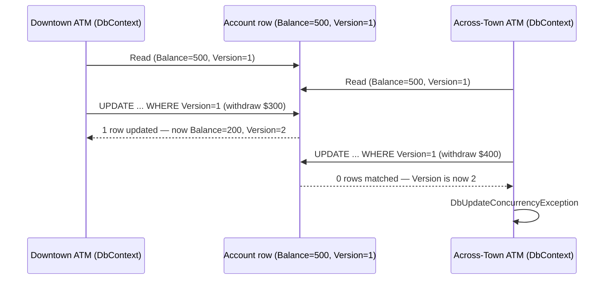
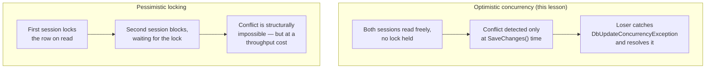

# Handling Concurrency Conflicts

## Introduction

Before reading this lesson, you should already be comfortable with **[Change Tracking](../11-efcore/11-09-change-tracking.md)**, in particular how `EntityEntry<T>` exposes an entity's `OriginalValues` and `CurrentValues`, and how `SaveChanges()` inspects an entity's state to decide what SQL to generate. This lesson puts that machinery to a very concrete test: what happens when two different parts of your system — two different `DbContext` instances, each with its own snapshot of the exact same database row — both try to save a change to that row at roughly the same time? Without a deliberate strategy, one of those changes silently overwrites the other, and nobody ever finds out. This lesson is about making sure that never happens quietly.

By the end of this lesson, you will be able to:

- Explain optimistic concurrency control and how it differs from locking a row for the entire duration of an edit
- Configure a concurrency token on an entity property using `[ConcurrencyCheck]`, and know when a database-managed `[Timestamp]`/rowversion column is the alternative
- Catch and inspect a `DbUpdateConcurrencyException` raised when two contexts try to save conflicting changes to the same row
- Apply both a store-wins (discard-and-reload) and a client-wins (reconcile-and-retry) resolution strategy, and judge which fits a given situation
- Build a Banking/ATM example demonstrating two concurrent withdrawal attempts on the same account, handled safely

## Handling Concurrency Conflicts — A Layman's Perspective

Picture a couple sharing one joint bank account, each holding their own card. On a Friday evening, one spouse is standing at an ATM downtown while the other, without either one knowing the other is doing this at that exact same moment, is standing at a completely different ATM across town. The account currently holds $500, and both machines show that same $500 balance on their screens, because that's genuinely what the balance was the instant each machine checked it.

The downtown spouse withdraws $300, leaving $200. The across-town spouse, having glanced at a screen that still says $500 — nothing about their own screen has changed since they looked — withdraws $400. If each machine simply trusted what it had seen on its own screen a few seconds earlier and processed its withdrawal purely on that basis, both machines would report success, both spouses would walk away with cash, and the account would somehow need to have paid out $700 from a starting balance of $500. That should never be allowed to happen.

A well-designed banking system prevents this with a simple discipline. Whichever ATM finishes its request first gets to actually update the account, because at that instant its picture of the account still matched reality exactly. The moment that update lands, though, it also quietly changes a small marker stamped on the account — think of a tiny sequence number ticked up by one, every single time the account is touched. The second ATM, right before it actually commits its own withdrawal, is required to check that marker one more time. If it still matches what that ATM originally saw, everything's fine, and the withdrawal proceeds. But if the marker has already changed — because the downtown withdrawal landed in between — the across-town ATM's transaction is refused outright, before a single dollar moves. The customer sees a message telling them their information was out of date, rather than the bank silently paying out money that isn't there.

Crucially, neither ATM had to lock the other one out the whole time each spouse was standing there deciding what to withdraw — that would mean whichever machine got there first would force the other to simply freeze and wait however long the first transaction took. Instead, both machines were free to proceed independently, right up until the very last moment of actually committing the change, when reality finally got double-checked, once, right at the end. That's optimistic concurrency: assume conflicts are the rare exception rather than the rule, let everyone proceed without blocking each other, and only check for a genuine collision at the very last possible moment — right before committing, not before starting.

## Handling Concurrency Conflicts — A Programming Language Perspective

Optimistic concurrency control assumes conflicting writes are uncommon and avoids holding a database lock for the duration of an edit, in contrast to pessimistic locking, which locks a row from the moment it's read until the transaction that read it completes. EF Core implements optimistic concurrency through a concurrency token: a property marked `[ConcurrencyCheck]` — any column whose *original* value EF Core includes in the `WHERE` clause of the generated `UPDATE`/`DELETE` statement — or, on providers with native support such as SQL Server, a dedicated `byte[]` property marked `[Timestamp]`, mapped to a `rowversion` column the database itself increments automatically on every write. When `SaveChanges()` issues an `UPDATE`, its `WHERE` clause includes `AccountId = @id AND Version = @originalVersion`; if another transaction already changed that row, zero rows match, and EF Core throws `DbUpdateConcurrencyException` rather than silently succeeding on the wrong assumption. Catching that exception, the affected `EntityEntry<T>`'s `GetDatabaseValues()` re-queries the row's actual current state, letting you apply a deliberate resolution: store-wins (accept the database's values, discard your change), client-wins (reconcile your intended change against the current values and retry), or a field-by-field merge.

## How to Detect and Handle a Concurrency Conflict

The example below models two "ATM sessions" as two separate `BankContext` instances against the same account row, using the EF Core SQLite in-memory provider (`"DataSource=:memory:"`, connection kept open) so both contexts genuinely share one underlying database. `[ConcurrencyCheck]` is portable across every EF Core provider — SQLite, `InMemory`, SQL Server, PostgreSQL — since the token's value is managed by your own code rather than a database-generated column; a SQL Server-specific `[Timestamp]` `rowversion` works the same way from EF Core's perspective, just with the database incrementing the token automatically instead of your code doing it.


*Figure 1: Both ATMs read the same starting balance, but only the first `UPDATE`'s `WHERE Version = 1` still matches by the time it runs — the second ATM's identical-looking `WHERE` clause matches nothing.*

```csharp
// Program.cs — .NET 10 / C# 14
using System.ComponentModel.DataAnnotations;
using Microsoft.Data.Sqlite;
using Microsoft.EntityFrameworkCore;

var connection = new SqliteConnection("DataSource=:memory:");
connection.Open();

using var seedContext = new BankContext(new DbContextOptionsBuilder<BankContext>().UseSqlite(connection).Options);
seedContext.Database.EnsureCreated();
seedContext.Accounts.Add(new Account { AccountId = 1, Owner = "Riley Chen", Balance = 500m, Version = 1 });
seedContext.SaveChanges();

using var atmDowntown = new BankContext(new DbContextOptionsBuilder<BankContext>().UseSqlite(connection).Options);
using var atmAcrossTown = new BankContext(new DbContextOptionsBuilder<BankContext>().UseSqlite(connection).Options);

Account downtownView = atmDowntown.Accounts.Single(a => a.AccountId == 1);
Account acrossTownView = atmAcrossTown.Accounts.Single(a => a.AccountId == 1);

Console.WriteLine($"Downtown ATM sees balance: {downtownView.Balance:C} (version {downtownView.Version})");
Console.WriteLine($"Across-town ATM sees balance: {acrossTownView.Balance:C} (version {acrossTownView.Version})");

// Downtown ATM withdraws first, and saves successfully.
downtownView.Balance -= 300m;
downtownView.Version++;
atmDowntown.SaveChanges();
Console.WriteLine($"\nDowntown ATM withdrew $300. New balance: {downtownView.Balance:C} (version {downtownView.Version})");

// Across-town ATM, still holding the now-stale version it originally read, tries to withdraw $400.
acrossTownView.Balance -= 400m;
acrossTownView.Version++;

try
{
    atmAcrossTown.SaveChanges();
    Console.WriteLine("Across-town ATM withdrew $400.");
}
catch (DbUpdateConcurrencyException)
{
    Console.WriteLine("\nAcross-town ATM: concurrency conflict detected — someone already changed this account.");

    // Store-wins: reload the current database values and discard the stale local change.
    var entry = atmAcrossTown.Entry(acrossTownView);
    var databaseValues = entry.GetDatabaseValues()!;
    entry.OriginalValues.SetValues(databaseValues);
    entry.CurrentValues.SetValues(databaseValues);

    Console.WriteLine($"Reloaded actual balance: {acrossTownView.Balance:C} (version {acrossTownView.Version})");
    Console.WriteLine("Across-town withdrawal was rejected — customer must re-check the balance and retry.");
}

class Account
{
    public int AccountId { get; set; }
    public string Owner { get; set; } = string.Empty;
    public decimal Balance { get; set; }

    [ConcurrencyCheck]
    public int Version { get; set; }
}

class BankContext(DbContextOptions<BankContext> options) : DbContext(options)
{
    public DbSet<Account> Accounts => Set<Account>();
}
```

**Console Output:**

```text
Downtown ATM sees balance: $500.00 (version 1)
Across-town ATM sees balance: $500.00 (version 1)

Downtown ATM withdrew $300. New balance: $200.00 (version 2)

Across-town ATM: concurrency conflict detected — someone already changed this account.
Reloaded actual balance: $200.00 (version 2)
Across-town withdrawal was rejected — customer must re-check the balance and retry.
```

Both ATMs genuinely saw the same $500 balance — that part of the story is real, not a bug. The conflict only surfaces when `atmAcrossTown.SaveChanges()` runs: its generated `UPDATE` still says `WHERE Version = 1`, because that's what its own snapshot recorded, but the database's `Version` is already `2` by then, so zero rows match and EF Core raises `DbUpdateConcurrencyException` instead of quietly succeeding against the wrong assumption. `GetDatabaseValues()` then re-queries the row's real current state, and `SetValues()` applies it — a clean, explicit store-wins resolution rather than a silent overwrite.

## Real-Time Example: Concurrent ATM Withdrawals in Banking/ATM

We continue building on the `Account` class from this lesson's model, now inside a `WithdrawalService` that behaves closer to a real ATM's withdrawal logic: check funds, apply the withdrawal, save — and if a concurrency conflict is detected, reconcile against the *actual current* balance and decide, based on that fresh number, whether the withdrawal can still go through at all. This is a client-wins strategy with a safety check built in, rather than a blind retry that could overdraw the account a second time.

```csharp
// Program.cs — .NET 10 / C# 14 — Real-Time Example
public class WithdrawalService
{
    private readonly BankContext _context;

    public WithdrawalService(BankContext context) => _context = context;

    public string Withdraw(int accountId, decimal amount)
    {
        Account account = _context.Accounts.Single(a => a.AccountId == accountId);

        if (account.Balance < amount)
        {
            return $"Declined: insufficient funds (balance {account.Balance:C}).";
        }

        account.Balance -= amount;
        account.Version++;

        try
        {
            _context.SaveChanges();
            return $"Approved: withdrew {amount:C}. New balance: {account.Balance:C}.";
        }
        catch (DbUpdateConcurrencyException)
        {
            var entry = _context.Entry(account);
            var databaseValues = entry.GetDatabaseValues()!;
            decimal currentBalance = (decimal)databaseValues[nameof(Account.Balance)]!;
            int currentVersion = (int)databaseValues[nameof(Account.Version)]!;
            entry.OriginalValues.SetValues(databaseValues);

            if (currentBalance < amount)
            {
                account.Balance = currentBalance;
                account.Version = currentVersion;
                return $"Declined on retry: insufficient funds after reconciling (balance {currentBalance:C}).";
            }

            account.Balance = currentBalance - amount;
            account.Version = currentVersion + 1;
            _context.SaveChanges();
            return $"Approved on retry: withdrew {amount:C}. New balance: {account.Balance:C}.";
        }
    }
}

// Usage — against the same connection, four ATM sessions across two accounts.
using var seedContext2 = new BankContext(new DbContextOptionsBuilder<BankContext>().UseSqlite(connection).Options);
seedContext2.Accounts.AddRange(
    new Account { AccountId = 2, Owner = "Jordan Patel", Balance = 500m, Version = 1 });
seedContext2.SaveChanges();

using var atmA1 = new BankContext(new DbContextOptionsBuilder<BankContext>().UseSqlite(connection).Options);
using var atmA2 = new BankContext(new DbContextOptionsBuilder<BankContext>().UseSqlite(connection).Options);
using var atmB1 = new BankContext(new DbContextOptionsBuilder<BankContext>().UseSqlite(connection).Options);
using var atmB2 = new BankContext(new DbContextOptionsBuilder<BankContext>().UseSqlite(connection).Options);

// Both "second" ATMs read the account before either "first" ATM commits a change,
// so they hold the same now-stale snapshot the conflict scenario depends on.
atmA2.Accounts.Single(a => a.AccountId == 1);
atmB2.Accounts.Single(a => a.AccountId == 2);

var withdrawalServiceA1 = new WithdrawalService(atmA1);
var withdrawalServiceA2 = new WithdrawalService(atmA2);
var withdrawalServiceB1 = new WithdrawalService(atmB1);
var withdrawalServiceB2 = new WithdrawalService(atmB2);

Console.WriteLine("Scenario A — Riley Chen's account, two concurrent withdrawals");
Console.WriteLine(withdrawalServiceA1.Withdraw(1, 300m));
Console.WriteLine(withdrawalServiceA2.Withdraw(1, 400m));

Console.WriteLine("\nScenario B — Jordan Patel's account, two concurrent withdrawals");
Console.WriteLine(withdrawalServiceB1.Withdraw(2, 100m));
Console.WriteLine(withdrawalServiceB2.Withdraw(2, 250m));
```

**Console Output:**

```text
Scenario A — Riley Chen's account, two concurrent withdrawals
Approved: withdrew $300.00. New balance: $200.00.
Declined on retry: insufficient funds after reconciling (balance $200.00).

Scenario B — Jordan Patel's account, two concurrent withdrawals
Approved: withdrew $100.00. New balance: $400.00.
Approved on retry: withdrew $250.00. New balance: $150.00.
```

Scenario A shows the retry legitimately failing: after reconciling against the real balance ($200, not the $500 the second ATM originally saw), $400 genuinely isn't available anymore, so the withdrawal is correctly declined instead of overdrawing the account. Scenario B shows the opposite outcome: after reconciling to the real $400 balance, $250 is still available, so the retry succeeds against the *current* number rather than the stale one. Neither outcome depended on locking either account for a single moment — both ATMs proceeded freely, and the only check that mattered happened once, right at the point of actually committing.

## Optimistic Concurrency vs Pessimistic Locking

Optimistic concurrency, the strategy this entire lesson has used, is one of two fundamentally different answers to "what stops two conflicting writes from corrupting the same row?" — the other is pessimistic locking, which prevents the conflict from ever being possible in the first place, at the cost of making every reader or writer wait their turn.


*Figure 2: Optimistic concurrency lets both sessions proceed and resolves a conflict after the fact; pessimistic locking prevents the conflict by making the second session wait.*

| Aspect | Optimistic Concurrency | Pessimistic Locking |
|---|---|---|
| When a conflict is caught | At `SaveChanges()`, via a failed `WHERE` clause match | Never — the second session can't even start editing until the lock releases |
| Locking while editing | None | A database lock held for the duration of the edit |
| Throughput under low contention | High — no one waits on anyone else | Lower — every writer queues behind the current lock holder |
| Risk under high contention | Retries and rejected saves become common | Long queues and potential lock timeouts |
| EF Core's default approach | This lesson's `[ConcurrencyCheck]`/`[Timestamp]` pattern | Not built in — requires explicit transactions and database-level locking hints |

## Types of Concurrency and Conflict-Handling Concerns in EF Core

This lesson's `[ConcurrencyCheck]` and `DbUpdateConcurrencyException` are the core mechanism; a few related concerns round out the picture:

1. **`[Timestamp]` / `rowversion` columns** — the SQL Server-specific alternative to a manually-managed `[ConcurrencyCheck]` property, where the database itself increments the token on every write instead of your own code.
2. **[Change Tracking](../11-efcore/11-09-change-tracking.md)** — the `EntityEntry<T>`, `OriginalValues`, and `CurrentValues` this lesson relied on to inspect and resolve a conflict were introduced there in full.
3. **Field-by-field merge resolution** — a third strategy beyond this lesson's store-wins and client-wins: presenting the conflicting values to a user (or business rule) and letting them choose, property by property, rather than accepting one side wholesale.
4. **Pessimistic locking via explicit transactions** — the alternative strategy this lesson's diagram contrasted against, for the rarer cases where blocking concurrent access outright is actually the safer choice.
5. **[Raw SQL and Stored Procedures](../11-efcore/11-11-raw-sql-and-stored-procedures.md)** — for database-side operations, like an atomic balance-check-and-debit, that some systems push into a stored procedure specifically to avoid round-tripping through application-level concurrency handling at all.
6. **EF Core's `IExecutionStrategy` / connection resiliency** — a related but distinct concern: automatically retrying a *transient* database failure (a dropped connection), as opposed to this lesson's genuine, business-relevant data conflict.

## What You've Learned & What's Next

Optimistic concurrency lets every session read and edit freely, and checks for a conflict only once — at the exact moment `SaveChanges()` tries to commit — using a concurrency token like `[ConcurrencyCheck]` in the generated `UPDATE`'s `WHERE` clause. When that check fails, `DbUpdateConcurrencyException` is EF Core's way of refusing to guess: `GetDatabaseValues()` hands you the real current row, and it's up to your code — as this lesson's two Banking/ATM scenarios showed, one declining and one succeeding on retry — to decide, deliberately, what happens next.

Continue your learning journey with **[Raw SQL and Stored Procedures](../11-efcore/11-11-raw-sql-and-stored-procedures.md)**, where you'll see how to step outside LINQ translation entirely for the queries and operations EF Core's own query language isn't the best fit for.

---
*Applies to: .NET 10 / C# 14. Last reviewed 2026-08-16.*
