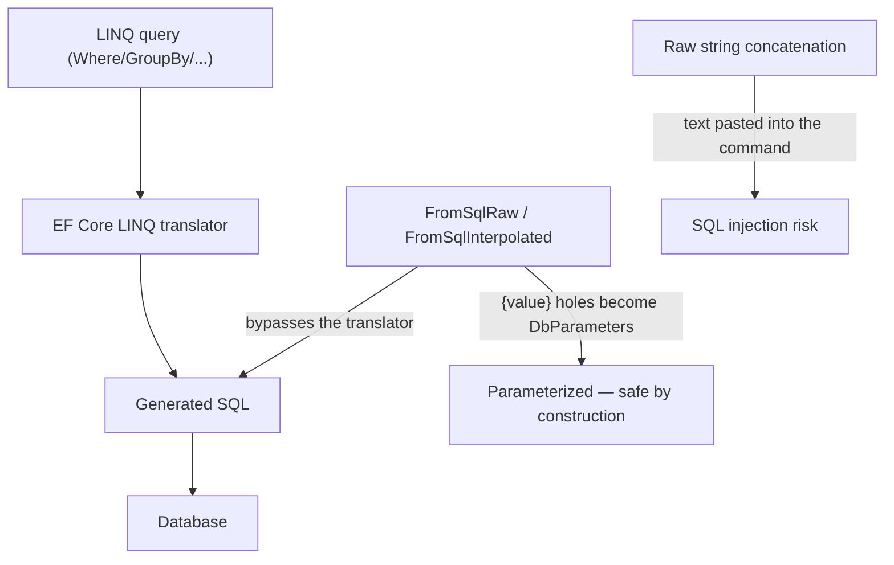
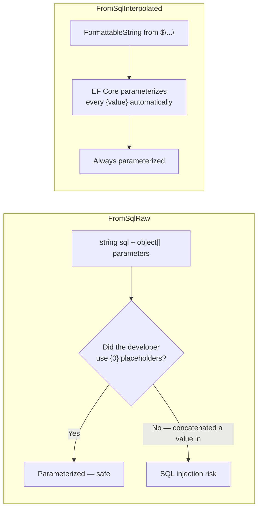

# Raw SQL and Stored Procedures

## Introduction

Before reading this lesson, you should already be comfortable with **[Handling Concurrency Conflicts](../11-efcore/11-10-handling-concurrency-conflicts.md)** and, more broadly, with writing everyday queries against a `DbContext` using LINQ. Every lesson in this module so far has trusted EF Core's LINQ-to-SQL translator to turn a `Where`/`OrderBy`/`GroupBy` chain into a correct SQL statement, and for the overwhelming majority of application code, that trust is well placed. But the translator isn't magic, and it isn't complete. Some queries — a gnarly reporting query with window functions, a recursive common table expression, a call into logic somebody already wrote and tested as a stored procedure years ago — either can't be expressed in LINQ at all, or can be expressed only as a contorted query whose generated SQL performs far worse than a hand-written statement would. This lesson covers EF Core's escape hatch for exactly those cases: running raw SQL directly, while still working through the same `DbContext` and, where possible, still getting back tracked entities.

By the end of this lesson, you will be able to:

- Explain when dropping to raw SQL inside EF Core is actually justified, versus reaching for it out of habit
- Query with `FromSqlRaw` and `FromSqlInterpolated`, and explain precisely why interpolation is the safer default
- Project raw SQL results into a plain DTO with `Database.SqlQuery<T>()`, without registering an entity type
- Run non-query raw SQL with `ExecuteSqlRaw`/`ExecuteSqlRawAsync` for statements that don't map to entities at all
- Call a stored procedure from EF Core and understand what's provider-specific about doing so
- Recognize SQL injection as a real risk in raw SQL code, and know exactly which EF Core API closes it automatically

## Raw SQL and Stored Procedures — A Layman's Perspective

Picture a busy restaurant with a printed menu and a waiter who translates every table's order into standardized tickets for the kitchen. "One medium-rare steak, no onions" becomes a ticket with checkboxes already familiar to every station in the kitchen — the grill knows exactly what to do with it, no improvisation required. That's an everyday LINQ query: you describe what you want in familiar terms, and something you don't have to think about translates it into instructions the kitchen already knows how to execute quickly and correctly.

Now suppose a regular customer, a food blogger, asks for something the printed menu was never built to express — a dish combining three sauces from three different sections of the menu, plated in a very specific layered way, prepared only because the head chef personally knows exactly how to make it work. No combination of checkboxes on the standard ticket can capture that request. So the waiter does something unusual: instead of filling out a standard ticket, they walk into the kitchen and hand the head chef a handwritten note describing exactly what to prepare, in the kitchen's own language. That handwritten note is raw SQL — you're stepping past the menu-translation layer and talking to the database directly, in its own native tongue, because what you want doesn't fit the menu's categories.

Here's where it gets dangerous, though. Suppose the customer is allowed to dictate part of that handwritten note themselves — "just write down whatever I tell you, exactly." If the waiter *copies the customer's words directly onto the note as instructions*, a mischievous customer could dictate something like "prepare my steak, and also, unlock the walk-in freezer and give away all the inventory to whoever asks." Copied verbatim onto a note the kitchen treats as trusted instructions, that second clause gets executed right alongside the first. That is SQL injection: user-supplied text, concatenated directly into a command the database treats as code, doing something the actual application never intended.

The safe version of the same handwritten note works differently. The waiter still writes "prepare a steak cooked to [BLANK], no [BLANK]" — but the blanks are filled in afterward, on a separate labeled slip clipped to the note, marked unmistakably as *data the customer supplied*, never as instructions to follow. The kitchen reads the note's structure once, then substitutes in whatever's on the labeled slip as inert values — a temperature, an ingredient name — never as new instructions, no matter what text ends up in those slots. That's `FromSqlInterpolated`: it looks exactly like you're building the SQL text with ordinary string interpolation, but underneath, every `{value}` you write becomes a separately-passed, clearly-labeled parameter rather than text pasted into the command itself. Whatever a customer writes in that blank, it can only ever be treated as a value — never as an instruction.

Finally, some dishes are so common and so carefully tuned that the kitchen keeps a laminated recipe card in a binder, pre-approved by the head chef, that any waiter can invoke just by calling out its name and a couple of parameters — "recipe forty-two, medium spice." That's a stored procedure: a named, pre-written unit of database logic the application calls by name rather than re-describing from scratch every time.

## Raw SQL and Stored Procedures — A Programming Language Perspective

`DbSet<TEntity>.FromSqlRaw(string sql, params object[] parameters)` executes a raw SQL `SELECT` and materializes each row into a tracked `TEntity`, provided the query returns every column the entity type maps to; the resulting `IQueryable<TEntity>` can still be composed with further LINQ operators such as `.Where()` or `.OrderBy()`, which EF Core appends to the raw SQL as a subquery. `FromSqlInterpolated(FormattableString sql)` accepts an interpolated string literal — syntactically identical to building the SQL with `$"..."` — but because the compiler produces a `FormattableString` rather than a plain `string`, EF Core inspects each interpolation hole and converts it into a `DbParameter` rather than splicing its text into the command, closing the SQL injection vector by construction rather than by developer discipline. `Database.SqlQuery<T>()` (EF Core 8+) runs raw SQL and projects it into any type — a `record`, a plain class — without that type needing to be a registered entity at all, which suits one-off reporting shapes. `Database.ExecuteSqlRaw`/`ExecuteSqlRawAsync` and their interpolated counterparts run non-query SQL (`INSERT`/`UPDATE`/`DELETE`, or a stored procedure call) and return only the affected row count, with no change tracking involved whatsoever. Calling a stored procedure uses the same `FromSqlRaw`/`ExecuteSqlRaw` surface with provider-specific call syntax (`EXEC`/`EXECUTE` on SQL Server, `CALL` on PostgreSQL/MySQL).

## How to Run Raw SQL Through EF Core

The runnable examples in this lesson use the **EF Core SQLite provider against an in-memory database** (`Microsoft.Data.Sqlite` with `DataSource=:memory:`), rather than the `Microsoft.EntityFrameworkCore.InMemory` package — the `InMemory` provider isn't relational at all and doesn't support raw SQL execution. Every relational provider (SQLite, SQL Server, PostgreSQL, MySQL) shares this same `FromSqlRaw`/`FromSqlInterpolated`/`ExecuteSqlRaw` API surface, so the code below carries over to a production SQL Server context essentially unchanged.


*Figure 1: LINQ and raw SQL both ultimately reach the database, but only the interpolated form guarantees every value is parameterized rather than pasted into the command text.*

```csharp
// Program.cs — .NET 10 / C# 14
using Microsoft.Data.Sqlite;
using Microsoft.EntityFrameworkCore;

var connection = new SqliteConnection("DataSource=:memory:");
connection.Open();

var options = new DbContextOptionsBuilder<CatalogContext>()
    .UseSqlite(connection)
    .Options;

using var context = new CatalogContext(options);
context.Database.EnsureCreated();

context.Products.AddRange(
    new Product { Name = "Wireless Mouse", Price = 24.99m },
    new Product { Name = "Mechanical Keyboard", Price = 89.50m },
    new Product { Name = "USB-C Hub", Price = 34.00m });
context.SaveChanges();

decimal threshold = 30.00m;

// Shown only to illustrate the risk — never build SQL text this way with real input.
string concatenated = $"SELECT * FROM Products WHERE Price > {threshold}";
Console.WriteLine($"Never do this — pasted directly into command text: {concatenated}");

// Safe: FromSqlInterpolated turns {threshold} into a parameter, not pasted text.
List<Product> premium = context.Products
    .FromSqlInterpolated($"SELECT * FROM Products WHERE Price > {threshold}")
    .OrderBy(p => p.Price)
    .ToList();

Console.WriteLine("Products above threshold (FromSqlInterpolated):");
foreach (Product p in premium)
{
    Console.WriteLine($"  {p.Name}: {p.Price:C}");
}

// ExecuteSqlRaw: a non-query command. No entities are loaded or tracked.
int rowsAffected = context.Database.ExecuteSqlRaw(
    "UPDATE Products SET Price = Price * 1.10 WHERE Price <= {0}", 30.00m);
Console.WriteLine($"Rows updated by ExecuteSqlRaw: {rowsAffected}");

class Product
{
    public int Id { get; set; }
    public string Name { get; set; } = "";
    public decimal Price { get; set; }
}

class CatalogContext(DbContextOptions<CatalogContext> options) : DbContext(options)
{
    public DbSet<Product> Products => Set<Product>();
}
```

**Console Output:**

```text
Never do this — pasted directly into command text: SELECT * FROM Products WHERE Price > 30.00
Products above threshold (FromSqlInterpolated):
  USB-C Hub: $34.00
  Mechanical Keyboard: $89.50
Rows updated by ExecuteSqlRaw: 1
```

`FromSqlInterpolated` returned exactly the two products priced above the threshold, sorted by the trailing `.OrderBy()` composed onto the raw SQL — proof that EF Core still treats the result as a queryable, not a dead-end list. The `ExecuteSqlRaw` call updated only the one product priced at or below the threshold (the Wireless Mouse), returning `1` as the affected row count, with no entity ever loaded into the change tracker to make that update happen.

## Real-Time Example: A Revenue Report in E-Commerce Order Processing

We extend the `Customer`, `Order`, and `OrderItem` entities from this module's earlier lessons with a reporting query LINQ struggles to express cleanly: total revenue per customer since a given date, grouped and sorted by that total. A `GroupBy`-then-`Sum` LINQ query *can* express this, but as the join fans out across more tables, the generated SQL often becomes a query plan a hand-tuned report deliberately avoids — exactly the kind of case where a raw, reviewed SQL statement is the right call, not a workaround.

```csharp
// Program.cs — .NET 10 / C# 14 — Real-Time Example (E-Commerce Order Processing)
using Microsoft.Data.Sqlite;
using Microsoft.EntityFrameworkCore;

var connection = new SqliteConnection("DataSource=:memory:");
connection.Open();

var options = new DbContextOptionsBuilder<StoreContext>()
    .UseSqlite(connection)
    .Options;

using var context = new StoreContext(options);
context.Database.EnsureCreated();

var alice = new Customer { Name = "Alice Chen" };
var bilal = new Customer { Name = "Bilal Rahman" };
context.Customers.AddRange(alice, bilal);

context.Orders.AddRange(
    new Order
    {
        Customer = alice,
        PlacedOn = new DateTime(2026, 6, 1),
        Items = { new OrderItem { ProductName = "Laptop Stand", Quantity = 2, UnitPrice = 45.00m } }
    },
    new Order
    {
        Customer = alice,
        PlacedOn = new DateTime(2026, 7, 15),
        Items = { new OrderItem { ProductName = "4K Monitor", Quantity = 1, UnitPrice = 320.00m } }
    },
    new Order
    {
        Customer = bilal,
        PlacedOn = new DateTime(2026, 7, 20),
        Items = { new OrderItem { ProductName = "Desk Lamp", Quantity = 3, UnitPrice = 18.00m } }
    });
context.SaveChanges();

DateTime since = new DateTime(2026, 1, 1);

// Database.SqlQuery<T> projects raw SQL directly into a DTO — no DbSet<T> registration needed.
List<TopCustomerRevenue> topCustomers = context.Database
    .SqlQuery<TopCustomerRevenue>($"""
        SELECT c.Name AS CustomerName, SUM(oi.Quantity * oi.UnitPrice) AS TotalRevenue
        FROM Orders o
        JOIN Customers c ON c.Id = o.CustomerId
        JOIN OrderItems oi ON oi.OrderId = o.Id
        WHERE o.PlacedOn >= {since}
        GROUP BY c.Name
        ORDER BY TotalRevenue DESC
        """)
    .ToList();

Console.WriteLine($"Top customers by revenue since {since:yyyy-MM-dd}:");
foreach (TopCustomerRevenue row in topCustomers)
{
    Console.WriteLine($"  {row.CustomerName}: {row.TotalRevenue:C}");
}

// Illustrative only — a SQL Server stored procedure call, shown for comparison.
// SQLite has no stored procedures, so this block is not executed here; the calling
// pattern (FromSqlRaw/SqlQuery with provider-specific call syntax) is identical on
// SQL Server, PostgreSQL, and MySQL once the procedure exists in that database.
//
// List<TopCustomerRevenue> viaStoredProc = context.Database
//     .SqlQuery<TopCustomerRevenue>($"EXEC dbo.usp_GetTopCustomersByRevenue @Since = {since}")
//     .ToList();

record TopCustomerRevenue(string CustomerName, decimal TotalRevenue);

class Customer
{
    public int Id { get; set; }
    public string Name { get; set; } = "";
}

class Order
{
    public int Id { get; set; }
    public int CustomerId { get; set; }
    public Customer? Customer { get; set; }
    public DateTime PlacedOn { get; set; }
    public List<OrderItem> Items { get; set; } = [];
}

class OrderItem
{
    public int Id { get; set; }
    public int OrderId { get; set; }
    public string ProductName { get; set; } = "";
    public int Quantity { get; set; }
    public decimal UnitPrice { get; set; }
}

class StoreContext(DbContextOptions<StoreContext> options) : DbContext(options)
{
    public DbSet<Customer> Customers => Set<Customer>();
    public DbSet<Order> Orders => Set<Order>();
    public DbSet<OrderItem> OrderItems => Set<OrderItem>();
}
```

**Console Output:**

```text
Top customers by revenue since 2026-01-01:
  Alice Chen: $410.00
  Bilal Rahman: $54.00
```

Alice's two orders total $410.00 (`2 × $45.00` plus `1 × $320.00`); Bilal's single order totals $54.00 (`3 × $18.00`). Neither figure came from a LINQ `GroupBy` — the report ran as one hand-written, join-and-aggregate SQL statement, parameterized automatically through the interpolated `since` value, and projected straight into a `TopCustomerRevenue` DTO that was never registered as an entity anywhere in `StoreContext`. A dashboard calling this method every few minutes gets exactly the query plan a database engineer reviewed and approved, not whatever plan the LINQ translator happened to produce.

## FromSqlRaw vs. FromSqlInterpolated

Both methods run raw SQL and both return tracked entities you can keep composing with LINQ. The difference that matters is entirely about how values reach the database. `FromSqlRaw` accepts a plain `string` plus a separate `params object[]` array — safe *only* if every value is passed through that parameter array using positional placeholders like `{0}`, and dangerously easy to misuse by concatenating a value straight into the SQL string instead, since nothing about the method signature stops you. `FromSqlInterpolated` accepts a `FormattableString`, which the C# compiler produces automatically from an interpolated string literal — and because EF Core receives the original, unformatted string plus its list of interpolated arguments (never a single pre-merged string), there is no concatenation step left for a developer to get wrong. The safety isn't a coding-style preference; it's a difference in what the compiler hands EF Core in the first place.


*Figure 2: `FromSqlRaw` is safe only if every value goes through its parameter array by convention; `FromSqlInterpolated` makes that the only possible outcome.*

| Aspect | `FromSqlRaw` | `FromSqlInterpolated` |
|---|---|---|
| Input type | `string` + `params object[]` | `FormattableString` (from `$"..."`) |
| SQL injection safety | Safe only if parameters are used correctly by convention | Parameterized automatically — safe by construction |
| Readability | Placeholders (`{0}`, `{1}`) separated from values | Values inline, exactly where they're used |
| When to prefer | Legacy code, or SQL built from a trusted constant | The default choice for any new raw SQL query |

## Types and Related Tools for Raw SQL in EF Core

Raw SQL access in EF Core comes in a few related forms, several of which extend beyond a single query:

1. **`FromSqlRaw` / `FromSqlInterpolated`** — this lesson's core APIs for raw SQL `SELECT` statements that still return tracked entities.
2. **`Database.SqlQuery<T>()`** — projects raw SQL directly into a plain DTO or record, with no entity or `DbSet` registration required.
3. **`Database.ExecuteSqlRaw` / `ExecuteSqlInterpolated`** — non-query raw SQL and stored procedure calls that bypass change tracking entirely.
4. **Stored procedures** — called through the same `FromSqlRaw`/`ExecuteSqlRaw` surface, with `EXEC`/`CALL` syntax that varies by provider.
5. **Keyless entity types (`HasNoKey()`)** — an older alternative to `SqlQuery<T>()` for mapping raw SQL results to a reusable, explicitly configured type.
6. **[Bulk Operations and Performance Tuning](../11-efcore/11-14-bulk-operations-and-performance.md)** — a LINQ-native way to skip loading entities into memory for updates and deletes, without leaving the query language at all.

## What You've Learned & What's Next

Raw SQL is EF Core's deliberate escape hatch, not a fallback for queries you simply haven't tried hard enough to express in LINQ — reach for it when a report, a recursive query, or an existing stored procedure genuinely needs it, and always prefer `FromSqlInterpolated` over `FromSqlRaw` so that every value is parameterized by construction rather than by discipline.

Continue your learning journey with **[Global Query Filters](../11-efcore/11-12-global-query-filters.md)**, where a single line in `OnModelCreating` starts filtering *every* query against an entity automatically — the mechanism behind soft-delete and multi-tenancy.

---
*Applies to: .NET 10 / C# 14. Last reviewed 2026-08-16.*
