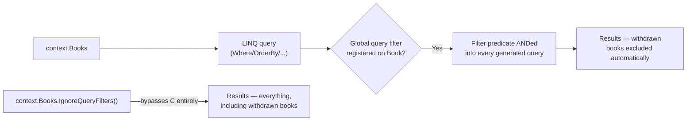
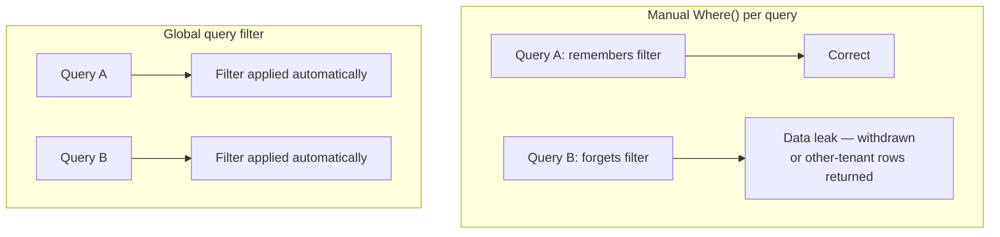

# Global Query Filters

## Introduction

Before reading this lesson, you should already be comfortable with **[Raw SQL and Stored Procedures](../11-efcore/11-11-raw-sql-and-stored-procedures.md)** and, from earlier lessons, with configuring entities inside `OnModelCreating`. Both of those skills assumed every query you write is complete on its own — you decide what conditions belong in the `Where` clause, every single time. This lesson introduces a different kind of rule: one you configure exactly once, on the model itself, that then applies automatically to *every* query issued against an entity from that point forward, whether that query was written by you, by a teammate six months from now, or by a raw SQL call you saw in the previous lesson. That's a global query filter, and it exists specifically to eliminate the risk of any single query forgetting a condition that must never be forgotten.

By the end of this lesson, you will be able to:

- Register a global query filter with `HasQueryFilter()` inside `OnModelCreating`
- Implement soft-delete correctly, so that "deleted" rows disappear from every query without a physical `DELETE`
- Implement a multi-tenancy filter that scopes every query to the current tenant automatically
- Reference `DbContext` instance state — not just constants — inside a query filter
- Deliberately bypass a filter with `IgnoreQueryFilters()` when a query genuinely needs to see everything
- Recognize why a global filter is safer than repeating the same `Where()` condition in every query by hand

## Global Query Filters — A Layman's Perspective

Picture a library's card catalog — the physical drawers of index cards patrons flip through to find a book, long before anyone touches the actual shelf. Every book the library has ever owned has a card in there somewhere, including books that were withdrawn from circulation years ago because they were damaged, lost, or simply retired. Those withdrawn books still physically exist in a back room, and their cards still technically sit in the drawer — but no patron browsing the catalog should ever see them turn up in a search. A withdrawn book showing up in search results, only for the patron to walk to the shelf and find nothing there, would be worse than useless.

The naive way to prevent that is to trust every single librarian, every single time they help a patron search, to remember to manually skip any card stamped "WITHDRAWN." That works fine for a week. Then a new part-time clerk starts, nobody mentions the stamp convention to them, and suddenly withdrawn books start appearing in search results again — not because anyone did anything wrong on purpose, but because a rule that lived only in people's memory quietly stopped being followed the moment someone new showed up who'd never been told about it.

The fix a well-run library actually uses is structural, not behavioral: the drawer itself is built with a spring-loaded divider that physically prevents any card stamped "WITHDRAWN" from ever sliding forward into the searchable section, full stop — no librarian has to remember anything, because the drawer enforces it mechanically regardless of who's operating it. That divider is a global query filter. It's configured once, on the catalog itself, and from that point on, every single search — run by the head librarian, the new clerk, or an automated kiosk — passes through the same mechanical exclusion without anyone needing to think about it query by query.

Now suppose this library is actually a network of ten branches sharing one shared catalog system, but each branch's staff should only ever see *their own* branch's books when searching — a Westside branch clerk searching for "gardening" shouldn't see Eastside branch's copy clutter up the results, even though both copies live in the same underlying system. The same spring-loaded divider mechanism handles this too, just configured differently: instead of filtering out anything stamped "WITHDRAWN," it filters based on which branch stamp the searching terminal itself belongs to, automatically excluding every other branch's cards without that terminal's staff ever typing "and only show Westside" into their search box. That's multi-tenancy enforced the same structural way soft-delete is — the filter doesn't care whether the excluded thing is "deleted" or simply "belongs to someone else."

And finally, sometimes someone genuinely does need to see everything the divider normally hides — an archivist doing inventory of every book the library has ever owned, withdrawn or not, across every branch. For exactly that rare, deliberate case, the head librarian keeps a special override key that temporarily disables the divider for one specific search, precisely because the archivist explicitly asked for the full, unfiltered drawer — not because the divider failed.

## Global Query Filters — A Programming Language Perspective

A global query filter is a `LambdaExpression` of type `Func<TEntity, bool>` registered against an entity type inside `OnModelCreating` via `modelBuilder.Entity<TEntity>().HasQueryFilter(predicate)`. EF Core appends this predicate as an additional `WHERE` condition to every LINQ query issued against that entity type — including queries reached indirectly through navigation properties — without the calling code ever writing that condition explicitly. Since EF Core 7.0, calling `HasQueryFilter()` more than once for the same entity combines the filters with a logical `AND` rather than the later call replacing the earlier one, which makes it straightforward to layer a soft-delete filter and a multi-tenancy filter on the same entity independently. A filter predicate may reference `DbContext` instance members — a field set in the constructor, for instance — rather than only compile-time constants, which is exactly what makes a *per-request* current-tenant value usable inside a filter registered once at model-build time. `IgnoreQueryFilters()`, called on an `IQueryable`, suppresses every global filter for that one query only, leaving the filter fully active for every other query in the application.

## How to Apply a Global Query Filter in C#

The runnable example below uses the **`Microsoft.EntityFrameworkCore.InMemory` provider** — global query filters operate at the LINQ level, before any SQL is generated, so they behave identically on `InMemory` and on every relational provider such as SQLite or SQL Server.


*Figure 1: Every ordinary query passes through the registered filter automatically; only an explicit `IgnoreQueryFilters()` call skips it.*

```csharp
// Program.cs — .NET 10 / C# 14
using Microsoft.EntityFrameworkCore;

using var context = new LibraryContext();

context.Books.AddRange(
    new Book { Title = "Clean Code", IsWithdrawn = false },
    new Book { Title = "Legacy COBOL Manual", IsWithdrawn = true },
    new Book { Title = "Refactoring", IsWithdrawn = false });
context.SaveChanges();

Console.WriteLine("Default search (filter applied automatically):");
foreach (Book b in context.Books)
{
    Console.WriteLine($"  {b.Title}");
}

Console.WriteLine("Archivist search (IgnoreQueryFilters):");
foreach (Book b in context.Books.IgnoreQueryFilters())
{
    Console.WriteLine($"  {b.Title} (withdrawn: {b.IsWithdrawn})");
}

class Book
{
    public int Id { get; set; }
    public string Title { get; set; } = "";
    public bool IsWithdrawn { get; set; }
}

class LibraryContext : DbContext
{
    protected override void OnConfiguring(DbContextOptionsBuilder optionsBuilder) =>
        optionsBuilder.UseInMemoryDatabase("LibraryCatalog");

    protected override void OnModelCreating(ModelBuilder modelBuilder)
    {
        modelBuilder.Entity<Book>().HasQueryFilter(b => !b.IsWithdrawn);
    }

    public DbSet<Book> Books => Set<Book>();
}
```

**Console Output:**

```text
Default search (filter applied automatically):
  Clean Code
  Refactoring
Archivist search (IgnoreQueryFilters):
  Clean Code (withdrawn: False)
  Legacy COBOL Manual (withdrawn: True)
  Refactoring (withdrawn: False)
```

The default `foreach` over `context.Books` never mentions `IsWithdrawn` at all, yet "Legacy COBOL Manual" never appears — the filter registered once in `OnModelCreating` excluded it silently, exactly as it would from every other query anyone writes against `Books` anywhere in the application. Only the explicit `IgnoreQueryFilters()` call surfaces it, and it does so only for that one query.

## Real-Time Example: Multi-Branch Soft-Delete in Library/Inventory Management

We extend the `Book`, `Member`, and `Loan` types from earlier in this module with a multi-branch catalog, combining *two* concerns in one filter: withdrawn books are hidden everywhere (soft-delete), and each branch's staff only ever see their own branch's books (multi-tenancy) — both enforced by a single `HasQueryFilter()` call that references the `LibraryContext` instance's own `_currentBranchId` field, set once per request/session rather than hardcoded.

```csharp
// Program.cs — .NET 10 / C# 14 — Real-Time Example (Library/Inventory Management)
using Microsoft.EntityFrameworkCore;

using var westside = new LibraryContext(currentBranchId: 1);
using var eastside = new LibraryContext(currentBranchId: 2);

// Both contexts share the same underlying InMemory database name, simulating one shared catalog.
westside.Books.AddRange(
    new Book { Title = "Clean Code", BranchId = 1, IsWithdrawn = false },
    new Book { Title = "The Pragmatic Programmer", BranchId = 1, IsWithdrawn = true },
    new Book { Title = "Domain-Driven Design", BranchId = 2, IsWithdrawn = false },
    new Book { Title = "Gardening Basics", BranchId = 2, IsWithdrawn = false });
westside.SaveChanges();

Console.WriteLine("Westside branch (BranchId 1) catalog search:");
foreach (Book b in westside.Books.OrderBy(b => b.Title))
{
    Console.WriteLine($"  {b.Title}");
}

Console.WriteLine("Eastside branch (BranchId 2) catalog search:");
foreach (Book b in eastside.Books.OrderBy(b => b.Title))
{
    Console.WriteLine($"  {b.Title}");
}

Console.WriteLine("Head-office audit (IgnoreQueryFilters — every branch, including withdrawn):");
foreach (Book b in westside.Books.IgnoreQueryFilters().OrderBy(b => b.BranchId).ThenBy(b => b.Title))
{
    Console.WriteLine($"  Branch {b.BranchId}: {b.Title} (withdrawn: {b.IsWithdrawn})");
}

class Book
{
    public int Id { get; set; }
    public string Title { get; set; } = "";
    public int BranchId { get; set; }
    public bool IsWithdrawn { get; set; }
}

class LibraryContext(int currentBranchId) : DbContext
{
    private readonly int _currentBranchId = currentBranchId;

    protected override void OnConfiguring(DbContextOptionsBuilder optionsBuilder) =>
        optionsBuilder.UseInMemoryDatabase("SharedLibraryCatalog");

    protected override void OnModelCreating(ModelBuilder modelBuilder)
    {
        modelBuilder.Entity<Book>()
            .HasQueryFilter(b => !b.IsWithdrawn && b.BranchId == _currentBranchId);
    }

    public DbSet<Book> Books => Set<Book>();
}
```

**Console Output:**

```text
Westside branch (BranchId 1) catalog search:
  Clean Code
Eastside branch (BranchId 2) catalog search:
  Domain-Driven Design
  Gardening Basics
Head-office audit (IgnoreQueryFilters — every branch, including withdrawn):
  Branch 1: Clean Code (withdrawn: False)
  Branch 1: The Pragmatic Programmer (withdrawn: True)
  Branch 2: Domain-Driven Design (withdrawn: False)
  Branch 2: Gardening Basics (withdrawn: False)
```

The Westside context's search never sees Eastside's books, and neither branch's search ever sees a withdrawn title — both restrictions came from the same single filter predicate, combining `!b.IsWithdrawn` and `b.BranchId == _currentBranchId` with `&&`. Nobody writing a query against `westside.Books` anywhere else in the application needs to remember either condition; it's structurally impossible to forget them, which is precisely the guarantee a real multi-branch inventory system needs before it can trust branch isolation at all.

## Global Query Filters vs. Manual Where Clauses

A manual `Where(b => !b.IsWithdrawn)` on a single query and a global query filter that expresses the exact same condition produce identical SQL — the difference is entirely about where the responsibility for remembering that condition lives. A manual `Where()` clause is correct only in the query where someone actually wrote it; every other query against the same entity, written by anyone, at any point in the project's future, has to independently remember to add it too, and nothing in the type system or the compiler will ever flag the query that forgets. A global filter moves that responsibility off of every individual query and onto the model itself, enforced exactly once, in exactly one place, applying automatically no matter who writes the next query or how many months from now they write it.


*Figure 2: A forgotten manual `Where()` is a silent data leak; a global filter cannot be forgotten because no query writes it in the first place.*

| Aspect | Manual `Where()` per query | Global query filter (`HasQueryFilter`) |
|---|---|---|
| Where it's defined | Repeated in every query that needs it | Once, in `OnModelCreating` |
| Risk of omission | High — one forgotten query leaks data | None — applies automatically |
| Overriding when needed | Simply don't add the condition | Explicit `IgnoreQueryFilters()` call |
| Typical use case | A condition specific to one query | Soft-delete, multi-tenancy — rules that must never be skipped |

## Types of Global Query Filter Usage in EF Core

Global query filters cover a handful of recurring patterns, most of which extend directly into production concerns:

1. **Soft-delete filters** — `HasQueryFilter(e => !e.IsDeleted)`, hiding logically-deleted rows from every query while keeping them physically in the database.
2. **Multi-tenancy filters** — `HasQueryFilter(e => e.TenantId == _currentTenantId)`, scoping every query to the calling tenant automatically.
3. **`IgnoreQueryFilters()`** — the deliberate, per-query bypass for administrative or audit scenarios that genuinely need to see everything.
4. **Combined filters (EF Core 7+)** — multiple `HasQueryFilter()` calls on the same entity now combine with `AND` rather than the last call overwriting the others.
5. **Filters referencing `DbContext` instance state** — a constructor-injected field, rather than a constant, letting the same filter definition scope correctly per request.
6. **[Interceptors in EF Core](../11-efcore/11-13-interceptors-in-ef-core.md)** — a complementary mechanism for enforcing rules automatically on *writes* (like stamping audit columns), the way a query filter enforces rules automatically on reads.

## What You've Learned & What's Next

A global query filter turns a condition that must never be skipped — soft-delete, tenant isolation — from something every query has to remember into something the model enforces structurally, with `IgnoreQueryFilters()` as the one deliberate, explicit way to see past it when that's genuinely what a query needs.

Continue your learning journey with **[Interceptors in EF Core](../11-efcore/11-13-interceptors-in-ef-core.md)**, where the same "enforce it once, automatically" idea extends from reads to writes — auto-populating audit columns and observing the SQL EF Core actually generates.

---
*Applies to: .NET 10 / C# 14. Last reviewed 2026-08-16.*
