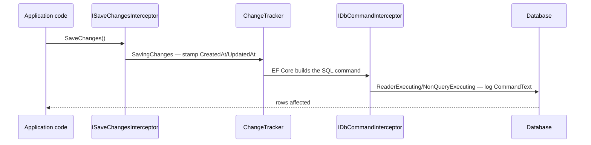
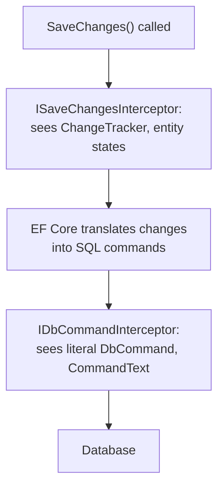

# Interceptors in EF Core

## Introduction

Before reading this lesson, you should already be comfortable with **[Global Query Filters](../11-efcore/11-12-global-query-filters.md)** — a mechanism for enforcing a rule automatically on every *read*. This lesson introduces the equivalent idea for the other half of EF Core's job: enforcing a rule automatically on every *write*, and observing exactly what EF Core sends to the database when it does. An interceptor is a piece of code that plugs directly into EF Core's internal pipeline — around every `SaveChanges()` call, or around every actual database command — so that a rule like "every row gets a timestamp" or "log every SQL statement we execute" doesn't have to be remembered inside every entity, every service method, or every query. You write the rule once, register it once, and it applies everywhere, automatically, from that point forward.

By the end of this lesson, you will be able to:

- Explain what `ISaveChangesInterceptor` and `IDbCommandInterceptor` each hook into, and how they differ
- Implement a `SavingChanges` override that auto-populates `CreatedAt`/`UpdatedAt` audit columns on every save
- Implement a command interceptor that logs the exact SQL text EF Core generates for each command
- Register one or more interceptors on a `DbContext` using `AddInterceptors()`
- Recognize why an interceptor is more reliable than repeating audit logic inside every entity's setters or every service method by hand

## Interceptors in EF Core — A Layman's Perspective

Picture a bank's back-office processing floor, where every deposit slip, withdrawal slip, and transfer form eventually has to pass through a single, mandatory checkpoint on its way from the teller's counter to the permanent vault ledger. Stationed at that checkpoint is a clerk whose entire job is to take every single form that passes by — no matter which teller filled it out, no matter which branch it came from — and stamp two things onto it before it's allowed to proceed: the exact date and time it was first created, and, if it's an amendment to something already on file, the date and time it was last touched. No teller ever has to remember to reach for the date stamp themselves; it happens automatically, at the one checkpoint every single form is structurally required to pass through anyway.

That checkpoint clerk is an `ISaveChangesInterceptor`. Every form heading toward the vault ledger is a call to `SaveChanges()`, and the clerk's stamping happens in the narrow window between the form arriving at the checkpoint and it actually being filed — which is exactly where `SavingChanges` sits in EF Core's pipeline, after your code has decided *what* to save but before the database has actually recorded it.

Now imagine a second, entirely different role on the same processing floor: a compliance auditor stationed even further downstream, at the point where the vault's own internal messaging system actually transmits the final, literal instruction to the ledger system — "credit account 4471 by $200.00," word for word, exactly as it will be executed. This auditor doesn't care about the paper forms at all; they care only about the literal instruction that's about to be carried out, and they photograph every single one of those instructions into a permanent log before letting it proceed, regardless of which checkpoint clerk or which teller was involved upstream. That auditor is an `IDbCommandInterceptor` — it doesn't see your entities or your change tracker at all; it sees the actual, literal command about to be sent to the database, in the database's own language.

What makes both of these roles genuinely valuable, rather than just bureaucratic overhead, is that neither one depends on any individual teller's memory or diligence. A brand-new teller who's never been told "always date-stamp your forms" still gets every form date-stamped correctly, because the checkpoint clerk does it regardless of who submitted the form. A new type of transaction nobody anticipated when the compliance auditor's role was created still gets logged, because the auditor photographs whatever comes through, not a pre-approved list of expected instructions. That's the whole point of an interceptor: the rule lives at a chokepoint every operation is already structurally forced to pass through, so the rule can never be silently skipped just because a particular piece of code forgot to apply it.

## Interceptors in EF Core — A Programming Language Perspective

`ISaveChangesInterceptor` (and its convenience base class, `SaveChangesInterceptor`) defines hooks — `SavingChanges`/`SavingChangesAsync`, called immediately before EF Core sends changes to the database, and `SavedChanges`/`SavedChangesAsync`, called immediately after — that receive a `DbContextEventData` giving access to the same `DbContext` whose `SaveChanges()` triggered them, including its full `ChangeTracker`. `IDbCommandInterceptor` (and `DbCommandInterceptor`) defines hooks around actual ADO.NET command execution — `ReaderExecuting`/`NonQueryExecuting`/`ScalarExecuting`, each with async variants — receiving the literal `DbCommand` about to run, including its final, fully parameterized `CommandText`. Both interfaces are registered on a `DbContextOptionsBuilder` via `.AddInterceptors(...)`, which accepts any number of interceptor instances and applies all of them; interceptors registered this way run for every operation on that context for the context's entire lifetime, with no per-query opt-in required. Because `IDbCommandInterceptor` operates at the level of an actual database command, it only fires against relational providers — a non-relational provider like `Microsoft.EntityFrameworkCore.InMemory` never constructs a `DbCommand` in the first place, so a command interceptor registered against it simply never runs.

## How to Register an Interceptor in EF Core

The runnable example below uses the **EF Core SQLite provider against an in-memory database** (`Microsoft.Data.Sqlite`, `DataSource=:memory:`) rather than the `InMemory` package, specifically because this lesson's command interceptor needs to see real, generated SQL text — something a non-relational provider never produces. Every relational provider shares this same interceptor API surface.


*Figure 1: `SavingChanges` fires once per `SaveChanges()` call, before the SQL exists; `NonQueryExecuting` fires once per actual command, after EF Core has built it.*

```csharp
// Program.cs — .NET 10 / C# 14
using Microsoft.Data.Sqlite;
using Microsoft.EntityFrameworkCore;
using Microsoft.EntityFrameworkCore.Diagnostics;

var connection = new SqliteConnection("DataSource=:memory:");
connection.Open();

var options = new DbContextOptionsBuilder<NotesContext>()
    .UseSqlite(connection)
    .AddInterceptors(new AuditSaveChangesInterceptor())
    .Options;

using var context = new NotesContext(options);
context.Database.EnsureCreated();

var note = new Note { Text = "Follow up with vendor" };
context.Notes.Add(note);
context.SaveChanges();

Console.WriteLine($"Created: {note.CreatedAt:yyyy-MM-dd HH:mm}, Updated: {note.UpdatedAt:yyyy-MM-dd HH:mm}");

note.Text = "Follow up with vendor — resolved";
context.SaveChanges();

Console.WriteLine($"Created: {note.CreatedAt:yyyy-MM-dd HH:mm}, Updated: {note.UpdatedAt:yyyy-MM-dd HH:mm}");

interface IAuditable
{
    DateTime CreatedAt { get; set; }
    DateTime UpdatedAt { get; set; }
}

class Note : IAuditable
{
    public int Id { get; set; }
    public string Text { get; set; } = "";
    public DateTime CreatedAt { get; set; }
    public DateTime UpdatedAt { get; set; }
}

class AuditSaveChangesInterceptor : SaveChangesInterceptor
{
    public override InterceptionResult<int> SavingChanges(
        DbContextEventData eventData, InterceptionResult<int> result)
    {
        Stamp(eventData.Context);
        return base.SavingChanges(eventData, result);
    }

    private static void Stamp(DbContext? context)
    {
        if (context is null) return;

        DateTime now = DateTime.UtcNow;
        foreach (var entry in context.ChangeTracker.Entries<IAuditable>())
        {
            if (entry.State == EntityState.Added)
            {
                entry.Entity.CreatedAt = now;
                entry.Entity.UpdatedAt = now;
            }
            else if (entry.State == EntityState.Modified)
            {
                entry.Entity.UpdatedAt = now;
            }
        }
    }
}

class NotesContext(DbContextOptions<NotesContext> options) : DbContext(options)
{
    public DbSet<Note> Notes => Set<Note>();
}
```

**Console Output** *(timestamps will reflect the actual run time; relative behavior is exact):*

```text
Created: 2026-08-16 09:14, Updated: 2026-08-16 09:14
Created: 2026-08-16 09:14, Updated: 2026-08-16 09:17
```

Nothing inside `Note`, and nothing in the code that created or modified it, ever set `CreatedAt` or `UpdatedAt` directly — the interceptor's `SavingChanges` override walked the `ChangeTracker` on every single call to `SaveChanges()` and stamped whichever entities were `Added` or `Modified`, entirely on its own. `CreatedAt` stayed fixed across the second save because that entity was `Modified`, not `Added`, on that call — only `UpdatedAt` moved forward.

## Real-Time Example: Auditing and SQL Logging in Banking/ATM Transaction Processing

We extend the `Account` and `Transaction` types from earlier in this module with two interceptors working together: an audit interceptor stamping `CreatedAt`/`UpdatedAt` on every `Transaction`, and a command interceptor logging the exact SQL EF Core sends for every insert — the kind of audit trail a real banking system's compliance requirements would actually demand, built without a single manual timestamp assignment or log statement scattered through the transaction-processing code itself.

```csharp
// Program.cs — .NET 10 / C# 14 — Real-Time Example (Banking/ATM)
using System.Data.Common;
using Microsoft.Data.Sqlite;
using Microsoft.EntityFrameworkCore;
using Microsoft.EntityFrameworkCore.Diagnostics;

var connection = new SqliteConnection("DataSource=:memory:");
connection.Open();

var options = new DbContextOptionsBuilder<BankContext>()
    .UseSqlite(connection)
    .AddInterceptors(new AuditSaveChangesInterceptor(), new SqlLoggingCommandInterceptor())
    .Options;

using var context = new BankContext(options);
context.Database.EnsureCreated();

var account = new Account { AccountNumber = "ACC-4471", Balance = 1000.00m };
context.Accounts.Add(account);
context.SaveChanges();

context.Transactions.Add(new Transaction
{
    AccountId = account.Id,
    Amount = 200.00m,
    Kind = "Deposit"
});
account.Balance += 200.00m;
context.SaveChanges();

interface IAuditable
{
    DateTime CreatedAt { get; set; }
    DateTime UpdatedAt { get; set; }
}

class Account
{
    public int Id { get; set; }
    public string AccountNumber { get; set; } = "";
    public decimal Balance { get; set; }
}

class Transaction : IAuditable
{
    public int Id { get; set; }
    public int AccountId { get; set; }
    public decimal Amount { get; set; }
    public string Kind { get; set; } = "";
    public DateTime CreatedAt { get; set; }
    public DateTime UpdatedAt { get; set; }
}

class AuditSaveChangesInterceptor : SaveChangesInterceptor
{
    public override InterceptionResult<int> SavingChanges(
        DbContextEventData eventData, InterceptionResult<int> result)
    {
        if (eventData.Context is DbContext ctx)
        {
            DateTime now = DateTime.UtcNow;
            foreach (var entry in ctx.ChangeTracker.Entries<IAuditable>())
            {
                if (entry.State == EntityState.Added)
                {
                    entry.Entity.CreatedAt = now;
                    entry.Entity.UpdatedAt = now;
                }
                else if (entry.State == EntityState.Modified)
                {
                    entry.Entity.UpdatedAt = now;
                }
            }
        }
        return base.SavingChanges(eventData, result);
    }
}

class SqlLoggingCommandInterceptor : DbCommandInterceptor
{
    public override InterceptionResult<int> NonQueryExecuting(
        DbCommand command, CommandEventData eventData, InterceptionResult<int> result)
    {
        Console.WriteLine($"[SQL] {command.CommandText.Replace(Environment.NewLine, " ")}");
        return base.NonQueryExecuting(command, eventData, result);
    }
}

class BankContext(DbContextOptions<BankContext> options) : DbContext(options)
{
    public DbSet<Account> Accounts => Set<Account>();
    public DbSet<Transaction> Transactions => Set<Transaction>();
}
```

**Console Output** *(the exact SQLite `INSERT`/`UPDATE` text EF Core generates; timestamps reflect actual run time):*

```text
[SQL] INSERT INTO "Accounts" ("AccountNumber", "Balance") VALUES (@p0, @p1);
[SQL] INSERT INTO "Transactions" ("AccountId", "Amount", "CreatedAt", "Kind", "UpdatedAt") VALUES (@p0, @p1, @p2, @p3, @p4);
[SQL] UPDATE "Accounts" SET "Balance" = @p0 WHERE "Id" = @p1;
```

Every `INSERT`/`UPDATE` statement the second `SaveChanges()` call produced was logged automatically by `SqlLoggingCommandInterceptor`, with `CreatedAt` and `UpdatedAt` already present as literal parameters — filled in by `AuditSaveChangesInterceptor` before the command was even built, not after. No line of business logic in this example ever called `Console.WriteLine` to log SQL, and no line ever assigned a timestamp to a `Transaction` — a real banking system gets a genuine, complete audit trail out of two small, reusable interceptors, applied uniformly to every save the application ever performs.

## `ISaveChangesInterceptor` vs. `IDbCommandInterceptor`

Both interceptor families let you observe and influence EF Core's pipeline without modifying the code that calls `SaveChanges()` or issues a query, but they sit at very different altitudes. `ISaveChangesInterceptor` operates at the level of the `DbContext` and its `ChangeTracker` — it sees tracked *entities*, their `EntityState`, and their CLR property values, and it runs once per `SaveChanges()` call regardless of how many individual SQL statements that call eventually produces. `IDbCommandInterceptor` operates one level lower, at the level of the actual ADO.NET `DbCommand` — it sees only the final, literal SQL text and its parameters, with no awareness of which entity or property that command originated from, and it runs once per command, so a single `SaveChanges()` touching five entities triggers the save interceptor once but the command interceptor up to five times.


*Figure 2: A save interceptor sees your entities before SQL exists; a command interceptor sees the SQL after EF Core has already built it.*

| Aspect | `ISaveChangesInterceptor` | `IDbCommandInterceptor` |
|---|---|---|
| What it sees | Tracked entities, `EntityState`, the `ChangeTracker` | The literal `DbCommand` and its `CommandText` |
| Fires once per | `SaveChanges()`/`SaveChangesAsync()` call | Individual database command |
| Works with `InMemory` provider | Yes | No — no `DbCommand` is ever built |
| Typical use case | Auto-populating audit columns, validation before save | Logging generated SQL, command-level diagnostics |

## Types of Interceptors in EF Core

A handful of interceptor interfaces cover EF Core's pipeline end to end, several of which are natural companions to this lesson's two examples:

1. **`ISaveChangesInterceptor` / `SaveChangesInterceptor`** — this lesson's audit hook, firing around every `SaveChanges()` call.
2. **`IDbCommandInterceptor` / `DbCommandInterceptor`** — this lesson's SQL-logging hook, firing around every actual database command.
3. **`IDbConnectionInterceptor`** — hooks around connection open/close, useful for connection-level diagnostics or retry logic.
4. **`IDbTransactionInterceptor`** — hooks around transaction start/commit/rollback.
5. **`AddInterceptors()`** — the single registration point on `DbContextOptionsBuilder` that accepts any number of interceptors of any kind, all applied together.
6. **[Bulk Operations and Performance Tuning](../11-efcore/11-14-bulk-operations-and-performance.md)** — a genuine gotcha worth knowing now: `ExecuteUpdate`/`ExecuteDelete` bypass the `ChangeTracker` and `SaveChanges()` entirely, so a `SaveChanges`-based audit interceptor like this lesson's never fires for them.

## What You've Learned & What's Next

An interceptor moves a rule that must apply to every save or every SQL command out of individual entities and service methods and into a single chokepoint EF Core's pipeline already forces every operation through — `ISaveChangesInterceptor` for entity-level concerns like audit columns, `IDbCommandInterceptor` for the literal SQL text itself, both registered once via `AddInterceptors()`.

Continue your learning journey with **[Bulk Operations and Performance Tuning](../11-efcore/11-14-bulk-operations-and-performance.md)**, where `ExecuteUpdate`/`ExecuteDelete` update or delete rows directly in the database — and, as the previous paragraph hinted, without ever triggering a `SaveChanges`-based interceptor like the one built in this lesson.

---
*Applies to: .NET 10 / C# 14. Last reviewed 2026-08-16.*
