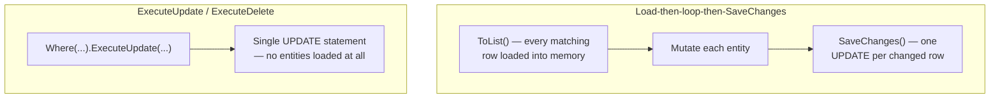
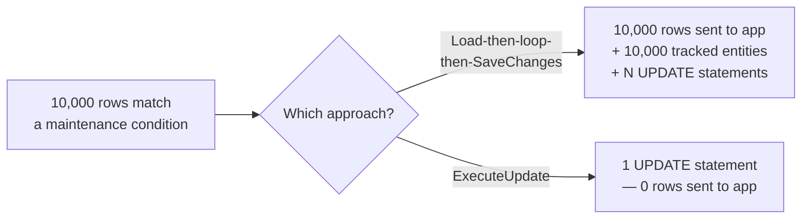

# Bulk Operations and Performance Tuning

## Introduction

Before reading this lesson, you should already be comfortable with **[Interceptors in EF Core](../11-efcore/11-13-interceptors-in-ef-core.md)** and, in fact, with the fully-loaded `SaveChanges()`-based workflow this entire module has used so far: load entities, mutate them, call `SaveChanges()`, let the change tracker figure out what SQL to generate. That workflow is exactly right when you're updating a handful of rows and genuinely need entity-level behavior — validation, audit interceptors, domain logic — to run on each one. It is a poor fit for a very common operation: applying the same change to thousands of rows at once, where loading every one of them into memory first is pure overhead nobody actually needs. This lesson covers the tools that skip that overhead deliberately, plus three related performance habits — read-only queries, compiled hot paths, and avoiding a classic loading mistake — that round out this module's coverage of writing efficient, production-shaped EF Core code.

By the end of this lesson, you will be able to:

- Use `ExecuteUpdate` to modify every row matching a query in a single database statement, without loading any entities
- Use `ExecuteDelete` to remove every row matching a query the same way
- Explain exactly why this differs from the load-then-loop-then-`SaveChanges` pattern, and why that difference matters at scale
- Recap `AsNoTracking()` for queries whose results will only ever be read, never saved back
- Build a compiled query with `EF.CompileQuery` for a query shape executed very frequently
- Recognize the N+1 query problem when loading related data, and avoid it with `Include()`

## Bulk Operations and Performance Tuning — A Layman's Perspective

Picture a large warehouse that just received word that an entire product line is being discounted 15% for a flash sale, effective immediately, across every single unit currently on the shelves — possibly thousands of individual boxes. The naive way to make that happen is to send a worker down every aisle, one box at a time: pick the box up, peel off the old price sticker, write a new one, put the box back down, and move to the next box, repeating that entire physical round trip for every single unit before the sale can start. That's the load-then-loop-then-save pattern: fetch every matching row into memory, one at a time conceptually, mutate each one individually, and only then write the results back — real, measurable work multiplied by however many rows happen to match.

A far more sensible warehouse manager does something completely different: they walk to the warehouse's central control panel and issue one instruction — "every box tagged with this product line gets its price reduced by 15%, right where it sits" — and the warehouse's own automated tagging system applies that instruction directly to every matching box on the shelf, in place, without a single box ever being picked up, carried anywhere, or handled individually by a worker. Nobody needed to know how many boxes matched ahead of time; the instruction scales the same way whether it touches ten boxes or ten thousand. That single instruction is `ExecuteUpdate` — and its twin for removing matching boxes from the shelves entirely, without ever carrying a single one out to inspect it first, is `ExecuteDelete`.

Two more workplace habits round out an efficient warehouse. First, an inventory auditor who's only there to *count* boxes and note what's on the shelves — never to move or relabel anything — doesn't need a clipboard tracking every box's exact original position so it can be put back "correctly" later, because nothing about auditing requires putting anything back; carrying that tracking clipboard around anyway would just be wasted effort for a task that's purely observational. That's `AsNoTracking()`: when a query's results will only be displayed, never saved back through the same context, there's no reason to pay for the bookkeeping that supports doing so.

Second, imagine a specific lookup — "what aisle is product SKU 44071 in?" — that gets asked by warehouse staff dozens of times an hour, every single day. Rather than have a clerk work out, from scratch, exactly how to search the warehouse's directory system every single time that question comes up, the warehouse prints one laminated, pre-computed lookup card for that exact question, handed to whoever asks it, so the "how do I even look this up" step never has to be repeated. That's a compiled query — the *plan* for running a frequently-asked query gets worked out once, not on every single call.

Finally, picture a supervisor who needs the contents of five different orders, and instead of requesting all five orders' contents in one single trip to the records room, sends a runner to the records room once *per order* — five separate round trips for what could have been done in one. That's the N+1 problem: one query to find the parent orders, then one *additional* query per order to fetch its contents, when a single, slightly smarter trip could have retrieved everything at once.

## Bulk Operations and Performance Tuning — A Programming Language Perspective

`ExecuteUpdate(Expression<Func<SetPropertyCalls<TEntity>, SetPropertyCalls<TEntity>>>)` and `ExecuteDelete()`, both introduced in EF Core 7 and available on any `IQueryable<TEntity>`, translate directly into a single SQL `UPDATE` or `DELETE` statement scoped by the query's `Where` clause; neither one materializes matching rows into entities, neither one touches the `ChangeTracker`, and neither one requires — or triggers — a call to `SaveChanges()`. This is a categorically different execution path from `ToList()` + mutate + `SaveChanges()`, which must round-trip every matching row into memory as a tracked entity before any change reaches the database at all. `AsNoTracking()`, covered earlier in this module, disables per-entity change-tracking snapshots for a query's results — appropriate whenever those results are read-only from that context's perspective. `EF.CompileQuery`/`EF.CompileAsyncQuery` produce a delegate that caches the LINQ expression tree's translation into SQL, sparing a repeatedly-executed parameterized query shape that (small, but nonzero) translation cost on every call — a targeted optimization for genuinely hot paths, not a default to apply everywhere. The N+1 problem occurs when a collection navigation property is accessed inside a loop over its parents without having been loaded up front, causing one additional query per parent; `Include()` (or a single projection) retrieves everything in one query instead.

## How to Run Bulk Operations and Tune Query Performance in C#

The runnable example below uses the **EF Core SQLite provider against an in-memory database** (`Microsoft.Data.Sqlite`, `DataSource=:memory:`) rather than the `Microsoft.EntityFrameworkCore.InMemory` package — `ExecuteUpdate`/`ExecuteDelete` translate to real SQL statements and are **not supported at all by the non-relational `InMemory` provider**. Every relational provider (SQLite, SQL Server, PostgreSQL) shares this same API surface.


*Figure 1: The old pattern's cost scales with how many rows are loaded into memory; `ExecuteUpdate` sends one statement regardless of how many rows match.*

```csharp
// Program.cs — .NET 10 / C# 14
using Microsoft.Data.Sqlite;
using Microsoft.EntityFrameworkCore;

var connection = new SqliteConnection("DataSource=:memory:");
connection.Open();

var options = new DbContextOptionsBuilder<CatalogContext>()
    .UseSqlite(connection)
    .Options;

using var context = new CatalogContext(options);
context.Database.EnsureCreated();

context.Products.AddRange(
    new Product { Name = "Widget A", Category = "Electronics", Price = 50.00m, Discontinued = false },
    new Product { Name = "Widget B", Category = "Electronics", Price = 80.00m, Discontinued = false },
    new Product { Name = "Widget C", Category = "Furniture", Price = 120.00m, Discontinued = true });
context.SaveChanges();

// ExecuteUpdate: a single UPDATE statement — no Product entities are ever loaded.
int discounted = context.Products
    .Where(p => p.Category == "Electronics")
    .ExecuteUpdate(setters => setters.SetProperty(p => p.Price, p => p.Price * 0.9m));
Console.WriteLine($"Products discounted: {discounted}");

// ExecuteDelete: a single DELETE statement — same story, no entities loaded.
int removed = context.Products
    .Where(p => p.Discontinued)
    .ExecuteDelete();
Console.WriteLine($"Discontinued products removed: {removed}");

// AsNoTracking: results are for display only, so no change-tracking snapshot is kept.
List<string> remaining = context.Products
    .AsNoTracking()
    .OrderBy(p => p.Name)
    .Select(p => $"{p.Name}: {p.Price:C}")
    .ToList();
Console.WriteLine("Remaining catalog:");
foreach (string line in remaining) Console.WriteLine($"  {line}");

// A compiled query for a hot lookup path — the translation to SQL is cached once.
var getByName = EF.CompileQuery((CatalogContext ctx, string name) =>
    ctx.Products.FirstOrDefault(p => p.Name == name));

Product? found = getByName(context, "Widget A");
Console.WriteLine($"Compiled lookup: {found?.Name} at {found?.Price:C}");

class Product
{
    public int Id { get; set; }
    public string Name { get; set; } = "";
    public string Category { get; set; } = "";
    public decimal Price { get; set; }
    public bool Discontinued { get; set; }
}

class CatalogContext(DbContextOptions<CatalogContext> options) : DbContext(options)
{
    public DbSet<Product> Products => Set<Product>();
}
```

**Console Output:**

```text
Products discounted: 2
Discontinued products removed: 1
Remaining catalog:
  Widget A: $45.00
  Widget B: $72.00
Compiled lookup: Widget A at $45.00
```

`ExecuteUpdate` discounted both Electronics products in one statement and reported `2` — the affected row count, not a list of entities. `ExecuteDelete` removed the single discontinued Furniture product the same way. Neither call ever populated `context.ChangeTracker` with a `Product`, which is exactly why the compiled lookup afterward still returns the freshly discounted price of `$45.00` straight from the database — there was never a stale tracked entity around to contradict it.

## Real-Time Example: Cleaning Up Abandoned Orders in E-Commerce Order Processing

We extend the `Order` and `OrderItem` types from earlier in this module with two everyday maintenance tasks: cancelling abandoned pending orders older than 30 days, and purging orders that have been cancelled for over a year — both as single bulk statements — followed by a direct demonstration of the N+1 problem using a query-counting interceptor like the one built in the previous lesson.

```csharp
// Program.cs — .NET 10 / C# 14 — Real-Time Example (E-Commerce Order Processing)
using System.Data.Common;
using Microsoft.Data.Sqlite;
using Microsoft.EntityFrameworkCore;
using Microsoft.EntityFrameworkCore.Diagnostics;

var connection = new SqliteConnection("DataSource=:memory:");
connection.Open();

var queryCounter = new QueryCountingInterceptor();

var options = new DbContextOptionsBuilder<StoreContext>()
    .UseSqlite(connection)
    .AddInterceptors(queryCounter)
    .Options;

using var context = new StoreContext(options);
context.Database.EnsureCreated();

DateTime asOf = new DateTime(2026, 8, 16);
DateTime abandonedCutoff = asOf.AddDays(-30);
DateTime purgeCutoff = asOf.AddYears(-1);

context.Orders.AddRange(
    new Order
    {
        CustomerId = 1, Status = "Pending", PlacedOn = new DateTime(2026, 6, 1),
        Items = { new OrderItem { ProductName = "Laptop Stand", Quantity = 1, UnitPrice = 45.00m } }
    },
    new Order
    {
        CustomerId = 2, Status = "Pending", PlacedOn = new DateTime(2026, 8, 10),
        Items = { new OrderItem { ProductName = "USB-C Hub", Quantity = 2, UnitPrice = 34.00m } }
    },
    new Order
    {
        CustomerId = 1, Status = "Pending", PlacedOn = new DateTime(2026, 5, 15),
        Items = { new OrderItem { ProductName = "Desk Lamp", Quantity = 1, UnitPrice = 18.00m } }
    },
    new Order { CustomerId = 3, Status = "Cancelled", PlacedOn = new DateTime(2025, 1, 10) });
context.SaveChanges();

// The old pattern, shown but not executed: load every matching order, mutate each
// one, then SaveChanges — three logical steps, and a round trip for every row, for
// what is conceptually a single statement.
//
// List<Order> abandoned = context.Orders
//     .Where(o => o.Status == "Pending" && o.PlacedOn < abandonedCutoff)
//     .ToList();
// foreach (Order o in abandoned) o.Status = "Cancelled";
// context.SaveChanges();

int cancelled = context.Orders
    .Where(o => o.Status == "Pending" && o.PlacedOn < abandonedCutoff)
    .ExecuteUpdate(setters => setters.SetProperty(o => o.Status, "Cancelled"));
Console.WriteLine($"Abandoned orders cancelled: {cancelled}");

int purged = context.Orders
    .Where(o => o.Status == "Cancelled" && o.PlacedOn < purgeCutoff)
    .ExecuteDelete();
Console.WriteLine($"Old cancelled orders purged: {purged}");

// N+1: loading each remaining order's items one order at a time.
queryCounter.Reset();
List<Order> loadedOneAtATime = context.Orders.AsNoTracking().ToList();
foreach (Order o in loadedOneAtATime)
{
    context.Entry(o).Collection(x => x.Items).Load();
}
Console.WriteLine($"Queries executed loading items one order at a time: {queryCounter.Count}");

// Fixed: a single query with Include(), regardless of how many orders match.
queryCounter.Reset();
List<Order> loadedWithInclude = context.Orders.AsNoTracking().Include(o => o.Items).ToList();
Console.WriteLine($"Queries executed loading items via Include(): {queryCounter.Count}");

class Order
{
    public int Id { get; set; }
    public int CustomerId { get; set; }
    public string Status { get; set; } = "";
    public DateTime PlacedOn { get; set; }
    public List<OrderItem> Items { get; set; } = [];
}

class OrderItem
{
    public int Id { get; set; }
    public int OrderId { get; set; }
    public string ProductName { get; set; } = "";
    public int Quantity { get; set; }
    public decimal UnitPrice { get; set; }
}

class QueryCountingInterceptor : DbCommandInterceptor
{
    public int Count { get; private set; }
    public void Reset() => Count = 0;

    public override InterceptionResult<DbDataReader> ReaderExecuting(
        DbCommand command, CommandEventData eventData, InterceptionResult<DbDataReader> result)
    {
        Count++;
        return base.ReaderExecuting(command, eventData, result);
    }
}

class StoreContext(DbContextOptions<StoreContext> options) : DbContext(options)
{
    public DbSet<Order> Orders => Set<Order>();
    public DbSet<OrderItem> OrderItems => Set<OrderItem>();
}
```

**Console Output:**

```text
Abandoned orders cancelled: 2
Old cancelled orders purged: 1
Queries executed loading items one order at a time: 4
Queries executed loading items via Include(): 1
```

Two orders placed before the 30-day cutoff (June 1 and May 15) were cancelled in one `ExecuteUpdate` statement; the order placed August 10 stayed `Pending`, since it wasn't old enough yet. Only the order that had already been `Cancelled` since January 2025 — over a year before the reference date — was purged by `ExecuteDelete`; neither newly-cancelled order was old enough to be purged in the same pass. The N+1 comparison is the sharpest part of this trace: loading three remaining orders' items one at a time issued **four** queries — one for the orders, one per order for its items — while `Include()` retrieved the exact same data in **one**. In a real storefront with thousands of orders on a dashboard, that difference is the entire reason a page loads in milliseconds instead of seconds.

## Load-Then-Loop-Then-SaveChanges vs. `ExecuteUpdate`/`ExecuteDelete`

The old pattern and the bulk-operation methods can produce an identical end result in the database, but they get there through fundamentally different amounts of work. Loading every matching row into memory means the database sends every column of every matching row across the wire, EF Core builds a tracked entity for each one, your code mutates each entity individually, and then `SaveChanges()` sends back one `UPDATE` per changed entity (or batches them, depending on the provider) — real cost that scales linearly with the row count, whether or not your code actually needs entity-level behavior for that particular change. `ExecuteUpdate`/`ExecuteDelete` skip every one of those steps: the database receives a single statement expressing the *rule* ("set Status to Cancelled where..."), and applies it to however many rows match, without a single row ever leaving the database to be looked at.


*Figure 2: The row count that matches a bulk maintenance condition changes the old pattern's cost proportionally; it barely changes `ExecuteUpdate`'s.*

| Aspect | Load-then-loop-then-`SaveChanges` | `ExecuteUpdate` / `ExecuteDelete` |
|---|---|---|
| Rows loaded into memory | Every matching row, as tracked entities | None |
| `SaveChanges()` required | Yes | No |
| `ISaveChangesInterceptor` fires | Yes | No — bypasses `SaveChanges` entirely |
| Global query filters (`HasQueryFilter`) still apply | Yes | Yes — filters apply during LINQ translation, before either path generates SQL |
| Best fit | Small row counts, or changes needing entity-level logic per row | Large row counts, simple uniform changes |

## Types of Bulk Operation and Performance Techniques in EF Core

This lesson's techniques cover the most common performance levers in everyday EF Core code, several of which connect directly to earlier lessons in this module:

1. **`ExecuteUpdate`/`ExecuteUpdateAsync`** (EF Core 7+) — this lesson's single-statement, no-entities-loaded update.
2. **`ExecuteDelete`/`ExecuteDeleteAsync`** (EF Core 7+) — this lesson's single-statement, no-entities-loaded delete.
3. **`AsNoTracking()` / `AsNoTrackingWithIdentityResolution()`** — skipping change-tracking overhead entirely for read-only query results.
4. **Compiled queries (`EF.CompileQuery`/`EF.CompileAsyncQuery`)** — caching a hot query shape's LINQ-to-SQL translation for repeated execution.
5. **`AsSplitQuery()`** — an alternative to a single `Include()` join, avoiding a *different* performance problem: row duplication when a query includes more than one collection navigation at once.
6. **[Global Query Filters](../11-efcore/11-12-global-query-filters.md)** — still enforced automatically on `ExecuteUpdate`/`ExecuteDelete`, even though the `SaveChanges`-based interceptors from the previous lesson never run for them.

## What You've Learned & What's Next

`ExecuteUpdate` and `ExecuteDelete` replace loading thousands of rows into memory just to change or remove them with a single statement that does the same job in the database directly — a genuinely newer, faster tool alongside older, still-essential habits: `AsNoTracking()` for read-only queries, compiled queries for hot paths, and `Include()` to avoid trading one query for N+1 of them.

Continue your learning journey with **[EF Core with Azure Cosmos DB](../11-efcore/11-15-ef-core-with-cosmos-db.md)**, this module's capstone lesson, where the same `DbContext`/LINQ programming model you've used throughout Module 11 gets pointed at a NoSQL document database instead of a relational one — and where several of this module's relational assumptions stop applying entirely.

---
*Applies to: .NET 10 / C# 14. Last reviewed 2026-08-16.*
