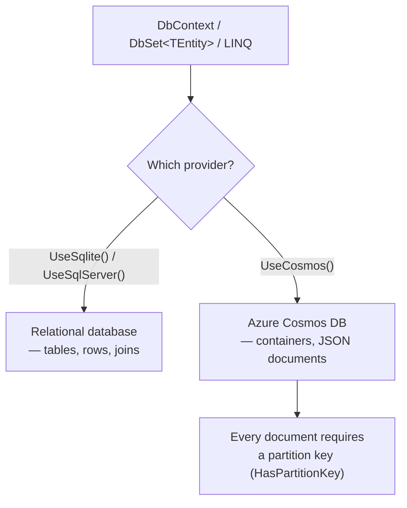
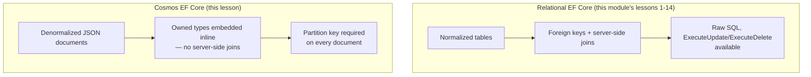

# EF Core with Azure Cosmos DB

## Introduction

Before reading this lesson, you should already be comfortable with **[Bulk Operations and Performance Tuning](../11-efcore/11-14-bulk-operations-and-performance.md)** and, really, with this entire module's relational assumptions: rows in normalized tables, foreign keys, server-side joins, and a `DbContext` that ultimately talks to a SQL dialect. This lesson is Module 11's capstone, and it deliberately pulls one of those assumptions out from under you: the database on the other end of the same `DbContext`/LINQ programming model you've used throughout this module doesn't have to be relational at all. Azure Cosmos DB is a NoSQL document database, and EF Core ships a provider for it that lets you keep writing `context.Orders.Where(...)` — while, underneath, storing and querying JSON documents instead of table rows. This lesson is illustrative rather than a hands-on lab: without a real Azure Cosmos DB account or the local Cosmos DB Emulator, none of this lesson's code actually runs, so every output shown here is explicitly labeled as representative, not a literal execution trace — a genuine exception to how every other lesson in this module has worked.

By the end of this lesson, you will be able to:

- Explain what the EF Core Cosmos DB provider (`UseCosmos()`) is and why it lets the same programming model target a non-relational database
- Configure a required partition key with `HasPartitionKey()` and explain why Cosmos DB mandates one
- Model denormalized, embedded data with owned types, instead of normalized tables joined at query time
- Identify which of this module's relational-only features — raw SQL, joins, bulk operations — don't carry over to Cosmos, and why
- Explain why this lesson can only be illustrative here, and what running it for real would require
- Recognize how this foreshadows Module 16's dedicated Azure Cosmos DB coverage

## EF Core with Azure Cosmos DB — A Layman's Perspective

Picture two very different ways an office could organize its e-commerce order paperwork. The first office — the one every earlier lesson in this module has assumed — runs a normalized filing system: every order gets a thin file containing just an order number and a reference number pointing to the customer's separate file; every line item on that order gets its *own* thin file, pointing back to the order's reference number. Nothing is duplicated anywhere. The tradeoff is that answering a simple question like "what's in order #4471, and who placed it?" means visiting three different cabinets, following the reference numbers between them by hand, and assembling the full picture only once all three files are open on the desk at the same time. That's relational modeling: normalized, cross-referenced, joined together at read time.

The second office does something structurally different. Instead of three thin, cross-referenced files, every order gets exactly one self-contained dossier — a single folder holding the order number, the customer's name and email written directly inside that folder (not a reference number pointing elsewhere), and every line item's full details also written directly inside that same folder. Nothing outside that one dossier needs to be touched to answer "what's in this order, and who placed it" — the entire answer sits inside one physical folder. That's a denormalized document, and it's the natural shape Cosmos DB stores everything in: not rows spread across normalized tables, but self-contained JSON documents, each one holding everything relevant to it directly, duplication and all.

Here's the detail that makes this second office actually fast at scale, rather than just differently organized: dossiers aren't filed alphabetically across one enormous shared cabinet. Instead, every drawer in the building is explicitly labeled with a customer ID, and every single dossier belonging to that customer — and *only* that customer — lives together, physically, in that one labeled drawer. A clerk who needs every one of a given customer's orders opens exactly one drawer and is done; they never touch any other customer's drawer, no matter how many other customers the building serves. That labeled drawer is a partition key, and Cosmos DB requires one for every single document, because the entire performance model of the system depends on operations scoped to one drawer staying fast and completely independent of how many other drawers exist elsewhere in the building.

The honest tradeoff shows up the moment two dossiers need information that logically belongs to something else entirely — say, a customer's loyalty tier, which conceptually belongs to the customer, not to any one order, but which a report about *orders* still needs to see. The first office would just open the customer's file and read it — that's what a join is for. The second office has no equivalent trick: either the loyalty tier gets duplicated, copied directly into every single order dossier that needs it (accepting that if the tier ever changes, every duplicated copy scattered across many dossiers needs updating separately), or the report accepts a second, entirely separate lookup into a different container. There is no filing-room shortcut that stitches two different documents together for free at read time, the way a relational join does — and every EF Core Cosmos design decision in this lesson exists because of that one fact.

## EF Core with Azure Cosmos DB — A Programming Language Perspective

`UseCosmos(accountEndpoint, accountKey, databaseName)`, called on a `DbContextOptionsBuilder`, configures a `DbContext` to target an Azure Cosmos DB account (or the local Cosmos DB Emulator) instead of a relational server; the rest of the `DbContext`'s public surface — `DbSet<TEntity>`, LINQ queries, `SaveChanges()` — remains the same API you've used throughout this module. Inside `OnModelCreating`, `modelBuilder.Entity<TEntity>().ToContainer("ContainerName")` maps an entity type to a Cosmos *container* (roughly analogous to a table), and `.HasPartitionKey(e => e.SomeProperty)` designates the required partition key property, without which Cosmos DB itself will refuse most operations. Related data is typically modeled with **owned entity types** (`OwnsOne`/`OwnsMany`) rather than a separate entity with its own foreign key — an owned type is serialized *inline*, inside the same JSON document as its owner, which is what actually produces the denormalized, embedded document shape Cosmos expects, rather than a second document joined at query time. `WithPartitionKey(value)`, called on a query, tells EF Core (and Cosmos) exactly which partition to target, turning what would otherwise be a slower cross-partition query into a fast, single-partition point read.

## How to Configure the EF Core Cosmos DB Provider

**This section is illustrative and conceptual, not a runnable demo.** Every other code block in this module has been verified against an actual `dotnet run`; this one requires a real Azure Cosmos DB account or the Azure Cosmos DB Emulator, neither of which is available while authoring this lesson, so the code below is presented for its shape and configuration, not as something you can copy, run, and expect identical output from without that infrastructure in place.


*Figure 1: The same `DbContext`/LINQ surface can target either a relational database or Cosmos DB — only the provider call and the entity modeling change.*

```csharp
// Program.cs — .NET 10 / C# 14 — illustrative; requires a real Cosmos account or emulator
using Microsoft.EntityFrameworkCore;

var builder = new DbContextOptionsBuilder<NotesContext>()
    .UseCosmos(
        accountEndpoint: "https://localhost:8081", // e.g. the Cosmos DB Emulator's endpoint
        accountKey: "<emulator-or-account-key>",
        databaseName: "NotesDb");

using var context = new NotesContext(builder.Options);
await context.Database.EnsureCreatedAsync();

var note = new Note { Category = "Reminders", Text = "Renew domain registration" };
context.Notes.Add(note);
await context.SaveChangesAsync();

List<Note> reminders = await context.Notes
    .WithPartitionKey("Reminders")
    .ToListAsync();

Console.WriteLine($"Notes in the 'Reminders' partition: {reminders.Count}");

class Note
{
    public string Id { get; set; } = Guid.NewGuid().ToString();
    public string Category { get; set; } = "";
    public string Text { get; set; } = "";
}

class NotesContext(DbContextOptions<NotesContext> options) : DbContext(options)
{
    public DbSet<Note> Notes => Set<Note>();

    protected override void OnModelCreating(ModelBuilder modelBuilder)
    {
        modelBuilder.Entity<Note>()
            .ToContainer("Notes")
            .HasPartitionKey(n => n.Category);
    }
}
```

**Illustrative Output** *(representative of what a real Cosmos account or emulator would return — not generated by an actual run):*

```text
Notes in the 'Reminders' partition: 1
```

`WithPartitionKey("Reminders")` tells Cosmos exactly which physical partition to search, so this query resolves as a fast, targeted lookup rather than scanning across every partition the `Notes` container has ever created. `ToContainer("Notes")` and `HasPartitionKey(n => n.Category)` are the two lines doing all the Cosmos-specific work here — everything else is the same `DbContext`/`DbSet`/LINQ code this module has used from its very first lesson.

## Real-Time Example: A Denormalized Order Document in E-Commerce Order Processing

We close out this module's E-Commerce Order Processing thread by reshaping the `Order`, `OrderItem`, and `Customer` types from earlier lessons into a single, self-contained document, exactly as a real Cosmos-backed storefront would model them: the customer's name and email are embedded directly inside each order (denormalized, not joined), every line item is embedded as an owned collection, and the whole document is partitioned by `CustomerId` so that "show me this customer's orders" is always a single-partition operation. **This example is illustrative for the same reason as the previous section — no live Cosmos account or emulator is available here — but the JSON shown below is exactly the document structure this model produces.**

```csharp
// Program.cs — .NET 10 / C# 14 — Real-Time Example (E-Commerce Order Processing), illustrative
using Microsoft.EntityFrameworkCore;

var builder = new DbContextOptionsBuilder<StoreContext>()
    .UseCosmos(
        accountEndpoint: "https://localhost:8081",
        accountKey: "<emulator-or-account-key>",
        databaseName: "StoreDb");

using var context = new StoreContext(builder.Options);
await context.Database.EnsureCreatedAsync();

var order = new Order
{
    CustomerId = "CUST-1001",
    PlacedOn = new DateTime(2026, 7, 15),
    Customer = new CustomerSummary { Name = "Alice Chen", Email = "alice.chen@example.com" },
    Items =
    [
        new OrderItem { ProductName = "4K Monitor", Quantity = 1, UnitPrice = 320.00m }
    ]
};

context.Orders.Add(order);
await context.SaveChangesAsync();

List<Order> aliceOrders = await context.Orders
    .WithPartitionKey("CUST-1001")
    .ToListAsync();

Console.WriteLine($"Orders for CUST-1001: {aliceOrders.Count}");

class Order
{
    public string Id { get; set; } = Guid.NewGuid().ToString();
    public string CustomerId { get; set; } = "";
    public DateTime PlacedOn { get; set; }
    public CustomerSummary Customer { get; set; } = new();
    public List<OrderItem> Items { get; set; } = [];
}

class CustomerSummary
{
    public string Name { get; set; } = "";
    public string Email { get; set; } = "";
}

class OrderItem
{
    public string ProductName { get; set; } = "";
    public int Quantity { get; set; }
    public decimal UnitPrice { get; set; }
}

class StoreContext(DbContextOptions<StoreContext> options) : DbContext(options)
{
    public DbSet<Order> Orders => Set<Order>();

    protected override void OnModelCreating(ModelBuilder modelBuilder)
    {
        modelBuilder.Entity<Order>(order =>
        {
            order.ToContainer("Orders");
            order.HasPartitionKey(o => o.CustomerId);
            order.OwnsOne(o => o.Customer);
            order.OwnsMany(o => o.Items);
        });
    }
}
```

**Illustrative Output** *(the actual JSON document this model would persist to the `Orders` container):*

```json
{
  "id": "5e5b6f2a-2b6a-4b0e-9b8e-2b1a6f0c9d3e",
  "CustomerId": "CUST-1001",
  "PlacedOn": "2026-07-15T00:00:00Z",
  "Customer": {
    "Name": "Alice Chen",
    "Email": "alice.chen@example.com"
  },
  "Items": [
    { "ProductName": "4K Monitor", "Quantity": 1, "UnitPrice": 320.00 }
  ],
  "_partitionKey": "CUST-1001",
  "_etag": "\"3a004e1f-0000-0300-0000-64a1b2c30000\""
}
```

Every piece of information needed to answer "what did Alice order, and when" lives inside this one document — the customer's name and email were written in directly, not stored once and referenced from many orders, and the line item lives in the same document as the order it belongs to, not in a separate `OrderItems` table joined at query time. `WithPartitionKey("CUST-1001")` means retrieving every one of Alice's orders never touches any other customer's documents, no matter how many millions of other customers the same container holds — the same guarantee this lesson's Layman's Perspective described as "only ever opening one labeled drawer."

## Relational EF Core vs. Cosmos EF Core

Every lesson before this one in Module 11 assumed a relational database sitting behind the `DbContext`: normalized tables, foreign keys enforced (or at least modeled) by the database, and a full SQL dialect available for raw SQL, joins, and set-based bulk operations. Cosmos DB keeps the `DbContext`/LINQ programming model but changes what's actually true underneath it. There are no server-side joins and no foreign-key constraints — related data that a relational model would normalize into a separate table gets embedded directly into the owning document instead, which is why denormalization is the *normal*, expected modeling choice here, not a compromise. The Cosmos provider's feature surface is also narrower than a relational provider's: raw SQL passthrough and `ExecuteUpdate`/`ExecuteDelete`, both covered earlier in this module, don't carry over the same way, since there's no shared SQL dialect being targeted underneath.


*Figure 2: The same `DbContext`/LINQ surface sits on top of two structurally different storage models.*

| Aspect | Relational EF Core | Cosmos EF Core |
|---|---|---|
| Data shape | Rows across normalized tables | Self-contained JSON documents |
| Related data | Foreign keys, joined at query time | Owned types, embedded inline (denormalized) |
| Partitioning | Not a core modeling concern | Required on every entity (`HasPartitionKey`) |
| Raw SQL / bulk operations | `FromSqlRaw`, `ExecuteUpdate`/`ExecuteDelete` | Not available the same way — no shared SQL dialect |
| Transactions | ACID across multiple tables | Guaranteed only within a single partition |

## Types of Cosmos DB Concepts EF Core Surfaces

A handful of Cosmos-specific concepts round out what this lesson introduced, several of which Module 16 covers in far more depth:

1. **`UseCosmos()`** — this lesson's provider registration call, pointing the same `DbContext` at Cosmos DB instead of a relational server.
2. **`HasPartitionKey()`** — the required, per-entity partition key configuration that makes Cosmos DB's performance model work at all.
3. **Owned entity types (`OwnsOne`/`OwnsMany`)** — the mechanism behind denormalized, embedded documents, used throughout this lesson's Real-Time Example.
4. **`WithPartitionKey()`** — a query hint that turns a query into a fast, single-partition operation instead of a cross-partition scan.
5. **The Azure Cosmos DB Emulator** — a local, no-account-required way to actually run the code this lesson could only present illustratively.
6. **Azure Cosmos DB (Module 16)** — this module's brief, EF Core-focused introduction is exactly what Module 16's dedicated Azure Cosmos DB lessons build on in depth, covering the service itself beyond what any single ORM provider exposes.

## What You've Learned & What's Next

Module 11 opened with a `DbContext` pointed at a relational database and closes here with that same `DbContext` pointed at a NoSQL document database instead — proof that EF Core's programming model was never actually tied to SQL, only to the provider underneath it. Along the way, this module covered querying and persisting data, migrations, relationships, concurrency, raw SQL, global query filters, interceptors, and bulk operations — and this final lesson's partition keys and embedded owned types are the one place where "the same LINQ, a different database" stops being simple, because the underlying storage model is genuinely different, not just a different SQL dialect.

Continue your learning journey with **[Single Responsibility Principle](../12-advanced-concepts/12-01-single-responsibility-principle.md)**, the first lesson of Module 12, where the focus shifts from EF Core's specific mechanics to the broader design principles — starting with why a class, much like the entities this module has been mapping all along, should have exactly one reason to change.

---
*Applies to: .NET 10 / C# 14. Last reviewed 2026-08-16.*
