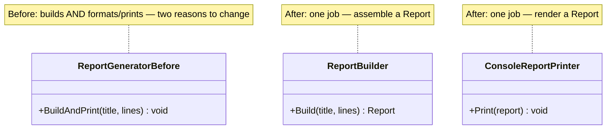
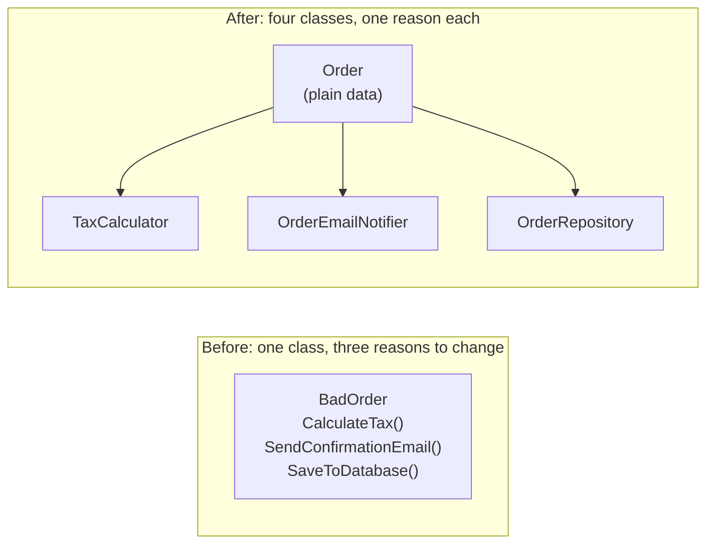

# Single Responsibility Principle

## Introduction

Before reading this lesson, you should already be comfortable with **[EF Core with Azure Cosmos DB](../11-efcore/11-15-ef-core-with-cosmos-db.md)** and, more broadly, with the class and interface fundamentals from Module 2 — you've been writing classes for eleven modules now. This lesson starts Module 12's first sub-area, the five **SOLID principles**: a set of five design guidelines, formalized by Robert C. Martin, for keeping object-oriented code maintainable as it grows. We begin with the "S" — the **Single Responsibility Principle (SRP)** — because it's the foundation the other four build on: a codebase where every class already does one thing well is far easier to keep open for extension, safe to substitute, cleanly segregated, and loosely coupled, which is exactly where the next four lessons are headed.

By the end of this lesson, you will be able to:

- State the Single Responsibility Principle and explain what "reason to change" means as a working definition
- Recognize a class that has silently accumulated multiple, unrelated responsibilities
- Refactor a bloated class into several focused, single-purpose classes that collaborate
- Explain the maintainability and testability payoff of doing so
- Identify the SRP violation as the specific structural problem the next four SOLID lessons continue addressing

## Single Responsibility Principle — A Layman's Perspective

Imagine a small restaurant with exactly one employee. This one person takes every order at the table, walks it back to the kitchen and cooks it, washes the dishes it was served on, handles every customer's payment, and also does the restaurant's bookkeeping at the end of the night. For a while, with one table and one customer at a time, this actually works — there's only one person, so there's no confusion about who does what. But the moment anything changes, the cracks show immediately. A new tax rule for the bookkeeping means retraining the same person who's also mid-shift taking orders. A busier dinner rush means the cooking is now late because the same person is also washing dishes. A customer complaint about being overcharged has to go through someone who is simultaneously the cashier, the cook, and the accountant, so it's genuinely unclear whose mistake it even was.

The deeper problem isn't that one person is doing a lot of work — plenty of small businesses run that way just fine on separate roles held loosely by different people who specialize. The problem is that all of those unrelated jobs have been welded into *one indivisible role* with *one* set of responsibilities, so that any change to any one job risks breaking, delaying, or confusing every other job that same person is also holding. Change the payment process, and you've disturbed the same person who takes orders. Change the recipe, and you've disturbed the same person who does the books. Nothing about "handling payments" and "cooking food" are related tasks — they just happen to currently live inside the same person, for no reason other than history.

The fix a real restaurant reaches for, the moment it grows past a hobby, is exactly what you'd expect: hire a server whose only job is taking orders and serving food, a cook whose only job is cooking, a cashier whose only job is handling payment, and a bookkeeper whose only job is the books. Each role now has exactly one reason to ever need retraining or replacing. A new tax law only touches the bookkeeper. A new menu item only touches the cook. A billing dispute only ever needs the cashier's attention. Nobody's unrelated job gets disturbed by a change to someone else's, because each role was carved along a genuine boundary of responsibility, not an arbitrary one.

A software class that has quietly accumulated unrelated jobs — say, one that represents an order, but also sends the confirmation email, calculates the tax, *and* saves itself to a database — is that overworked one-person restaurant. It "compiles" the same way that one exhausted person can, in fact, get through a slow Tuesday night. But the instant the tax rule changes, or the email template needs a redesign, or the database needs to switch providers, you're forced to open and re-test the exact same class that represents something as simple and central as "an order" — even though none of those three changes have anything conceptually to do with *what an order is*. The Single Responsibility Principle is the software version of hiring the server, the cook, the cashier, and the bookkeeper separately: give each class exactly one job, so it only ever has one reason to change.

## Single Responsibility Principle — A Programming Language Perspective

The Single Responsibility Principle states that a class should have **one, and only one, reason to change** — equivalently, a class should be responsible to a single actor or concern, and everything inside it should be tightly related to that one concern (high **cohesion**). "Reason to change" is the operative phrase: it doesn't mean a class must have exactly one method, it means every method and field in the class must exist to serve the *same* underlying purpose, so that a business change in one area of the system (billing rules, notification templates, persistence technology) maps to a change in exactly one class, not several unrelated ones bundled together. In C#, SRP is a design discipline rather than a compiler-enforced rule — nothing stops you from writing a class that mixes concerns, and it will compile and run correctly. The principle is applied by *decomposition*: pulling unrelated behavior out into separate classes that collaborate through fields, constructor parameters, or method calls, each new class owning one narrow concern and exposing a small, purposeful public surface. The result is usually more classes, each smaller and individually easier to name, read, test, and change in isolation.

## How to Apply the Single Responsibility Principle in C#

The mechanical process is the same every time: look at a class, list out everything it actually does, group those things by *why* each one would ever need to change, and if you find more than one distinct "why," split the class along those lines. The example below starts with a `ReportGenerator` that both builds a report's content and decides how to format it for display — two genuinely separate concerns wearing one name.


*Figure 1: Splitting a class that both builds and prints a report into a builder and a printer, each with a single reason to change.*

```csharp
// Program.cs — .NET 10 / C# 14
var report = new ReportBuilder().Build(
    title: "Weekly Summary",
    lines: ["Sales up 4%", "Two new hires", "No incidents"]);

new ConsoleReportPrinter().Print(report);

record Report(string Title, DateOnly GeneratedOn, IReadOnlyList<string> Lines);

class ReportBuilder
{
    public Report Build(string title, IReadOnlyList<string> lines) =>
        new(title, DateOnly.FromDateTime(DateTime.Now), lines);
}

class ConsoleReportPrinter
{
    public void Print(Report report)
    {
        Console.WriteLine($"=== {report.Title} ({report.GeneratedOn}) ===");
        foreach (var line in report.Lines)
        {
            Console.WriteLine($"- {line}");
        }
    }
}
```

**Console Output:**

```text
=== Weekly Summary (2026-08-16) ===
- Sales up 4%
- Two new hires
- No incidents
```

`ReportBuilder` has exactly one reason to change: the rules for what data belongs in a `Report`. `ConsoleReportPrinter` has exactly one reason to change: how a `Report` gets rendered to an output device. Neither class knows or cares how the other one works — `ReportBuilder` doesn't know it will be printed to a console, and `ConsoleReportPrinter` doesn't know or care how a `Report`'s contents were assembled. That independence is the entire point.

## Real-Time Example: Splitting a Bloated Order Class in E-Commerce Order Processing

We open this module's E-Commerce Order Processing thread with the SRP violation this lesson exists to fix: an `Order` class that, in a typical growing codebase, ends up doing far more than represent an order. Below, the **Before** version bundles the order's own data together with tax calculation, email notification, and database persistence — three unrelated concerns that have nothing to do with what an order *is*. The **After** version keeps `Order` as a plain data holder and extracts `TaxCalculator`, `OrderEmailNotifier`, and `OrderRepository` as separate, single-purpose collaborators.

```csharp
// Program.cs — .NET 10 / C# 14 — BEFORE: Order violates SRP
var badOrder = new BadOrder("ORD-3001", "dana@example.com", 250.00m);
badOrder.CalculateTax();
badOrder.SendConfirmationEmail();
badOrder.SaveToDatabase();

class BadOrder(string id, string customerEmail, decimal subtotal)
{
    public decimal Tax { get; private set; }

    // Reason to change #1: tax rules
    public void CalculateTax() => Tax = subtotal * 0.08m;

    // Reason to change #2: email provider / template
    public void SendConfirmationEmail() =>
        Console.WriteLine($"[Email] To {customerEmail}: Order {id} confirmed. Tax: {Tax:C}");

    // Reason to change #3: persistence technology
    public void SaveToDatabase() =>
        Console.WriteLine($"[DB] Saved order {id} (subtotal {subtotal:C}, tax {Tax:C})");
}
```

**Console Output (Before):**

```text
[Email] To dana@example.com: Order ORD-3001 confirmed. Tax: $0.00
[DB] Saved order ORD-3001 (subtotal $250.00, tax $0.00)
```

Notice the bug hiding in plain sight: `SendConfirmationEmail` reads `Tax` *before* `CalculateTax` has had a chance to run inside the right order — because all three concerns share one class with no enforced sequencing, it's easy to call them in the wrong order and get a silently wrong email. Splitting responsibilities, as shown next, removes that whole class of ordering mistake by making each collaborator responsible for producing its own correct result.

```csharp
// Program.cs — .NET 10 / C# 14 — AFTER: responsibilities separated
var order = new Order("ORD-3002", "dana@example.com", 250.00m);

var tax = new TaxCalculator().Calculate(order);
new OrderEmailNotifier().SendConfirmation(order, tax);
new OrderRepository().Save(order, tax);

record Order(string Id, string CustomerEmail, decimal Subtotal);

class TaxCalculator
{
    public decimal Calculate(Order order) => order.Subtotal * 0.08m;
}

class OrderEmailNotifier
{
    public void SendConfirmation(Order order, decimal tax) =>
        Console.WriteLine($"[Email] To {order.CustomerEmail}: Order {order.Id} confirmed. Tax: {tax:C}");
}

class OrderRepository
{
    public void Save(Order order, decimal tax) =>
        Console.WriteLine($"[DB] Saved order {order.Id} (subtotal {order.Subtotal:C}, tax {tax:C})");
}
```

**Console Output (After):**

```text
[Email] To dana@example.com: Order ORD-3002 confirmed. Tax: $20.00
[DB] Saved order ORD-3002 (subtotal $250.00, tax $20.00)
```

`Order` is now a plain, dependency-free record — it can be constructed, compared, and tested with no tax, email, or database logic anywhere near it. `TaxCalculator` changes only when tax rules change; `OrderEmailNotifier` changes only when the email template or provider changes; `OrderRepository` changes only when the persistence technology changes. A future switch from raw `Console.WriteLine` stand-ins to a real SMTP client or a real EF Core `DbContext` — the kind this curriculum built in Module 11 — touches exactly one class each, never `Order` itself.

## Bloated Class vs. Single-Responsibility Classes

The core contrast is between one class silently doing several unrelated jobs and several small classes each doing exactly one. The bloated version *looks* simpler at first glance — one file, one class name to remember — but that simplicity is an illusion that collapses the moment two of its unrelated jobs need to change independently, or the moment you try to unit test the tax logic without also standing up a fake email sender and a fake database. The separated version has more files and more names, but each one is small enough to fully understand, test, and change in isolation, and none of them accidentally depend on the internal details of another.


*Figure 2: One overloaded class collapsed into a plain data type plus three single-purpose collaborators.*

| Aspect | Bloated `Order` (Before) | Separated Classes (After) |
|---|---|---|
| Reasons to change | Three (tax rules, email, persistence) all in one class | One per class |
| Unit testing tax logic | Requires the whole class, including email/DB side effects | `TaxCalculator` tested alone, no side effects |
| Risk of ordering bugs | High — methods can be called in the wrong sequence | Low — each collaborator produces its own result independently |
| Adding a new concern (e.g. audit logging) | Edits the same crowded class again | Adds one new collaborator class; `Order` untouched |
| Readability of `Order` itself | Obscured by unrelated methods | Just the data an order actually is |

## Types of Responsibility Splits in C#

SRP shows up in a few recurring shapes once you start looking for it, some of which this curriculum covers as dedicated patterns later:

1. **Data vs. behavior split** — as in this lesson, separating a plain data holder (`Order`) from the services that act on it (`TaxCalculator`, `OrderEmailNotifier`).
2. **Persistence extraction** — moving database access into a dedicated repository class, the same shape `OrderRepository` demonstrates here and that Module 11's EF Core lessons built in depth.
3. **Notification/side-effect extraction** — isolating email, SMS, or logging into their own notifier classes so the "what happened" logic never depends on "how we tell someone."
4. **Validation extraction** — pulling input-validation rules into a dedicated validator class rather than scattering `if` checks through a business class (a natural pairing with Module 5's exception-handling and result-pattern lessons).
5. **[Open/Closed Principle](../12-advanced-concepts/12-02-open-closed-principle.md)** — the next SOLID principle, which asks a related but distinct question: once a class has one clear responsibility, how do you extend *that* responsibility without editing its existing code?

## What You've Learned & What's Next

A class should have exactly one reason to change. `BadOrder` had three, tangled together into one indivisible unit; splitting it into `Order`, `TaxCalculator`, `OrderEmailNotifier`, and `OrderRepository` gave each concern its own class, each independently testable and independently changeable — the direct payoff of following SRP.

Continue your learning journey with **[Open/Closed Principle](../12-advanced-concepts/12-02-open-closed-principle.md)**, where we take a class that already has a single, well-defined responsibility — calculating a discount — and learn how to extend what it can do without ever having to modify its existing, working code.

---
*Applies to: .NET 10 / C# 14. Last reviewed 2026-08-16.*
