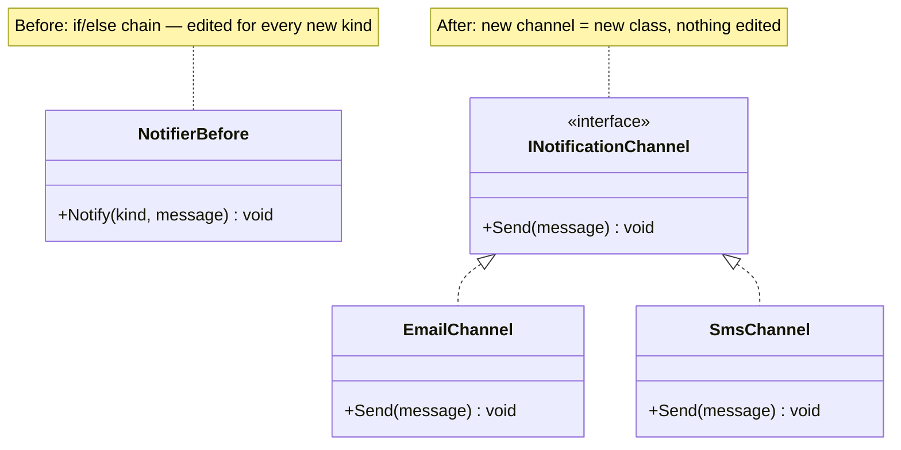
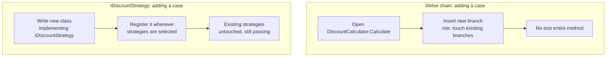

# Open/Closed Principle

## Introduction

Before reading this lesson, you should already be comfortable with **[Single Responsibility Principle](../12-advanced-concepts/12-01-single-responsibility-principle.md)** — the previous lesson gave `Order` a single, well-defined job. This lesson asks a different question about a class that already has one clear responsibility: how do you let it grow to handle new cases *without* going back and editing its existing, already-tested code every single time? That question is the **Open/Closed Principle (OCP)**, the second SOLID principle: a class should be open for extension but closed for modification.

By the end of this lesson, you will be able to:

- State the Open/Closed Principle and explain what "open for extension, closed for modification" means in practice
- Recognize an `if`/`else if` or `switch` chain that will need editing every time a new case is added
- Replace that chain with an interface and one implementation per case
- Add an entirely new case by writing a new class, without touching any existing class
- Explain why OCP reduces the risk of breaking working code when requirements grow

## Open/Closed Principle — A Layman's Perspective

Picture a power strip bolted into the wall of an old house. The strip itself has a fixed number of sockets wired directly into the house's electrical circuit, and every single appliance in the house — the lamp, the toaster, the space heater, the phone charger — was wired directly into that strip by an electrician, one at a time, because the strip was never designed to accept plugs. Every time the household buys a new appliance, the electrician has to come back, open the wall panel, and splice a new wire into the same strip that already powers everything else. Each new appliance means re-opening wiring that was already working, and each time there's a real risk of loosening a connection that used to power something else just fine.

Now picture the modern version of the same power strip: a plain outlet with standard sockets. The electrician wires the outlet into the wall exactly once, and from that point forward, adding the toaster, the lamp, the space heater, or a brand-new appliance nobody has invented yet means simply plugging it in. Nobody touches the wall wiring again. Nobody re-opens the panel. The outlet doesn't know or care what kind of appliance gets plugged into it — it only guarantees a standard shape of plug will work, and any appliance built to that standard shape just works, today or ten years from now.

The difference between these two households isn't how many appliances they own — it's *where the risk of breakage lives*. In the spliced-wire house, every new appliance is a small surgery performed on wiring that used to work, and a slip of the electrician's hand can just as easily kill power to the lamp as it can wire in the new heater. In the standard-outlet house, adding a new appliance touches nothing that used to work; the outlet's existing wiring is never reopened, so nothing that already worked can be put at risk by something new being added.

A class with a long `if this type of thing, do X; else if that type of thing, do Y` chain is the spliced-wire house. Every time the business adds a new case — a new discount type, a new shipping rule, a new payment method — someone has to reopen that same chain, insert a new branch in the right spot, and hope they didn't disturb any of the branches that already worked correctly for months in production. The Open/Closed Principle is the standard outlet: instead of one growing chain that gets edited forever, you define a stable "shape" — an interface — that any new case can plug into, and adding a new case becomes writing one new, isolated class, never reopening the classes that already work.

## Open/Closed Principle — A Programming Language Perspective

The Open/Closed Principle states that software entities — classes, modules, functions — should be **open for extension but closed for modification**: it should be possible to add new behavior without changing existing, already-verified source code. In C#, this is achieved primarily through **polymorphism**: defining an interface (or abstract base class) that captures a stable contract, and expressing each variant behavior as a separate class implementing that interface, rather than as a branch inside one growing conditional. Callers depend on the interface type, not on any concrete implementation, so a caller's code never needs to change when a new implementation is added — only a new class needs to be written and, typically, registered wherever implementations are selected (a dictionary keyed by type, or a dependency-injection container, both covered later in this module). The `if`/`else if`/`switch` chain is the anti-pattern OCP is defined in opposition to: every new case requires editing a method that already shipped and already passed its tests, which is exactly the modification OCP asks you to close off.

## How to Apply the Open/Closed Principle in C#

The pattern is always the same: find a conditional chain that selects behavior by type or category, define an interface describing that behavior abstractly, write one implementing class per branch, and let a caller select and invoke through the interface rather than through the conditional.


*Figure 1: Replacing a growing conditional with an interface and one implementation per case.*

```csharp
// Program.cs — .NET 10 / C# 14
List<INotificationChannel> channels = [new EmailChannel(), new SmsChannel()];

foreach (var channel in channels)
{
    channel.Send("Your appointment is confirmed.");
}

interface INotificationChannel
{
    void Send(string message);
}

class EmailChannel : INotificationChannel
{
    public void Send(string message) => Console.WriteLine($"[Email] {message}");
}

class SmsChannel : INotificationChannel
{
    public void Send(string message) => Console.WriteLine($"[SMS] {message}");
}
```

**Console Output:**

```text
[Email] Your appointment is confirmed.
[SMS] Your appointment is confirmed.
```

Adding a push-notification channel tomorrow means writing a new `PushChannel : INotificationChannel` class and adding it to the list — `EmailChannel`, `SmsChannel`, and the loop that sends to each channel are never reopened. That loop is closed for modification: it was written once, against the interface, and stays correct no matter how many new channels get added later.

## Real-Time Example: Discount Calculation in E-Commerce Order Processing

We continue this module's E-Commerce Order Processing thread, extending the `Order` type from the previous lesson with discount calculation. The **Before** version is a `DiscountCalculator` with an `if`/`else if` chain, one branch per discount type — the exact shape that must be edited every time a new discount type is introduced. The **After** version defines an `IDiscountStrategy` interface with one implementing class per discount type, so a new discount type is added by writing a new class, never by editing `DiscountCalculator` again.

```csharp
// Program.cs — .NET 10 / C# 14 — BEFORE: if/else chain violates OCP
Console.WriteLine(DiscountCalculator.Calculate("Loyalty", 200.00m).ToString("C"));
Console.WriteLine(DiscountCalculator.Calculate("Clearance", 200.00m).ToString("C"));

static class DiscountCalculator
{
    // Every new discount type means editing this method again.
    public static decimal Calculate(string discountType, decimal subtotal) =>
        discountType switch
        {
            "Loyalty" => subtotal * 0.10m,
            "Clearance" => subtotal * 0.30m,
            _ => 0m
        };
}
```

**Console Output (Before):**

```text
$20.00
$60.00
```

```csharp
// Program.cs — .NET 10 / C# 14 — AFTER: IDiscountStrategy, extended by adding classes
List<IDiscountStrategy> strategies = [new LoyaltyDiscount(), new ClearanceDiscount()];

foreach (var strategy in strategies)
{
    Console.WriteLine($"{strategy.GetType().Name}: {strategy.Apply(200.00m):C}");
}

interface IDiscountStrategy
{
    decimal Apply(decimal subtotal);
}

class LoyaltyDiscount : IDiscountStrategy
{
    public decimal Apply(decimal subtotal) => subtotal * 0.10m;
}

class ClearanceDiscount : IDiscountStrategy
{
    public decimal Apply(decimal subtotal) => subtotal * 0.30m;
}

// A brand-new discount type: no existing class above was touched to add this one.
class FirstOrderDiscount : IDiscountStrategy
{
    public decimal Apply(decimal subtotal) => subtotal * 0.15m;
}
```

**Console Output (After):**

```text
LoyaltyDiscount: $20.00
ClearanceDiscount: $60.00
```

Notice that `FirstOrderDiscount` is a complete, working discount type, and adding it required zero edits to `LoyaltyDiscount`, `ClearanceDiscount`, `IDiscountStrategy`, or the loop that applies a strategy — it simply wasn't included in the `strategies` list above, which is why it doesn't appear in the output yet. That's the payoff in a real storefront: a marketing team introducing a "first order" promotion never risks breaking the loyalty or clearance logic that's already live in production, because nothing about adding the new discount required reopening them.

## If/Else Chain vs. Strategy Interface

The `if`/`else if` chain and the strategy-interface approach can express identical behavior for the cases that exist today — the difference only shows up the moment a *new* case needs to be added. The chain forces you back into a method that already shipped, already passed code review, and already has test coverage, and asks you to insert a new branch into the middle of it without disturbing any of the branches around it. The interface approach asks you to write a brand-new, self-contained class instead — nothing that already worked can be broken by adding it, because nothing that already worked was opened.


*Figure 2: Adding a new case in a conditional chain versus adding a new case as an isolated class.*

| Aspect | `if`/`else if` Chain | `IDiscountStrategy` Interface |
|---|---|---|
| Adding a new case | Edit the existing method | Add a new class |
| Risk to existing cases | Present — shared method body | None — existing classes untouched |
| Unit testing one case | Must exercise the whole method | Test the one implementing class alone |
| Where new logic lives | A new branch inside a growing method | A new, self-contained file/class |
| Growth over time | Method keeps getting longer and riskier | Number of small classes grows; each stays simple |

## Types of Extension Points in C#

The interface-plus-implementations shape used here is the most common way to satisfy OCP, but C# offers a few related extension mechanisms, several covered as dedicated topics elsewhere in this curriculum:

1. **Interfaces with multiple implementations** — this lesson's approach: define a contract once, add behavior by adding classes.
2. **Abstract base classes with overridable methods** — a close cousin, useful when implementations share common state or default behavior (see Module 2's [Abstract Classes and Methods](../02-oop/02-14-abstract-classes-and-methods.md)).
3. **The Strategy design pattern** — the formal name for the `IDiscountStrategy` shape used in this lesson's Real-Time Example, covered later in this module's design-patterns lessons.
4. **Extension methods** — adding new operations to an existing type without modifying its source, covered in [Extension Methods in C#](../02-oop/02-23-extension-methods-in-csharp.md).
5. **[Liskov Substitution Principle](../12-advanced-concepts/12-03-liskov-substitution-principle.md)** — the next SOLID principle, which asks what happens *after* you've built a family of interchangeable implementations: can every one of them actually be substituted for another without breaking the caller?

## What You've Learned & What's Next

The Open/Closed Principle asks you to design so that new behavior is *added*, never *edited in*. Replacing `DiscountCalculator`'s `if`/`else if` chain with an `IDiscountStrategy` interface meant a brand-new discount type — `FirstOrderDiscount` — could be introduced as a self-contained class, with zero risk to the loyalty and clearance logic already running in production.

Continue your learning journey with **[Liskov Substitution Principle](../12-advanced-concepts/12-03-liskov-substitution-principle.md)**, where we examine whether every implementation of an interface or subclass of a base type can genuinely stand in for another — and what goes wrong when one of them secretly can't.

---
*Applies to: .NET 10 / C# 14. Last reviewed 2026-08-16.*
