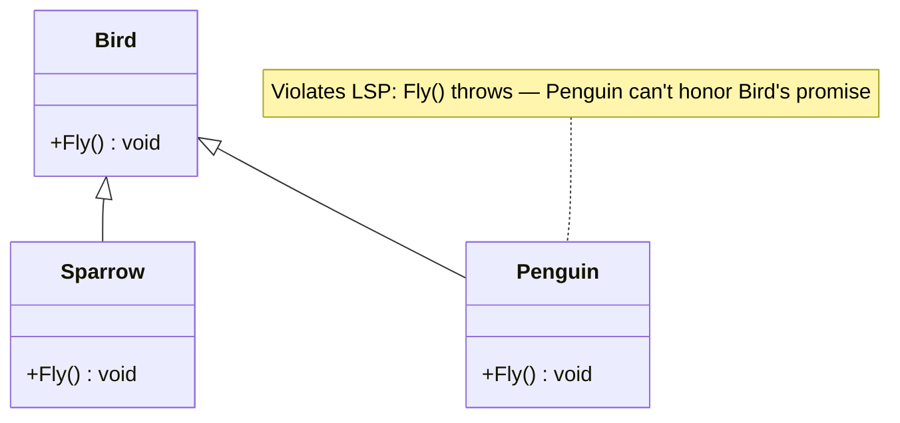
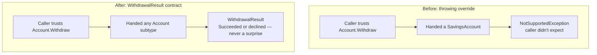

# Liskov Substitution Principle

## Introduction

Before reading this lesson, you should already be comfortable with **[Open/Closed Principle](../12-advanced-concepts/12-02-open-closed-principle.md)** — the previous lesson built a family of interchangeable `IDiscountStrategy` implementations. This lesson asks the question that family of implementations quietly depends on: can every one of them actually be substituted for another without the caller noticing anything went wrong? That question is the **Liskov Substitution Principle (LSP)**, the third SOLID principle, named for Barbara Liskov: a subtype must be usable anywhere its base type is expected, without breaking the caller's expectations.

By the end of this lesson, you will be able to:

- State the Liskov Substitution Principle and explain what "substitutable without breaking behavior" means
- Recognize a subclass that technically compiles but violates its base type's behavioral contract
- Identify why throwing an exception from an overridden method is often an LSP violation in disguise
- Remodel an inheritance hierarchy so every subtype honors the base type's contract
- Explain the connection between LSP violations and the earlier "spliced-wire" reasoning from Open/Closed

## Liskov Substitution Principle — A Layman's Perspective

Imagine a car rental company that advertises every vehicle on its lot as "a car you can drive off right now." A customer walks up, picks any vehicle from the lot at random — trusting the company's promise that any of them will do — and expects the same basic experience regardless of which one they picked: turn the key, put it in drive, and go. That promise is the entire point of the lot being organized as "cars," rather than making every customer separately research each individual vehicle's quirks before choosing one.

Now suppose one vehicle on that lot is, technically, a car — it has four wheels, a steering wheel, doors, and a manufacturer's badge that says "car" — but it's actually a display model with no engine installed. A customer who picks it, trusting the lot's blanket promise, turns the key and gets nothing. Worse, suppose the rental company "handles" this by having the display model's ignition throw a printed note into the customer's lap reading "this vehicle cannot actually be driven, please select a different one." Technically, every vehicle on the lot still fits on the lot. But the promise the lot exists to make — "grab any car here, and driving it works the same way" — has quietly stopped being true for one of them, and the customer only discovers that after they've already committed to picking it, at the exact moment they expected to just drive away.

This is precisely the trap of a subclass that looks correct on paper but breaks its parent's promise at run time. If a `SavingsAccount` is declared to be an `Account`, then every place in the codebase that already trusts "any `Account` supports `Withdraw`" is making the same promise the car lot made: grab any account, call `Withdraw`, and it behaves like withdrawing. If `SavingsAccount` overrides `Withdraw` to throw an exception under conditions the base `Account` never warned callers about, it has become the display model on the lot — it fits the type system's rules, but it silently breaks the one promise that made treating it as "just another `Account`" safe in the first place.

The fix isn't to forbid savings accounts from having withdrawal rules — real savings accounts absolutely do have limits. The fix is to make sure the *promise* the base type makes is honest enough that every subtype can actually keep it. If `Account.Withdraw` is documented and designed to say "this may fail if the requested amount isn't currently available, and callers should check the result," then a savings account with a monthly limit isn't violating anything — it's just one more legitimate way that promise can resolve. The problem was never that savings accounts have limits; it's a base type that promised more certainty than every one of its subtypes could actually deliver.

## Liskov Substitution Principle — A Programming Language Perspective

The Liskov Substitution Principle states that if `S` is a subtype of `T`, objects of type `T` should be replaceable with objects of type `S` without altering the correctness of the program — a subtype must honor its base type's behavioral contract, not merely its method signatures. In C#, the compiler only enforces the *signature* half of this (a subclass overriding a method must match its return type and parameters, subject to variance rules); it does nothing to enforce the *behavioral* half, which is why a class can compile cleanly while still violating LSP. Common violation patterns include a subclass throwing `NotSupportedException` or `NotImplementedException` from a method the base type promises will succeed, strengthening a method's preconditions (rejecting inputs the base type accepted), or weakening its postconditions (returning results the base type's contract ruled out). Detecting an LSP violation therefore requires reasoning about the base type's *contract* — what callers are entitled to assume — not just whether the code compiles.

## How to Apply the Liskov Substitution Principle in C#

The diagnostic question is always the same: for every method a base type exposes, can you write a caller that trusts the base type's promise, and would that caller still work correctly if handed *any* subtype? If the answer is no for even one subtype, the hierarchy needs remodeling — usually by narrowing the base type's contract, or by splitting the hierarchy so the failing behavior isn't inherited at all.


*Figure 1: A classic LSP violation — not every `Bird` can honor the `Fly()` contract the base type promises.*

```csharp
// Program.cs — .NET 10 / C# 14
List<IMover> movers = [new Sparrow(), new Glider()];

foreach (var mover in movers)
{
    Console.WriteLine(mover.Move());
}

// The contract only promises movement — not flight specifically —
// so every implementation can honor it truthfully.
interface IMover
{
    string Move();
}

class Sparrow : IMover
{
    public string Move() => "Sparrow flies through the air.";
}

class Glider : IMover
{
    public string Move() => "Glider soars using air currents, no flapping.";
}
```

**Console Output:**

```text
Sparrow flies through the air.
Glider soars using air currents, no flapping.
```

Both `Sparrow` and `Glider` honestly satisfy `IMover.Move()` — neither one throws, neither one secretly refuses to do what the interface promises. The fix wasn't to give `Glider` a fake `Fly()` method that quietly did something else; it was to define the contract (`Move`) narrowly enough that every real implementation can genuinely keep the promise it makes.

## Real-Time Example: Account Withdrawal in Banking/ATM

We introduce this module's Banking/ATM case-study thread with the LSP violation this lesson exists to fix. The **Before** version has a base `Account` whose `Withdraw` method promises to complete a withdrawal, and a `SavingsAccount : Account` that overrides `Withdraw` to throw `NotSupportedException` once a monthly limit is hit — breaking that promise for any caller that trusts `Account` uniformly. The **After** version redesigns the contract so `Withdraw` returns a result describing what happened, which every account type — checking or savings — can honor truthfully, limit or no limit.

```csharp
// Program.cs — .NET 10 / C# 14 — BEFORE: SavingsAccount violates LSP
List<BadAccount> accounts = [new BadCheckingAccount(500m), new BadSavingsAccount(500m)];

foreach (var account in accounts)
{
    try
    {
        account.Withdraw(100m);
        Console.WriteLine($"{account.GetType().Name}: withdrew $100, balance now {account.Balance:C}");
    }
    catch (NotSupportedException ex)
    {
        Console.WriteLine($"{account.GetType().Name}: withdrawal blew up — {ex.Message}");
    }
}

abstract class BadAccount(decimal balance)
{
    public decimal Balance { get; protected set; } = balance;
    public abstract void Withdraw(decimal amount);
}

class BadCheckingAccount(decimal balance) : BadAccount(balance)
{
    public override void Withdraw(decimal amount) => Balance -= amount;
}

class BadSavingsAccount(decimal balance) : BadAccount(balance)
{
    private int _withdrawalsThisMonth;

    // Breaks the base contract: callers trusting Account.Withdraw get an exception instead.
    public override void Withdraw(decimal amount)
    {
        if (_withdrawalsThisMonth >= 0)
            throw new NotSupportedException("Savings accounts limit withdrawals; use RequestWithdrawal instead.");

        Balance -= amount;
        _withdrawalsThisMonth++;
    }
}
```

**Console Output (Before):**

```text
BadCheckingAccount: withdrew $100, balance now $400.00
BadSavingsAccount: withdrawal blew up — Savings accounts limit withdrawals; use RequestWithdrawal instead.
```

```csharp
// Program.cs — .NET 10 / C# 14 — AFTER: contract every account can honor truthfully
List<Account> accounts = [new CheckingAccount(500m), new SavingsAccount(500m, monthlyLimit: 1)];

foreach (var account in accounts)
{
    var first = account.Withdraw(100m);
    Console.WriteLine($"{account.GetType().Name} #1: {Describe(first)}, balance {account.Balance:C}");

    var second = account.Withdraw(100m);
    Console.WriteLine($"{account.GetType().Name} #2: {Describe(second)}, balance {account.Balance:C}");
}

static string Describe(WithdrawalResult result) =>
    result.Succeeded ? "succeeded" : $"declined ({result.Reason})";

readonly record struct WithdrawalResult(bool Succeeded, string? Reason);

abstract class Account(decimal balance)
{
    public decimal Balance { get; protected set; } = balance;

    // The contract now promises a result, never a thrown exception for a routine business rule.
    public abstract WithdrawalResult Withdraw(decimal amount);
}

class CheckingAccount(decimal balance) : Account(balance)
{
    public override WithdrawalResult Withdraw(decimal amount)
    {
        Balance -= amount;
        return new WithdrawalResult(true, null);
    }
}

class SavingsAccount(decimal balance, int monthlyLimit) : Account(balance)
{
    private int _withdrawalsThisMonth;

    public override WithdrawalResult Withdraw(decimal amount)
    {
        if (_withdrawalsThisMonth >= monthlyLimit)
            return new WithdrawalResult(false, "monthly withdrawal limit reached");

        Balance -= amount;
        _withdrawalsThisMonth++;
        return new WithdrawalResult(true, null);
    }
}
```

**Console Output (After):**

```text
CheckingAccount #1: succeeded, balance $400.00
CheckingAccount #2: succeeded, balance $300.00
SavingsAccount #1: succeeded, balance $400.00
SavingsAccount #2: declined (monthly withdrawal limit reached), balance $400.00
```

Every account in the `accounts` list is handled by the exact same loop, with no type-checking and no `try`/`catch` aimed at one specific subtype — because `Account.Withdraw` now promises a `WithdrawalResult`, not guaranteed success, every subtype can honor that promise truthfully. A real ATM's withdrawal screen can call `Withdraw` on whatever `Account` it's handed, check `Succeeded`, and show the right message, without needing to know or care whether it's holding a `CheckingAccount` or a `SavingsAccount`.

## Throwing Override vs. Honest Contract

The two versions above look almost identical at the call site — both are "an account, asked to withdraw money" — but only one of them is safe to use polymorphically. The throwing version works fine as long as every caller happens to know, and remembers, that `SavingsAccount` specifically needs special handling; the moment a caller trusts the base `Account` type the way polymorphism is supposed to let them, that caller crashes on exactly the input a checking account would have accepted without complaint. The result-returning version makes the *real* business rule — a withdrawal can be declined — part of the contract every subtype shares, so no caller is ever surprised by behavior the base type didn't advertise.


*Figure 2: A contract that can silently fail for one subtype, versus one every subtype can honor identically.*

| Aspect | Throwing Override (Before) | `WithdrawalResult` Contract (After) |
|---|---|---|
| Base contract promise | Implied: withdrawal always completes | Explicit: withdrawal may succeed or be declined |
| `SavingsAccount` behavior | Breaks the promise via exception | Fully honors the promise |
| Caller code | Needs type-specific `try`/`catch` | One uniform code path for every `Account` |
| Substitutability | Fails — swapping in `SavingsAccount` breaks callers | Holds — any `Account` subtype is safe to substitute |
| Where the real bug lives | The base type's dishonest contract | N/A — contract matches every subtype's reality |

## Types of LSP Violations in C#

A handful of recurring shapes account for most real-world LSP violations, several of which connect directly to other lessons in this curriculum:

1. **Throwing from an override** — as in this lesson's Before example, a subclass throwing `NotSupportedException`/`NotImplementedException` from a method the base type promises will succeed.
2. **Strengthened preconditions** — a subclass rejecting inputs (via validation or exceptions) that the base type's contract accepted without complaint.
3. **Weakened postconditions** — a subclass returning results (nulls, out-of-range values) the base type's contract ruled out.
4. **Violated invariants** — a subclass allowing an object to reach a state the base type guarantees never happens, breaking assumptions callers rely on.
5. **[Interface Segregation Principle](../12-advanced-concepts/12-04-interface-segregation-principle.md)** — the next SOLID principle, which prevents a related problem: bloated interfaces that force implementers into exactly this kind of throwing-override trap for methods they can't honestly support.

## What You've Learned & What's Next

A subtype must be safe to substitute for its base type everywhere the base type is expected — not just type-check, but genuinely behave the way callers are entitled to assume. `SavingsAccount`'s throwing `Withdraw` override broke that promise the moment a caller trusted `Account` uniformly; redefining the contract around a `WithdrawalResult` let every account type, limits and all, honor the same promise honestly.

Continue your learning journey with **[Interface Segregation Principle](../12-advanced-concepts/12-04-interface-segregation-principle.md)**, where we look at what happens when the *interface itself* is too broad — forcing implementers to support methods they were never going to honestly deliver in the first place.

---
*Applies to: .NET 10 / C# 14. Last reviewed 2026-08-16.*
