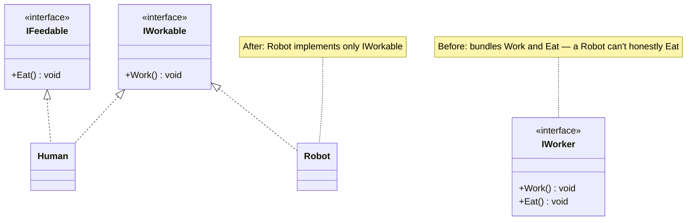
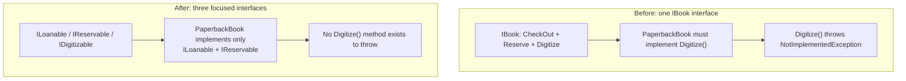

# Interface Segregation Principle

## Introduction

Before reading this lesson, you should already be comfortable with **[Liskov Substitution Principle](../12-advanced-concepts/12-03-liskov-substitution-principle.md)** — the previous lesson showed how a throwing override breaks a base type's promise. This lesson tackles a common *cause* of that exact trap: an interface that bundles together more methods than any single implementer actually needs. That's the **Interface Segregation Principle (ISP)**, the fourth SOLID principle: clients shouldn't be forced to depend on methods they don't use.

By the end of this lesson, you will be able to:

- State the Interface Segregation Principle and explain what "forced to depend on methods you don't use" means
- Recognize a bloated interface that mixes unrelated capabilities into one contract
- Identify `NotImplementedException` inside an interface implementation as a strong ISP warning sign
- Split a bloated interface into several small, focused interfaces
- Explain how ISP and the previous lesson's LSP violation are two views of the same underlying design flaw

## Interface Segregation Principle — A Layman's Perspective

Imagine a job application form that every single applicant to a company must fill out in full, regardless of the role — not just a name and contact section, but also a "forklift certifications" section, a "public speaking engagements" section, and a "advanced statistical modeling" section, all mandatory, none skippable. An applicant for the receptionist role has to sit there and either fabricate an answer for the forklift section or write "not applicable" three separate times, for three sections that have nothing to do with the job they're actually applying for. The form wasn't designed around any one role — it was designed by stapling together every question the company has ever wanted to ask *any* applicant, for *any* role, ever.

Now imagine the sane version of that hiring process: a short, universal form asking for name and contact details, and then separate, role-specific supplements — a warehouse supplement with the forklift questions, a communications supplement with the speaking questions, a data-science supplement with the modeling questions — each handed only to the applicants actually applying for that kind of role. The receptionist applicant fills out the universal form and is done; nobody hands them a forklift-certification question they have to awkwardly decline. Each supplement stays focused on exactly the one kind of role it exists for, so nobody is ever forced to answer for a capability their job doesn't require.

The bloated form is what a bloated interface does to the classes that implement it. If an interface bundles together every method any *possible* implementer might ever want — checking out an item, reserving it, and digitizing it, say — then *every* implementer, including the ones for which two of those three methods make no sense at all, is forced to provide some kind of answer for all three. Some of them can genuinely do all three. Others are stuck writing the code equivalent of "not applicable" — a method body that does nothing useful, or worse, throws an exception the moment anyone actually calls it, because the interface demanded an implementation that particular class was never going to honestly have.

The fix is exactly the hiring department's fix: split the one bloated form into focused, role-specific supplements. A class that genuinely supports checkout implements a small "loanable" contract. A class that genuinely supports reservations implements a small "reservable" contract. A class that genuinely supports digitization implements a small "digitizable" contract. A class can implement one, two, or all three of these small contracts, entirely depending on what it can actually do — and nothing forces a class to answer for a capability it was never going to have.

## Interface Segregation Principle — A Programming Language Perspective

The Interface Segregation Principle states that clients should not be forced to depend on interface members they do not use — large, "fat" interfaces should be split into smaller, role-specific interfaces so that implementing classes only need to satisfy the members genuinely relevant to them. In C#, this is directly supported by the language's ability to implement **multiple interfaces** on a single class: rather than one interface with every method a family of classes might collectively need, you define several narrow interfaces, each describing one cohesive capability, and each concrete class implements exactly the subset that applies to it. A telltale sign of an ISP violation is a method body that throws `NotImplementedException` or `NotSupportedException`, or one that silently does nothing — both indicate the interface demanded a capability that particular implementer doesn't genuinely have, forcing a dishonest implementation purely to satisfy the compiler. Segregating the interface removes the need for that dishonest implementation entirely, because the class simply never claims to implement the interface it can't honestly support.

## How to Apply the Interface Segregation Principle in C#

The process starts by listing every method on a suspect interface and asking, for each concrete implementer, "does this method genuinely make sense here, or would implementing it require throwing or faking a result?" Any method that fails that test for at least one implementer is a candidate to move into its own smaller interface.


*Figure 1: Splitting a bundled interface so each implementer only claims the capabilities it genuinely has.*

```csharp
// Program.cs — .NET 10 / C# 14
List<IWorkable> workers = [new Human(), new Robot()];

foreach (var worker in workers)
{
    worker.Work();
}

if (workers.OfType<IFeedable>().FirstOrDefault() is { } feedable)
{
    feedable.Eat();
}

interface IWorkable
{
    void Work();
}

interface IFeedable
{
    void Eat();
}

class Human : IWorkable, IFeedable
{
    public void Work() => Console.WriteLine("Human writes code.");
    public void Eat() => Console.WriteLine("Human eats lunch.");
}

class Robot : IWorkable
{
    public void Work() => Console.WriteLine("Robot assembles parts.");
}
```

**Console Output:**

```text
Human writes code.
Robot assembles parts.
Human eats lunch.
```

`Robot` never has to provide a fake, throwing, or empty `Eat()` method, because it was never forced to implement `IFeedable` in the first place — it only implements `IWorkable`, the one capability it genuinely has. `workers.OfType<IFeedable>()` finds only the implementers that genuinely support eating, with no risk of accidentally calling a method a `Robot` could never honestly support.

## Real-Time Example: Book Capabilities in Library/Inventory Management

We introduce this module's Library/Inventory Management case-study thread with the ISP violation this lesson exists to fix. The **Before** version has a single, bloated `IBook` interface with `CheckOut()`, `Reserve()`, and `Digitize()` — forcing `PaperbackBook`, a physical-only book, to implement `Digitize()` with a `NotImplementedException`, because a paperback genuinely cannot be digitized on demand. The **After** version segregates the interface into `ILoanable`, `IReservable`, and `IDigitizable`, letting each book type implement only the capabilities it genuinely has.

```csharp
// Program.cs — .NET 10 / C# 14 — BEFORE: bloated IBook violates ISP
IBook paperback = new PaperbackBook("Clean Code");
IBook ebook = new EBook("Clean Architecture");

paperback.CheckOut();
paperback.Reserve();

try
{
    paperback.Digitize();
}
catch (NotImplementedException ex)
{
    Console.WriteLine($"PaperbackBook.Digitize failed: {ex.Message}");
}

ebook.Digitize();

interface IBook
{
    void CheckOut();
    void Reserve();
    void Digitize();
}

class PaperbackBook(string title) : IBook
{
    public void CheckOut() => Console.WriteLine($"{title}: checked out from the shelf.");
    public void Reserve() => Console.WriteLine($"{title}: reserved for pickup.");

    // A paperback has no digital form — forced to implement a method it cannot honor.
    public void Digitize() => throw new NotImplementedException("Paperback books cannot be digitized.");
}

class EBook(string title) : IBook
{
    public void CheckOut() => Console.WriteLine($"{title}: checked out (license issued).");
    public void Reserve() => Console.WriteLine($"{title}: reserved for pickup.");
    public void Digitize() => Console.WriteLine($"{title}: already in digital format.");
}
```

**Console Output (Before):**

```text
Clean Code: checked out from the shelf.
Clean Code: reserved for pickup.
PaperbackBook.Digitize failed: Paperback books cannot be digitized.
Clean Architecture: already in digital format.
```

```csharp
// Program.cs — .NET 10 / C# 14 — AFTER: segregated interfaces
ILoanable paperback = new PaperbackBook("Clean Code");
paperback.CheckOut();

if (paperback is IReservable reservablePaperback)
{
    reservablePaperback.Reserve();
}

List<object> catalog = [new PaperbackBook("Clean Code"), new EBook("Clean Architecture")];

foreach (var item in catalog.OfType<IDigitizable>())
{
    item.Digitize();
}

interface ILoanable
{
    void CheckOut();
}

interface IReservable
{
    void Reserve();
}

interface IDigitizable
{
    void Digitize();
}

class PaperbackBook(string title) : ILoanable, IReservable
{
    public void CheckOut() => Console.WriteLine($"{title}: checked out from the shelf.");
    public void Reserve() => Console.WriteLine($"{title}: reserved for pickup.");
}

class EBook(string title) : ILoanable, IReservable, IDigitizable
{
    public void CheckOut() => Console.WriteLine($"{title}: checked out (license issued).");
    public void Reserve() => Console.WriteLine($"{title}: reserved for pickup.");
    public void Digitize() => Console.WriteLine($"{title}: already in digital format.");
}
```

**Console Output (After):**

```text
Clean Code: checked out from the shelf.
Clean Code: reserved for pickup.
Clean Architecture: already in digital format.
```

`PaperbackBook` no longer implements `IDigitizable` at all, so there is no `Digitize()` method on it to throw in the first place — the `catalog.OfType<IDigitizable>()` filter simply skips it, exactly as `Robot` was skipped by `OfType<IFeedable>()` earlier. A real library system's "convert to e-book" batch job can run safely over the entire catalog using this same filter, never risking a runtime exception from an item that was never capable of digitization to begin with.

## Bloated Interface vs. Segregated Interfaces

A single `IBook` interface looks appealingly simple — one contract, one thing to implement — right up until a real physical-only book has to implement a method it can never honestly support. The segregated version has more interface names to track, but every one of them is genuinely optional per class, so no implementer is ever forced into writing a throwing stub just to satisfy a compiler that doesn't know or care whether the method behind that stub actually works.


*Figure 2: One bloated interface forcing a dishonest stub, versus segregated interfaces implemented only where genuinely supported.*

| Aspect | Bloated `IBook` (Before) | Segregated Interfaces (After) |
|---|---|---|
| `PaperbackBook.Digitize()` | Must exist; throws at run time | Does not exist — not implemented at all |
| Compile-time safety | None — call sites can call `Digitize()` on anything `IBook` | Strong — only `IDigitizable` implementers expose `Digitize()` |
| Adding a new book type | Must implement all three methods, real or fake | Implements only the interfaces it genuinely supports |
| Risk of runtime exceptions | High — from forced, unsupported methods | Low — unsupported capabilities simply aren't present |
| Discoverability of capabilities | Hidden inside one large interface | Explicit — the interfaces a class implements name what it can do |

## Types of Interface Segregation in C#

Interface segregation shows up in a few recurring shapes once you start looking for it, several of which connect to other lessons in this curriculum:

1. **Capability-based splitting** — as in this lesson, splitting by *what a client can do* (`ILoanable`, `IReservable`, `IDigitizable`) rather than by what type of object it is.
2. **Role interfaces** — small, narrowly scoped interfaces describing one role a class plays for one particular caller, a common .NET convention (`IDisposable`, `IComparable<T>`).
3. **Explicit interface implementation** — a related C# feature for resolving naming conflicts when a class implements multiple segregated interfaces with overlapping member names, covered in [Interfaces in C#](../02-oop/02-15-interfaces-in-csharp.md).
4. **Default interface methods** — a way to add a new member to an existing interface without breaking every implementer, covered in [Default Interface Methods](../02-oop/02-16-default-interface-methods-static-abstract.md), useful when segregating an interface further after the fact.
5. **[Dependency Inversion Principle](../12-advanced-concepts/12-05-dependency-inversion-principle.md)** — the final SOLID principle and this sub-area's capstone, which asks how high-level code should depend on interfaces like these at all, rather than on concrete classes directly.

## What You've Learned & What's Next

Clients shouldn't be forced to depend on methods they don't use. A single bloated `IBook` interface forced `PaperbackBook` into a `Digitize()` method it could never honestly support; splitting it into `ILoanable`, `IReservable`, and `IDigitizable` let each book type implement only the capabilities it genuinely has, eliminating the throwing stub entirely.

Continue your learning journey with **[Dependency Inversion Principle](../12-advanced-concepts/12-05-dependency-inversion-principle.md)**, the capstone of this SOLID sub-area, where we look at how high-level business logic should depend on abstractions like the interfaces built across these last two lessons, rather than on concrete, low-level classes directly — and recap all five SOLID principles together.

---
*Applies to: .NET 10 / C# 14. Last reviewed 2026-08-16.*
