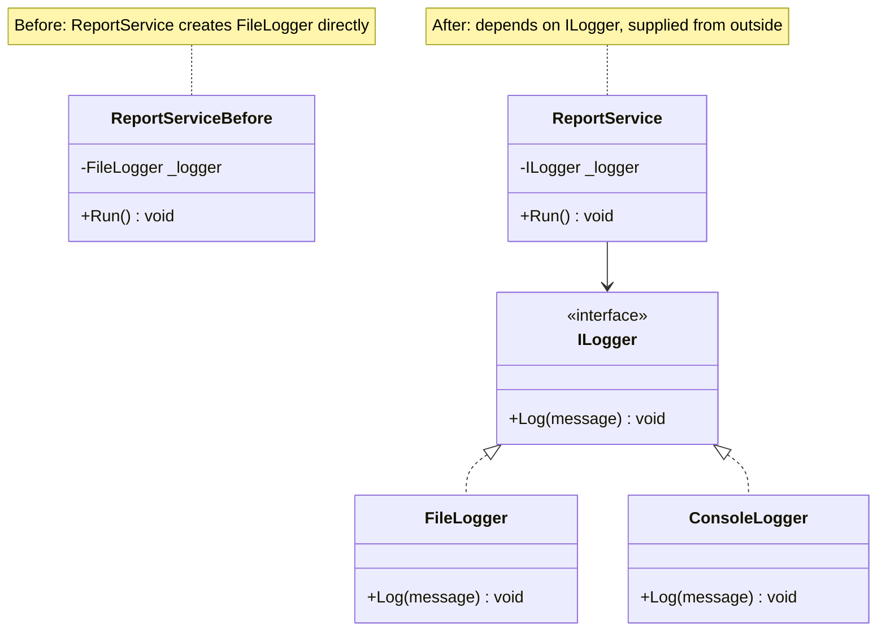
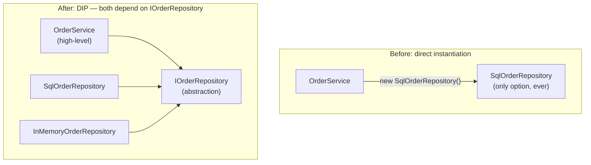

# Dependency Inversion Principle

## Introduction

Before reading this lesson, you should already be comfortable with **[Interface Segregation Principle](../12-advanced-concepts/12-04-interface-segregation-principle.md)** and, ideally, with **[Dependency Injection and Service Lifetimes](../10-aspnetcore/10-08-di-and-service-lifetimes.md)** from Module 10, since this lesson is where those two threads finally meet. This is the capstone of Module 12's SOLID sub-area: the **Dependency Inversion Principle (DIP)**, the fifth and final principle, asks how a high-level class should obtain the low-level collaborators it needs — and the answer is the one piece every earlier SOLID lesson has been quietly assuming was already true.

By the end of this lesson, you will be able to:

- State the Dependency Inversion Principle and distinguish it from ordinary dependency injection
- Recognize a high-level class that directly instantiates a concrete low-level dependency with `new`
- Refactor that class to depend on an abstraction, injected via its constructor
- Explain why "both should depend on abstractions" applies to the high-level *and* the low-level module
- Recap all five SOLID principles and how each one enables the next

## Dependency Inversion Principle — A Layman's Perspective

Imagine a construction company whose head architect insists on personally pouring every foundation, laying every brick, and wiring every socket on every single project, because the architect only trusts *that one specific crew* they hand-picked years ago, refuses to work through any general contractor, and has never even written down what "pour a foundation" or "wire a socket" actually requires as a job. The moment that specific crew is unavailable — retired, booked on another job, priced out of the market — the architect has no way to bring in any other crew, because there was never a standard job description that any *other* qualified crew could be handed and trusted to fulfill. The architect's blueprints are, in effect, welded directly to one specific set of hands.

A well-run construction company works the other way around. The architect's blueprint specifies *roles*, not people: "a licensed electrician wires the sockets," "a certified foundation crew pours the slab." Any electrician holding the right license can be handed that blueprint and get the sockets wired correctly; any certified crew can pour the slab. The architect never needs to know or care which specific company shows up on-site — only that whoever shows up satisfies the licensing and certification standard the blueprint calls for. If one electrical contractor goes out of business, the general contractor simply books a different licensed electrician; the blueprint itself never has to change, because it was never written around one specific company in the first place.

That's the whole idea behind depending on abstractions instead of concrete implementations. A high-level class that directly creates `new SqlOrderRepository()` inside its own code has done what the stubborn architect did: it has welded itself to one specific, concrete implementation, and the only way to ever use a different one — a different database, a fake one for testing, a caching layer in front of the real one — is to reopen and edit the high-level class itself. A high-level class that instead asks, in its constructor, for "something that satisfies the `IOrderRepository` license" is the well-run company's blueprint: it can be handed a SQL-backed repository, a Cosmos-backed repository from Module 11's capstone, or a fake in-memory one for a test, and it works identically every time, because it was never welded to any one of them.

The word "inversion" describes exactly what changes here. Normally you'd expect the high-level, important logic — placing an order — to depend on the low-level plumbing details — how an order gets saved. Dependency Inversion flips that: the low-level plumbing is written to satisfy an abstraction that the *high-level* logic defines, so it's the plumbing that ends up depending on the high-level module's terms, not the other way around. Both the architect's blueprint and the electrician's license point at the same standard; neither one points directly at the other.

## Dependency Inversion Principle — A Programming Language Perspective

The Dependency Inversion Principle states two related rules: high-level modules should not depend on low-level modules — both should depend on abstractions — and abstractions should not depend on details; details should depend on abstractions. In C#, "abstraction" means an interface (or abstract class), and satisfying DIP means a high-level class declares a dependency on that interface type, typically received through **constructor injection**, rather than constructing a concrete class itself with `new`. This is distinct from, but closely related to, the ASP.NET Core dependency-injection container covered in Module 10: DIP is the *design principle* that says "depend on an abstraction, injected from outside," while the DI container is one *mechanism* — resolving `IOrderRepository` to a concrete `SqlOrderRepository` at startup and supplying it automatically — for satisfying that principle at scale across an entire application. A class can follow DIP with nothing more than a constructor parameter and manual object construction; the DI container simply automates that wiring once an application has many such dependencies.

## How to Apply the Dependency Inversion Principle in C#

The refactor is mechanical: find a `new ConcreteLowLevelClass()` call inside a high-level class, extract an interface describing what the high-level class actually needs from it, change the high-level class's constructor to accept that interface, and supply a concrete implementation from outside — a `Main` method, a test, or a DI container.


*Figure 1: A high-level class rewired to depend on an interface instead of constructing a concrete dependency itself.*

```csharp
// Program.cs — .NET 10 / C# 14
ILogger logger = new ConsoleLogger();
var service = new ReportService(logger);
service.Run();

interface ILogger
{
    void Log(string message);
}

class ConsoleLogger : ILogger
{
    public void Log(string message) => Console.WriteLine($"[Console] {message}");
}

// A high-level class depending on an abstraction, injected via constructor.
class ReportService(ILogger logger)
{
    public void Run()
    {
        logger.Log("Report generation started.");
        logger.Log("Report generation complete.");
    }
}
```

**Console Output:**

```text
[Console] Report generation started.
[Console] Report generation complete.
```

`ReportService` never writes `new ConsoleLogger()` anywhere in its own code — it only knows about `ILogger`. Swapping in a `FileLogger` or a test double that records messages in memory requires zero changes to `ReportService` itself; only the object passed into its constructor changes.

## Real-Time Example: Order Persistence in E-Commerce Order Processing

We close out this module's SOLID sub-area, and this curriculum's E-Commerce Order Processing thread for now, with the DIP violation this lesson exists to fix: an `OrderService` that directly instantiates `new SqlOrderRepository()` inside its own constructor, welding high-level order-placement logic to one specific, concrete persistence technology. The **After** version depends on an `IOrderRepository` abstraction instead, injected via the constructor — the same shape Module 10's ASP.NET Core DI container automates in a real application, and a direct callback to the `OrderRepository` this module's very first lesson extracted for Single Responsibility.

```csharp
// Program.cs — .NET 10 / C# 14 — BEFORE: OrderService depends directly on SqlOrderRepository
var badService = new BadOrderService();
badService.PlaceOrder("ORD-4001", 149.99m);

class SqlOrderRepository
{
    public void Save(string orderId, decimal total) =>
        Console.WriteLine($"[SQL] INSERT INTO Orders (Id, Total) VALUES ('{orderId}', {total:C})");
}

// High-level policy welded directly to one low-level, concrete implementation.
class BadOrderService
{
    private readonly SqlOrderRepository _repository = new();

    public void PlaceOrder(string orderId, decimal total)
    {
        Console.WriteLine($"Placing order {orderId} for {total:C}");
        _repository.Save(orderId, total);
    }
}
```

**Console Output (Before):**

```text
Placing order ORD-4001 for $149.99
[SQL] INSERT INTO Orders (Id, Total) VALUES ('ORD-4001', $149.99)
```

```csharp
// Program.cs — .NET 10 / C# 14 — AFTER: OrderService depends on IOrderRepository
IOrderRepository repository = new SqlOrderRepository();
var service = new OrderService(repository);
service.PlaceOrder("ORD-4002", 149.99m);

// Testing needs no real database — just another IOrderRepository implementation.
IOrderRepository testRepository = new InMemoryOrderRepository();
var testService = new OrderService(testRepository);
testService.PlaceOrder("ORD-4003", 89.50m);

interface IOrderRepository
{
    void Save(string orderId, decimal total);
}

class SqlOrderRepository : IOrderRepository
{
    public void Save(string orderId, decimal total) =>
        Console.WriteLine($"[SQL] INSERT INTO Orders (Id, Total) VALUES ('{orderId}', {total:C})");
}

class InMemoryOrderRepository : IOrderRepository
{
    public void Save(string orderId, decimal total) =>
        Console.WriteLine($"[In-Memory] Stored order {orderId} ({total:C}) for a test assertion");
}

// High-level policy depends only on the abstraction — never on a concrete repository type.
class OrderService(IOrderRepository repository)
{
    public void PlaceOrder(string orderId, decimal total)
    {
        Console.WriteLine($"Placing order {orderId} for {total:C}");
        repository.Save(orderId, total);
    }
}
```

**Console Output (After):**

```text
Placing order ORD-4002 for $149.99
[SQL] INSERT INTO Orders (Id, Total) VALUES ('ORD-4002', $149.99)
Placing order ORD-4003 for $89.50
[In-Memory] Stored order ORD-4003 ($89.50) for a test assertion
```

`OrderService` runs identically in both calls — same constructor, same `PlaceOrder` method — yet one call persists through a real SQL-shaped repository and the other through an in-memory stand-in fit for a unit test, and `OrderService` itself contains no code that changed between them. In a real ASP.NET Core application, Module 10's DI container performs exactly this substitution automatically: `builder.Services.AddScoped<IOrderRepository, SqlOrderRepository>()` at startup means every controller or minimal API endpoint that asks for `IOrderRepository` receives a `SqlOrderRepository` without `OrderService` ever being told which concrete type it's holding.

## Direct Instantiation vs. Constructor-Injected Abstraction

Directly instantiating a concrete dependency looks like less code — one `new` expression, no interface to define — but it permanently welds the high-level class to that one specific implementation, the same trap the stubborn architect fell into. Depending on an injected abstraction costs one interface and one constructor parameter, and in exchange, the high-level class becomes usable with any implementation that satisfies the abstraction: a different database technology, a decorator that adds caching or logging around the real repository, or a test double — none of which require touching `OrderService` itself.


*Figure 2: A high-level class welded to one concrete class, versus both high-level and low-level code depending on a shared abstraction.*

| Aspect | Direct Instantiation (Before) | Constructor-Injected Abstraction (After) |
|---|---|---|
| What `OrderService` depends on | `SqlOrderRepository` (concrete) | `IOrderRepository` (abstraction) |
| Swapping persistence technology | Edit `OrderService`'s source | Pass a different implementation in |
| Unit testing `OrderService` | Requires a real or mocked SQL dependency | Pass an `InMemoryOrderRepository`, no database needed |
| Who decides the concrete type | `OrderService` itself | The caller, or a DI container, from outside |
| Fits Module 10's DI container | No — nothing to register or resolve | Yes — `AddScoped<IOrderRepository, SqlOrderRepository>()` |

## Types of Dependency Inversion in C#

DIP shows up in a few recurring forms once you start looking for it, several of which tie directly back into earlier modules of this curriculum:

1. **Constructor injection** — as in this lesson, the dependency arrives as a constructor parameter, the most common and explicit form.
2. **DI container registration** — Module 10's `AddScoped`/`AddSingleton`/`AddTransient`, which automates supplying the concrete implementation for an abstraction across an entire application.
3. **Factory abstractions** — an interface that creates other objects, useful when the concrete type to construct can't be decided until run time.
4. **Repository pattern** — the specific abstraction shape used in this lesson's `IOrderRepository`, formalized as a dedicated design pattern later in this module.
5. **Test doubles** — `InMemoryOrderRepository` in this lesson's example is a simple hand-written one; Module 13's testing coverage builds on this same DIP foundation with mocking frameworks.

## What You've Learned & What's Next: The Five SOLID Principles Together

High-level modules shouldn't depend on low-level modules — both should depend on abstractions. `OrderService` depending on `IOrderRepository`, rather than constructing `SqlOrderRepository` directly, is what let the exact same high-level class work against a real SQL-shaped repository and an in-memory test double without a single line of `OrderService` changing.

That closes out all five SOLID principles, each building directly on the one before it:

- **Single Responsibility** gave every class exactly one reason to change, splitting a bloated `Order` into focused collaborators.
- **Open/Closed** let new behavior — a new discount type — be added as a new class, without editing code that already worked.
- **Liskov Substitution** made sure every subtype of a base type, like every `Account`, could honestly keep the promises the base type made.
- **Interface Segregation** kept those promises small and focused, so no implementer was ever forced to fake a capability it didn't have.
- **Dependency Inversion** tied it together by having high-level policy depend on those same small abstractions, not on any one concrete implementation underneath them.

Continue your learning journey with **[Singleton Pattern](../12-advanced-concepts/12-06-singleton-pattern.md)**, where Module 12 moves from SOLID's design principles to concrete design patterns — starting with the pattern most often reached for, and most often misused, in real C# codebases.

---
*Applies to: .NET 10 / C# 14. Last reviewed 2026-08-16.*
