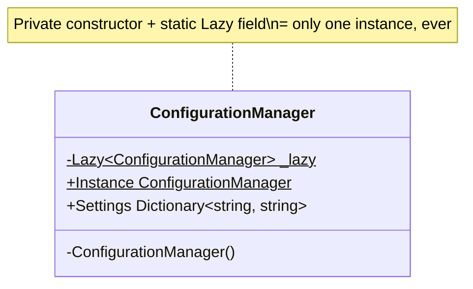
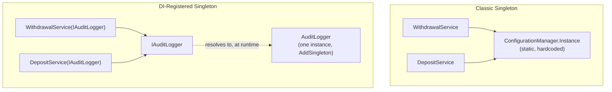

# Singleton Pattern

## Introduction

Before reading this lesson, you should already be comfortable with **[Dependency Inversion Principle](../12-advanced-concepts/12-05-dependency-inversion-principle.md)** and, more broadly, with the five SOLID principles this module just finished covering. This lesson opens Module 12's second sub-area: the classic **Gang-of-Four (GoF) design pattern catalog**, starting with its **creational patterns** — patterns concerned with *how objects get created* rather than how they behave once they exist. The Singleton Pattern is the simplest of the five creational patterns and, fittingly, the most controversial: it guarantees a class has exactly one instance for the lifetime of an application, with a single global point of access to it. You'll implement it the textbook way, then immediately confront why the very principle you just learned — depend on abstractions, not concretions — makes classic Singleton a pattern most modern C# codebases actively avoid in favor of DI's `AddSingleton`.

By the end of this lesson, you will be able to:

- State the Singleton Pattern's GoF category (creational) and the problem it solves
- Implement a thread-safe Singleton using `Lazy<T>`
- Explain why classic Singleton conflicts with the Dependency Inversion Principle you just learned
- Register a class with a **Singleton lifetime** in a DI container as a more testable alternative
- Recognize when a true Singleton is appropriate versus when it's an anti-pattern
- Distinguish object identity (`ReferenceEquals`) from value equality when verifying "only one instance"

## Singleton Pattern — A Layman's Perspective

Imagine a small town that decides, for good reason, to have exactly one post office. Every letter anyone in town sends or receives passes through that one building — not because the town lacks the land or money for two, but because having exactly one is the whole point: two competing post offices would mean two separate address registries, two separate delivery schedules, and endless confusion about which office actually has your parcel right now. One post office, reachable the same way by everyone in town, keeps the town's mail coherent. That's the appeal of a Singleton: some things in a system genuinely need to be singular — one shared cache, one shared configuration, one shared connection to a piece of hardware — and having exactly one, reachable from anywhere, avoids the chaos of accidentally maintaining two disagreeing copies of something that should never have been duplicated.

Here's where the town's arrangement starts to show its cost. Suppose the local school wants to run a mail-sorting class for students — a safe, harmless simulation of how the post office works. The school can't just build a small pretend post office for the exercise; the *real* town charter says there is exactly one post office, full stop, and every process in town that "sends mail" is wired, by law, to reach that one specific building and no other. The class either has to use the real post office (dragging actual town mail into a classroom exercise) or the school has to petition to change the town charter itself just to run a simulation. Nothing about "let's practice sorting mail safely" should have required rewriting the rule that created the one true post office in the first place — but because every process was hardwired to reach *that specific building* rather than "whichever post office we're told to use today," there was no room left to substitute a pretend one.

This is exactly the tension a classic Singleton creates in software. The pattern solves a real problem — some things genuinely should be singular — but the *way* it classically solves it, a static, globally-reachable instance baked directly into the type itself, means every piece of code that uses it is hardwired to that one specific, concrete building, the same way the whole town's mail processes were hardwired to one specific post office by name. Testing becomes exactly as awkward as the school's mail-sorting class: you can't easily substitute a fake, harmless stand-in for the real thing, because nothing in the design ever imagined "whichever instance we're handed" — only "that one specific instance, reached by its own global name." The fix, as you'll see in this lesson's second half, is the same fix any sensible town would eventually reach: keep the "exactly one" guarantee, but stop hardwiring *which* one by name — let each department be *handed* the post office to use, rather than reaching for one fixed building on their own. That's precisely what a DI container's Singleton lifetime gives you, and it's why this lesson pairs the classic pattern with its modern replacement rather than presenting Singleton as an unqualified good.

## Singleton Pattern — A Programming Language Perspective

The **Singleton Pattern** is a GoF **creational** pattern that restricts a class to exactly one instance and provides a single, global point of access to it. The classic C# implementation hides the constructor (`private` access modifier), stores the one instance in a `static` field, and exposes it through a `static` property or method — so no other code can call `new` on the type directly, and every caller reaches the same object. Because static field initialization can race across threads, thread-safe Singletons typically wrap the instance in **`System.Lazy<T>`**, whose default thread-safety mode (`LazyThreadSafetyMode.ExecutionAndPublication`) guarantees the factory delegate runs exactly once even under concurrent first access, without you writing manual locking. This is distinct from a **Singleton *lifetime*** in a dependency injection container (`IServiceCollection.AddSingleton<TService, TImplementation>()`), which achieves the same "exactly one instance for the application's lifetime" guarantee, but resolves that instance through constructor injection against an interface — meaning consumers depend on an abstraction they receive, not a concrete static type they reach for by name.

## How to Implement a Thread-Safe Singleton in C#

The mechanics are: a `private` constructor (blocking external `new`), a `private static readonly Lazy<T>` field holding the one instance, and a `public static` property exposing `Lazy<T>.Value`. `Lazy<T>` defers construction until the first access and guarantees only one thread ever wins the race to construct it.


*Figure 1: A Singleton's private constructor blocks external construction; the static `Lazy<T>` field is the only path to an instance.*

```csharp
// Program.cs — .NET 10 / C# 14
var config1 = ConfigurationManager.Instance;
var config2 = ConfigurationManager.Instance;

config1.Settings["Region"] = "us-east";

Console.WriteLine($"Same instance? {ReferenceEquals(config1, config2)}");
Console.WriteLine($"Region seen via config2: {config2.Settings["Region"]}");

class ConfigurationManager
{
    private static readonly Lazy<ConfigurationManager> _lazy = new(() => new ConfigurationManager());

    public static ConfigurationManager Instance => _lazy.Value;

    public Dictionary<string, string> Settings { get; } = new();

    private ConfigurationManager()
    {
        Console.WriteLine("ConfigurationManager created.");
    }
}
```

**Console Output:**

```text
ConfigurationManager created.
Same instance? True
Region seen via config2: us-east
```

`"ConfigurationManager created."` prints only once, at the first access to `Instance` — the second access to `_lazy.Value` returns the already-built object without re-running the constructor. `ReferenceEquals(config1, config2)` returns `true` because both variables point at the exact same object in memory, which is why a value written through `config1` is immediately visible through `config2`: there was never a second object to disagree with the first.

## Real-Time Example: An Audit Logger in Banking/ATM Operations

We apply Singleton to a genuinely singular concern in a Banking/ATM system: an **audit log** that every transaction-processing service must write to, where two disagreeing logs would be a real operational problem — an auditor reconciling withdrawals against deposits needs one authoritative sequence of events, not two independent logs that might miss each other's entries. Rather than reaching for the classic static-`Instance` shape, we register `AuditLogger` with a **Singleton lifetime** in the DI container, behind an `IAuditLogger` interface — the modern equivalent this lesson's Layman's Perspective built toward: exactly one shared instance, but handed to consumers rather than reached for by name.

```csharp
// Program.cs — .NET 10 / C# 14 — Real-Time Example (Banking/ATM)
using Microsoft.Extensions.DependencyInjection;

var services = new ServiceCollection();
services.AddSingleton<IAuditLogger, AuditLogger>();
services.AddTransient<WithdrawalService>();
services.AddTransient<DepositService>();

using var provider = services.BuildServiceProvider();

var withdrawal = provider.GetRequiredService<WithdrawalService>();
var deposit = provider.GetRequiredService<DepositService>();

withdrawal.Withdraw("ACC-1001", 200m);
deposit.Deposit("ACC-1002", 500m);

var logger = provider.GetRequiredService<IAuditLogger>();
Console.WriteLine($"Total audit entries recorded: {logger.EntryCount}");

interface IAuditLogger
{
    int EntryCount { get; }
    void Log(string message);
}

class AuditLogger : IAuditLogger
{
    public int EntryCount { get; private set; }

    public void Log(string message)
    {
        EntryCount++;
        Console.WriteLine($"[Audit #{EntryCount}] {message}");
    }
}

class WithdrawalService(IAuditLogger auditLogger)
{
    public void Withdraw(string accountId, decimal amount) =>
        auditLogger.Log($"Withdrawal of {amount:C} from {accountId}");
}

class DepositService(IAuditLogger auditLogger)
{
    public void Deposit(string accountId, decimal amount) =>
        auditLogger.Log($"Deposit of {amount:C} to {accountId}");
}
```

**Console Output:**

```text
[Audit #1] Withdrawal of $200.00 from ACC-1001
[Audit #2] Deposit of $500.00 to ACC-1002
Total audit entries recorded: 2
```

`WithdrawalService` and `DepositService` never construct an `AuditLogger` themselves and never reach for a static `Instance` — the container hands each one the *same* `IAuditLogger` instance because it was registered with `AddSingleton`, which is exactly why the entry count keeps incrementing across both services rather than resetting. In a real ATM system, swapping `AuditLogger` for a `FakeAuditLogger` in a unit test is a one-line change to the DI registration; a classic static-`Instance` version would have no equivalent seam.

## Classic Singleton vs. DI-Registered Singleton

The classic Singleton and a DI container's Singleton lifetime both guarantee "exactly one instance," but they differ in *how* consumers reach that instance, and that difference is precisely what determines whether the resulting code stays testable. The classic pattern hardcodes the *path* to the instance — a static property baked into the type itself — so every consumer is permanently coupled to that one concrete class. The DI-registered version hardcodes only the *count* — exactly one instance for the container's lifetime — while leaving *which* instance satisfies that contract entirely up to the container's registration, which is what makes substituting a fake for testing a configuration change rather than a design change.


*Figure 2: Classic Singleton hardcodes the concrete type consumers reach for; DI-registered Singleton hardcodes only the count, leaving the concrete type swappable behind an interface.*

| Aspect | Classic Singleton (`static Instance`) | DI-Registered Singleton (`AddSingleton`) |
|---|---|---|
| How consumers reach it | Static property, called by name from anywhere | Constructor injection, against an interface |
| Testability | Hard — no seam to substitute a fake | Easy — swap the DI registration |
| Coupling | Tight — consumers depend on one concrete type | Loose — consumers depend on an abstraction |
| Thread-safe construction | Must hand-roll, typically with `Lazy<T>` | Container guarantees single construction |
| Lifetime scope | Global for the process's entire lifetime, always | Scoped to the container instance (flexible per host) |

## Types of Singleton-Related Approaches in C#

Several variations and neighboring ideas round out this pattern, some carried over from earlier .NET eras and some superseding it entirely:

1. **`Lazy<T>`-backed Singleton** — this lesson's thread-safe, lazily-initialized implementation; the modern standard for hand-rolled Singletons.
2. **Eager static-field Singleton** — instance created immediately at type load (`private static readonly ConfigurationManager _instance = new();`), simpler but pays construction cost even if never used.
3. **Double-checked locking Singleton** — the pre-`Lazy<T>` pattern using a `lock` and a null check inside another null check; largely obsolete now that `Lazy<T>` handles this correctly.
4. **DI container Singleton lifetime (`AddSingleton`)** — the modern, testable replacement demonstrated in this lesson's Real-Time Example, and the default recommendation for new C# code.
5. **Ambient/static-gateway anti-pattern** — static classes used purely to smuggle global mutable state through an application; shares Singleton's testability problems without even the "exactly one instance" discipline.
6. **[Factory Method Pattern](../12-advanced-concepts/12-07-factory-method-pattern.md)** — the next creational pattern, which shifts the question from "how many instances exist" to "who decides which concrete type gets created."

## What You've Learned & What's Next

Singleton guarantees exactly one instance with a single point of access — genuinely useful when something in your system really must be singular, like a shared audit log. But the classic implementation's static, globally-reachable instance hardwires every consumer to one concrete type, which is exactly what the Dependency Inversion Principle warns against; registering the same class with a Singleton *lifetime* in a DI container keeps the "exactly one" guarantee while restoring the testable seam a classic Singleton removes.

Continue your learning journey with **[Factory Method Pattern](../12-advanced-concepts/12-07-factory-method-pattern.md)**, where the focus shifts from "how many instances" to "which concrete type gets created," letting subclasses decide.

---
*Applies to: .NET 10 / C# 14. Last reviewed 2026-08-16.*
