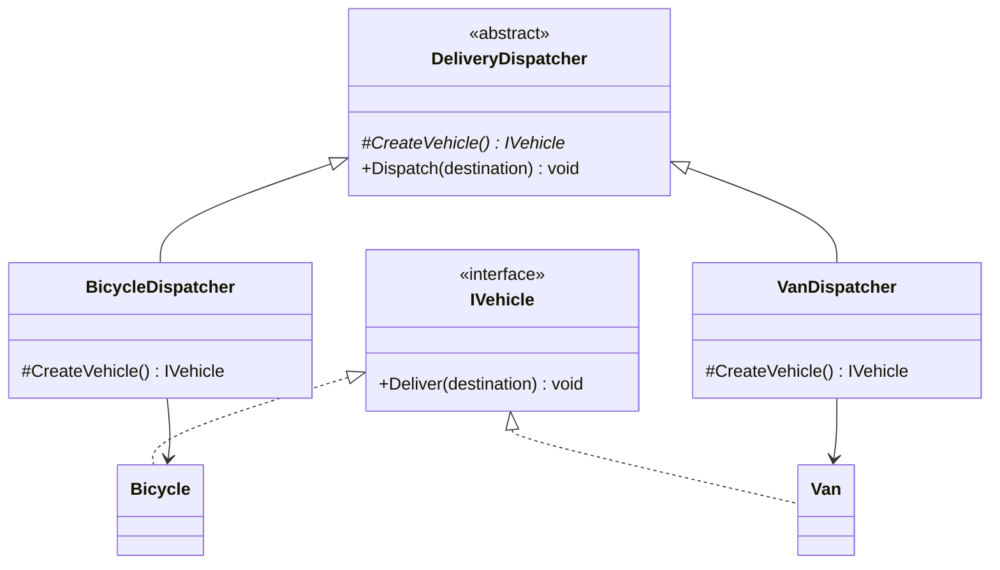
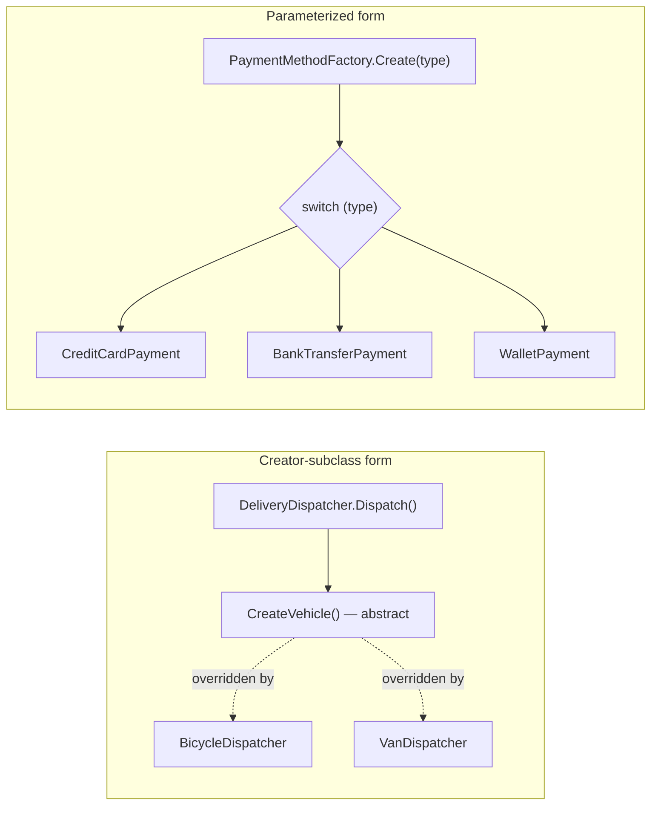

# Factory Method Pattern

## Introduction

Before reading this lesson, you should already be comfortable with **[Singleton Pattern](../12-advanced-concepts/12-06-singleton-pattern.md)**, the first pattern in this module's Gang-of-Four creational catalog. Singleton answered "how many instances should exist" (exactly one); the Factory Method Pattern answers a different question entirely: "which concrete type gets created, and who decides?" Instead of scattering `new SomeConcreteType()` calls throughout your codebase — each one a hardcoded commitment to a specific class — Factory Method concentrates that decision behind a single creation method, so the rest of your code depends only on an abstraction and never has to know, or care, exactly which concrete type it received.

By the end of this lesson, you will be able to:

- State the Factory Method Pattern's GoF category (creational) and the problem it solves
- Implement the classic Creator-subclass form, where each subclass overrides an abstract creation method
- Implement the pragmatic parameterized form commonly seen in production C# code
- Explain how Factory Method supports the Open/Closed Principle from earlier in this module
- Apply Factory Method to select a payment implementation at runtime in an e-commerce scenario
- Recognize the tradeoff between the subclass form's extensibility and the parameterized form's simplicity

## Factory Method Pattern — A Layman's Perspective

Picture a regional logistics dispatch center that takes delivery bookings over the phone. A customer calls and says only one thing: "I need a delivery to Downtown Cafe." The customer never specifies *how* the delivery should happen — no mention of a bicycle, a van, or anything else — because that decision genuinely isn't the customer's to make. It belongs to the dispatcher, who looks at the destination, the size of the package, and the day's traffic, and decides on the spot which vehicle actually handles this particular job. The booking procedure itself — "take the destination, hand it off, get a confirmation back" — never changes no matter which vehicle ends up doing the work.

Now suppose this logistics company expands into overnight regional deliveries and starts using cargo vans for the first time. Nothing about the phone booking procedure needs to change — the same "book a delivery" call still works exactly as it always did. All that changes is that the dispatcher now has one more option available when deciding which vehicle to assign. Customers who've been calling this company for years don't notice a thing; they still just say where the package needs to go, and the right vehicle shows up. That's the heart of what a factory method buys you: the *procedure* for requesting something stays fixed and stable, while the *decision* about exactly what fulfills that request can be extended, replaced, or specialized without disturbing the procedure at all.

Contrast this with a company that never separated those two concerns — where every single customer, when they call, has to already know and explicitly ask for "a bicycle courier" or "a delivery van" by name, and the person taking the call has a long, hardcoded list of `if the customer said bicycle, dispatch a bicycle; if they said van, dispatch a van` sitting right there in the booking script. Adding cargo planes to the fleet now means rewriting the booking script itself, and every customer who calls has to learn a new vocabulary term just to place an order. The problem was never that different vehicles need different handling — of course they do — the problem is that the *decision* about which vehicle to use got welded directly into the *procedure* for requesting a delivery, so the two can never change independently.

A factory method is the software equivalent of a competent dispatcher: the code that wants something built calls one stable, unchanging method — "create me the thing I need" — and hands off the actual decision of *which concrete thing* gets built to a place designed specifically to make that decision, whether that's a subclass tailored to one kind of job, or a single decision point that reads a request and knows exactly which concrete type answers it.

## Factory Method Pattern — A Programming Language Perspective

The **Factory Method Pattern** is a GoF **creational** pattern that defines a method for creating an object but defers the decision of exactly which concrete type to instantiate to a subclass (or a parameterized decision point), rather than hardcoding a `new ConcreteType()` call at every place an object is needed. In its classic form, an abstract (or virtual) **Creator** class declares an abstract **factory method** — conventionally returning an interface or abstract base type — and each **ConcreteCreator** subclass overrides that method to return a specific concrete **Product**. Client code that calls the Creator's other, non-abstract methods never references a concrete Product type directly; it only ever sees the abstraction the factory method returns. A widely used, more pragmatic variant in production C# skips the subclass hierarchy entirely: a single `static` method takes a parameter (often an `enum`) and returns the appropriate concrete type via a `switch` expression — trading some of the classic form's extensibility for far less ceremony. Both forms exist to keep object-creation *decisions* separated from object-creation *usage*.

## How to Implement the Factory Method Pattern in C#

The classic form has three moving parts: an abstract `Creator` declaring the factory method, one or more concrete `Creator` subclasses each overriding it to return a specific `Product`, and a `Product` interface the rest of the code depends on instead of any concrete type.


*Figure 1: `DeliveryDispatcher.Dispatch()` never changes; each subclass's `CreateVehicle()` override is the only thing that decides the concrete `IVehicle`.*

```csharp
// Program.cs — .NET 10 / C# 14
DeliveryDispatcher dispatcher = new BicycleDispatcher();
dispatcher.Dispatch("Downtown Cafe");

dispatcher = new VanDispatcher();
dispatcher.Dispatch("Warehouse District");

abstract class DeliveryDispatcher
{
    // The factory method: subclasses decide which concrete IVehicle gets created
    protected abstract IVehicle CreateVehicle();

    public void Dispatch(string destination)
    {
        IVehicle vehicle = CreateVehicle();
        vehicle.Deliver(destination);
    }
}

interface IVehicle
{
    void Deliver(string destination);
}

class Bicycle : IVehicle
{
    public void Deliver(string destination) =>
        Console.WriteLine($"Bicycle courier delivering to {destination}.");
}

class Van : IVehicle
{
    public void Deliver(string destination) =>
        Console.WriteLine($"Van delivering to {destination}.");
}

class BicycleDispatcher : DeliveryDispatcher
{
    protected override IVehicle CreateVehicle() => new Bicycle();
}

class VanDispatcher : DeliveryDispatcher
{
    protected override IVehicle CreateVehicle() => new Van();
}
```

**Console Output:**

```text
Bicycle courier delivering to Downtown Cafe.
Van delivering to Warehouse District.
```

`Dispatch()` is defined exactly once, on the abstract `DeliveryDispatcher`, and never changes regardless of which subclass is used. Each subclass's only job is to answer one question — "which `IVehicle` do I create?" — and `Dispatch()` never needs to know or check which answer it got, since it only ever calls members of the `IVehicle` interface.

## Real-Time Example: A Payment Method Factory in E-Commerce Order Processing

We apply Factory Method to checkout in an E-Commerce Order Processing system, using the pragmatic parameterized form real production code reaches for far more often than a full Creator-subclass hierarchy: a single static `PaymentMethodFactory.Create()` method that reads a `PaymentType` and returns the matching `IPaymentMethod` implementation. The checkout flow that calls it depends only on `IPaymentMethod`, never on `CreditCardPayment`, `BankTransferPayment`, or `WalletPayment` directly — the exact same separation of "decide the type" from "use the type" as the classic form, with less ceremony for a case where subclassing an entire dispatcher hierarchy would be overkill.

```csharp
// Program.cs — .NET 10 / C# 14 — Real-Time Example (E-Commerce Order Processing)
IPaymentMethod payment1 = PaymentMethodFactory.Create(PaymentType.CreditCard);
payment1.Process(149.99m, "ORD-5001");

IPaymentMethod payment2 = PaymentMethodFactory.Create(PaymentType.BankTransfer);
payment2.Process(899.00m, "ORD-5002");

IPaymentMethod payment3 = PaymentMethodFactory.Create(PaymentType.Wallet);
payment3.Process(24.50m, "ORD-5003");

enum PaymentType { CreditCard, BankTransfer, Wallet }

interface IPaymentMethod
{
    void Process(decimal amount, string orderId);
}

class CreditCardPayment : IPaymentMethod
{
    public void Process(decimal amount, string orderId) =>
        Console.WriteLine($"[Credit Card] Charged {amount:C} for order {orderId}.");
}

class BankTransferPayment : IPaymentMethod
{
    public void Process(decimal amount, string orderId) =>
        Console.WriteLine($"[Bank Transfer] Initiated transfer of {amount:C} for order {orderId}.");
}

class WalletPayment : IPaymentMethod
{
    public void Process(decimal amount, string orderId) =>
        Console.WriteLine($"[Wallet] Deducted {amount:C} for order {orderId}.");
}

static class PaymentMethodFactory
{
    public static IPaymentMethod Create(PaymentType type) => type switch
    {
        PaymentType.CreditCard => new CreditCardPayment(),
        PaymentType.BankTransfer => new BankTransferPayment(),
        PaymentType.Wallet => new WalletPayment(),
        _ => throw new ArgumentOutOfRangeException(nameof(type), type, "Unsupported payment type.")
    };
}
```

**Console Output:**

```text
[Credit Card] Charged $149.99 for order ORD-5001.
[Bank Transfer] Initiated transfer of $899.00 for order ORD-5002.
[Wallet] Deducted $24.50 for order ORD-5003.
```

Nothing in the checkout flow above ever mentions `CreditCardPayment` or `WalletPayment` by name outside the factory itself — it asks `PaymentMethodFactory` for "the payment method for this `PaymentType`" and gets back an `IPaymentMethod` it can call `Process` on without caring what's underneath. Adding a fourth option, say `PaymentType.CryptoWallet`, means writing one new class and one new `switch` arm, not touching every place in the codebase that processes a payment.

## Creator-Subclass Factory Method vs. Parameterized Factory Method

Both forms shown in this lesson separate "decide the concrete type" from "use the abstraction," but they make different tradeoffs about *how* that decision extends over time. The Creator-subclass form (`DeliveryDispatcher`) is fully open for extension without modification — adding a new vehicle type means writing one new subclass, and every existing class stays untouched, a textbook demonstration of the Open/Closed Principle. The parameterized form (`PaymentMethodFactory`) is simpler to read and avoids a subclass per variant, but adding a new `PaymentType` does mean editing the existing `switch` expression — a small, honest violation of strict Open/Closed compliance that most teams accept in exchange for far less boilerplate, unless the number of variants is large or genuinely open-ended, in which case a registration dictionary (`Dictionary<PaymentType, Func<IPaymentMethod>>`) restores full extensibility at the cost of a little indirection.


*Figure 2: The subclass form extends via new classes; the parameterized form extends via a new `switch` arm — both keep the calling code decoupled from concrete types.*

| Aspect | Creator-subclass form | Parameterized form |
|---|---|---|
| Extending with a new type | Add one new subclass; nothing else changes | Add one new class + one new `switch` arm |
| Open/Closed compliance | Fully open for extension, closed for modification | Mostly closed, but the `switch` itself needs editing |
| Boilerplate | One class per variant, plus the abstract Creator | One shared factory method, no extra classes |
| Best fit | Few variants, each needing distinct surrounding behavior | Many simple variants sharing one creation shape |

## Types of Factory Method Variants in C#

Factory Method shows up in a few recurring shapes, and the next lesson extends the idea further still:

1. **Creator-subclass Factory Method** — the classic GoF form shown in this lesson's How-To section, fully Open/Closed-compliant.
2. **Parameterized static factory method** — the pragmatic, `switch`-based form shown in this lesson's Real-Time Example, common in real C# codebases.
3. **Registry-based factory method** — a `Dictionary<TKey, Func<TProduct>>` mapping keys to creation delegates, restoring Open/Closed compliance for the parameterized form.
4. **Static factory methods on the product type itself** — idioms like `TimeSpan.FromSeconds(5)`, where the type provides its own named creation methods instead of a separate factory class.
5. **[Abstract Factory Pattern](../12-advanced-concepts/12-08-abstract-factory-pattern.md)** — the next pattern, which groups several related factory methods together to produce whole families of matched objects.

## What You've Learned & What's Next

Factory Method separates the decision of *which concrete type to create* from the code that *uses* the result, whether that decision lives in an overridden method on a Creator subclass or in a single parameterized factory method reading a request type. Either way, calling code depends only on an abstraction — `IVehicle`, `IPaymentMethod` — and stays untouched when new concrete types are introduced.

Continue your learning journey with **[Abstract Factory Pattern](../12-advanced-concepts/12-08-abstract-factory-pattern.md)**, where a single factory method's decision expands into a *family* of related factory methods, ensuring several matched objects get created together consistently.

---
*Applies to: .NET 10 / C# 14. Last reviewed 2026-08-16.*
