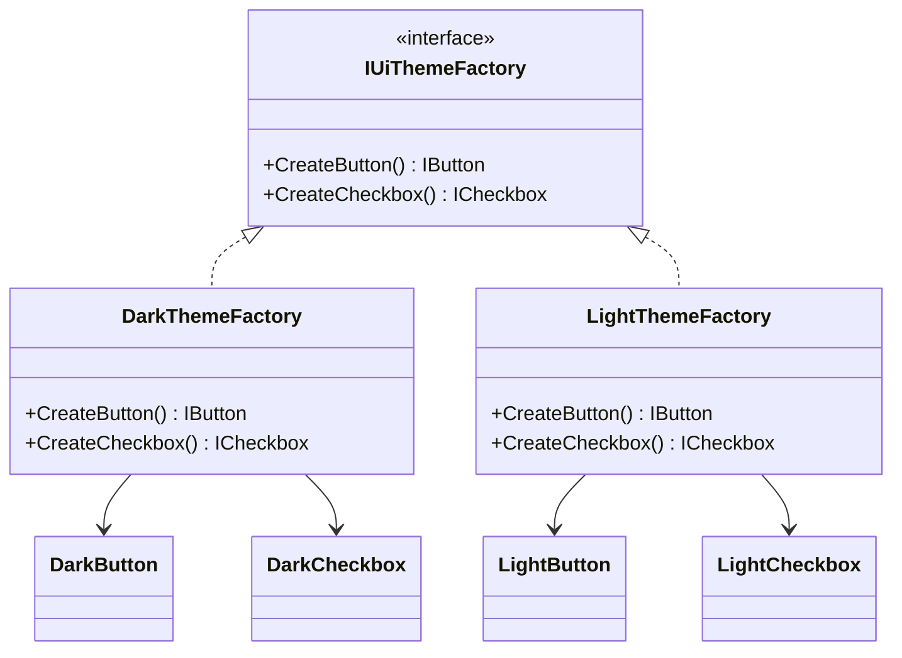
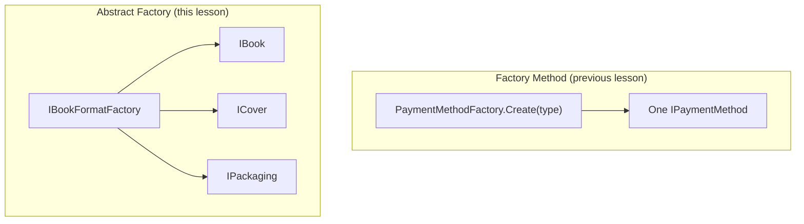

# Abstract Factory Pattern

## Introduction

Before reading this lesson, you should already be comfortable with **[Factory Method Pattern](../12-advanced-concepts/12-07-factory-method-pattern.md)**, where a single creation method decided which concrete type of *one* product got built. The Abstract Factory Pattern takes that same idea and scales it up: instead of one factory method producing one kind of object, an abstract factory groups *several* related factory methods behind one interface, so that a single choice of "which factory" guarantees every object it produces belongs to the same consistent family. Where Factory Method answered "which concrete type?", Abstract Factory answers "which *matching set* of concrete types, all at once?"

By the end of this lesson, you will be able to:

- State the Abstract Factory Pattern's GoF category (creational) and the problem it solves
- Explain why Abstract Factory is often described as "a factory of factories"
- Implement an abstract factory interface with multiple creation methods, plus two or more concrete factories
- Distinguish Abstract Factory from the single-product Factory Method Pattern
- Apply Abstract Factory to produce matched sets of related objects in a library/inventory scenario
- Recognize the risk Abstract Factory specifically prevents: accidentally mixing incompatible objects from different families

## Abstract Factory Pattern — A Layman's Perspective

Imagine a kitchen appliance retailer that sells complete appliance suites rather than individual mismatched units. One suite is finished entirely in brushed stainless steel — the refrigerator, the oven, and the dishwasher all share the same handle style, the same trim color, the same visual language. A second suite is finished entirely in matte black, with its own matching handles and trim, consistent across all three appliances. A customer doesn't shop for a refrigerator and an oven and a dishwasher as three separate, independent decisions; they pick *a suite* — stainless steel or matte black — and every appliance that arrives is guaranteed to match every other appliance in that same suite, because the retailer designed the whole family together, not one piece at a time.

Now imagine what would go wrong if the retailer let customers freely mix and match: a stainless-steel refrigerator standing next to a matte-black oven, with a dishwasher from neither collection stuck in between. Nothing would be *broken*, exactly — each individual appliance still works — but the kitchen would look assembled from spare parts, and worse, some combinations might not even be *compatible*: perhaps the matte-black oven's control panel was designed to pair electronically with the matte-black dishwasher's cycle scheduling, and putting a stainless-steel dishwasher in that same kitchen means losing a feature that only works within one consistent suite. The retailer's real service isn't selling three appliances — it's guaranteeing that whichever suite you choose, everything inside it was designed to belong together.

This is precisely the risk Abstract Factory exists to prevent in software. The moment a system needs several *related* objects that must all agree with each other — not just any refrigerator and any oven, but specifically *this suite's* refrigerator and *this same suite's* oven — leaving each object's creation as an independent decision invites exactly the mismatched-kitchen problem: nothing stops a careless caller from picking one variant's book cover and pairing it with a different variant's packaging, producing a combination that was never designed to go together and might not even function correctly as a set.

Abstract Factory solves this the same way the appliance retailer does: instead of exposing "build me a refrigerator" and "build me an oven" as two unrelated choices, it exposes exactly one choice — "give me the stainless-steel suite" or "give me the matte-black suite" — and from that single decision, every object needed afterward is produced already matched, with no further opportunity to accidentally combine pieces that were never meant to sit in the same kitchen.

## Abstract Factory Pattern — A Programming Language Perspective

The **Abstract Factory Pattern** is a GoF **creational** pattern that provides an interface for creating **families of related or dependent objects** without specifying their concrete classes. In C#, this means defining an interface — the abstract factory — that declares *multiple* creation methods, one for each distinct product type the family needs (for example, `CreateButton()` and `CreateCheckbox()`, or `CreateBook()`, `CreateCover()`, and `CreatePackaging()`). Each **concrete factory** class implements every one of those methods consistently, so that all the objects one concrete factory produces are guaranteed compatible with each other, while a different concrete factory produces an entirely separate, equally internally-consistent family. Client code depends only on the abstract factory interface and the product interfaces it returns — never on any concrete factory or concrete product type directly — which is what makes swapping an entire family (say, switching a UI from a light theme to a dark theme, or switching book production from paperback to hardcover) a single decision at one call site rather than a scattered set of independent choices that could drift out of sync.

## How to Implement the Abstract Factory Pattern in C#

An abstract factory interface groups several creation methods together; each concrete factory implements all of them to produce one internally-consistent family. Client code depends only on the abstract factory and the product interfaces, never on any concrete type.


*Figure 1: One concrete factory produces every product in a matching family — `DarkThemeFactory` never produces a `LightButton`, and vice versa.*

```csharp
// Program.cs — .NET 10 / C# 14
IUiThemeFactory factory = new DarkThemeFactory();
RenderUi(factory);

factory = new LightThemeFactory();
RenderUi(factory);

static void RenderUi(IUiThemeFactory factory)
{
    IButton button = factory.CreateButton();
    ICheckbox checkbox = factory.CreateCheckbox();
    button.Render();
    checkbox.Render();
}

interface IButton { void Render(); }
interface ICheckbox { void Render(); }

interface IUiThemeFactory
{
    IButton CreateButton();
    ICheckbox CreateCheckbox();
}

class DarkButton : IButton
{
    public void Render() => Console.WriteLine("Rendering dark button.");
}

class DarkCheckbox : ICheckbox
{
    public void Render() => Console.WriteLine("Rendering dark checkbox.");
}

class LightButton : IButton
{
    public void Render() => Console.WriteLine("Rendering light button.");
}

class LightCheckbox : ICheckbox
{
    public void Render() => Console.WriteLine("Rendering light checkbox.");
}

class DarkThemeFactory : IUiThemeFactory
{
    public IButton CreateButton() => new DarkButton();
    public ICheckbox CreateCheckbox() => new DarkCheckbox();
}

class LightThemeFactory : IUiThemeFactory
{
    public IButton CreateButton() => new LightButton();
    public ICheckbox CreateCheckbox() => new LightCheckbox();
}
```

**Console Output:**

```text
Rendering dark button.
Rendering dark checkbox.
Rendering light button.
Rendering light checkbox.
```

`RenderUi` accepts only an `IUiThemeFactory` and only ever calls `IButton`/`ICheckbox` members — it has no idea, and no way to find out, whether it's rendering the dark or light family. Swapping `DarkThemeFactory` for `LightThemeFactory` at the single call site in `Main` is the only change needed to switch the *entire* matched family; there's no second location where a mismatched button and checkbox could accidentally be paired.

## Real-Time Example: Matched Book Format Sets in Library/Inventory Management

We apply Abstract Factory to a Library/Inventory Management system that stocks the same titles in two distinct formats: paperback and hardcover. Each format needs a **matched set** of three related objects — a book, a cover, and packaging — and mixing pieces from different formats would be a real inventory error: a paperback book shrink-wrapped is normal; a paperback book packed in a rigid hardcover box is not. `IBookFormatFactory` groups all three creation methods behind one interface, and `PaperbackFactory`/`HardcoverFactory` each guarantee their own internally-consistent set.

```csharp
// Program.cs — .NET 10 / C# 14 — Real-Time Example (Library/Inventory Management)
AssembleInventoryItem(new PaperbackFactory(), "Clean Code");
AssembleInventoryItem(new HardcoverFactory(), "Domain-Driven Design");

static void AssembleInventoryItem(IBookFormatFactory factory, string title)
{
    IBook book = factory.CreateBook(title);
    ICover cover = factory.CreateCover();
    IPackaging packaging = factory.CreatePackaging();

    Console.WriteLine($"--- Assembling '{title}' ---");
    book.Describe();
    cover.Describe();
    packaging.Describe();
}

interface IBook { void Describe(); }
interface ICover { void Describe(); }
interface IPackaging { void Describe(); }

interface IBookFormatFactory
{
    IBook CreateBook(string title);
    ICover CreateCover();
    IPackaging CreatePackaging();
}

class PaperbackBook(string title) : IBook
{
    public void Describe() => Console.WriteLine($"Book: '{title}' (paperback binding)");
}

class SoftCover : ICover
{
    public void Describe() => Console.WriteLine("Cover: flexible laminated soft cover");
}

class ShrinkWrapPackaging : IPackaging
{
    public void Describe() => Console.WriteLine("Packaging: shrink-wrap sleeve");
}

class HardcoverBook(string title) : IBook
{
    public void Describe() => Console.WriteLine($"Book: '{title}' (hardcover binding)");
}

class DustJacketCover : ICover
{
    public void Describe() => Console.WriteLine("Cover: printed dust jacket over rigid boards");
}

class RigidBoxPackaging : IPackaging
{
    public void Describe() => Console.WriteLine("Packaging: rigid protective box");
}

class PaperbackFactory : IBookFormatFactory
{
    public IBook CreateBook(string title) => new PaperbackBook(title);
    public ICover CreateCover() => new SoftCover();
    public IPackaging CreatePackaging() => new ShrinkWrapPackaging();
}

class HardcoverFactory : IBookFormatFactory
{
    public IBook CreateBook(string title) => new HardcoverBook(title);
    public ICover CreateCover() => new DustJacketCover();
    public IPackaging CreatePackaging() => new RigidBoxPackaging();
}
```

**Console Output:**

```text
--- Assembling 'Clean Code' ---
Book: 'Clean Code' (paperback binding)
Cover: flexible laminated soft cover
Packaging: shrink-wrap sleeve
--- Assembling 'Domain-Driven Design' ---
Book: 'Domain-Driven Design' (hardcover binding)
Cover: printed dust jacket over rigid boards
Packaging: rigid protective box
```

`AssembleInventoryItem` takes any `IBookFormatFactory` and never checks which concrete factory it received — it simply asks for a book, a cover, and packaging, and trusts that whichever factory it was given produced all three consistently. A warehouse system built this way can never accidentally shrink-wrap a hardcover title or box up a paperback, because a single factory choice at intake determines the entire matched set, exactly as the Layman's Perspective's appliance suites guaranteed a matching kitchen.

## Factory Method vs. Abstract Factory

Factory Method, from the previous lesson, and Abstract Factory both hide concrete-type decisions behind an abstraction, but they operate at different scopes. Factory Method concerns itself with *one* product — a single creation method deciding which one concrete type to return. Abstract Factory concerns itself with an entire *family* of related products, grouping several creation methods behind one interface so that one choice of concrete factory determines every product in that family at once. It's common, in fact, for a concrete Abstract Factory's individual creation methods to internally be small Factory Methods — the two patterns compose rather than compete.


*Figure 2: Factory Method returns one product from one decision; Abstract Factory returns a whole matched family from one decision.*

| Aspect | Factory Method | Abstract Factory |
|---|---|---|
| Scope | One product type | A family of related product types |
| Interface shape | One creation method | Multiple creation methods, grouped |
| Compatibility guarantee | None between separate calls | Guaranteed — one factory, one consistent family |
| Typical structure | Subclass override, or a parameterized method | One interface, multiple concrete factory implementations |

## Types of Abstract Factory Variants in C#

Abstract Factory appears in a few recognizable shapes across C# codebases:

1. **Classic Abstract Factory interface** — a dedicated interface like `IUiThemeFactory` or `IBookFormatFactory`, exactly as shown in this lesson.
2. **Abstract Factory built from internal Factory Methods** — each of the abstract factory's creation methods is itself a small Factory Method delegating to further logic.
3. **DI-selected Abstract Factory** — registering a concrete factory (`PaperbackFactory` vs. `HardcoverFactory`) as a service in a DI container, chosen by configuration rather than a hardcoded `new`.
4. **Generic Abstract Factory** — using generic type parameters to reduce the number of near-duplicate factory interfaces, at the cost of some readability.
5. **[Builder Pattern](../12-advanced-concepts/12-09-builder-pattern.md)** — the next pattern, which shifts from "choose one matched family, all at once" to "assemble one complex object, one step at a time."

## What You've Learned & What's Next

Abstract Factory groups several related creation methods behind one interface, so that choosing a single concrete factory guarantees every product it produces belongs to the same compatible family — preventing the mismatched combinations that arise when related objects are created independently. `IBookFormatFactory`'s `PaperbackFactory` and `HardcoverFactory` each demonstrated that guarantee directly.

Continue your learning journey with **[Builder Pattern](../12-advanced-concepts/12-09-builder-pattern.md)**, where the focus shifts from selecting a whole family of objects at once to assembling one complex object step by step through a fluent API.

---
*Applies to: .NET 10 / C# 14. Last reviewed 2026-08-16.*
