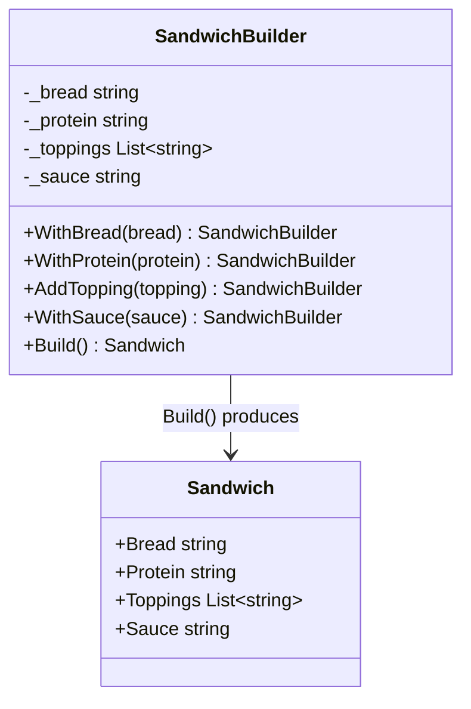
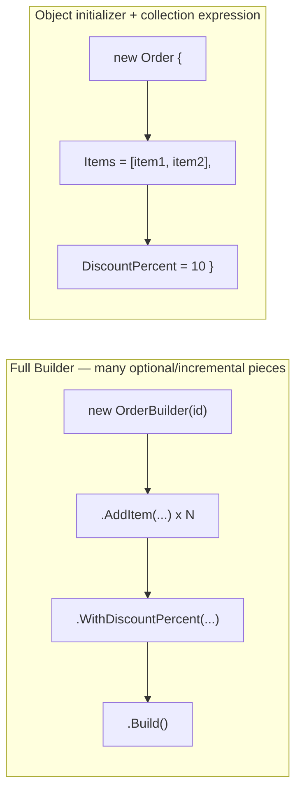

# Builder Pattern

## Introduction

Before reading this lesson, you should already be comfortable with **[Abstract Factory Pattern](../12-advanced-concepts/12-08-abstract-factory-pattern.md)**, which showed how one decision can produce a whole matched *family* of objects at once. The Builder Pattern solves a related but distinct problem: constructing a *single* object that's complex enough — enough optional pieces, enough configuration, enough steps — that building it in one constructor call would mean either an unreadably long parameter list or a pile of near-duplicate overloaded constructors. Builder instead assembles that one object incrementally, one step at a time, through a fluent chain of method calls that reads almost like a sentence describing what you want built.

By the end of this lesson, you will be able to:

- State the Builder Pattern's GoF category (creational) and the problem it solves
- Explain the "telescoping constructor" problem Builder specifically avoids
- Implement a fluent builder whose chained methods each return the builder itself
- Apply Builder to assemble a multi-part order in an e-commerce scenario
- Recognize when C# 12 collection expressions and primary constructors make a full Builder unnecessary
- Identify the tradeoff between a mutable fluent builder and a fully immutable one

## Builder Pattern — A Layman's Perspective

Picture a made-to-order sandwich counter, the kind where nothing is handed to you pre-assembled. You move down a line, and at each station you make exactly one decision: which bread, which protein, which cheese, which vegetables, which sauce. Nobody at the first station asks you to describe the entire sandwich up front — you'd have no way to answer sensibly before seeing what's actually available at each later station anyway. Instead, the sandwich accumulates, one addition at a time, as you move down the line, and only at the very last station — the one where they wrap it and hand it over — does a single, finished sandwich actually exist. Everything before that final wrap was a sandwich *in progress*, not yet ready to eat.

Compare this to a different, much less flexible restaurant: one where you must specify the entire order in a single breath at the register — bread, protein, three vegetables, sauce, and a note about how much of each — all at once, before anything starts, in one long unbroken sentence. Miss a detail, and the whole order has to be repeated from scratch. Want to add a topping you forgot to mention three steps back? Too late, you're already reciting toppings. This "everything in one sentence" restaurant is exactly what a constructor with fifteen parameters feels like to use — a wall of positional arguments where getting the count or order wrong compiles into a completely different, and completely wrong, sandwich.

The made-to-order counter's approach works because sandwiches, in general, have wildly varying complexity: some customers want three ingredients, others want twelve, and some want extras on some ingredients but not others. Forcing every customer through one fixed, all-at-once ordering ritual regardless of complexity would either be needlessly slow for the simple order or maddeningly rigid for the complicated one. Letting the sandwich accumulate one station at a time, in whatever order and combination each customer actually needs, handles both cases naturally with the exact same process — the person building a three-ingredient sandwich just walks past the stations they don't need, while the person building a twelve-ingredient masterpiece stops at every one.

That incremental, one-decision-at-a-time accumulation — culminating in one explicit "I'm done, wrap it up" moment that produces the finished thing — is exactly what the Builder Pattern gives you in code. Rather than trying to specify a complex object's entire configuration in one constructor call, you add to it piece by piece, in whatever combination the situation actually calls for, and only the final `Build()` call produces the completed, ready-to-use object.

## Builder Pattern — A Programming Language Perspective

The **Builder Pattern** is a GoF **creational** pattern that separates the construction of a complex object from its final representation, so the same step-by-step construction process can be reused to produce different configurations of that object. In C#, the idiomatic modern implementation is a **fluent builder**: a class exposing chained methods, each configuring one piece of the object being built and returning the builder itself (`return this;`), so calls can be chained one after another — `.WithX(...).WithY(...).AddZ(...)` — ending in a `Build()` method that produces the fully assembled, immutable result. This directly avoids the **telescoping constructor problem**: a class offering many constructor overloads to cover every combination of optional parameters, which becomes unreadable and error-prone once more than a handful of optional values are involved. The classic GoF form additionally separates a `Director` class, which encapsulates specific, reusable build *sequences*; most modern C# code skips the `Director` and lets calling code chain the builder directly, since the flexibility of arbitrary call ordering is usually exactly what's wanted.

## How to Implement the Builder Pattern in C#

A fluent builder holds the in-progress state privately, exposes one chainable method per configurable piece, and exposes a final `Build()` method that assembles and returns the finished object.


*Figure 1: Each chained method returns the same `SandwichBuilder`, accumulating state; only `Build()` produces the finished `Sandwich`.*

```csharp
// Program.cs — .NET 10 / C# 14
Sandwich sandwich = new SandwichBuilder()
    .WithBread("Whole wheat")
    .WithProtein("Turkey")
    .AddTopping("Lettuce")
    .AddTopping("Tomato")
    .WithSauce("Mustard")
    .Build();

Console.WriteLine(sandwich);

class Sandwich
{
    public string Bread { get; init; } = "";
    public string Protein { get; init; } = "";
    public List<string> Toppings { get; init; } = [];
    public string Sauce { get; init; } = "";

    public override string ToString() =>
        $"{Bread} bread, {Protein}, toppings: [{string.Join(", ", Toppings)}], sauce: {Sauce}";
}

class SandwichBuilder
{
    private string _bread = "";
    private string _protein = "";
    private readonly List<string> _toppings = [];
    private string _sauce = "";

    public SandwichBuilder WithBread(string bread) { _bread = bread; return this; }
    public SandwichBuilder WithProtein(string protein) { _protein = protein; return this; }
    public SandwichBuilder AddTopping(string topping) { _toppings.Add(topping); return this; }
    public SandwichBuilder WithSauce(string sauce) { _sauce = sauce; return this; }

    public Sandwich Build() => new()
    {
        Bread = _bread,
        Protein = _protein,
        Toppings = _toppings,
        Sauce = _sauce
    };
}
```

**Console Output:**

```text
Whole wheat bread, Turkey, toppings: [Lettuce, Tomato], sauce: Mustard
```

Each `With...`/`Add...` call returns `this`, which is exactly what makes the chained, dot-after-dot syntax possible — every call in the chain is operating on the same `SandwichBuilder` instance, accumulating state until `Build()` reads all of it and produces one finished, immutable `Sandwich`. Notice that toppings were added one at a time via repeated `AddTopping` calls — a shape a single constructor parameter list handles awkwardly at best.

## Real-Time Example: An Order Builder in E-Commerce Order Processing

We extend this curriculum's E-Commerce Order Processing thread with an `OrderBuilder` that fluently assembles an order's line items, discount, and shipping address — the exact kind of object where a constructor accepting "a list of items, a discount, and an address" all at once would force every caller to have every piece ready simultaneously, even though line items are naturally added incrementally as a shopper fills a cart.

```csharp
// Program.cs — .NET 10 / C# 14 — Real-Time Example (E-Commerce Order Processing)
Order order = new OrderBuilder("ORD-6001")
    .AddItem("Wireless Mouse", quantity: 2, unitPrice: 25.00m)
    .AddItem("USB-C Hub", quantity: 1, unitPrice: 45.00m)
    .WithDiscountPercent(10)
    .ShipTo("221B Baker Street, London")
    .Build();

Console.WriteLine($"Order {order.Id} - shipping to {order.ShippingAddress}");
foreach (var item in order.Items)
{
    Console.WriteLine($"  {item.Quantity} x {item.ProductName} @ {item.UnitPrice:C}");
}
Console.WriteLine($"Subtotal: {order.Subtotal:C}");
Console.WriteLine($"Discount ({order.DiscountPercent}%): -{order.DiscountAmount:C}");
Console.WriteLine($"Total: {order.Total:C}");

record OrderLineItem(string ProductName, int Quantity, decimal UnitPrice)
{
    public decimal LineTotal => Quantity * UnitPrice;
}

class Order
{
    public required string Id { get; init; }
    public required IReadOnlyList<OrderLineItem> Items { get; init; }
    public required int DiscountPercent { get; init; }
    public required string ShippingAddress { get; init; }

    public decimal Subtotal => Items.Sum(i => i.LineTotal);
    public decimal DiscountAmount => Subtotal * DiscountPercent / 100m;
    public decimal Total => Subtotal - DiscountAmount;
}

class OrderBuilder(string orderId)
{
    private readonly List<OrderLineItem> _items = [];
    private int _discountPercent;
    private string _shippingAddress = "";

    public OrderBuilder AddItem(string productName, int quantity, decimal unitPrice)
    {
        _items.Add(new OrderLineItem(productName, quantity, unitPrice));
        return this;
    }

    public OrderBuilder WithDiscountPercent(int percent)
    {
        _discountPercent = percent;
        return this;
    }

    public OrderBuilder ShipTo(string address)
    {
        _shippingAddress = address;
        return this;
    }

    public Order Build() => new()
    {
        Id = orderId,
        Items = _items,
        DiscountPercent = _discountPercent,
        ShippingAddress = _shippingAddress
    };
}
```

**Console Output:**

```text
Order ORD-6001 - shipping to 221B Baker Street, London
  2 x Wireless Mouse @ $25.00
  1 x USB-C Hub @ $45.00
Subtotal: $95.00
Discount (10%): -$9.50
Total: $85.50
```

`OrderBuilder` lets the two `AddItem` calls happen independently, in whatever order items are actually added to a cart, while `WithDiscountPercent` and `ShipTo` are applied whenever that information becomes available — nothing requires all four pieces to be known simultaneously the way a single constructor call would. `Order` itself stays a plain, `required`-enforced, effectively immutable type; only `OrderBuilder` deals with the incremental, in-progress state.

## Builder Pattern vs. Modern C# Lightweight Alternatives

A full fluent builder earns its complexity when a type has many optional pieces, incremental collection-building (like `AddItem` called an arbitrary number of times), or genuinely multi-step assembly. For simpler cases, C# has grown lighter-weight alternatives that avoid writing a whole builder class. `required` members plus an object initializer already solve the telescoping-constructor problem for objects whose values are all known at once, without any incremental accumulation. **C# 12's collection expressions** (`Items = [item1, item2]`) make initializing a list-typed property directly, inline, painless — often removing the need for a builder's sole purpose being "let me add items one at a time" if the full list is already available. **Primary constructors** collapse simple constructor-and-field boilerplate into the class declaration itself, reducing the ceremony that made long parameter lists feel unavoidable in the first place. None of these replace Builder for genuinely complex, incremental, multi-step construction — but reaching for a full Builder class when an object initializer and a collection expression would do is unnecessary ceremony.


*Figure 2: Both reach the same finished object; the lightweight form skips the builder entirely when every value is already known up front.*

| Aspect | Fluent Builder | Object Initializer + Collection Expression |
|---|---|---|
| Best fit | Many optional pieces, incremental accumulation | All values known at construction time |
| Extra type needed | Yes — a dedicated builder class | No — just the target type itself |
| Reads as | A chained sequence of steps | One declarative expression |
| Adding items one at a time | Natural (`AddItem` called per item) | Awkward — the whole collection must exist first |

## Types of Builder Variants in C#

Builder shows up in a few recognizable forms, along with lighter alternatives worth knowing when a full builder is overkill:

1. **Fluent builder returning `this`** — the mutable, chainable form shown in this lesson's `SandwichBuilder` and `OrderBuilder`.
2. **Builder + Director** — the classic GoF pairing, where a separate `Director` class encapsulates specific, reusable build sequences on top of the builder.
3. **Immutable builder** — each chained method returns a *new* builder instance instead of mutating shared state, trading a small allocation cost for safety when a builder might be reused or shared.
4. **`required` members + object initializer** — a lightweight, non-incremental alternative for objects whose values are all known at once.
5. **C# 12 collection expressions** — inline collection literals (`[item1, item2]`) that remove the need for a builder whose only job was accumulating a list.
6. **[Prototype Pattern](../12-advanced-concepts/12-10-prototype-pattern.md)** — the next pattern, which sidesteps construction entirely by cloning an existing, already-built object instead.

## What You've Learned & What's Next

Builder assembles a complex object incrementally through a fluent, chainable API, avoiding both the telescoping-constructor problem and the need for every configuration value to be known simultaneously. `OrderBuilder` demonstrated this directly: line items accumulated one `AddItem` call at a time, with discount and shipping information applied whenever it became available, all before one final `Build()` call produced the finished, immutable `Order`. For simpler objects, though, C# 12's collection expressions and `required` object initializers often make a dedicated builder class unnecessary.

Continue your learning journey with **[Prototype Pattern](../12-advanced-concepts/12-10-prototype-pattern.md)**, where instead of building an object from scratch, step by step, we produce a new one by cloning an existing instance.

---
*Applies to: .NET 10 / C# 14. Last reviewed 2026-08-16.*
