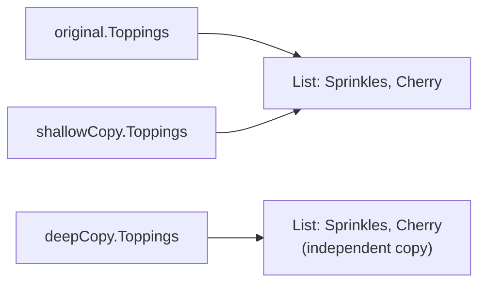
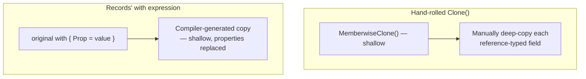

# Prototype Pattern

## Introduction

Before reading this lesson, you should already be comfortable with **[Builder Pattern](../12-advanced-concepts/12-09-builder-pattern.md)**, which assembled a complex object step by step from scratch. The Prototype Pattern closes out Module 12's Gang-of-Four creational catalog with a fundamentally different strategy: instead of building a new object piece by piece, or choosing which concrete type or family to construct, you **clone an existing, already-configured instance** and adjust only what's different. When most of a new object's configuration is identical to something you already have, copying that existing object is often simpler, safer, and cheaper than re-specifying everything from a blank starting point.

By the end of this lesson, you will be able to:

- State the Prototype Pattern's GoF category (creational) and the problem it solves
- Distinguish a **shallow clone** from a **deep clone**, and identify the specific bug shallow cloning introduces
- Implement both shallow and deep cloning in C#
- Apply Prototype to derive variations of a shared template in a library/inventory scenario
- Explain how records' `with` expression provides a safer, built-in modern alternative to a hand-rolled `Clone()` method
- Recognize this lesson as the close of Module 12's creational-pattern sub-area, ahead of the structural patterns that follow

## Prototype Pattern — A Layman's Perspective

Picture a bakery that fields a lot of custom cake orders that are all variations on a small handful of popular themes. Rather than filling out a brand-new recipe card from a blank page for every single order — re-specifying the sponge type, the icing, the box size, all over again — the head baker keeps a stack of already-completed "master" recipe cards for the shop's most popular cakes. When a new order comes in that's basically the shop's classic vanilla cake with a different message written in icing, the baker photocopies the master card and simply changes the one detail that's different, rather than starting over from raw ingredients and a blank form. That's the core idea behind Prototype: producing a new instance by copying an existing one, then adjusting only what differs, instead of constructing everything again from nothing.

Here's where the bakery's photocopying habit can go quietly wrong. Suppose the master recipe card doesn't list its toppings directly on the card — instead, it just has a note pointing to a separate topping checklist pinned on a clipboard elsewhere in the kitchen, shared across every cake based on that master recipe. If the baker photocopies only the recipe card itself, the photocopy still points to the *exact same physical clipboard* the original recipe pointed to — nothing about the clipboard itself got duplicated. Now if this new custom order needs "no cherries," and the baker crosses cherries off that shared clipboard, they've just silently removed cherries from every *other* cake that also happens to be using that same master recipe, including orders that were never supposed to be touched at all. The copy looked independent — it was a separate piece of paper — but the thing that actually mattered, the topping list, was never actually copied; it was only ever referenced.

The fix a careful bakery would reach for is obvious once the problem is visible: when photocopying the recipe card, also photocopy the topping clipboard it points to, and staple that fresh photocopy to the new card instead of leaving it pointing at the shared original. Now the new order's topping list is its own independent sheet of paper — crossing an item off it changes nothing about any other order's clipboard, because there's no longer a shared clipboard being pointed at by more than one card.

This exact distinction — copying the surface-level card versus copying everything the card points to, all the way down — is the difference between a **shallow clone** and a **deep clone** in software, and it's the single most important detail to get right whenever you clone an object rather than build one from scratch.

## Prototype Pattern — A Programming Language Perspective

The **Prototype Pattern** is a GoF **creational** pattern that creates a new object by copying (cloning) an existing instance — the **prototype** — rather than instantiating the class directly, which is useful when an object is expensive or complex to construct, or when you want several variations of an already-configured object. C# offers `object.MemberwiseClone()`, a `protected` method inherited from `object`, to perform a **shallow clone**: it copies every field's value, but for reference-type fields, it copies the *reference itself*, not the object the reference points to — so the original and the clone end up sharing the same underlying reference-typed data, exactly like two recipe cards pointing at one shared clipboard. A **deep clone** additionally clones every reference-typed field's target, recursively, so the clone owns fully independent copies of everything, not just its own top-level fields. C#'s built-in `ICloneable` interface is now largely discouraged in modern code, precisely because its single `Clone()` method makes no contractual promise about whether it performs a shallow or a deep copy, leaving callers to guess. Records' **`with` expression**, introduced in C# 9, offers a safer, language-supported alternative for records specifically: `original with { PropertyName = newValue }` performs a shallow copy of the record and replaces only the specified properties, giving you Prototype's "clone, then change one thing" behavior without writing a `Clone()` method at all.

## How to Clone Objects in C#: Shallow vs. Deep

`MemberwiseClone()` is the mechanical building block for a shallow clone; a deep clone additionally recreates any mutable reference-typed members so the clone doesn't share them with the original.


*Figure 1: `ShallowClone()` leaves `shallowCopy.Toppings` pointing at the same `List` as `original`; `DeepClone()` allocates a fully independent `List` instead.*

```csharp
// Program.cs — .NET 10 / C# 14
var original = new Recipe("Classic Vanilla", ["Sprinkles", "Cherry"]);

Recipe shallowCopy = original.ShallowClone();
Recipe deepCopy = original.DeepClone();

shallowCopy.Toppings.Remove("Cherry");   // mutates the SAME list original also references
deepCopy.Toppings.Remove("Sprinkles");   // mutates only the deep copy's own independent list

Console.WriteLine($"Original toppings: {string.Join(", ", original.Toppings)}");
Console.WriteLine($"Shallow copy toppings: {string.Join(", ", shallowCopy.Toppings)}");
Console.WriteLine($"Deep copy toppings: {string.Join(", ", deepCopy.Toppings)}");

class Recipe(string name, List<string> toppings)
{
    public string Name { get; set; } = name;
    public List<string> Toppings { get; set; } = toppings;

    public Recipe ShallowClone() => (Recipe)MemberwiseClone();

    public Recipe DeepClone() => new(Name, new List<string>(Toppings));
}
```

**Console Output:**

```text
Original toppings: Sprinkles
Shallow copy toppings: Sprinkles
Deep copy toppings: Cherry
```

Removing `"Cherry"` from `shallowCopy.Toppings` also removed it from `original.Toppings` — both variables reference the exact same `List<string>`, because `MemberwiseClone()` only copied the *reference*, not the list itself. `deepCopy`, built with its own independent `new List<string>(Toppings)`, was unaffected by that shallow mutation, and its own subsequent removal of `"Sprinkles"` didn't touch `original` or `shallowCopy` either — proof that a deep clone truly owns everything it holds.

## Real-Time Example: Cloning a Book Template in Library/Inventory Management

We apply Prototype to a Library/Inventory Management system that stocks the same title across multiple branches. Rather than re-entering a book's title, author, and subject tags every time a new physical copy is cataloged, the library keeps one `BookTemplate` per title and clones it to produce each branch's `BookCopy`, varying only the inventory ID and shelf location — while making sure each branch's tag list is its own independent copy, not a shared reference back to the template.

```csharp
// Program.cs — .NET 10 / C# 14 — Real-Time Example (Library/Inventory Management)
var template = new BookTemplate(
    Title: "Clean Architecture",
    Author: "Robert C. Martin",
    Tags: ["software-design", "architecture"]);

BookCopy centralCopy = template.CreateCopy("INV-1001", "Central Branch - Shelf A3");
BookCopy westCopy = template.CreateCopy("INV-1002", "West Branch - Shelf C7");

westCopy.Tags.Add("recommended"); // must not affect the template or the other branch's copy

Console.WriteLine($"Template tags: {string.Join(", ", template.Tags)}");
Console.WriteLine($"{centralCopy.InventoryId} ({centralCopy.ShelfLocation}) tags: {string.Join(", ", centralCopy.Tags)}");
Console.WriteLine($"{westCopy.InventoryId} ({westCopy.ShelfLocation}) tags: {string.Join(", ", westCopy.Tags)}");

record BookTemplate(string Title, string Author, List<string> Tags)
{
    public BookCopy CreateCopy(string inventoryId, string shelfLocation) => new(
        Title: Title,
        Author: Author,
        Tags: [.. Tags], // deep-copy the tag list so each copy owns its own independent list
        InventoryId: inventoryId,
        ShelfLocation: shelfLocation);
}

record BookCopy(string Title, string Author, List<string> Tags, string InventoryId, string ShelfLocation);
```

**Console Output:**

```text
Template tags: software-design, architecture
INV-1001 (Central Branch - Shelf A3) tags: software-design, architecture
INV-1002 (West Branch - Shelf C7) tags: software-design, architecture, recommended
```

`CreateCopy` uses the C# 12 collection-expression spread operator (`[.. Tags]`) to allocate a brand-new `List<string>` for every copy it produces, rather than handing out the template's own list by reference. That's why tagging `westCopy` as `"recommended"` shows up only on `westCopy` — neither the shared `template` nor `centralCopy` at the other branch was disturbed, exactly the deep-clone guarantee a real multi-branch inventory system depends on to avoid one branch's cataloging work silently corrupting another's.

## Manual `Clone()` vs. Records' `with` Expression

Hand-rolling `ShallowClone()`/`DeepClone()` methods, as this lesson's `Recipe` class did, gives you full control but also full responsibility: every reference-typed field must be deliberately considered and deliberately deep-copied, or the clipboard-sharing bug from this lesson's Layman's Perspective creeps back in silently. C# records' `with` expression — `original with { PropertyName = newValue }` — sidesteps writing a `Clone()` method at all for the specific case of records: it performs the copy for you, replacing only the properties you name, using the compiler-generated copy constructor every record automatically has. The tradeoff is scope: `with` only shallow-copies (a mutable reference-typed property inside a record `with`-copy is still shared, exactly like `MemberwiseClone()`), and it only applies to records, not ordinary classes — so a class holding genuinely mutable reference-typed state, like this lesson's `Recipe`, still needs a deliberate deep-clone method, while an immutable-by-convention record with simple value-typed properties is exactly where `with` is the better everyday tool.


*Figure 2: A hand-rolled `Clone()` gives full control over shallow vs. deep; `with` gives a safe, built-in shallow copy for records with no `Clone()` method to write.*

| Aspect | Manual `Clone()` (`MemberwiseClone`/deep copy) | Records' `with` expression |
|---|---|---|
| Applies to | Any class | Records only |
| Copy depth | Your choice — shallow or explicitly deep | Always shallow (nested mutable references still shared) |
| Code required | A hand-written `Clone()`/`DeepClone()` method | None — built into every record automatically |
| Risk if misused | Silent shared-reference bugs if depth isn't considered | Same shared-reference risk, but only for mutable reference-typed properties |

## Types of Prototype-Related Concepts in C#

Prototype and its cloning mechanics appear in a few recognizable forms:

1. **Shallow clone (`MemberwiseClone()`)** — copies top-level fields, including reference-typed fields *by reference*, as shown in this lesson's `Recipe.ShallowClone()`.
2. **Deep clone (manual or via collection-expression copying)** — recursively copies reference-typed members so the clone shares nothing mutable with the original, as shown in `Recipe.DeepClone()` and `BookTemplate.CreateCopy()`.
3. **`ICloneable` interface** — .NET's built-in cloning contract, now largely discouraged because its single `Clone()` method doesn't specify shallow vs. deep semantics.
4. **Records' `with` expression** — the modern, language-supported alternative to a hand-rolled `Clone()` method for record types.
5. **Prototype registry** — a `Dictionary<string, IPrototype>` of named, pre-configured prototypes to clone from, useful once a system has many reusable templates.
6. **[Adapter Pattern](../12-advanced-concepts/12-11-adapter-pattern.md)** — the next pattern, and the first of this module's *structural* patterns, shifting focus from how objects get created to how differently-shaped objects can work together.

## What You've Learned & What's Next

Prototype produces a new object by cloning an existing, already-configured instance rather than building one from scratch — but that convenience only holds up if you know whether you got a shallow clone, sharing mutable reference-typed state with the original, or a deep clone, owning fully independent copies of everything. `BookTemplate.CreateCopy()` demonstrated the deep-clone discipline a real multi-branch library system needs, while records' `with` expression showed the safer, built-in alternative for the common case of simple, largely immutable data. This lesson also closes out Module 12's five Gang-of-Four **creational** patterns — Singleton, Factory Method, Abstract Factory, Builder, and Prototype — all concerned with *how objects come into existence*.

Continue your learning journey with **[Adapter Pattern](../12-advanced-concepts/12-11-adapter-pattern.md)**, the first of the Gang-of-Four **structural** patterns, where the question shifts from creating objects to making two incompatible interfaces work together.

---
*Applies to: .NET 10 / C# 14. Last reviewed 2026-08-16.*
