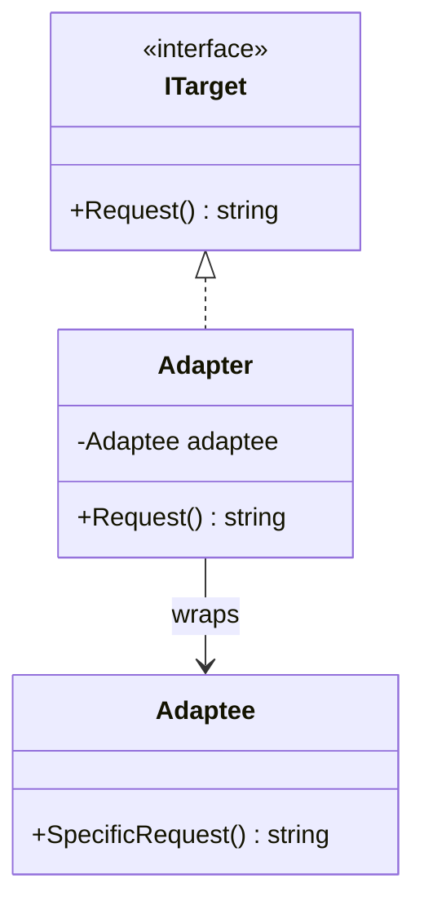
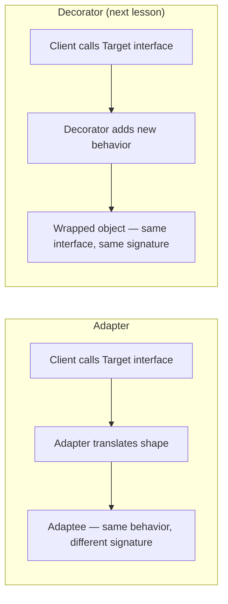

# Adapter Pattern

## Introduction

Before reading this lesson, you should already be comfortable with **[Prototype Pattern](../12-advanced-concepts/12-10-prototype-pattern.md)** and, more broadly, with the creational patterns this module has covered so far — patterns concerned with *how objects get built*. This lesson turns to a different family entirely: structural patterns, concerned with *how objects are composed and connected*. The Adapter Pattern is the natural place to start that family, because its job is one every C# developer eventually runs into without needing a name for it: you already have a working class, it already does what you need, but its method signatures don't match the interface your application code expects to call.

By the end of this lesson, you will be able to:

- Explain what problem the Adapter Pattern solves and recognize the "interface mismatch" situation that calls for it
- Distinguish the Adapter Pattern from simply rewriting or modifying the class you don't control
- Implement an object adapter in C# using composition and interface implementation
- Apply the Adapter Pattern to wrap a legacy, non-conforming API behind a modern application interface
- Contrast Adapter with Decorator, and explain why the two are so often confused

## Adapter Pattern — A Layman's Perspective

Picture packing for a trip abroad with a laptop charger built for one country's wall sockets, and arriving somewhere the sockets are a completely different shape. The charger itself is fine — nothing about it is broken, and you have no reason to want a different charger. The wall socket is fine too — it's not going to change shape to suit your luggage. What you actually need is a small block that plugs into the foreign socket on one side and offers your charger's familiar plug shape on the other. That little block does no electrical work of its own; it doesn't generate power, transform voltage, or improve anything. Its entire job is translation: accept the shape the wall offers, and present the shape your charger expects.

This is exactly the situation the Adapter Pattern addresses in software, and it's exactly why the pattern borrowed this name rather than inventing a new one. Somewhere in a real system, you have a piece of code — often something you didn't write and can't change, like a third-party library, an old internal service, or a vendor's SDK — that already does the job you need done, but exposes it through a method shape your application never asked for. Maybe it wants a `string` where you have a strongly typed request object, maybe it returns an integer status code where the rest of your codebase expects a proper result type, maybe it's synchronous where everything else you write is `async`. Rewriting that code is often not an option: you don't own it, it's tested and stable, or a vendor ships new versions of it that would silently overwrite your edits.

So instead, exactly like the travel plug adapter, you build one small piece of code whose only job is to sit between the two: it implements the interface shape your application already expects, and internally it holds onto — and calls into — the object with the shape you can't change. Your application code never learns that anything unusual is happening on the other side; from where it stands, it's just talking to something that implements the interface it always expected. The oddly-shaped legacy object never changes, never gets rewritten, and never even needs to know an adapter exists in front of it.

The one discipline this analogy makes clear if you look closely: the adapter block does not make the outlet or the charger *better* — it does not add surge protection, does not add new functionality, does not decide when to charge. It only translates shape. Any pattern that instead *adds* new behavior around an object — logging, caching, added validation — is solving a different problem, which is why the next lesson, the Decorator Pattern, so often gets confused with this one despite the two doing genuinely different jobs.

## Adapter Pattern — A Programming Language Perspective

The Adapter Pattern is a structural design pattern that converts the interface of an existing class (the **Adaptee**) into another interface (the **Target**) that client code expects, without modifying the Adaptee's source. In C#, this is almost always implemented as an **object adapter**: a class that implements the `Target` interface and holds a private reference to an instance of the `Adaptee`, translating each `Target` method call into one or more calls on the wrapped `Adaptee`. C# has no true multiple inheritance, so the alternative "class adapter" style from the original GoF catalog — inheriting from the Adaptee directly and layering interface implementation on top — is rarely used here; composition, not inheritance, is idiomatic C#. The adapter class itself typically contains only translation logic: reshaping parameters, converting return types, and occasionally mapping between synchronous and asynchronous calling conventions using `Task.FromResult` or `Task.Run`.

## How to Implement the Adapter Pattern in C#

An adapter needs exactly three participants: the `Target` interface your client code already depends on, the existing `Adaptee` class whose shape doesn't match, and the `Adapter` class that implements `Target` while internally delegating to an `Adaptee` instance.


*Figure 1: `Adapter` implements the interface the client expects (`ITarget`) while holding and delegating to the incompatible `Adaptee`.*

```csharp
// Program.cs — .NET 10 / C# 14
// The interface client code already expects.
interface ITarget
{
    string Request();
}

// An existing class with an incompatible shape — imagine this ships in a NuGet package.
class Adaptee
{
    public string SpecificRequest() => "specific behavior from Adaptee";
}

// Translates ITarget calls into Adaptee calls.
class Adapter(Adaptee adaptee) : ITarget
{
    public string Request() => $"Adapter: (TRANSLATED) {adaptee.SpecificRequest()}";
}

ITarget target = new Adapter(new Adaptee());
Console.WriteLine(target.Request());
```

**Console Output:**

```text
Adapter: (TRANSLATED) specific behavior from Adaptee
```

Client code only ever holds an `ITarget` reference and calls `Request()`. It never sees `Adaptee` or `SpecificRequest()` directly — the `Adapter` class absorbed that mismatch entirely. Swapping `Adaptee` for a different incompatible class later only requires writing a new adapter, never touching the client.

## Real-Time Example: Adapting a Legacy Payment Gateway in E-Commerce Order Processing

We continue the E-Commerce Order Processing case study. The application's checkout code is written against a clean, modern interface, `IPaymentProcessor`, which every payment provider is expected to implement. But the company already has a working integration with an older, in-house `LegacyPaymentGateway` class — battle-tested, still handling real transactions, but built years before `IPaymentProcessor` existed. It takes a raw card number and a `double` amount, and returns an integer status code instead of a proper result object. Rewriting it is out of the question; it's shared with other systems. Instead, we adapt it.

```csharp
// Program.cs — .NET 10 / C# 14 — Real-Time Example (E-Commerce Order Processing)
// The modern interface all payment providers are expected to implement.
interface IPaymentProcessor
{
    Task<PaymentResult> ProcessPaymentAsync(PaymentRequest request);
}

record PaymentRequest(string CardNumber, decimal Amount);
record PaymentResult(bool Success, string Message);

// The legacy class we don't own and can't rewrite — a stand-in for a real vendor SDK.
class LegacyPaymentGateway
{
    // Returns 0 for approved, 1 for declined; takes a double amount, not decimal.
    public int MakePayment(string cardNumber, double amount)
    {
        Console.WriteLine($"[LegacyPaymentGateway] Charging card ending {cardNumber[^4..]} for {amount:C}");
        return amount <= 5000.00 ? 0 : 1;
    }
}

// The adapter: implements IPaymentProcessor, delegates to LegacyPaymentGateway.
class LegacyPaymentGatewayAdapter(LegacyPaymentGateway legacyGateway) : IPaymentProcessor
{
    public Task<PaymentResult> ProcessPaymentAsync(PaymentRequest request)
    {
        int statusCode = legacyGateway.MakePayment(request.CardNumber, (double)request.Amount);

        PaymentResult result = statusCode == 0
            ? new PaymentResult(Success: true, Message: "Payment approved")
            : new PaymentResult(Success: false, Message: "Payment declined — amount exceeds legacy limit");

        return Task.FromResult(result);
    }
}

IPaymentProcessor processor = new LegacyPaymentGatewayAdapter(new LegacyPaymentGateway());

PaymentResult order4471 = await processor.ProcessPaymentAsync(new PaymentRequest("4111111111111234", 249.99m));
Console.WriteLine($"Order #4471: {(order4471.Success ? "SUCCESS" : "FAILED")} — {order4471.Message}");

PaymentResult order4472 = await processor.ProcessPaymentAsync(new PaymentRequest("5500005555554444", 7200.00m));
Console.WriteLine($"Order #4472: {(order4472.Success ? "SUCCESS" : "FAILED")} — {order4472.Message}");
```

**Console Output:**

```text
[LegacyPaymentGateway] Charging card ending 1234 for $249.99
Order #4471: SUCCESS — Payment approved
[LegacyPaymentGateway] Charging card ending 4444 for $7,200.00
Order #4472: FAILED — Payment declined — amount exceeds legacy limit
```

Checkout code depends only on `IPaymentProcessor` and never references `LegacyPaymentGateway` directly, which means the same checkout flow can later accept a brand-new payment provider — Stripe, a bank API, anything — just by writing one more adapter, with zero changes to the checkout logic itself. This is the practical payoff: the legacy `int`/`double` shape stays exactly as it is, untouched and still serving whatever other systems depend on it, while the rest of the codebase gets to work against a clean, modern, `async`-friendly contract.

## Adapter Pattern vs. Decorator Pattern

Both patterns wrap an existing object, both are implemented in C# as a class holding a reference to another object, and both are frequently mistaken for each other at first glance — which is precisely why they're worth contrasting directly before moving on. The distinction is about *intent*, not mechanics. An adapter exists purely to reconcile an interface mismatch: the wrapped object already does everything the client needs, just under a different method shape, and the adapter changes nothing about *what* happens — only how it's asked for. A decorator, covered next, wraps an object that already implements the interface the client expects, and adds genuinely new behavior — logging, caching, discounts — around calls that would otherwise pass through unchanged.


*Figure 2: Adapter translates a mismatched shape; Decorator adds behavior to a matching one.*

| Aspect | Adapter Pattern | Decorator Pattern |
|---|---|---|
| Wrapped object's interface | Different from what the client expects | Same as what the client expects |
| Purpose | Reconcile an interface mismatch | Add new behavior dynamically |
| Changes behavior? | No — behavior is preserved, only reshaped | Yes — that's the entire point |
| Stackable? | Rarely — typically one adapter per Adaptee | Yes — decorators commonly chain |
| Typical trigger | A legacy class or third-party library you can't change | A class you own, wanting optional extra behavior |

## Types of Adapter in C#

The core idea has a few recognized variants and close relatives, several covered in their own lessons in this module:

1. **Object Adapter** — the composition-based style used throughout this lesson, and the idiomatic choice in C# given the lack of multiple inheritance.
2. **Class Adapter** — the original GoF variant using inheritance from the Adaptee; rarely idiomatic in C#, more common in languages with multiple inheritance.
3. **Two-Way Adapter** — implements both interfaces simultaneously, letting either side treat the object as native — useful when migrating incrementally between two APIs.
4. **Pluggable Adapter** — an adapter that discovers or configures its translation logic at runtime rather than hardcoding one Adaptee, often via delegates or reflection.
5. **[Decorator Pattern](../12-advanced-concepts/12-12-decorator-pattern.md)** — the next lesson; wraps a matching interface to add behavior rather than reconcile a mismatch.
6. **[Facade Pattern](../12-advanced-concepts/12-13-facade-pattern.md)** — also simplifies access to existing code, but by unifying *several* subsystems behind one new interface rather than translating one mismatched one.

## What You've Learned & What's Next

The Adapter Pattern lets you integrate a class you can't or shouldn't modify — a legacy service, a third-party SDK, an older internal API — by writing a small translation layer that implements the interface your application already expects. The behavior underneath never changes; only its shape does, which keeps the legacy code untouched and the rest of your codebase clean.

Continue your learning journey with **[Decorator Pattern](../12-advanced-concepts/12-12-decorator-pattern.md)**, where we wrap objects again — but this time to layer new, stackable behavior onto a matching interface instead of reconciling a mismatched one.

---
*Applies to: .NET 10 / C# 14. Last reviewed 2026-08-16.*
