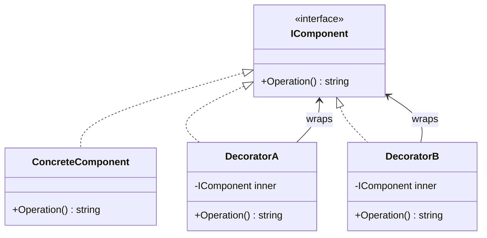
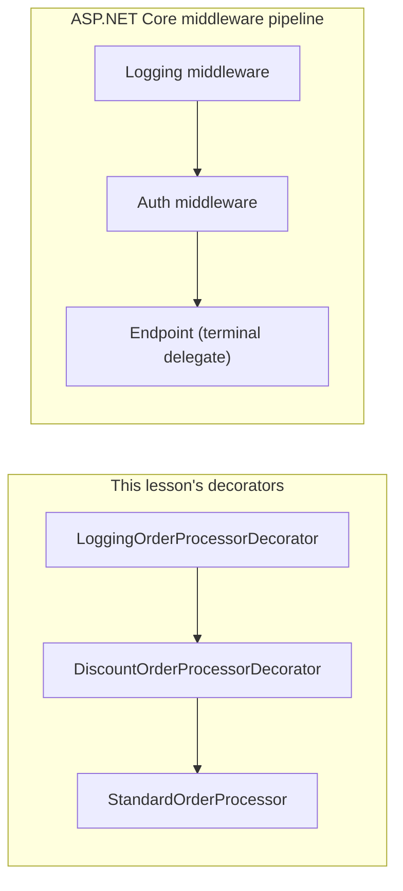

# Decorator Pattern

## Introduction

Before reading this lesson, you should already be comfortable with **[Adapter Pattern](../12-advanced-concepts/12-11-adapter-pattern.md)**, especially its central lesson that wrapping an object in a class implementing the same interface is a legitimate structural technique. The Adapter Pattern used that wrapping to reconcile a mismatched interface without changing behavior. This lesson uses the exact same wrapping mechanic for the opposite purpose: adding genuinely new behavior around an object, dynamically, without touching that object's source code at all.

By the end of this lesson, you will be able to:

- Explain what problem the Decorator Pattern solves and why subclassing alone doesn't scale to it
- Implement a decorator that wraps an interface and adds behavior before or after delegating to the wrapped object
- Stack multiple decorators to compose several independent behaviors at runtime
- Apply the Decorator Pattern to layer logging and discount logic onto order processing
- Recognize ASP.NET Core middleware as this same pattern operating at the framework level

## Decorator Pattern — A Layman's Perspective

Think about ordering a plain coffee and then choosing what to add to it. The barista starts with a base cup of coffee — nothing more. You can ask for it with milk added. You can ask for that milk-added coffee to also get a shot of caramel syrup. You can ask for that caramel-and-milk coffee to also get whipped cream on top. At no point did anyone go back to the coffee plant and grow a different bean to produce "caramel coffee" as its own separate crop — each addition is a wrapping step applied on top of whatever came before it, and every step still hands you back something that is, fundamentally, still a cup of coffee you can drink, add more to, or hand to someone else exactly like any other cup.

Notice what would happen if the coffee shop tried to handle this differently — by preparing a separate, fixed recipe for every possible combination in advance: "plain coffee," "coffee with milk," "coffee with caramel," "coffee with milk and caramel," "coffee with milk, caramel, and whipped cream," and so on. Every new addable ingredient doubles the number of fixed recipes needed, because each existing combination now needs a version with and without the new ingredient. Three optional add-ins already means eight separate recipes; a fourth pushes it to sixteen. That explosion is exactly what happens in code when you try to model "the same object, but with optional extra behavior" using subclassing alone — a `LoggingDiscountedOrderProcessor` subclass sitting next to a `DiscountedOrderProcessor` subclass sitting next to a `LoggingOrderProcessor` subclass, multiplying out of control as more optional behaviors are added.

The coffee shop's actual solution — building the drink by wrapping one preparation step around another, each step indifferent to how many steps came before it — is the Decorator Pattern. Each "add-in" is a small, independent wrapper that takes a drink, does its one job (pour in milk, pump in syrup, add cream), and hands back something that still looks and behaves like a drink to whatever step comes next. Order matters (milk poured in before whipped cream is stacked on top behaves differently from the reverse), but the ingredients themselves never need to know about each other, and any new add-in the shop introduces next season is just one more small wrapping step — not a fresh multiplication of the entire recipe list.

The bridge to code is direct: an object implementing some interface is the base drink. A decorator is a class that implements that *same* interface, holds a reference to another instance of it, and does its own extra work immediately before or after forwarding the call along — exactly like a barista pouring in one ingredient and passing the cup to the next station. Stack enough decorators and you get exactly the combinatorial flexibility of a coffee counter's menu, without ever writing a combinatorial number of classes.

## Decorator Pattern — A Programming Language Perspective

The Decorator Pattern is a structural design pattern that attaches additional responsibilities to an object dynamically by wrapping it in one or more decorator classes that implement the same interface as the object they wrap. Each decorator holds a private reference to a `Component` (typically the shared interface), implements every member of that interface, and — unlike the Adapter Pattern — actually executes new logic in addition to delegating the call, rather than merely reshaping it. Because every decorator implements the same interface it wraps, decorators compose: a decorator can wrap another decorator, which wraps another, which finally wraps the real, "concrete" component, and the client holding the outermost reference cannot tell how many layers exist underneath. C# has no dedicated decorator syntax — this pattern is expressed with plain interface implementation and constructor injection of the wrapped instance, often paired with primary constructors for brevity.

## How to Implement the Decorator Pattern in C#

A decorator needs a shared `Component` interface, a `ConcreteComponent` implementing the base behavior, and one or more `Decorator` classes that also implement `Component` while wrapping another `Component` instance.


*Figure 1: Both decorators and the concrete component implement `IComponent`, so decorators can wrap the component — or wrap each other.*

```csharp
// Program.cs — .NET 10 / C# 14
interface IComponent
{
    string Operation();
}

class ConcreteComponent : IComponent
{
    public string Operation() => "ConcreteComponent";
}

class DecoratorA(IComponent inner) : IComponent
{
    public string Operation() => $"DecoratorA({inner.Operation()})";
}

class DecoratorB(IComponent inner) : IComponent
{
    public string Operation() => $"DecoratorB({inner.Operation()})";
}

IComponent plain = new ConcreteComponent();
IComponent wrapped = new DecoratorB(new DecoratorA(plain));

Console.WriteLine(plain.Operation());
Console.WriteLine(wrapped.Operation());
```

**Console Output:**

```text
ConcreteComponent
DecoratorB(DecoratorA(ConcreteComponent))
```

The second line shows the stack in action: `wrapped.Operation()` calls into `DecoratorB`, which calls into `DecoratorA`, which finally calls into `ConcreteComponent` — each layer adding its own text around whatever the inner call returned. Reordering the wrapping (`new DecoratorA(new DecoratorB(plain))`) would produce `DecoratorA(DecoratorB(ConcreteComponent))` instead — the same layers, composed in the opposite order.

## Real-Time Example: Decorating Order Processing in E-Commerce Order Processing

We continue the E-Commerce Order Processing case study, extending the `IPaymentProcessor`-style thinking from the previous lesson to a parallel `IOrderProcessor` interface. The base implementation, `StandardOrderProcessor`, just processes an order. We want two optional, independently toggleable behaviors layered around it: logging every processing call, and applying a loyalty discount — without modifying `StandardOrderProcessor` itself or writing a combinatorial number of subclasses for every combination.

```csharp
// Program.cs — .NET 10 / C# 14 — Real-Time Example (E-Commerce Order Processing)
record Order(int OrderId, decimal Total);

interface IOrderProcessor
{
    decimal Process(Order order);
}

class StandardOrderProcessor : IOrderProcessor
{
    public decimal Process(Order order)
    {
        Console.WriteLine($"[StandardOrderProcessor] Processing order #{order.OrderId}");
        return order.Total;
    }
}

// Decorator: logs before and after delegating.
class LoggingOrderProcessorDecorator(IOrderProcessor inner) : IOrderProcessor
{
    public decimal Process(Order order)
    {
        Console.WriteLine($"[Logging] Starting order #{order.OrderId}");
        decimal result = inner.Process(order);
        Console.WriteLine($"[Logging] Finished order #{order.OrderId} — charged {result:C}");
        return result;
    }
}

// Decorator: applies a 10% loyalty discount, then delegates.
class DiscountOrderProcessorDecorator(IOrderProcessor inner, decimal discountRate) : IOrderProcessor
{
    public decimal Process(Order order)
    {
        var discounted = order with { Total = order.Total * (1 - discountRate) };
        Console.WriteLine($"[Discount] Applied {discountRate:P0} — {order.Total:C} -> {discounted.Total:C}");
        return inner.Process(discounted);
    }
}

IOrderProcessor processor =
    new LoggingOrderProcessorDecorator(
        new DiscountOrderProcessorDecorator(
            new StandardOrderProcessor(),
            discountRate: 0.10m));

var order4471 = new Order(OrderId: 4471, Total: 250.00m);
decimal charged = processor.Process(order4471);
Console.WriteLine($"Final amount charged: {charged:C}");
```

**Console Output:**

```text
[Logging] Starting order #4471
[Discount] Applied 10% — $250.00 -> $225.00
[StandardOrderProcessor] Processing order #4471
[Logging] Finished order #4471 — charged $225.00
Final amount charged: $225.00
```

Neither `StandardOrderProcessor` nor the discount logic ever had to know logging existed, and the logging decorator never had to know a discount was involved — each layer only knows about the `IOrderProcessor` interface, exactly like the coffee counter's add-ins only knowing how to modify "a drink." A checkout flow that needs logging without a discount, or a discount without logging, composes the same two building blocks differently, with zero new classes written.

## Decorator Pattern vs. ASP.NET Core Middleware

If the stacked-wrapping shape in the example above looked familiar, that's because ASP.NET Core's middleware pipeline is this exact pattern operating at the framework level. Each middleware component receives a `RequestDelegate` representing "everything that comes after me," does its own work (logging, authentication, exception handling), and then chooses whether and when to invoke that inner delegate — precisely the role `LoggingOrderProcessorDecorator` played toward `inner.Process(order)`. `app.UseMiddleware<T>()` calls compose in registration order exactly the way `new LoggingOrderProcessorDecorator(new DiscountOrderProcessorDecorator(...))` composed by nesting constructor calls.


*Figure 2: Both structures wrap a "next step" delegate/interface repeatedly, each layer free to act before, after, or instead of calling onward.*

| Aspect | Decorator Pattern (this lesson) | ASP.NET Core Middleware |
|---|---|---|
| Wrapped unit | An object implementing a shared interface | A `RequestDelegate` representing the rest of the pipeline |
| Composed by | Nested constructor calls | `app.Use...()` calls in `Program.cs`, in registration order |
| Can skip the inner call? | Yes — a decorator can choose not to call `inner` | Yes — short-circuiting (e.g. auth failure) skips calling `next` |
| Configured at | Compile time, in application code | Startup, via the middleware pipeline builder |
| Typical use | Logging, caching, discounts, validation around business logic | Logging, auth, CORS, exception handling around HTTP requests |

## Types of Decorator in C#

The core idea appears in a few recognizable forms, plus closely related patterns covered elsewhere in this module:

1. **Object Decorator** — the composition-based style used throughout this lesson; the standard, idiomatic approach in C#.
2. **Stacked / Chained Decorators** — multiple decorators composed together, as in the Real-Time Example, to combine independent behaviors.
3. **ASP.NET Core Middleware** — this same pattern applied to `RequestDelegate` pipelines, as contrasted above.
4. **`Stream` Decorators (BCL)** — `GZipStream`, `CryptoStream`, and `BufferedStream` all wrap another `Stream` to add compression, encryption, or buffering — a decorator pattern that has shipped in .NET since its earliest versions.
5. **[Adapter Pattern](../12-advanced-concepts/12-11-adapter-pattern.md)** — the previous lesson; wraps to reconcile a mismatched interface rather than to add behavior.
6. **[Facade Pattern](../12-advanced-concepts/12-13-facade-pattern.md)** — the next lesson; simplifies access to several subsystems rather than layering behavior onto one.

## What You've Learned & What's Next

The Decorator Pattern wraps an object behind the same interface it already implements, adding new behavior before or after delegating — and because every decorator shares that interface, they stack freely to combine independent behaviors without a combinatorial explosion of subclasses. ASP.NET Core's entire middleware pipeline is this pattern at framework scale, which is worth remembering the next time you write `app.UseAuthentication()` followed by `app.UseAuthorization()`.

Continue your learning journey with **[Facade Pattern](../12-advanced-concepts/12-13-facade-pattern.md)**, where the goal shifts from adding behavior to one object to hiding the complexity of several objects behind one simplified entry point.

---
*Applies to: .NET 10 / C# 14. Last reviewed 2026-08-16.*
