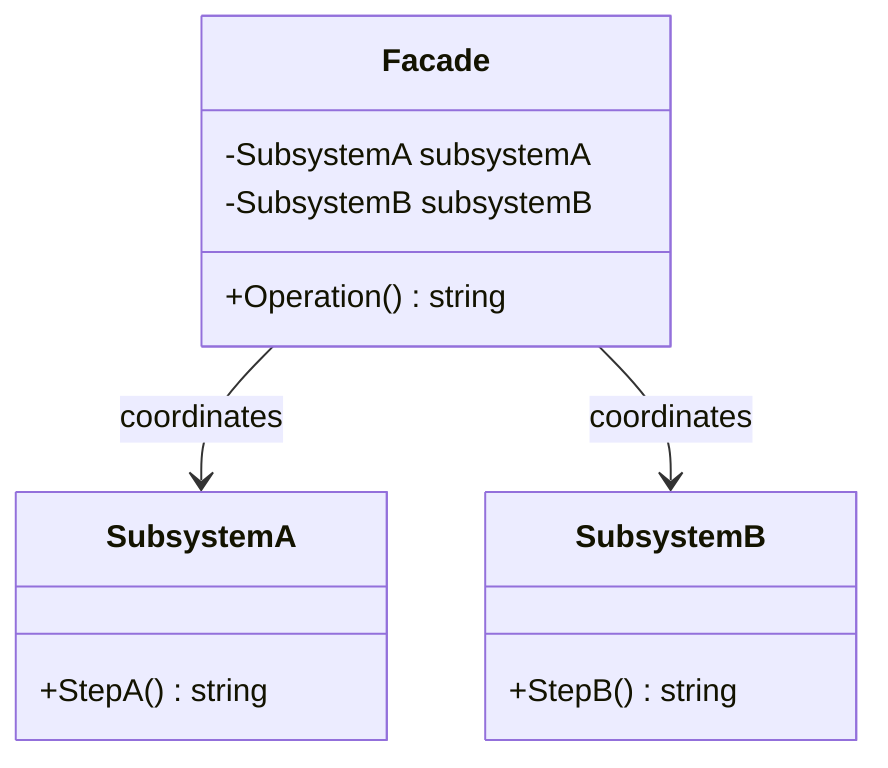
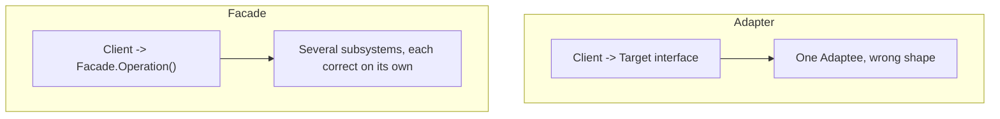

# Facade Pattern

## Introduction

Before reading this lesson, you should already be comfortable with **[Decorator Pattern](../12-advanced-concepts/12-12-decorator-pattern.md)**, and with the broader idea, shared by every structural pattern in this module, that wrapping existing code in a new class can reshape how client code experiences it. The Decorator Pattern wrapped a *single* object to add behavior to it. This lesson wraps *several* independent objects at once, for a different reason entirely: not to add behavior, but to hide the sheer number of steps and objects a caller would otherwise need to coordinate by hand.

By the end of this lesson, you will be able to:

- Explain what problem the Facade Pattern solves and why "simplified" doesn't mean "less capable"
- Distinguish a facade from the subsystems it coordinates, and explain why callers can still reach those subsystems directly if they need to
- Implement a facade class that coordinates multiple independent subsystem classes behind one method
- Apply the Facade Pattern to unify inventory, payment, and shipping behind a single `Checkout()` call
- Contrast Facade with Adapter, since both simplify access to existing code for different reasons

## Facade Pattern — A Layman's Perspective

Think about starting a car. Underneath the hood, starting an engine is genuinely complicated: fuel needs to reach the cylinders at the right pressure, the starter motor needs to turn the crankshaft, spark plugs need to fire in precise sequence, the electrical system needs to supply power to a dozen components simultaneously, and none of it can happen safely out of order. Nobody coordinates any of that by hand. Instead, the entire dashboard offers exactly one action: turn the key (or press the button). One motion, and every one of those complicated, interdependent subsystems gets triggered in the right order, automatically.

Critically, the key doesn't *replace* those subsystems — it doesn't fire the spark plugs itself or pump the fuel itself. Every one of those individual components still exists, still does its own specialized job, and a mechanic can still reach in and work with the fuel system or the starter motor directly, in isolation, when that's exactly what's needed. What the key/ignition switch provides is a single, simplified entry point for the overwhelmingly common case — "I just want the car to start" — so that the driver never needs to understand, or even know about, the coordination happening underneath.

This is the entire idea behind the Facade Pattern. A real system frequently ends up with several genuinely independent subsystems, each one legitimately complex and each one deserving to stay a separate, focused class: an inventory system that checks and reserves stock, a payment system that authorizes and charges a card, a shipping system that schedules a carrier pickup. Each of those classes is correct exactly as it is, and none of them should be merged into one, because each still needs to be usable on its own for its own specialized purposes — a warehouse tool that only checks inventory has no business also touching payment logic. But the *common* case — "a customer wants to check out" — requires coordinating all three, in a specific order, with specific error handling if any one step fails partway through. Making every caller re-derive that coordination logic by hand, scattered across the codebase, is asking every caller to be their own mechanic, wiring the fuel line to the spark plugs themselves, every single time they just wanted to start the car.

A facade is the ignition switch: one new class, sitting in front of the existing subsystems, that knows the correct order to call them in and exposes exactly one simple method for the common case. The subsystems don't change, don't get merged, and remain fully accessible on their own to any code that has a genuinely specialized reason to bypass the facade — the facade is an added convenience, never a replacement for what already existed underneath it.

## Facade Pattern — A Programming Language Perspective

The Facade Pattern is a structural design pattern that provides a simplified, unified interface to a set of interfaces in a more complex subsystem, without hiding or replacing those subsystems' own public APIs. In C# terms, a facade is ordinarily just a plain class whose constructor accepts (or constructs) instances of each subsystem class it coordinates, and whose public methods call into those subsystems in the correct sequence, translating or aggregating their individual results into one outcome the caller can act on. Unlike Adapter, a facade does not exist because any one subsystem's interface is wrong — every subsystem it wraps may already have a perfectly sensible API of its own — the facade exists purely to spare callers from needing to know about, sequence, or hold references to more than one class for the common-case operation. Facades are commonly registered in dependency injection containers alongside the subsystems they wrap, so both the facade and the underlying subsystems remain independently reachable.

## How to Implement the Facade Pattern in C#

A facade needs the existing subsystem classes it will coordinate, plus one new `Facade` class whose constructor holds references to those subsystems and whose public method sequences calls across them.


*Figure 1: `Facade` holds references to independent subsystem classes and sequences calls across them behind one method.*

```csharp
// Program.cs — .NET 10 / C# 14
class SubsystemA
{
    public string StepA() => "SubsystemA: step complete";
}

class SubsystemB
{
    public string StepB() => "SubsystemB: step complete";
}

class Facade(SubsystemA subsystemA, SubsystemB subsystemB)
{
    public string Operation()
    {
        string resultA = subsystemA.StepA();
        string resultB = subsystemB.StepB();
        return $"Facade: coordinated [{resultA}] then [{resultB}]";
    }
}

var facade = new Facade(new SubsystemA(), new SubsystemB());
Console.WriteLine(facade.Operation());

// Subsystems remain independently usable, exactly as before.
Console.WriteLine(new SubsystemA().StepA());
```

**Console Output:**

```text
Facade: coordinated [SubsystemA: step complete] then [SubsystemB: step complete]
SubsystemA: step complete
```

`Facade.Operation()` is the single method most callers will use, but the last line proves the point of the pattern: `SubsystemA` was never modified, wrapped, or hidden away — it's just as directly callable on its own as it was before the facade existed.

## Real-Time Example: An Order Checkout Facade in E-Commerce Order Processing

We continue the E-Commerce Order Processing case study. Checking out an order genuinely requires three independent subsystems to run in sequence: `InventoryService` must reserve stock, `IPaymentProcessor` (from the Adapter Pattern lesson) must charge the customer, and `ShippingService` must schedule a carrier pickup — and if payment fails, the inventory reservation must be released rather than left dangling. `OrderCheckoutFacade` is the one class that knows this sequence, so calling code never has to.

```csharp
// Program.cs — .NET 10 / C# 14 — Real-Time Example (E-Commerce Order Processing)
record Order(int OrderId, string ProductSku, int Quantity, decimal Total);

class InventoryService
{
    public bool ReserveStock(string sku, int quantity)
    {
        Console.WriteLine($"[Inventory] Reserved {quantity} unit(s) of {sku}");
        return true;
    }

    public void ReleaseStock(string sku, int quantity) =>
        Console.WriteLine($"[Inventory] Released {quantity} unit(s) of {sku} back to stock");
}

class PaymentService
{
    public bool Charge(decimal amount)
    {
        Console.WriteLine($"[Payment] Charged {amount:C}");
        return amount <= 1000.00m; // simulate a decline above this threshold
    }
}

class ShippingService
{
    public void SchedulePickup(int orderId) =>
        Console.WriteLine($"[Shipping] Pickup scheduled for order #{orderId}");
}

class OrderCheckoutFacade(InventoryService inventory, PaymentService payment, ShippingService shipping)
{
    public bool Checkout(Order order)
    {
        if (!inventory.ReserveStock(order.ProductSku, order.Quantity))
        {
            Console.WriteLine($"Checkout failed for order #{order.OrderId}: out of stock");
            return false;
        }

        if (!payment.Charge(order.Total))
        {
            Console.WriteLine($"Checkout failed for order #{order.OrderId}: payment declined");
            inventory.ReleaseStock(order.ProductSku, order.Quantity);
            return false;
        }

        shipping.SchedulePickup(order.OrderId);
        Console.WriteLine($"Checkout succeeded for order #{order.OrderId}");
        return true;
    }
}

var facade = new OrderCheckoutFacade(new InventoryService(), new PaymentService(), new ShippingService());

facade.Checkout(new Order(OrderId: 4471, ProductSku: "SKU-MONITOR-4K", Quantity: 1, Total: 320.00m));
Console.WriteLine();
facade.Checkout(new Order(OrderId: 4472, ProductSku: "SKU-LAPTOP-15", Quantity: 1, Total: 1450.00m));
```

**Console Output:**

```text
[Inventory] Reserved 1 unit(s) of SKU-MONITOR-4K
[Payment] Charged $320.00
[Shipping] Pickup scheduled for order #4471
Checkout succeeded for order #4471

[Inventory] Reserved 1 unit(s) of SKU-LAPTOP-15
[Payment] Charged $1,450.00
Checkout failed for order #4472: payment declined
[Inventory] Released 1 unit(s) of SKU-LAPTOP-15 back to stock
```

Calling code anywhere in the application — a web controller, a background job, a test — now calls `facade.Checkout(order)` and never needs to know that three separate services, and a compensating rollback step, exist behind it. `InventoryService`, `PaymentService`, and `ShippingService` remain fully independent classes a warehouse tool or a refunds tool could still use directly, exactly as the ignition-switch analogy described.

## Facade Pattern vs. Adapter Pattern

Both patterns place a new class in front of existing code, and both aim to make that existing code easier for callers to work with — which is why they're easy to conflate. The difference is *what's wrong* with the existing code. Adapter exists because exactly one existing class has the *wrong shape* — a mismatched interface the client can't call directly — and the adapter's whole job is translating that one shape into the one expected. Facade exists because *several* existing classes each have a perfectly fine shape individually, but calling all of them correctly, in order, is more coordination than most callers should have to repeat.


*Figure 2: Adapter reshapes one mismatched class; Facade coordinates several already-correct classes.*

| Aspect | Adapter Pattern | Facade Pattern |
|---|---|---|
| Number of wrapped classes | One (the Adaptee) | Several (the subsystems) |
| What's "wrong" underneath | The interface shape | Nothing — just too much coordination |
| Wrapped classes still usable directly? | Rarely the point — client shouldn't need to | Yes, by design, for specialized callers |
| Adds new behavior? | No — only reshapes | No — only sequences and simplifies |
| Typical trigger | A legacy class or third-party library | A multi-step workflow spanning several services |

## Types of Facade in C#

The core idea has a few common variations, plus closely related patterns covered elsewhere in this module:

1. **Basic Facade** — a single class coordinating a fixed set of subsystems, as shown in this lesson.
2. **Facade over an Interface** — exposing the facade itself as an interface (e.g. `ICheckoutFacade`) so it can be mocked in tests, common wherever DI is already in use.
3. **Layered Facade** — a facade that itself calls into a lower-level facade, useful when a subsystem is large enough to warrant its own internal simplification layer.
4. **Facade in Minimal APIs** — an ASP.NET Core minimal API endpoint delegate that itself acts as a thin facade over injected services, a shape you've likely already written without naming it.
5. **[Adapter Pattern](../12-advanced-concepts/12-11-adapter-pattern.md)** — reshapes one mismatched interface, rather than coordinating several correct ones.
6. **[Proxy Pattern](../12-advanced-concepts/12-14-proxy-pattern.md)** — the next lesson; controls access to a single object rather than simplifying access to several.

## What You've Learned & What's Next

The Facade Pattern hides the coordination complexity of several independent subsystems behind one simplified method, without merging, replacing, or hiding those subsystems' own APIs — they remain fully usable on their own for callers with more specialized needs. `OrderCheckoutFacade` is the ignition switch for checkout: one call, three subsystems, correctly sequenced every time.

Continue your learning journey with **[Proxy Pattern](../12-advanced-concepts/12-14-proxy-pattern.md)**, where the goal shifts again — from simplifying access to several objects, to controlling access to a single one.

---
*Applies to: .NET 10 / C# 14. Last reviewed 2026-08-16.*
