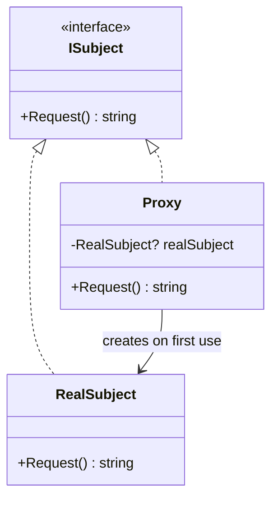
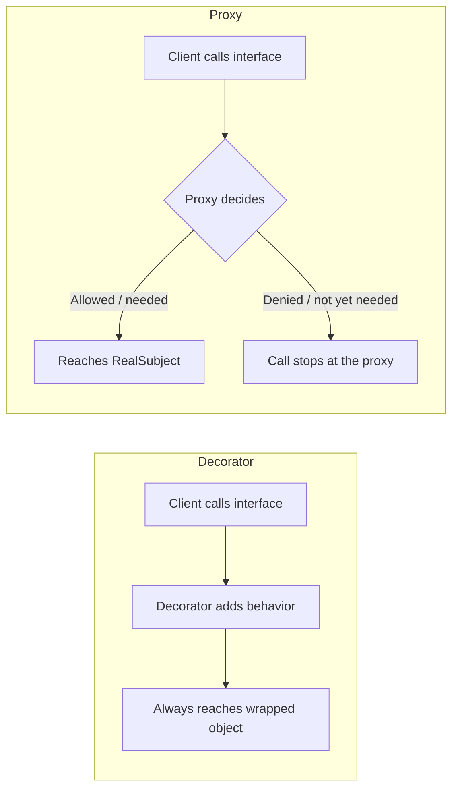

# Proxy Pattern

## Introduction

Before reading this lesson, you should already be comfortable with **[Facade Pattern](../12-advanced-concepts/12-13-facade-pattern.md)**, and with the recurring structural-pattern theme that a new class placed in front of existing code can change how callers experience it, without changing the code underneath. The Facade Pattern coordinated *several* subsystems behind one simplified entry point. This lesson returns to controlling access to a *single* object — but for a different reason than Adapter's mismatched shape or Decorator's added behavior: controlling *when*, *whether*, or *how* a caller is allowed to reach that one object at all.

By the end of this lesson, you will be able to:

- Explain what problem the Proxy Pattern solves and name its common variants: virtual, protection, and remote proxies
- Implement a proxy that implements the same interface as its real subject and controls access to it
- Apply lazy initialization inside a proxy so an expensive resource is only created on first actual use
- Apply the Proxy Pattern to defer loading an expensive book cover image until it's actually displayed
- Contrast Proxy with Decorator, since both wrap a matching interface but for different reasons

## Proxy Pattern — A Layman's Perspective

Picture a busy executive's front desk, staffed by an assistant. Anyone wanting a meeting doesn't walk straight into the executive's office — they go through the assistant first. From the visitor's point of view, this barely matters: they still ask for "a meeting with the executive," and a meeting is still what they eventually get. But the assistant is doing real work in between that request and the actual meeting. If the executive is away, the assistant says so immediately, without ever bothering the executive at all. If the visitor doesn't have appropriate clearance, the assistant declines the request on the spot. And critically, the assistant doesn't wake the executive up, prepare a conference room, and pull the relevant files the moment the *building* opens for the day, on the off chance someone might ask for a meeting — all of that real setup work only happens once an actual visitor actually shows up and the meeting is actually going to happen.

This is precisely the role a proxy plays for an object in code. Some objects are expensive or sensitive enough that you don't want them created, contacted, or fully initialized the instant a reference to them exists in memory — you want that cost or that access check to happen only exactly when it's genuinely needed, and not a moment before. A proxy is a stand-in that looks, from the caller's point of view, exactly like the real thing — it implements the very same interface — but internally it decides when to actually create, contact, or forward to the real object, and it can add its own checks (is this visitor cleared? has the real object even been created yet?) along the way.

The assistant analogy also makes the three classic flavors of proxy easy to tell apart. A **virtual proxy** is the assistant deferring the expensive part — pulling files, prepping a room — until a visitor genuinely shows up, exactly like a proxy that delays creating an expensive object until its first real use. A **protection proxy** is the assistant checking a visitor's clearance before ever letting them through, exactly like a proxy that checks permissions before forwarding a call to the real object. And a **remote proxy** is a satellite office's own front desk, handling a request locally that actually needs to be relayed to an executive sitting in an entirely different building — exactly like a proxy standing in for an object that actually lives on another server, over the network.

In every one of these flavors, the caller-facing shape never changes: a visitor asks for a meeting the same way regardless of which kind of front desk they've walked up to. The proxy's entire value is everything it does — or deliberately avoids doing — before that request ever reaches the real, expensive, or sensitive thing behind it.

## Proxy Pattern — A Programming Language Perspective

The Proxy Pattern is a structural design pattern in which a `Proxy` class implements the same interface as a `RealSubject`, holds a reference to (or the means to create) that `RealSubject`, and controls access to it — commonly by deferring its creation, checking permissions before forwarding a call, or relaying calls across a process or network boundary. Unlike Decorator, which always adds new behavior on top of every call, a proxy's defining trait is *access control*: it may refuse a call entirely, delay creating the real object until first use (lazy initialization, often via C#'s `Lazy<T>`), or transparently redirect a call somewhere else. In C#, a proxy is ordinarily a plain class implementing the same interface as the type it stands in for, with the real object held behind a nullable or `Lazy<T>`-wrapped field that's only materialized inside the method that actually needs it.

## How to Implement the Proxy Pattern in C#

A proxy needs a shared `Subject` interface, a `RealSubject` that does the genuine (and here, deliberately expensive) work, and a `Proxy` class implementing the same interface that defers creating the `RealSubject` until it's actually needed.


*Figure 1: `Proxy` implements the same interface as `RealSubject` but only creates it the first time `Request()` is actually called.*

```csharp
// Program.cs — .NET 10 / C# 14
interface ISubject
{
    string Request();
}

class RealSubject : ISubject
{
    public RealSubject() => Console.WriteLine("RealSubject: expensive setup running now");

    public string Request() => "RealSubject: handled the request";
}

class Proxy : ISubject
{
    private RealSubject? realSubject;

    public string Request()
    {
        realSubject ??= new RealSubject(); // created only on first actual use
        return realSubject.Request();
    }
}

ISubject proxy = new Proxy();
Console.WriteLine("Proxy created — no expensive setup has run yet");
Console.WriteLine(proxy.Request());
Console.WriteLine(proxy.Request());
```

**Console Output:**

```text
Proxy created — no expensive setup has run yet
RealSubject: expensive setup running now
RealSubject: handled the request
RealSubject: handled the request
```

The expensive `RealSubject` setup message appears only once, on the first `Request()` call — not when `Proxy` itself was created, and not again on the second call, since `realSubject ??= new RealSubject()` only creates it once and reuses it afterward.

## Real-Time Example: A Lazy Book Cover Image Proxy in Library-Inventory Management

We turn to the Library/Inventory Management case study for this lesson. A library catalog lists thousands of books, and each `Book` has a cover image — but loading a full-resolution cover image from disk or a remote service is comparatively expensive, and the vast majority of catalog views (a plain text search results list) never actually display it. `LazyBookCoverImageProxy` implements the same `IBookCoverImage` interface as the real image loader, but only loads the actual image data the first time something asks to display it.

```csharp
// Program.cs — .NET 10 / C# 14 — Real-Time Example (Library-Inventory Management)
interface IBookCoverImage
{
    string GetImageData();
}

class RealBookCoverImage : IBookCoverImage
{
    private readonly string imageData;

    // Simulates an expensive load (disk/network) that happens exactly once, at construction.
    public RealBookCoverImage(string isbn)
    {
        Console.WriteLine($"[RealBookCoverImage] Loading cover data for ISBN {isbn} from storage");
        imageData = $"<binary image data for {isbn}>";
    }

    public string GetImageData() => imageData;
}

class LazyBookCoverImageProxy(string isbn) : IBookCoverImage
{
    private RealBookCoverImage? realImage;

    public string GetImageData()
    {
        if (realImage is null)
        {
            Console.WriteLine($"[Proxy] First request for ISBN {isbn} — loading full image now");
            realImage = new RealBookCoverImage(isbn);
        }
        else
        {
            Console.WriteLine($"[Proxy] ISBN {isbn} — reusing already-loaded image");
        }

        return realImage.GetImageData();
    }
}

var catalogEntries = new List<IBookCoverImage>
{
    new LazyBookCoverImageProxy("978-0134685991"),
    new LazyBookCoverImageProxy("978-0596009205"),
};

Console.WriteLine("Catalog search results rendered — no cover images loaded yet.\n");

Console.WriteLine("User opens the detail page for the first book:");
Console.WriteLine(catalogEntries[0].GetImageData());
Console.WriteLine();

Console.WriteLine("User revisits the same detail page:");
Console.WriteLine(catalogEntries[0].GetImageData());
```

**Console Output:**

```text
Catalog search results rendered — no cover images loaded yet.

User opens the detail page for the first book:
[Proxy] First request for ISBN 978-0134685991 — loading full image now
[RealBookCoverImage] Loading cover data for ISBN 978-0134685991 from storage
<binary image data for 978-0134685991>

User revisits the same detail page:
[Proxy] ISBN 978-0134685991 — reusing already-loaded image
<binary image data for 978-0134685991>
```

The second catalog entry's cover image is never loaded at all in this run, exactly as intended — most catalog searches never open a detail page for every result, and this proxy ensures the library application never pays the loading cost for covers nobody actually looks at.

## Proxy Pattern vs. Decorator Pattern

Both patterns wrap an object behind the same interface it implements, and structurally they can look nearly identical — which is exactly why they're worth contrasting explicitly, much like Adapter and Decorator were contrasted two lessons ago. The distinction, again, is intent. A decorator's job is to *always* add its behavior around a call that will, one way or another, still reach the wrapped object. A proxy's job is to *control* whether, when, or how the call reaches the real object at all — including, in the protection-proxy case, refusing to forward the call whatsoever.


*Figure 2: Decorator always forwards after adding behavior; Proxy may not forward at all.*

| Aspect | Proxy Pattern | Decorator Pattern |
|---|---|---|
| Purpose | Control access (lazy load, protect, relay remotely) | Add new behavior |
| Always reaches the wrapped object? | No — may defer, deny, or redirect | Yes — decoration doesn't skip the call |
| Client aware two objects exist? | Usually not — proxy looks identical to the real subject | Sometimes — decorators are often deliberately composed by the caller |
| Common variants | Virtual, protection, remote | Logging, caching, validation, discount |
| Typical trigger | An expensive, sensitive, or remote resource | A behavior you want optional and stackable |

## Types of Proxy in C#

The Proxy Pattern has a handful of well-known variants, plus closely related patterns covered elsewhere in this module:

1. **Virtual Proxy** — defers creating an expensive object until first use, as shown in this lesson's `LazyBookCoverImageProxy`.
2. **Protection Proxy** — checks caller permissions before forwarding a call, refusing outright if the check fails.
3. **Remote Proxy** — stands in locally for an object that actually lives on another process or server, relaying calls across that boundary (much of gRPC and WCF client code is generated remote proxies).
4. **`Lazy<T>` (BCL)** — the .NET base class library's own general-purpose virtual proxy for deferred, thread-safe initialization of any value.
5. **[Decorator Pattern](../12-advanced-concepts/12-12-decorator-pattern.md)** — wraps to always add behavior, rather than to control or defer access.
6. **[Bridge Pattern](../12-advanced-concepts/12-15-bridge-pattern.md)** — the next lesson; decouples an abstraction from its implementation rather than controlling access to a single object.

## What You've Learned & What's Next

The Proxy Pattern places a stand-in in front of a real object, implementing the same interface so callers can't tell the difference, while controlling exactly when or whether the real object is actually reached — deferring expensive work, enforcing permissions, or relaying across a boundary. `LazyBookCoverImageProxy` deferred an expensive image load until the moment it was genuinely needed, and never paid that cost for covers nobody viewed.

Continue your learning journey with **[Bridge Pattern](../12-advanced-concepts/12-15-bridge-pattern.md)**, where the focus shifts from controlling access to one object to decoupling an abstraction from its implementation so each can vary independently.

---
*Applies to: .NET 10 / C# 14. Last reviewed 2026-08-16.*
