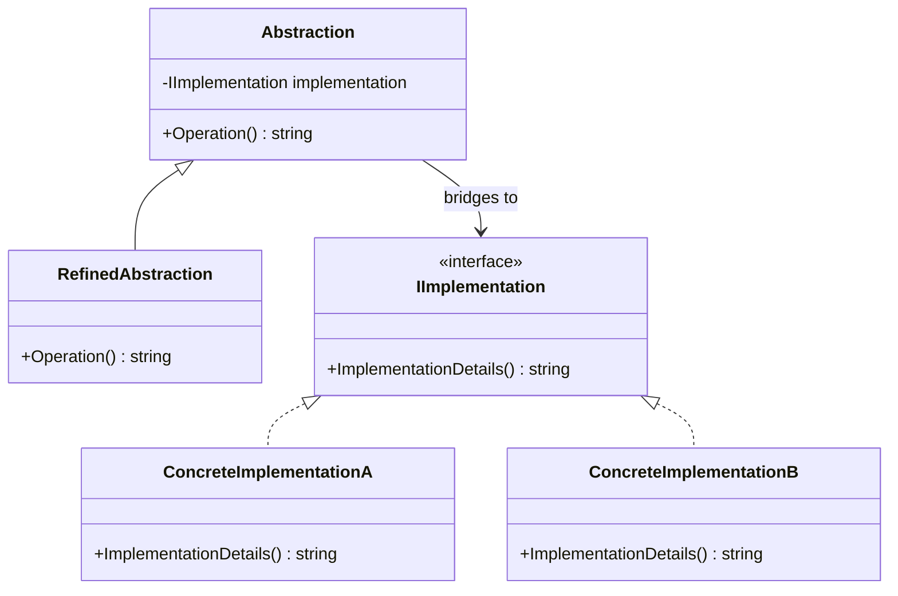
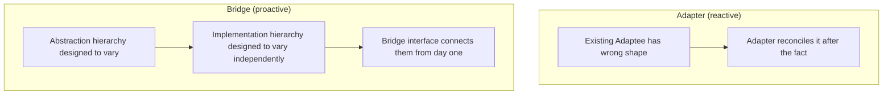

# Bridge Pattern

## Introduction

Before reading this lesson, you should already be comfortable with **[Proxy Pattern](../12-advanced-concepts/12-14-proxy-pattern.md)** and, more broadly, with the four structural patterns this module has covered so far — each one placing a new class in front of existing code for a different reason: reshaping (Adapter), adding behavior (Decorator), simplifying (Facade), or controlling access (Proxy). This lesson closes out that run with a pattern aimed squarely at a problem none of the previous four solve: what happens when a class has *two* independent reasons to vary, and subclassing tries to force both into a single inheritance hierarchy.

By the end of this lesson, you will be able to:

- Explain what problem the Bridge Pattern solves and identify the "class explosion" symptom that signals you need it
- Distinguish an abstraction hierarchy from an implementation hierarchy, and explain why Bridge keeps them separate
- Implement a Bridge by having an abstraction hold a reference to an implementation interface, rather than inheriting from a concrete class
- Apply the Bridge Pattern to decouple a `NotificationSender` abstraction from independent delivery-channel implementations
- Contrast Bridge with Adapter, since both involve an interface and a separate implementation but solve different problems

## Bridge Pattern — A Layman's Perspective

Picture a universal TV remote control, sold separately from the television itself. The remote defines a fixed set of user-facing actions: power on/off, volume up/down, channel change. Crucially, the remote does not contain a television inside it — it sends a signal, and some entirely separate device on the other end (a Sony TV, a Samsung TV, a cheap no-name brand) is responsible for actually carrying out that action in whatever way its own hardware requires. The remote's design never had to decide in advance which brand of television it would control; it was built against "whatever receives these signals and knows what to do with them," and any TV manufacturer that wants to be compatible only needs to build a receiver that understands the remote's signals.

Now picture what would happen if every combination were instead built as a single, fused unit — a "basic remote for a Sony TV," a "basic remote for a Samsung TV," an "advanced remote with recording controls for a Sony TV," an "advanced remote with recording controls for a Samsung TV." Every new remote feature set doubles against every TV brand it must support, and every new TV brand doubles against every remote feature set already built. Two categories of variation — the remote's own feature set, and the TV brand receiving its signals — get multiplied together into a combinatorial mess, purely because someone tried to bake both into one fused product line instead of keeping them as two separate, independently varying things connected by one shared signal format.

This is exactly the shape of problem the Bridge Pattern exists to prevent in code, and it's why "bridge" is the right word: it's not a translation step like Adapter, and it's not a stand-in like Proxy — it's a deliberate connector built between two things that are meant to change independently, on purpose, from day one. One side is the **abstraction** — the user-facing shape, like the remote's set of actions. The other side is the **implementation** — the actual mechanism carrying those actions out, like a specific TV brand's internal circuitry. The abstraction holds a reference to the implementation through a shared, narrow interface (the remote's signal format), and neither side needs to know the internal details of the other. Add a new remote feature set, and every existing TV brand supports it automatically, because the new remote is still just sending signals through the same interface. Add a new TV brand, and every existing remote design controls it automatically, for the identical reason.

The bridge is that shared signal interface itself — the one narrow contract both sides agree to honor, so that the two hierarchies can each grow in their own direction without ever needing to be recombined into new fused classes every time either one changes.

## Bridge Pattern — A Programming Language Perspective

The Bridge Pattern is a structural design pattern that decouples an abstraction from its implementation by having the abstraction hold a reference to an implementation *interface*, rather than inheriting directly from a concrete implementation class, so that both the abstraction hierarchy and the implementation hierarchy can vary independently. In C#, this means the "abstraction" side is typically a class (or abstract class) whose constructor accepts an instance of an `IImplementation`-style interface via composition, exactly the same "hold a reference to an interface" mechanic used by Adapter, Decorator, and Proxy earlier in this module — the difference here is intent: Bridge exists from the outset as a deliberate design decision to keep two orthogonal hierarchies separate, not as a fix applied to an existing mismatched, under-featured, or overly-accessible class. New concrete implementations only need to satisfy the shared interface; new abstraction subclasses only need to call through it — neither hierarchy's growth forces new classes in the other.

## How to Implement the Bridge Pattern in C#

A bridge needs an `Implementation` interface, one or more concrete implementations of it, and an `Abstraction` class that holds a reference to that interface (not to any one concrete implementation) and delegates to it.


*Figure 1: `Abstraction` holds a reference to `IImplementation` rather than inheriting from a concrete class — the two hierarchies vary independently.*

```csharp
// Program.cs — .NET 10 / C# 14
interface IImplementation
{
    string ImplementationDetails();
}

class ConcreteImplementationA : IImplementation
{
    public string ImplementationDetails() => "Implementation A";
}

class ConcreteImplementationB : IImplementation
{
    public string ImplementationDetails() => "Implementation B";
}

class Abstraction(IImplementation implementation)
{
    public virtual string Operation() => $"Abstraction: base operation with {implementation.ImplementationDetails()}";
}

class RefinedAbstraction(IImplementation implementation) : Abstraction(implementation)
{
    public override string Operation() => $"RefinedAbstraction: extended operation with {implementation.ImplementationDetails()}";
}

Abstraction basic = new Abstraction(new ConcreteImplementationA());
Abstraction refined = new RefinedAbstraction(new ConcreteImplementationB());

Console.WriteLine(basic.Operation());
Console.WriteLine(refined.Operation());
```

**Console Output:**

```text
Abstraction: base operation with Implementation A
RefinedAbstraction: extended operation with Implementation B
```

`RefinedAbstraction` never had to be paired with a matching "RefinedImplementation" class — it works with either `ConcreteImplementationA` or `ConcreteImplementationB` unchanged, because it only ever depends on the shared `IImplementation` interface. This is the class-explosion escape hatch in miniature: two abstraction classes and two implementation classes cover all four combinations, not four fused classes.

## Real-Time Example: Bridging Notification Channels

For this lesson's Real-Time Example, we step slightly outside the three primary case-study domains to a scenario every one of them eventually needs: sending notifications. An e-commerce order confirmation, a bank's fraud alert, and a library's overdue-book reminder all face the identical structural problem — a notification has an *abstraction* side (a plain notification, an urgent notification with retry logic) and a *channel* side (email, SMS, push) that must vary independently, without multiplying into a class per combination.

```csharp
// Program.cs — .NET 10 / C# 14 — Real-Time Example (Notification Channels)
interface INotificationChannel
{
    void Send(string recipient, string message);
}

class EmailChannel : INotificationChannel
{
    public void Send(string recipient, string message) =>
        Console.WriteLine($"[Email] To: {recipient} — \"{message}\"");
}

class SmsChannel : INotificationChannel
{
    public void Send(string recipient, string message) =>
        Console.WriteLine($"[SMS] To: {recipient} — \"{message}\"");
}

class PushChannel : INotificationChannel
{
    public void Send(string recipient, string message) =>
        Console.WriteLine($"[Push] To: {recipient} — \"{message}\"");
}

// The abstraction: bridges to whatever INotificationChannel it's given.
class NotificationSender(INotificationChannel channel)
{
    public virtual void Notify(string recipient, string message) => channel.Send(recipient, message);
}

// A refined abstraction: adds retry behavior, still independent of the channel.
class UrgentNotificationSender(INotificationChannel channel, int maxRetries) : NotificationSender(channel)
{
    public override void Notify(string recipient, string message)
    {
        for (int attempt = 1; attempt <= maxRetries; attempt++)
        {
            Console.WriteLine($"[Urgent] Attempt {attempt} of {maxRetries}:");
            base.Notify(recipient, message);
        }
    }
}

NotificationSender orderConfirmation = new NotificationSender(new EmailChannel());
orderConfirmation.Notify("alice.chen@example.com", "Your order #4471 has shipped.");

NotificationSender overdueReminder = new NotificationSender(new SmsChannel());
overdueReminder.Notify("+1-555-0142", "Your library book is due tomorrow.");

NotificationSender fraudAlert = new UrgentNotificationSender(new PushChannel(), maxRetries: 2);
fraudAlert.Notify("device-8890", "Unusual activity detected on your account.");
```

**Console Output:**

```text
[Email] To: alice.chen@example.com — "Your order #4471 has shipped."
[SMS] To: +1-555-0142 — "Your library book is due tomorrow."
[Urgent] Attempt 1 of 2:
[Push] To: device-8890 — "Unusual activity detected on your account."
[Urgent] Attempt 2 of 2:
[Push] To: device-8890 — "Unusual activity detected on your account."
```

`UrgentNotificationSender`'s retry logic works with `EmailChannel` and `SmsChannel` exactly as readily as it worked with `PushChannel` above — nothing about the retry behavior is tied to any one channel. Adding a fourth channel (say, `WhatsAppChannel`) tomorrow requires implementing `INotificationChannel` once; both `NotificationSender` and `UrgentNotificationSender` gain support for it immediately, with no new "urgent WhatsApp sender" class ever needing to be written. That is the entire payoff of the bridge: the notification-kind hierarchy and the delivery-channel hierarchy each grew once, independently, and every combination between them came for free.

## Bridge Pattern vs. Adapter Pattern

Both patterns involve an interface sitting between a client and some separate implementation, and both are built from the same "hold a reference to an interface" mechanic used throughout this module — which makes them easy to mix up on a superficial read. The distinction is about *when* and *why* the separation was introduced. Adapter is reactive: it exists because a specific existing class already has the wrong shape, and the adapter's whole purpose is reconciling that one mismatch after the fact. Bridge is proactive: the separation between abstraction and implementation is designed in from the start, specifically so that two categories of variation — not just one mismatched class — can each grow independently, before any mismatch ever occurs.


*Figure 2: Adapter fixes a mismatch after the fact; Bridge is designed in from the start to let two hierarchies vary independently.*

| Aspect | Bridge Pattern | Adapter Pattern |
|---|---|---|
| When introduced | At design time, proactively | Reactively, once a mismatch already exists |
| Number of varying hierarchies | Two (abstraction and implementation), by design | One (the Adaptee's shape needs fixing) |
| Goal | Prevent a combinatorial class explosion | Reconcile one incompatible interface |
| Both sides expected to grow? | Yes — that's the entire premise | No — the Target interface is usually fixed |
| Typical trigger | Two independent axes of variation identified up front | An existing legacy class or third-party library |

## Types of Bridge in C#

The core idea appears in a few recognizable forms, plus closely related patterns covered elsewhere in this module:

1. **Basic Bridge** — an abstraction holding a reference to an implementation interface, as shown throughout this lesson.
2. **Refined Abstraction** — a subclass of the abstraction (like `UrgentNotificationSender`) that adds behavior while remaining implementation-agnostic.
3. **Multi-Level Bridge** — a bridge where the implementation side itself has further internal variation (e.g. an `EmailChannel` supporting multiple SMTP providers underneath).
4. **`System.Data.Common` Provider Model (BCL)** — `DbConnection`/`DbCommand` bridge ADO.NET's abstraction to independently-varying provider implementations (SQL Server, PostgreSQL, SQLite), a pattern .NET has shipped since its earliest versions.
5. **[Adapter Pattern](../12-advanced-concepts/12-11-adapter-pattern.md)** — reconciles one existing mismatched interface reactively, rather than designing two hierarchies to vary independently from the start.
6. **[Composite Pattern](../12-advanced-concepts/12-16-composite-pattern.md)** — the next lesson; composes objects into tree structures rather than bridging two independent hierarchies.

## What You've Learned & What's Next

The Bridge Pattern separates an abstraction from its implementation by having the abstraction hold a reference to an implementation interface rather than inheriting from a concrete class, letting two independent categories of variation — like notification kind and delivery channel — each grow on their own without multiplying into a class per combination. This closes out the module's run through Adapter, Decorator, Facade, Proxy, and Bridge — five ways of placing an interface between a client and existing code, each solving a genuinely different problem despite sharing the same underlying composition mechanic.

Continue your learning journey with **[Composite Pattern](../12-advanced-concepts/12-16-composite-pattern.md)**, where the focus shifts to composing individual objects and groups of objects into tree structures that client code can treat uniformly.

---
*Applies to: .NET 10 / C# 14. Last reviewed 2026-08-16.*
