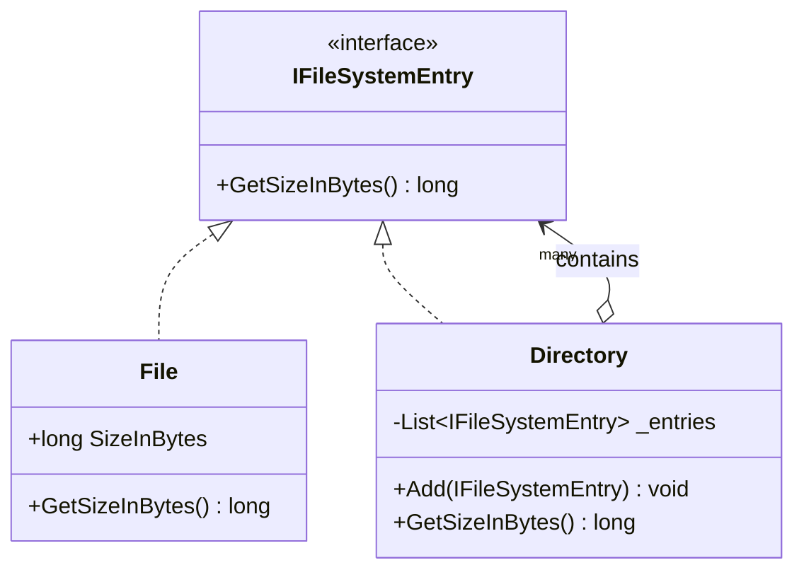
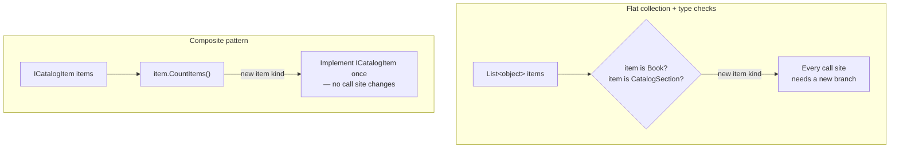

# Composite Pattern

## Introduction

Before reading this lesson, you should already be comfortable with **[Bridge Pattern](../12-advanced-concepts/12-15-bridge-pattern.md)** and, more broadly, with the idea that the Gang-of-Four structural patterns are all about assembling classes and objects into larger structures without tangling their implementations together. The Composite pattern tackles a specific, very common shape of structure: a hierarchy where some things are single, indivisible items, and other things are containers holding more of those same kinds of things — and you want client code to treat both cases identically, without ever needing an `if (isContainer)` check.

By the end of this lesson, you will be able to:

- State the Composite pattern's intent: composing objects into tree structures that represent part-whole hierarchies
- Define a single component abstraction implemented by both leaf nodes and composite (container) nodes
- Write client code that recursively aggregates a result across an entire tree without knowing its depth or shape in advance
- Add and remove children from a composite node at run time
- Recognize the tradeoff Composite accepts: leaf nodes must implement child-management members that don't really apply to them

## Composite Pattern — A Layman's Perspective

Picture a gift box sitting on a table. Inside it might be a single wrapped present — a book, say. Or it might be another, slightly smaller gift box, itself containing a present, or perhaps another box still, nested three or four layers deep before you finally hit an actual present at the bottom. From across the room, every one of these boxes looks the same: a wrapped, ribboned box sitting on the table. You cannot tell, just by looking, whether lifting the lid reveals one present or a dozen more boxes.

Now suppose someone asks you a simple question: "how many individual presents are on this table?" You can't answer by guessing at the shape of what's inside every box in advance. Instead, you open each box one at a time, using the exact same procedure regardless of what you expect to find inside. If a box contains a present directly, you count it and move on. If a box contains more boxes, you open each of those too, using that same procedure again, and again, however many layers deep the nesting goes — until every box you've opened has finally yielded actual presents, and you add up everything you found along the way. The procedure never changes based on depth; it only ever changes based on what's immediately inside the one box currently in your hands.

This is precisely the problem the Composite pattern solves in software. Some objects are single, "leaf" items with no further nesting — an individual present. Other objects are containers that hold more objects of the exact same conceptual kind — a box that might hold presents, or might hold more boxes. Without a deliberate design, code that needs to answer "how many presents total?" would need to know, at every single level, whether it's looking at a present or a box, and branch its logic accordingly — a mess of nested `if` checks that gets worse with every additional layer of nesting the real world throws at it.

The fix is to stop distinguishing between "a present" and "a box" at the interface level entirely. Both a present and a box get handed the same one label: "a thing that knows how to report a present count." A present's version of that label is trivial — it always answers "one." A box's version of that label is recursive — it asks every item it directly holds to report *its* count, using that same label, and adds the answers together, never caring whether the item answering is another present or another box three layers deep. Whoever asked the original question — "how many presents on this table?" — just asks every box on the table to report its count using that one shared label, and the correct total emerges automatically, no matter how deeply any individual box happened to be nested. That shared label, applied uniformly to both the individual item and the container holding more of the same, is what the Composite pattern formalizes in code.

## Composite Pattern — A Programming Language Perspective

Composite defines one abstraction — typically an interface or abstract class — implemented by two categories of concrete type: **leaf** types, which hold no children and implement the abstraction's operations directly, and **composite** types, which hold a collection of the same abstraction (`IEnumerable<TComponent>` or similar) and implement the abstraction's operations by delegating to, and aggregating over, that collection. Client code depends only on the shared abstraction and never needs to distinguish a leaf reference from a composite reference — polymorphism, not conditional logic, resolves which behavior actually runs. The recursive structure falls directly out of the fact that a composite's children are typed as the same abstraction the composite itself implements, so a composite can contain other composites to arbitrary depth without any change to the abstraction itself.

## How to Implement the Composite Pattern in C#

The canonical illustration of Composite is a file system: a `File` is a leaf with a fixed size, and a `Directory` is a composite holding any mix of files and further subdirectories, whose own size is simply the sum of everything it directly contains.


*Figure 1: `File` and `Directory` both implement `IFileSystemEntry`; `Directory` can hold either, to any depth.*

```csharp
// Program.cs — .NET 10 / C# 14
IFileSystemEntry root = new Directory("root");
var docs = new Directory("docs");
docs.Add(new File("resume.pdf", 45_000));
docs.Add(new File("cover-letter.docx", 22_000));

var photos = new Directory("photos");
photos.Add(new File("vacation.jpg", 3_200_000));

((Directory)root).Add(docs);
((Directory)root).Add(photos);
((Directory)root).Add(new File("notes.txt", 1_500));

Console.WriteLine($"Total size: {root.GetSizeInBytes():N0} bytes");

interface IFileSystemEntry
{
    long GetSizeInBytes();
}

class File(string name, long sizeInBytes) : IFileSystemEntry
{
    public string Name { get; } = name;
    public long GetSizeInBytes() => sizeInBytes;
}

class Directory(string name) : IFileSystemEntry
{
    private readonly List<IFileSystemEntry> _entries = [];

    public string Name { get; } = name;

    public void Add(IFileSystemEntry entry) => _entries.Add(entry);

    public long GetSizeInBytes() => _entries.Sum(entry => entry.GetSizeInBytes());
}
```

**Console Output:**

```text
Total size: 3,268,500 bytes
```

`root.GetSizeInBytes()` never checks whether `root` holds files or subdirectories directly — it just asks each of its three entries for their size and adds the results. Two of those entries happen to be `Directory` instances, which recursively ask their own children the same question, but that recursion is invisible from `root`'s point of view. `File.GetSizeInBytes()` and `Directory.GetSizeInBytes()` are both just `IFileSystemEntry.GetSizeInBytes()` as far as the caller is concerned.

## Real-Time Example: Nested Catalog Sections in Library/Inventory Management

We model the Library/Inventory Management case study's catalog as a Composite tree: an individual `Book` is a leaf, and a `CatalogSection` (say, "Fiction" or, nested inside it, "Fiction → Science Fiction") is a composite that can hold both individual `Book` items and further nested `CatalogSection`s. A librarian asking "how many items are in the Fiction wing, including every sub-section?" needs exactly the recursive count Composite provides, without writing a single special case for how deeply the wing happens to be organized.

```csharp
// Program.cs — .NET 10 / C# 14 — Real-Time Example (Library/Inventory Management)
var fiction = new CatalogSection("Fiction");
fiction.Add(new Book("The Hobbit", "978-0-618-96633-6"));
fiction.Add(new Book("Dune", "978-0-441-01359-3"));

var sciFi = new CatalogSection("Science Fiction");
sciFi.Add(new Book("Foundation", "978-0-553-29335-0"));
sciFi.Add(new Book("Neuromancer", "978-0-441-56956-4"));
sciFi.Add(new Book("Snow Crash", "978-0-553-38095-8"));
fiction.Add(sciFi);

var reference = new CatalogSection("Reference");
reference.Add(new Book("Oxford English Dictionary", "978-0-19-861186-8"));

var library = new CatalogSection("Entire Library");
library.Add(fiction);
library.Add(reference);

Console.WriteLine($"Fiction wing (including sub-sections): {fiction.CountItems()} items");
Console.WriteLine($"Entire library: {library.CountItems()} items");

interface ICatalogItem
{
    int CountItems();
}

class Book(string title, string isbn) : ICatalogItem
{
    public string Title { get; } = title;
    public string Isbn { get; } = isbn;

    public int CountItems() => 1;
}

class CatalogSection(string name) : ICatalogItem
{
    private readonly List<ICatalogItem> _items = [];

    public string Name { get; } = name;

    public void Add(ICatalogItem item) => _items.Add(item);

    public bool Remove(ICatalogItem item) => _items.Remove(item);

    public int CountItems() => _items.Sum(item => item.CountItems());
}
```

**Console Output:**

```text
Fiction wing (including sub-sections): 5 items
Entire library: 6 items
```

`fiction.CountItems()` sums two direct `Book` leaves plus whatever `sciFi.CountItems()` reports for its own three books — five in total — without `CatalogSection` ever needing to know it's holding another section rather than a book. A real library system built this way lets a librarian reorganize the catalog freely, nesting sections as deeply as the collection warrants, without a single counting or reporting query having to change to accommodate the new depth.

## Composite vs. a Flat Collection with Type Checks

The alternative to Composite is a single flat list holding a mix of item types, with client code branching on each item's runtime type — `if (item is Book) ... else if (item is CatalogSection) ...` — every time it needs to do anything recursive. That alternative technically works for one level of nesting, but it breaks down the moment a `CatalogSection` needs to contain another `CatalogSection`, because every piece of client code that ever branches on type now needs a recursive case bolted on, and every new "kind of thing" the catalog might someday hold (an `EBook`, a `Magazine`) means revisiting every one of those branches again. Composite avoids this entirely by pushing the recursion behind a single shared operation that each type implements for itself.


*Figure 2: Type-checking branches multiply at every call site; Composite concentrates the variation inside each type's own implementation.*

| Aspect | Flat Collection + Type Checks | Composite Pattern |
|---|---|---|
| Adding a new item kind | Every branching call site must add a case | Only the new type implements the shared interface |
| Nesting depth | Hard-coded, usually shallow | Arbitrary, handled uniformly by recursion |
| Client code | Must know concrete types to branch on | Depends only on the shared abstraction |
| Risk of missed cases | High — easy to forget a branch somewhere | Low — the compiler enforces the interface contract |

## Types of Composite-Related Structures in C#

Composite trees show up under several closely related names, some covered in their own dedicated lessons:

1. **[Bridge Pattern](../12-advanced-concepts/12-15-bridge-pattern.md)** — this lesson's prerequisite; separates an abstraction from its implementation rather than composing a tree, but shares Composite's structural-pattern goal of flexible object assembly.
2. **[Flyweight Pattern](../12-advanced-concepts/12-17-flyweight-pattern.md)** — next lesson; often paired with Composite so that the many leaf nodes in a large tree share common state instead of duplicating it.
3. **`System.Xml.Linq.XElement`** — the .NET base class library's own Composite: an `XElement` can contain text or further nested `XElement` children, queried uniformly regardless of depth.
4. **Visitor pattern** — frequently layered on top of a Composite tree to add new operations (rendering, validation) without modifying every leaf and composite type each time.
5. **Iterator pattern** — provides uniform traversal over a Composite tree's elements without exposing the tree's internal recursive structure to the caller.

## What You've Learned & What's Next

Composite lets a single shared abstraction represent both an individual item and any composition of those items, so client code can recurse across an entire tree — however deep it happens to be — without a single type check. The `CatalogSection` and `Book` types built here give the Library/Inventory Management case study a recursive structure that later lessons can keep extending.

Continue your learning journey with **[Flyweight Pattern](../12-advanced-concepts/12-17-flyweight-pattern.md)**, where we return to the E-Commerce Order Processing domain to see how thousands of objects can share common state instead of each duplicating it in memory.

---
*Applies to: .NET 10 / C# 14. Last reviewed 2026-08-16.*
