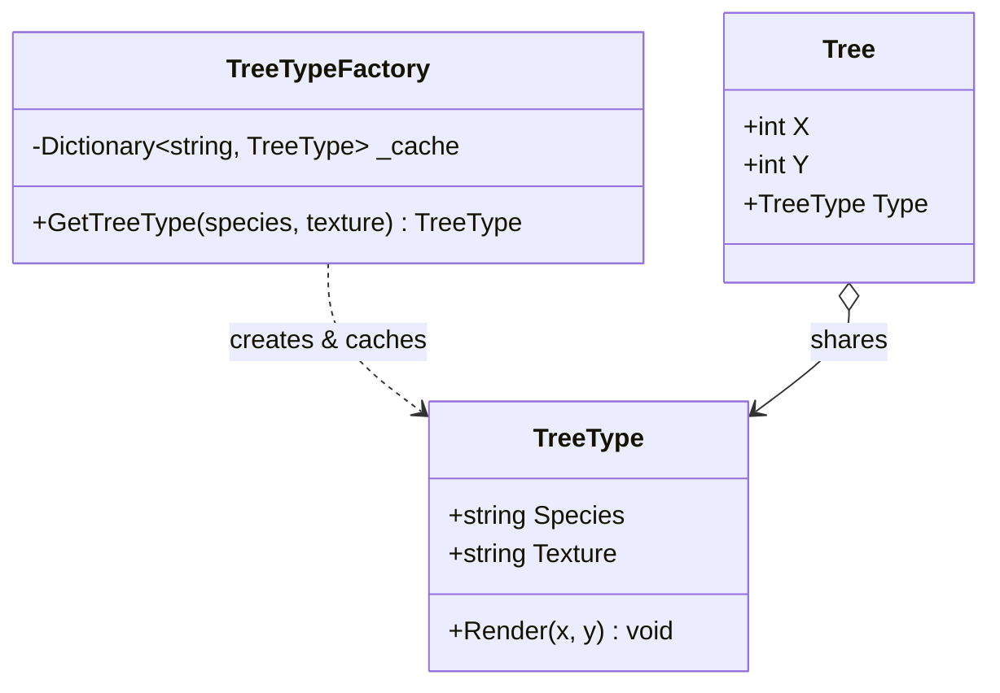
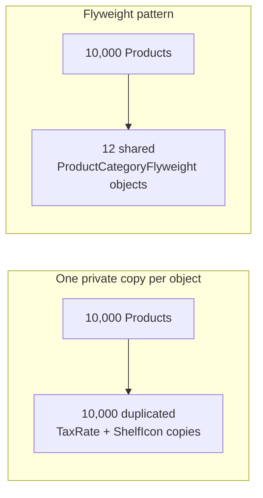

# Flyweight Pattern

## Introduction

Before reading this lesson, you should already be comfortable with **[Composite Pattern](../12-advanced-concepts/12-16-composite-pattern.md)** and, more broadly, with the idea running through this module's structural patterns: reshaping how objects relate to each other, without touching what any individual object actually does. Flyweight addresses a problem that only shows up at scale — when a program needs *many thousands* of similar objects, and naively giving each one its own private copy of data that's actually identical across most of them wastes a surprising amount of memory for no real benefit.

By the end of this lesson, you will be able to:

- State the Flyweight pattern's intent: sharing common, reusable state across many objects instead of duplicating it in each one
- Distinguish **intrinsic state** (shared, context-independent) from **extrinsic state** (unique per object, supplied by the caller)
- Implement a flyweight factory that caches and reuses shared instances instead of constructing duplicates
- Measure, with a simple count, how many distinct shared instances a flyweight factory actually created versus how many objects reference them
- Recognize when Flyweight is worth the added indirection, and when a plain object per item is simpler and perfectly fine

## Flyweight Pattern — A Layman's Perspective

Imagine a print shop that produces thousands of personalized birthday cards. Every card needs the same rose illustration printed in the corner — a detailed, full-color image that took the artist real time and ink to create. If the shop treated every single card as its own independent project, redrawing that exact same rose from scratch on every one of the ten thousand cards it prints this month, it would burn an enormous amount of artist time and ink recreating an image that never actually changes from card to card.

No print shop actually works that way, of course. Instead, the artist draws the rose exactly once, and the shop makes a single, reusable printing plate from that one drawing. Every card that needs a rose in the corner uses that same one plate, stamped down however many times are needed. What genuinely differs from card to card — the recipient's name, the personal message, the date — gets added separately, on top of the shared rose, specific to that one card and nowhere else. The rose is identical and reusable across every card; the name and message are unique to each card and supplied fresh every time.

This split is the entire idea behind Flyweight. Some piece of an object's data is genuinely shared and identical across huge numbers of instances — the rose plate. Other data is genuinely unique to each individual instance and has to be supplied separately every time — the recipient's name. A design that doesn't separate these two kinds of data ends up redrawing the rose on every single card: each object carries its own private, duplicated copy of information that thousands of other objects hold an identical copy of, multiplying memory use for no benefit whatsoever, since none of those copies are ever actually different from one another.

The fix mirrors the print shop exactly. The shared, unchanging data — the rose — gets pulled out into one object, made once, and handed out by reference to every card that needs it; that one object is the "flyweight." Whoever needs a rose asks a central place — the person who keeps the printing plates in a drawer — for "the rose plate," and either gets back the one that was already made, or, the very first time, watches one get made and then kept for every future request. Each individual card then supplies only the small amount of information that's genuinely unique to it — the name, the message — pointing back at the one shared plate for the rest. Nothing about the rose is ever duplicated in memory, no matter how many thousands of cards eventually reference it.

## Flyweight Pattern — A Programming Language Perspective

Flyweight separates an object's state into **intrinsic state** — data that is identical across many logical instances and can therefore be shared through a single object reference — and **extrinsic state** — data that genuinely varies per instance and must be supplied by the calling code at the point of use, rather than stored redundantly inside the shared object. A **flyweight factory** owns a cache, typically a `Dictionary<TKey, TFlyweight>`, and exposes a single access method (commonly `GetFlyweight(key)`) that returns an existing cached instance when one already exists for that key, or constructs and caches exactly one new instance the first time a key is seen. Because C# objects are reference types by default, many "owning" objects can hold a reference to the very same flyweight instance without any duplication of the intrinsic data it wraps — the savings come entirely from reference sharing, not from any special runtime feature.

## How to Implement the Flyweight Pattern in C#

The classic illustration renders a forest: every tree of the same species shares one `TreeType` object holding its species name and texture data (intrinsic, identical for every oak), while each individual `Tree` supplies only its own x/y position (extrinsic, unique per tree).


*Figure 1: Every `Tree` holds a reference to a shared `TreeType`; the factory ensures only one `TreeType` exists per distinct species/texture pair.*

```csharp
// Program.cs — .NET 10 / C# 14
var factory = new TreeTypeFactory();
List<Tree> forest = [];

(string species, string texture, int x, int y)[] plantings =
[
    ("Oak", "oak-bark.png", 10, 20),
    ("Oak", "oak-bark.png", 15, 45),
    ("Pine", "pine-bark.png", 30, 5),
    ("Oak", "oak-bark.png", 60, 12),
];

foreach (var (species, texture, x, y) in plantings)
{
    TreeType type = factory.GetTreeType(species, texture);
    forest.Add(new Tree(x, y, type));
}

foreach (Tree tree in forest)
{
    tree.Render();
}

Console.WriteLine($"Trees planted: {forest.Count}, distinct TreeType instances created: {factory.CreatedCount}");

class TreeType(string species, string texture)
{
    public string Species { get; } = species;
    public string Texture { get; } = texture;

    public void RenderAt(int x, int y) =>
        Console.WriteLine($"Rendering {Species} ({Texture}) at ({x}, {y})");
}

class Tree(int x, int y, TreeType type)
{
    public void Render() => type.RenderAt(x, y);
}

class TreeTypeFactory
{
    private readonly Dictionary<string, TreeType> _cache = [];

    public int CreatedCount { get; private set; }

    public TreeType GetTreeType(string species, string texture)
    {
        string key = $"{species}:{texture}";
        if (!_cache.TryGetValue(key, out TreeType? type))
        {
            type = new TreeType(species, texture);
            _cache[key] = type;
            CreatedCount++;
        }

        return type;
    }
}
```

**Console Output:**

```text
Rendering Oak (oak-bark.png) at (10, 20)
Rendering Oak (oak-bark.png) at (15, 45)
Rendering Pine (pine-bark.png) at (30, 5)
Rendering Oak (oak-bark.png) at (60, 12)
Trees planted: 4, distinct TreeType instances created: 2
```

Four trees were planted, but the factory only ever constructed two `TreeType` instances — one for "Oak," reused three times, and one for "Pine." Every `Tree` supplies its own unique `x`/`y` position (extrinsic state) at the point where it calls `RenderAt`, while the species name and texture path (intrinsic state) live in exactly one shared `TreeType` object per distinct species, no matter how many trees of that species the forest eventually contains.

## Real-Time Example: A Product Category Cache in E-Commerce Order Processing

We extend the E-Commerce Order Processing case study's `Product` catalog with a `ProductCategoryFlyweight`: category metadata — the category's display name, its tax rate, and its storage-shelf icon path — is identical for every product in the same category, so instead of each `Product` duplicating that metadata, every `Product` holds a shared reference to one `ProductCategoryFlyweight` per distinct category, obtained from a `ProductCategoryFlyweightFactory`. A catalog with ten thousand products spread across a dozen categories then holds only a dozen category objects in memory, not ten thousand duplicated copies of category metadata.

```csharp
// Program.cs — .NET 10 / C# 14 — Real-Time Example (E-Commerce Order Processing)
var factory = new ProductCategoryFlyweightFactory();

(string sku, string name, decimal price, string category)[] catalogRows =
[
    ("SKU-100", "Wireless Mouse", 24.99m, "Electronics"),
    ("SKU-101", "USB-C Hub", 39.99m, "Electronics"),
    ("SKU-200", "Novel: Dune", 12.50m, "Books"),
    ("SKU-201", "Novel: Foundation", 11.75m, "Books"),
    ("SKU-102", "Mechanical Keyboard", 89.99m, "Electronics"),
];

List<Product> catalog = [];
foreach (var (sku, name, price, category) in catalogRows)
{
    ProductCategoryFlyweight categoryData = factory.GetCategory(category);
    catalog.Add(new Product(sku, name, price, categoryData));
}

foreach (Product product in catalog)
{
    Console.WriteLine(product.DescribeWithTax());
}

Console.WriteLine($"Products: {catalog.Count}, distinct category flyweights created: {factory.CreatedCount}");

class ProductCategoryFlyweight(string name, decimal taxRate, string shelfIcon)
{
    public string Name { get; } = name;
    public decimal TaxRate { get; } = taxRate;
    public string ShelfIcon { get; } = shelfIcon;
}

class Product(string sku, string name, decimal price, ProductCategoryFlyweight category)
{
    public string Sku { get; } = sku;
    public string Name { get; } = name;
    public decimal Price { get; } = price;
    public ProductCategoryFlyweight Category { get; } = category;

    public string DescribeWithTax()
    {
        decimal priceWithTax = Price * (1 + Category.TaxRate);
        return $"{Sku} {Name} [{Category.Name}] — {priceWithTax:C} incl. tax";
    }
}

class ProductCategoryFlyweightFactory
{
    private readonly Dictionary<string, ProductCategoryFlyweight> _cache = [];

    public int CreatedCount { get; private set; }

    public ProductCategoryFlyweight GetCategory(string name)
    {
        if (!_cache.TryGetValue(name, out ProductCategoryFlyweight? category))
        {
            (decimal taxRate, string icon) = name switch
            {
                "Electronics" => (0.08m, "icon-electronics.svg"),
                "Books" => (0.00m, "icon-books.svg"),
                _ => (0.05m, "icon-generic.svg"),
            };

            category = new ProductCategoryFlyweight(name, taxRate, icon);
            _cache[name] = category;
            CreatedCount++;
        }

        return category;
    }
}
```

**Console Output:**

```text
SKU-100 Wireless Mouse [Electronics] — $26.99 incl. tax
SKU-101 USB-C Hub [Electronics] — $43.19 incl. tax
SKU-200 Novel: Dune [Books] — $12.50 incl. tax
SKU-201 Novel: Foundation [Books] — $11.75 incl. tax
SKU-102 Mechanical Keyboard [Electronics] — $97.19 incl. tax
Products: 5, distinct category flyweights created: 2
```

Five products reference only two `ProductCategoryFlyweight` instances between them — three products share the exact same "Electronics" object, and two share the same "Books" object. In a real catalog holding tens of thousands of SKUs across a stable set of categories, this is the difference between storing category metadata once per category and storing it once per SKU, which is where the memory savings actually compound.

## Flyweight vs. One Private Copy Per Object

Without Flyweight, every `Product` would carry its own private `TaxRate` and `ShelfIcon` fields, populated with the same values as every other product in that category, over and over. That duplication is harmless at a few dozen products, but it scales linearly with catalog size even though the underlying category data never actually changes — ten thousand electronics products means ten thousand duplicated copies of "8% tax rate," not two. Flyweight breaks that linear growth by capping the number of category objects at the number of *distinct* categories, regardless of how many products reference them.


*Figure 2: Memory for shared category data grows with catalog size under duplication, but stays flat at the number of distinct categories with Flyweight.*

| Aspect | One Private Copy Per Object | Flyweight Pattern |
|---|---|---|
| Shared-data memory growth | Linear with object count | Flat, bounded by distinct category count |
| Where shared data lives | Duplicated inside every object | Once per distinct value, referenced by many |
| Adding a new object | Trivial, no factory involved | Goes through the flyweight factory's cache lookup |
| Mutating shared data | Must update every duplicate individually | Update the one shared instance; every reference sees it |

## Types of Flyweight-Related Sharing in C#

Flyweight's core idea — share instead of duplicate — appears under several related names in .NET, some covered in their own dedicated lessons:

1. **[Composite Pattern](../12-advanced-concepts/12-16-composite-pattern.md)** — the previous lesson; frequently combined with Flyweight so a tree's many leaf nodes share common intrinsic data instead of each duplicating it.
2. **String interning** — .NET's own built-in flyweight for identical string literals, so `"Electronics" == "Electronics"` across the whole process can reference one shared string instance.
3. **Object pooling** (`ObjectPool<T>`) — a related but distinct optimization: reusing whole mutable object instances over time, rather than sharing immutable intrinsic state across many instances at once.
4. **`readonly record struct`** — a value-type alternative worth considering when "shared" data is small enough that copying it is actually cheaper than the indirection a reference-based flyweight introduces.
5. **The Singleton pattern** — a related creational pattern, covered elsewhere in this module's catalog, guaranteeing exactly one instance of a type; Flyweight instead guarantees exactly one instance *per distinct key*, not one instance overall.

## What You've Learned & What's Next

Flyweight separates the state an object shares with countless others of its kind from the state that's genuinely unique to it, so a factory can cache and reuse one shared instance per distinct value instead of letting every object duplicate that same data privately. The `ProductCategoryFlyweight` cache built here keeps the E-Commerce Order Processing catalog's category metadata bounded no matter how large the product list grows.

Continue your learning journey with **[Strategy Pattern](../12-advanced-concepts/12-18-strategy-pattern.md)**, this module's first behavioral pattern, where interchangeable algorithms — starting with shipping cost calculation — get swapped in and out behind a single shared interface.

---
*Applies to: .NET 10 / C# 14. Last reviewed 2026-08-16.*
