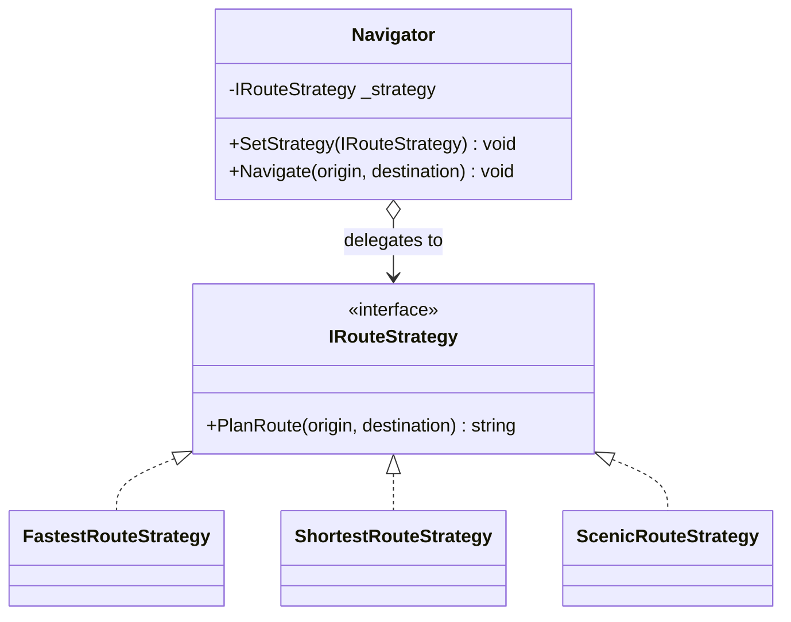
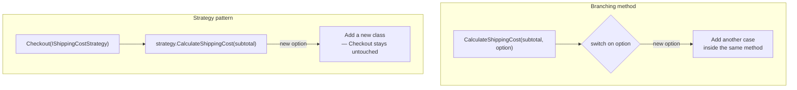

# Strategy Pattern

## Introduction

Before reading this lesson, you should already be comfortable with **[Flyweight Pattern](../12-advanced-concepts/12-17-flyweight-pattern.md)**, the last of this module's structural patterns. Strategy is the first of the **behavioral patterns** — a group concerned not with how objects are assembled, but with how objects communicate and divide up responsibility for behavior. Strategy also isn't a brand-new idea at this point in the curriculum: it's the design pattern that formalizes exactly what the **[Open/Closed Principle](../12-advanced-concepts/12-02-open-closed-principle.md)** lesson's discount-calculation example was already doing — swapping in a new algorithm without modifying the class that uses it — so this lesson gives that earlier example its proper name.

By the end of this lesson, you will be able to:

- State the Strategy pattern's intent: encapsulating a family of interchangeable algorithms behind one common interface
- Define a strategy interface and multiple concrete implementations of it
- Inject a chosen strategy into a context object, and swap strategies at run time without changing the context's code
- Explain how Strategy is one concrete way of satisfying the Open/Closed Principle
- Recognize when a plain delegate (`Func<T, TResult>`) is a lighter-weight substitute for a full strategy interface

## Strategy Pattern — A Layman's Perspective

Picture a delivery driver at the start of every shift, standing in front of a rack holding several different route-planning guides — one for the fastest route regardless of tolls, one that avoids highways entirely, one built around minimizing fuel cost. The driver's actual job never changes from guide to guide: pick up the package, follow whichever guide is currently in hand, drop off the package. What changes, entirely, is which specific guide gets pulled off the rack before the shift starts.

Crucially, the driver never needs to relearn how to drive, load a truck, or make a delivery just because today's guide is the fuel-saving one instead of yesterday's fastest-route one. Every guide on that rack follows the exact same format — turn-by-turn instructions the driver already knows how to read — so swapping which guide is in hand changes *which route gets driven*, not *how the driver operates*. A dispatcher who wants to switch strategies for tomorrow's shift doesn't retrain the driver at all; they just hand over a different guide from the same rack.

Now imagine the alternative: a single guide that tries to handle every possible routing preference itself, riddled with branches like "if today is a fuel-saving day, do this; if today is a fastest-route day, do that instead," all crammed into one document that grows a new branch every time management dreams up another routing preference. Every new preference means reopening and editing that same sprawling guide, at real risk of breaking one of the routing rules that already worked correctly for a different preference entirely.

The rack-of-guides approach avoids that entirely by keeping every routing algorithm in its own separate, self-contained guide, all built to the same interchangeable format. Adding a new routing preference means writing one new guide and placing it on the rack — nothing about the driver, the truck, or any of the *other* guides already on that rack needs to change. This is the Strategy pattern: a family of interchangeable algorithms, each implementing the same shared shape, freely swapped in and out of whatever uses them, without ever touching the code doing the using.

## Strategy Pattern — A Programming Language Perspective

Strategy defines an interface (or, equivalently, a delegate type) representing one interchangeable algorithm, implemented by one concrete class per variant of that algorithm. A **context** class holds a reference to the currently selected strategy — typically injected through its constructor or a settable property — and delegates the actual algorithmic work to that strategy at the point it's needed, rather than implementing the algorithm's variations itself. Because the context depends only on the shared strategy interface, not on any one concrete implementation, new strategies can be introduced by adding a new class that implements the interface, with zero changes required to the context or to any other existing strategy — the same mechanism the Open/Closed Principle lesson described in the abstract. In modern C#, a strategy with only one method is frequently represented as a `Func<TInput, TResult>` delegate instead of a full interface, trading a small amount of self-documentation for less ceremony.

## How to Implement the Strategy Pattern in C#

The example below gives a `Navigator` context three interchangeable route-planning strategies — fastest, shortest, and scenic — all implementing the same `IRouteStrategy` interface, swapped at run time by assigning a different instance.


*Figure 1: `Navigator` never implements routing logic itself — it delegates to whichever `IRouteStrategy` is currently assigned.*

```csharp
// Program.cs — .NET 10 / C# 14
var navigator = new Navigator(new FastestRouteStrategy());
navigator.Navigate("Downtown", "Airport");

navigator.SetStrategy(new ScenicRouteStrategy());
navigator.Navigate("Downtown", "Airport");

interface IRouteStrategy
{
    string PlanRoute(string origin, string destination);
}

class FastestRouteStrategy : IRouteStrategy
{
    public string PlanRoute(string origin, string destination) =>
        $"{origin} -> Highway 401 -> {destination} (fastest, 22 min)";
}

class ShortestRouteStrategy : IRouteStrategy
{
    public string PlanRoute(string origin, string destination) =>
        $"{origin} -> Main St -> {destination} (shortest, 6.1 km)";
}

class ScenicRouteStrategy : IRouteStrategy
{
    public string PlanRoute(string origin, string destination) =>
        $"{origin} -> Riverside Dr -> Lakeview Rd -> {destination} (scenic, 41 min)";
}

class Navigator(IRouteStrategy strategy)
{
    private IRouteStrategy _strategy = strategy;

    public void SetStrategy(IRouteStrategy strategy) => _strategy = strategy;

    public void Navigate(string origin, string destination) =>
        Console.WriteLine(_strategy.PlanRoute(origin, destination));
}
```

**Console Output:**

```text
Downtown -> Highway 401 -> Airport (fastest, 22 min)
Downtown -> Riverside Dr -> Lakeview Rd -> Airport (scenic, 41 min)
```

`Navigator.Navigate` never checks which strategy is active — it just calls `_strategy.PlanRoute(...)` and prints whatever comes back. Swapping from `FastestRouteStrategy` to `ScenicRouteStrategy` between the two calls changed the route entirely without a single line of `Navigator` itself being touched, which is exactly the Open/Closed Principle's "open for extension, closed for modification" in action.

## Real-Time Example: Interchangeable Shipping Cost Strategies in E-Commerce Order Processing

We extend the E-Commerce Order Processing case study's checkout flow with an `IShippingCostStrategy` interface, giving an `Order` three interchangeable ways to calculate shipping: `StandardShippingStrategy` (a flat rate), `ExpressShippingStrategy` (a higher flat rate for faster delivery), and `FreeShippingOverThresholdStrategy` (free above a subtotal threshold, otherwise a standard fallback rate). The checkout code that computes a total never branches on which shipping option the customer picked — it just asks whichever strategy is currently assigned.

```csharp
// Program.cs — .NET 10 / C# 14 — Real-Time Example (E-Commerce Order Processing)
var cartSubtotal = 84.50m;

IShippingCostStrategy[] options =
[
    new StandardShippingStrategy(),
    new ExpressShippingStrategy(),
    new FreeShippingOverThresholdStrategy(threshold: 75.00m, fallbackRate: 5.99m),
];

foreach (IShippingCostStrategy strategy in options)
{
    var checkout = new Checkout(strategy);
    decimal total = checkout.CalculateTotal(cartSubtotal);
    Console.WriteLine($"{strategy.GetType().Name}: subtotal {cartSubtotal:C} + shipping = total {total:C}");
}

interface IShippingCostStrategy
{
    decimal CalculateShippingCost(decimal subtotal);
}

class StandardShippingStrategy : IShippingCostStrategy
{
    public decimal CalculateShippingCost(decimal subtotal) => 7.99m;
}

class ExpressShippingStrategy : IShippingCostStrategy
{
    public decimal CalculateShippingCost(decimal subtotal) => 18.99m;
}

class FreeShippingOverThresholdStrategy(decimal threshold, decimal fallbackRate) : IShippingCostStrategy
{
    public decimal CalculateShippingCost(decimal subtotal) =>
        subtotal >= threshold ? 0.00m : fallbackRate;
}

class Checkout(IShippingCostStrategy shippingStrategy)
{
    public decimal CalculateTotal(decimal subtotal) =>
        subtotal + shippingStrategy.CalculateShippingCost(subtotal);
}
```

**Console Output:**

```text
StandardShippingStrategy: subtotal $84.50 + shipping = total $92.49
ExpressShippingStrategy: subtotal $84.50 + shipping = total $103.49
FreeShippingOverThresholdStrategy: subtotal $84.50 + shipping = total $84.50
```

`Checkout.CalculateTotal` is identical in all three runs — it always just adds `shippingStrategy.CalculateShippingCost(subtotal)` to the subtotal. Because `$84.50` clears the `$75.00` threshold, `FreeShippingOverThresholdStrategy` waives shipping entirely on this cart, while the same cart under the other two strategies pays a flat rate regardless of subtotal. A real storefront would let the customer pick a shipping option at checkout and construct `Checkout` with whichever `IShippingCostStrategy` matches that choice — adding a future strategy, say a regional flat-rate table, never requires touching `Checkout` itself.

## Strategy Pattern vs. a Branching Method

Without Strategy, `Checkout` would need its own `CalculateShippingCost` method containing an `if`/`else if` chain (or a `switch` over a `ShippingOption` enum) covering every shipping option — and every new shipping option would mean reopening and re-testing that same method, risking a mistake in a branch that had nothing to do with the new one being added. This is precisely the violation the Open/Closed Principle lesson described in the abstract, and Strategy is the concrete pattern that fixes it: each algorithm variant becomes its own class, and `Checkout` depends only on the shared interface, never on any specific variant's implementation.


*Figure 2: A branching method grows a new case per option; Strategy grows a new class per option instead, leaving the context untouched.*

| Aspect | Branching Method | Strategy Pattern |
|---|---|---|
| Adding a new algorithm variant | Edit the existing method, add a case | Add a new class implementing the interface |
| Risk to existing behavior | Every edit risks the other branches | Existing strategy classes are never touched |
| Where the algorithm lives | Inside the context's own method | In its own dedicated, testable class |
| Runtime flexibility | Fixed once the method is compiled | Strategy instance can be swapped at any time |

## Types of Strategy-Related Approaches in C#

Strategy appears under several closely related forms in modern C#, some covered in their own dedicated lessons:

1. **[Open/Closed Principle](../12-advanced-concepts/12-02-open-closed-principle.md)** — the SOLID principle this pattern gives a concrete implementation to; revisit it to see the same discount-calculation idea before it had this pattern's name attached.
2. **`Func<T, TResult>` delegates** — a lighter-weight substitute for a single-method strategy interface, trading a named type for less ceremony; see the Module 6 delegates lessons.
3. **[Observer Pattern](../12-advanced-concepts/12-19-observer-pattern.md)** — next lesson; also decouples behavior from the object that triggers it, but notifies many observers of a change rather than selecting one interchangeable algorithm.
4. **[Command Pattern](../12-advanced-concepts/12-20-command-pattern.md)** — encapsulates an entire request as an object rather than just an algorithm, and typically supports undo, which Strategy does not address.
5. **`IComparer<T>`** — the .NET base class library's own Strategy pattern, letting `List<T>.Sort(IComparer<T>)` accept interchangeable comparison algorithms without changing `Sort` itself.

## What You've Learned & What's Next

Strategy encapsulates each variant of an algorithm in its own class behind one shared interface, so a context object can be handed any variant — and handed a different one later — without ever branching on which one it currently holds. The `IShippingCostStrategy` family built here gives the E-Commerce Order Processing checkout flow room to grow new shipping options without ever modifying `Checkout` itself.

Continue your learning journey with **[Observer Pattern](../12-advanced-concepts/12-19-observer-pattern.md)**, where a subject notifies a whole list of interested observers whenever its state changes — the same underlying idea as the C# `event` keyword you already know from Module 6.

---
*Applies to: .NET 10 / C# 14. Last reviewed 2026-08-16.*
