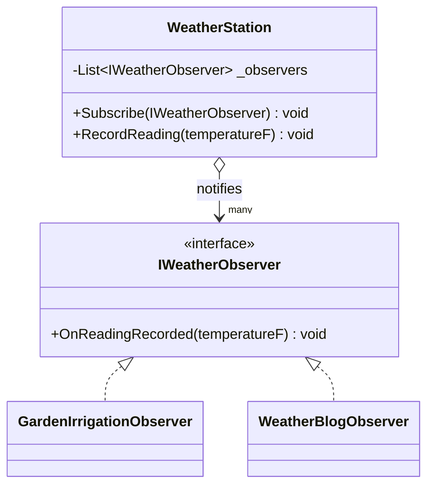
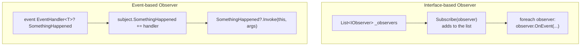

# Observer Pattern

## Introduction

Before reading this lesson, you should already be comfortable with **[Strategy Pattern](../12-advanced-concepts/12-18-strategy-pattern.md)** and, further back, with the `event` keyword from **[Events in C#](../06-delegates-events/06-04-events-in-csharp.md)**. That second prerequisite matters more than usual here: the Observer pattern describes a subject notifying a list of interested observers whenever its state changes, and that is, without exaggeration, exactly what a C# `event` already does. This lesson names the general pattern, shows it built by hand with a plain interface, and then shows the same behavior expressed idiomatically with the `event` keyword you already know.

By the end of this lesson, you will be able to:

- State the Observer pattern's intent: a subject notifying a dynamic list of observers whenever its state changes, without knowing anything about them beyond a shared interface
- Implement Observer by hand with an `IObserver`-style interface and a subject that maintains a list of subscribers
- Recognize that a C# `event` is a language-level implementation of this same subject/observer relationship
- Rebuild the same scenario using `event` and `EventHandler<TEventArgs>`, and compare the two approaches directly
- Explain why multiple, independent observers can react to the same state change without knowing about each other

## Observer Pattern — A Layman's Perspective

Picture a neighborhood weather station on the roof of a building, quietly measuring temperature every hour. Several tenants have asked the building manager to be told whenever a new reading comes in: one tenant runs a rooftop garden and wants to know immediately so they can adjust the irrigation; another tracks weather trends for a hobby blog; a third is simply curious and wants a text message each time. None of these three tenants know or care that the others exist. The weather station doesn't know or care what any of them plan to do with a new reading, either — its only job is measuring the temperature and announcing, loudly, "a new reading is in," to whoever currently happens to be signed up to hear it.

The building manager keeps a simple sign-up sheet by the station: any tenant can add their name and contact method to that sheet at any time, and remove it just as freely if they lose interest. When a new reading comes in, the station's job is mechanical and identical every single time, regardless of how many names are currently on the sheet: read down the list, and notify everyone on it, one by one. If the gardening tenant moves out and removes their name, nothing about how the station takes readings changes — the sheet just has one fewer name on it. If a fourth tenant signs up next month wanting the same notifications, the station still doesn't need to change anything about how it operates — it just has one more name to notify.

This arrangement only works because of one deliberate design choice: the weather station was never built to know about "the gardener" or "the blogger" specifically. It was built to know about one much more generic thing — "anyone who has signed up to be told about a new reading" — and every tenant, regardless of what they actually plan to do with that information, signs up using that exact same generic method. The station's only responsibility is measuring and announcing; each tenant's own reaction to the announcement — watering a garden, updating a blog, sending a text — is entirely that tenant's private business, invisible to the station and to every other tenant on the sheet.

A bank account works exactly the same way in software. Every deposit and withdrawal is a "new reading" the account announces. A fraud-monitoring system wants to hear about every one, watching for suspicious patterns. A monthly statement generator wants to hear about every one too, building up a running log. Neither of those two systems needs to know the other exists, and the `Account` itself doesn't need to know anything about fraud detection or statement formatting at all — it just needs a sign-up sheet, and a habit of reading down that sheet every time something happens worth announcing.

## Observer Pattern — A Programming Language Perspective

Observer defines a **subject** that maintains a collection of **observers**, each implementing a shared interface (or, in idiomatic modern C#, subscribed via an `event`), and notifies every currently-registered observer whenever its own state changes, by invoking a method (or the event) each observer implements or has subscribed to. Observers register and deregister themselves with the subject at run time — the subject's own code never hard-codes which specific observers exist, only that *some* collection of them currently does. Built by hand, this typically means a subject holding a `List<IObserver>` and looping over it to call each observer's update method. In idiomatic C#, the exact same relationship is expressed instead with an `event` field: subscribing is `subject.SomethingHappened += observerMethod` rather than `subject.Attach(observerInstance)`, and notifying every subscriber is `SomethingHappened?.Invoke(...)` rather than a manual loop — the language's own multicast delegate machinery replaces the hand-rolled observer list entirely.

## How to Implement the Observer Pattern with an Interface in C#

Built by hand, Observer needs an observer interface, a subject that keeps a list of registered observers, and a notification loop the subject runs whenever its state changes. The example below has a `WeatherStation` subject notify any number of `IWeatherObserver` implementations whenever a new reading comes in.


*Figure 1: `WeatherStation` loops over every registered `IWeatherObserver` each time a new reading comes in, without knowing which concrete observers it's talking to.*

```csharp
// Program.cs — .NET 10 / C# 14
var station = new WeatherStation();
station.Subscribe(new GardenIrrigationObserver());
station.Subscribe(new WeatherBlogObserver());

station.RecordReading(72);
station.RecordReading(58);

interface IWeatherObserver
{
    void OnReadingRecorded(int temperatureF);
}

class GardenIrrigationObserver : IWeatherObserver
{
    public void OnReadingRecorded(int temperatureF)
    {
        if (temperatureF >= 70)
        {
            Console.WriteLine($"[Irrigation] {temperatureF}F — running extra watering cycle");
        }
        else
        {
            Console.WriteLine($"[Irrigation] {temperatureF}F — no change needed");
        }
    }
}

class WeatherBlogObserver : IWeatherObserver
{
    public void OnReadingRecorded(int temperatureF) =>
        Console.WriteLine($"[Blog] Logging reading: {temperatureF}F");
}

class WeatherStation
{
    private readonly List<IWeatherObserver> _observers = [];

    public void Subscribe(IWeatherObserver observer) => _observers.Add(observer);

    public void RecordReading(int temperatureF)
    {
        foreach (IWeatherObserver observer in _observers)
        {
            observer.OnReadingRecorded(temperatureF);
        }
    }
}
```

**Console Output:**

```text
[Irrigation] 72F — running extra watering cycle
[Blog] Logging reading: 72F
[Irrigation] 58F — no change needed
[Blog] Logging reading: 58F
```

`WeatherStation.RecordReading` never mentions gardens or blogs by name — it only knows about the shared `IWeatherObserver` interface, and loops over however many observers happen to be registered. Both observers react independently to the exact same two readings, each doing something entirely different with the same notification, and neither one knows the other exists.

## Real-Time Example: Fraud Monitoring and Statement Generation in Banking/ATM

We extend the Banking/ATM case study's `Account` type with the modern, idiomatic version of the same pattern: instead of a hand-rolled `IAccountObserver` interface and a manual `List<IAccountObserver>`, `Account` exposes a `TransactionOccurred` **event**, and both `FraudMonitor` and `StatementGenerator` subscribe to it with `+=`. Every deposit and withdrawal raises that one event exactly once, and both subscribers react to it independently — `FraudMonitor` watching for a suspiciously large withdrawal, `StatementGenerator` simply appending a line to a running statement.

```csharp
// Program.cs — .NET 10 / C# 14 — Real-Time Example (Banking/ATM)
var account = new Account("4000123456789012", balance: 1_500.00m);

var fraudMonitor = new FraudMonitor(alertThreshold: 1_000.00m);
var statementGenerator = new StatementGenerator();

account.TransactionOccurred += fraudMonitor.OnTransaction;
account.TransactionOccurred += statementGenerator.OnTransaction;

account.Deposit(250.00m);
account.TryWithdraw(1_200.00m);
account.TryWithdraw(50.00m);

statementGenerator.PrintStatement();

class TransactionEventArgs(string kind, decimal amount, decimal balanceAfter) : EventArgs
{
    public string Kind { get; } = kind;
    public decimal Amount { get; } = amount;
    public decimal BalanceAfter { get; } = balanceAfter;
}

class Account(string accountNumber, decimal balance)
{
    public string MaskedAccountNumber { get; } = $"****{accountNumber[^4..]}";
    public decimal Balance { get; private set; } = balance;

    public event EventHandler<TransactionEventArgs>? TransactionOccurred;

    public void Deposit(decimal amount)
    {
        Balance += amount;
        TransactionOccurred?.Invoke(this, new TransactionEventArgs("Deposit", amount, Balance));
    }

    public bool TryWithdraw(decimal amount)
    {
        if (amount > Balance)
        {
            return false;
        }

        Balance -= amount;
        TransactionOccurred?.Invoke(this, new TransactionEventArgs("Withdrawal", amount, Balance));
        return true;
    }
}

class FraudMonitor(decimal alertThreshold)
{
    public void OnTransaction(object? sender, TransactionEventArgs e)
    {
        if (e.Kind == "Withdrawal" && e.Amount >= alertThreshold)
        {
            Console.WriteLine($"[FraudMonitor] ALERT: large withdrawal of {e.Amount:C}");
        }
    }
}

class StatementGenerator
{
    private readonly List<string> _lines = [];

    public void OnTransaction(object? sender, TransactionEventArgs e) =>
        _lines.Add($"{e.Kind,-10} {e.Amount,10:C}   balance after: {e.BalanceAfter:C}");

    public void PrintStatement()
    {
        Console.WriteLine("--- Statement ---");
        foreach (string line in _lines)
        {
            Console.WriteLine(line);
        }
    }
}
```

**Console Output:**

```text
[FraudMonitor] ALERT: large withdrawal of $1,200.00
--- Statement ---
Deposit       $250.00   balance after: $1,750.00
Withdrawal  $1,200.00   balance after: $550.00
Withdrawal    $50.00   balance after: $500.00
```

`Account.Deposit` and `Account.TryWithdraw` each raise `TransactionOccurred` exactly once, and both `FraudMonitor` and `StatementGenerator` react independently to every single raise — `FraudMonitor` only ever prints something when a withdrawal clears its threshold, while `StatementGenerator` records every transaction unconditionally. Neither subscriber knows the other is listening, and `Account` itself never mentions fraud detection or statements anywhere in its own code — it only ever calls `TransactionOccurred?.Invoke(...)`.

## Interface-Based Observer vs. Event-Based Observer

The `WeatherStation` example built the subject/observer relationship entirely by hand: a custom interface, a manually maintained `List<IWeatherObserver>`, and an explicit `foreach` loop to notify everyone. The `Account` example achieves the identical relationship using C#'s `event` keyword, which is doing the exact same job — maintaining a list of subscribers and notifying each of them — using the compiler's own multicast delegate machinery instead of code you wrote yourself. Nothing about the *pattern* changed between the two; only how much of the plumbing you had to write by hand did.


*Figure 2: Both approaches maintain a subscriber list and notify every subscriber — `event` just does the list-keeping and looping for you.*

| Aspect | Interface-Based Observer | Event-Based Observer (`event`) |
|---|---|---|
| Subscriber storage | A manually maintained `List<IObserver>` | Compiler-generated multicast delegate field |
| Subscribing | Custom `Attach(observer)` method | `+=` |
| Unsubscribing | Custom `Detach(observer)` method | `-=` |
| Notifying | Hand-written `foreach` loop | `SomethingHappened?.Invoke(...)` |
| Guarding against outside misuse | Depends entirely on the author's own discipline | Enforced by the compiler — outside code cannot invoke or reassign it |

## Types of Observer-Related Notification in C#

Observer's core idea — one subject, many independent reactions — appears under several closely related forms in .NET, some covered in their own dedicated lessons:

1. **[Events in C#](../06-delegates-events/06-04-events-in-csharp.md)** — the language-level implementation of this lesson's pattern, using `event` and `EventHandler<TEventArgs>` instead of a hand-written interface and observer list.
2. **[Weak Event Pattern](../06-delegates-events/06-09-weak-event-pattern.md)** — addresses a real risk with either flavor of Observer: a subject holding strong references to long-lived observers can keep them alive longer than intended.
3. **`IObservable<T>` / `IObserver<T>`** (System.Reactive) — .NET's own generalized, push-based Observer abstraction, supporting composition operators over streams of notifications.
4. **[Strategy Pattern](../12-advanced-concepts/12-18-strategy-pattern.md)** — previous lesson; also decouples behavior from a context object, but selects one interchangeable algorithm rather than notifying many independent listeners.
5. **[Command Pattern](../12-advanced-concepts/12-20-command-pattern.md)** — next lesson; encapsulates a request as an object, sometimes raised in response to the very notifications Observer delivers.

## What You've Learned & What's Next

Observer lets a subject announce that its state has changed to however many independent observers currently care, without the subject ever needing to know what any of them plan to do about it. Built by hand with an interface and a list, or expressed idiomatically with C#'s `event` keyword, it's the exact same relationship — and the `Account`, `FraudMonitor`, and `StatementGenerator` types built here give the Banking/ATM case study a foundation the next lesson builds on directly.

Continue your learning journey with **[Command Pattern](../12-advanced-concepts/12-20-command-pattern.md)**, where individual deposit and withdrawal requests against this same `Account` become objects in their own right — queueable, and undoable.

---
*Applies to: .NET 10 / C# 14. Last reviewed 2026-08-16.*
