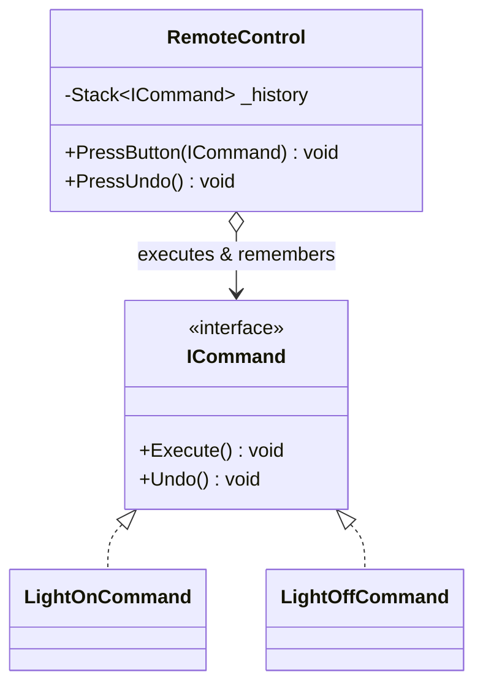
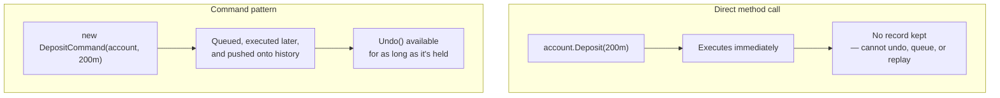

# Command Pattern

## Introduction

Before reading this lesson, you should already be comfortable with **[Observer Pattern](../12-advanced-concepts/12-19-observer-pattern.md)** and, from it, with the `Account` type from the Banking/ATM case study that notifies interested listeners whenever a transaction occurs. This lesson turns each individual transaction *request* — "deposit this amount," "withdraw this amount" — into an object in its own right, rather than a direct method call. Once a request is an object instead of a call, it can be handed around, queued up to run later, logged for an audit trail, and — the payoff this lesson focuses on — reversed.

By the end of this lesson, you will be able to:

- State the Command pattern's intent: encapsulating a request as an object with an `Execute()` method, decoupling the thing that triggers a request from the thing that carries it out
- Implement a command interface with `Execute()` and an optional `Undo()`
- Queue multiple commands and run them in order through a single invoker, without the invoker knowing what any specific command actually does
- Implement a simple "undo the last executed command" feature backed by a history stack
- Recognize the tradeoff a reversible command accepts: it must remember enough about what it did to undo it later

## Command Pattern — A Layman's Perspective

Picture a restaurant kitchen during a busy dinner rush. A server doesn't walk into the kitchen and personally cook every dish for every table — instead, they write each order down on a ticket: table number, dish, any modifications, and clip it to the rail where the kitchen staff will get to it. The server's job ends the moment that ticket is clipped up; whichever cook picks it up next reads it and does exactly what it says, in whatever order the tickets happen to be hanging in.

Notice what that ticket actually is: a self-contained little object representing one specific request, holding everything needed to carry it out, entirely separate from both the server who wrote it and the cook who will eventually act on it. The server doesn't need to know which cook will pick up the ticket, or when — they just need to know the ticket rail accepts tickets and someone competent will handle them in order. And because the ticket is a physical, standalone thing rather than the server shouting the order directly at whichever cook happens to be free, the kitchen can do things with it that a shouted order could never support: tickets can be reordered by priority, several can be queued up waiting for their turn, and — the detail every real kitchen actually relies on — a mistaken ticket can be pulled back off the rail before it's cooked, or a dish already made can be voided and struck from the bill if a customer changes their mind in time.

That last part is the deepest reason kitchens actually work this way. If an order were nothing but a spoken instruction that vanished the instant it was carried out, undoing a mistake would mean somehow reconstructing what had already happened purely from memory. A ticket, by contrast, is a record that persists — it can be pulled back, corrected, or explicitly voided, precisely because it was never just an instruction in the moment; it was an object that continued to exist after being acted on.

Software built around direct method calls — `account.Deposit(amount)` shouted straight from wherever the request originates — has exactly the shouted-order limitation. The moment you want to queue several requests, replay them in a specific order, or undo one that already ran, you're stuck, because nothing about a direct method call persists after it returns. The Command pattern is the ticket-and-rail system translated into code: each request becomes its own object, holding everything needed to carry it out and, if it needs to be reversible, everything needed to undo it too — clipped onto a queue for some invoker to work through, entirely decoupled from whoever originally wrote the ticket.

## Command Pattern — A Programming Language Perspective

Command defines an interface — conventionally `ICommand`, with an `Execute()` method and, when reversibility matters, an `Undo()` method — implemented by one concrete class per kind of request, each concrete command holding whatever data (a receiver reference, an amount, a target) it needs to carry out its one specific request. An **invoker** holds a collection of commands (often a `Queue<ICommand>` for pending work and a `Stack<ICommand>` for executed history) and calls `Execute()` on each in turn, without knowing or caring what any individual command actually does — only that it implements the shared interface. Undo support requires a command to record enough state, at execution time, to reverse its own effect later — an inherent cost of reversibility, not something the pattern grants for free. Because each command is a full object rather than a bare method call, commands can be constructed, held, passed around, and executed at a different time and place than where they were created — the same decoupling a written kitchen ticket provides over a shouted order.

## How to Implement the Command Pattern in C#

The classic illustration is a remote control: each button is bound to a `ICommand` rather than hard-wired to a specific device method, so the same `RemoteControl` invoker can operate any device and, because every command remembers how to reverse itself, undo the last button press.


*Figure 1: `RemoteControl` executes whatever `ICommand` it's handed and pushes it onto a history stack so `PressUndo()` can reverse it later.*

```csharp
// Program.cs — .NET 10 / C# 14
var livingRoomLight = new Light("Living Room");

var remote = new RemoteControl();
remote.PressButton(new LightOnCommand(livingRoomLight));
remote.PressButton(new LightOffCommand(livingRoomLight));
remote.PressUndo();

interface ICommand
{
    void Execute();
    void Undo();
}

class Light(string name)
{
    public bool IsOn { get; private set; }

    public void TurnOn()
    {
        IsOn = true;
        Console.WriteLine($"{name} light is ON");
    }

    public void TurnOff()
    {
        IsOn = false;
        Console.WriteLine($"{name} light is OFF");
    }
}

class LightOnCommand(Light light) : ICommand
{
    public void Execute() => light.TurnOn();
    public void Undo() => light.TurnOff();
}

class LightOffCommand(Light light) : ICommand
{
    public void Execute() => light.TurnOff();
    public void Undo() => light.TurnOn();
}

class RemoteControl
{
    private readonly Stack<ICommand> _history = new();

    public void PressButton(ICommand command)
    {
        command.Execute();
        _history.Push(command);
    }

    public void PressUndo()
    {
        if (_history.Count == 0)
        {
            Console.WriteLine("Nothing to undo");
            return;
        }

        ICommand lastCommand = _history.Pop();
        lastCommand.Undo();
    }
}
```

**Console Output:**

```text
Living Room light is ON
Living Room light is OFF
Living Room light is ON
```

`RemoteControl.PressButton` never mentions lights or "on" and "off" by name — it only calls `Execute()` on whatever `ICommand` it's handed, then remembers it. `PressUndo()` pops the most recently executed command off the history stack and calls its `Undo()`, which is why the light ends up back on: the last button pressed was `LightOffCommand`, and undoing it means turning the light back on.

## Real-Time Example: Queued, Undoable Transactions in Banking/ATM

We extend the Banking/ATM case study's `Account` type with `DepositCommand` and `WithdrawCommand`, each implementing `ICommand`. A `TransactionQueue` invoker accepts a batch of pending commands, executes them in order, and keeps a history stack so the ATM can support a simple "undo last transaction" button — exactly the kind of feature a real ATM offers before a session is finalized.

```csharp
// Program.cs — .NET 10 / C# 14 — Real-Time Example (Banking/ATM)
var account = new Account("4000123456789012", balance: 500.00m);
var queue = new TransactionQueue();

queue.Enqueue(new DepositCommand(account, 200.00m));
queue.Enqueue(new WithdrawCommand(account, 150.00m));
queue.Enqueue(new WithdrawCommand(account, 1_000.00m)); // exceeds balance — will fail, not queued as executed

queue.RunAll();
Console.WriteLine($"Balance after queued transactions: {account.Balance:C}");

queue.UndoLast();
Console.WriteLine($"Balance after undoing last transaction: {account.Balance:C}");

interface ICommand
{
    bool Execute();
    void Undo();
}

class Account(string accountNumber, decimal balance)
{
    public string MaskedAccountNumber { get; } = $"****{accountNumber[^4..]}";
    public decimal Balance { get; private set; } = balance;

    public void Deposit(decimal amount) => Balance += amount;

    public bool TryWithdraw(decimal amount)
    {
        if (amount > Balance)
        {
            return false;
        }

        Balance -= amount;
        return true;
    }
}

class DepositCommand(Account account, decimal amount) : ICommand
{
    public bool Execute()
    {
        account.Deposit(amount);
        Console.WriteLine($"Deposited {amount:C} -- new balance {account.Balance:C}");
        return true;
    }

    public void Undo()
    {
        account.TryWithdraw(amount);
        Console.WriteLine($"Undo deposit: withdrew back {amount:C} -- new balance {account.Balance:C}");
    }
}

class WithdrawCommand(Account account, decimal amount) : ICommand
{
    public bool Execute()
    {
        bool succeeded = account.TryWithdraw(amount);
        Console.WriteLine(succeeded
            ? $"Withdrew {amount:C} -- new balance {account.Balance:C}"
            : $"Withdrawal of {amount:C} declined -- insufficient funds (balance {account.Balance:C})");
        return succeeded;
    }

    public void Undo()
    {
        account.Deposit(amount);
        Console.WriteLine($"Undo withdrawal: redeposited {amount:C} -- new balance {account.Balance:C}");
    }
}

class TransactionQueue
{
    private readonly Queue<ICommand> _pending = new();
    private readonly Stack<ICommand> _history = new();

    public void Enqueue(ICommand command) => _pending.Enqueue(command);

    public void RunAll()
    {
        while (_pending.Count > 0)
        {
            ICommand command = _pending.Dequeue();
            if (command.Execute())
            {
                _history.Push(command); // only successfully executed commands are undoable
            }
        }
    }

    public void UndoLast()
    {
        if (_history.Count == 0)
        {
            Console.WriteLine("No transaction to undo");
            return;
        }

        _history.Pop().Undo();
    }
}
```

**Console Output:**

```text
Deposited $200.00 -- new balance $700.00
Withdrew $150.00 -- new balance $550.00
Withdrawal of $1,000.00 declined -- insufficient funds (balance $550.00)
Balance after queued transactions: $550.00
Undo withdrawal: redeposited $150.00 -- new balance $700.00
Balance after undoing last transaction: $700.00
```

The third command, a `$1,000.00` withdrawal, executes but returns `false` and is never pushed onto the history stack — an ATM has no business letting a customer "undo" a transaction that never actually happened. `UndoLast()` reverses the most recent transaction that *did* succeed, the `$150.00` withdrawal, by depositing the same amount back — restoring the balance to what it was immediately beforehand. A real ATM's "cancel last transaction" button, offered before a session ends, is this exact mechanism: a history of executed, reversible command objects, popped and undone one at a time.

## Command Pattern vs. a Direct Method Call

A direct call like `account.Deposit(200.00m)` is simpler to write and perfectly adequate when nothing beyond "do it now" is ever needed. It becomes a dead end the moment any of three things matter: running several requests as a batch in a specific order, deferring execution to a different time or place than where the request originated, or reversing a request after the fact. A direct call carries none of the information needed to undo itself once it returns — the amount and the target are gone the instant the method call ends, unless the caller separately remembers them. Command captures exactly that information, once, inside a persistent object, so it remains available for as long as the invoker keeps holding onto it.


*Figure 2: A direct call leaves nothing behind after it returns; a command object persists, so it can be queued, replayed, or undone.*

| Aspect | Direct Method Call | Command Pattern |
|---|---|---|
| Execution timing | Immediate, at the call site | Deferred — queued, then executed later by an invoker |
| Undo support | None, unless hand-built separately each time | Built into the command object's own `Undo()` |
| Batching / ordering | Requires separate bookkeeping by the caller | Natural — commands are just objects in a queue |
| Coupling | Caller must know the exact method to call | Caller only needs the shared `ICommand` interface |

## Types of Command-Related Requests in C#

Command's core idea — a request as an object — appears under several related forms in .NET, some covered in their own dedicated lessons:

1. **[Observer Pattern](../12-advanced-concepts/12-19-observer-pattern.md)** — previous lesson; frequently paired with Command, since a command's execution is a natural moment to raise a notification event for interested listeners.
2. **`Action` delegates** — a lighter-weight substitute for a full `ICommand` interface when a request needs no undo support and no extra data beyond a closure's captured variables.
3. **`ICommand` (WPF / MAUI)** — the UI-framework interface (`Execute`, `CanExecute`) that binds a button or menu item directly to a command object, a direct descendant of this exact pattern.
4. **Macro commands** — a composite `ICommand` that holds a list of other commands and executes (or undoes) all of them as one logical unit, combining Command with the Composite pattern.
5. **[Template Method Pattern](../12-advanced-concepts/12-21-template-method-pattern.md)** — next lesson; fixes an algorithm's overall steps in a base class while letting subclasses vary individual steps, a different way of structuring behavior than encapsulating a whole request as one object.

## What You've Learned & What's Next

Command turns a request into a standalone object with its own `Execute()` and, when reversibility matters, its own `Undo()`, decoupling whoever triggers a request from whoever eventually carries it out. The `DepositCommand`, `WithdrawCommand`, and `TransactionQueue` types built here give the Banking/ATM case study a queued, undoable transaction history — a feature a direct method call could never have supported on its own.

Continue your learning journey with **[Template Method Pattern](../12-advanced-concepts/12-21-template-method-pattern.md)**, where a base class fixes the overall shape of an algorithm while leaving individual steps for subclasses to fill in.

---
*Applies to: .NET 10 / C# 14. Last reviewed 2026-08-16.*
