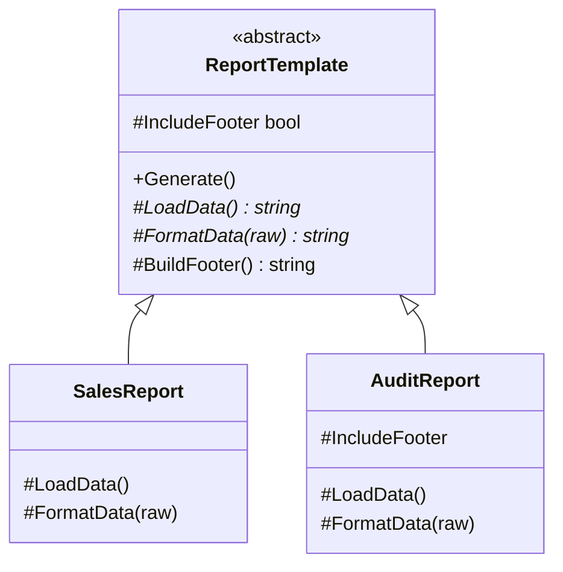
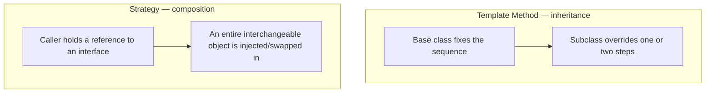

# Template Method Pattern

## Introduction

Before reading this lesson, you should already be comfortable with **[Command Pattern](../12-advanced-concepts/12-20-command-pattern.md)**, which encapsulated a single request as an object. This lesson covers a different, and in some ways opposite, problem: instead of packaging one request, **Template Method** fixes the *order* of an entire multi-step algorithm in one place, while still letting individual subclasses supply the specifics of one or two of those steps. It's the pattern behind every "the process is always the same, but one step genuinely differs" situation — and it's built entirely out of tools this curriculum has already covered: an abstract base class, virtual methods, and method overriding.

By the end of this lesson, you will be able to:

- Explain the Template Method pattern's intent: fix an algorithm's overall skeleton in a base class, deferring individual steps to subclasses
- Distinguish an **abstract primitive operation** (a step every subclass must supply) from a **hook** (an optional step with a sensible default)
- Build an abstract class whose orchestrating method calls those steps in a fixed, non-negotiable order
- Apply the pattern to a real order-processing flow — validate, charge, fulfill, notify — where only fulfillment differs by order type
- Recognize when Template Method (inheritance-based) is the wrong tool and Strategy (composition-based) is the better fit

## Template Method — A Layman's Perspective

Picture a government passport office processing an application. No matter who walks in or what they're applying for, the clerk follows an identical five-step sequence, in an identical order, every single time: check the applicant's identity documents, collect the processing fee, produce the actual travel document, and finally notify the applicant that it's ready. That order is not a suggestion — a clerk who tried to collect the fee before verifying identity, or notify the applicant before producing anything, would be doing the job wrong, and every supervisor in the building would say so immediately. The *sequence* of the process is fixed, non-negotiable, and identical for every single applicant who ever walks through that door.

And yet, one step in that sequence looks completely different depending on what's being applied for. Producing a standard ten-year passport book means sending paperwork to a physical printing facility, embossing a physical booklet, and mailing it out days later. Producing an emergency same-day digital travel authorization means generating a document electronically and emailing it within minutes. Two wildly different activities — one physical and slow, one digital and instant — sitting in the exact same slot of the exact same fixed sequence. The clerk's checklist doesn't change shape to accommodate this difference; only the *content* of that one step changes, based on which kind of application is on the counter.

Here's the detail that makes this genuinely a template, rather than just a coincidence: the office doesn't hand every new clerk a blank checklist and trust them to remember the right order from memory. It hands them a printed, numbered form with the fixed steps already listed — identity check, fee collection, document production, notification — with only the document-production line reading "see attachment for your specific document type." The form itself enforces the sequence. A new clerk handling passport books and a new clerk handling digital travel authorizations are handed the *identical* form, differing only in which attachment they're given for that one step.

Notice, too, what the form does *not* allow. It doesn't let a clerk decide, on a whim, to skip the fee-collection step for a document type they personally find tedious, or to notify the applicant before the document actually exists. The fixed steps stay fixed regardless of which document type is being processed — only the one step explicitly marked "varies by type" is ever allowed to differ.

The bridge to programming: the printed form with its fixed, numbered sequence is a base class's **template method** — a single orchestrating method that calls a series of steps in an unchangeable order. Every step the form marks as "always the same" is a concrete or default-implemented method in that base class. The one step marked "see attachment for your type" is an abstract method every subclass is *required* to supply its own implementation for — exactly the shape this lesson's real example builds around order fulfillment.

## Template Method — A Programming Language Perspective

The **Template Method** pattern defines the skeleton of an algorithm in a base class method — the *template method* — which calls a fixed sequence of other methods, some of which are left abstract for subclasses to supply (**primitive operations**), and some of which carry a sensible default implementation that a subclass may optionally override (**hooks**). The template method itself is typically left non-virtual (or marked `sealed` if overriding a virtual base member), so that no subclass can reorder, skip, or duplicate steps — only the content of individual steps varies, never the sequence they run in. This inverts normal calling conventions: rather than a subclass calling into its base class, the base class's template method calls *down* into whatever the subclass supplied — a principle sometimes called the "Hollywood principle" ("don't call us, we'll call you"). No C# 14-specific syntax is required here; this pattern has been fully expressible with `abstract`, `virtual`, and `override` since C# 1, and remains a straightforward application of inheritance and polymorphism.

## How to Apply the Template Method Pattern in C#

The smallest complete version of this pattern needs just three things: an abstract class with one non-virtual orchestrating method, at least one `abstract` step every subclass must supply, and at least one `virtual` step — a hook — with a default implementation a subclass may leave alone or override.


*Figure 1: `Generate()` is the fixed template method; `LoadData`/`FormatData` are required steps; `IncludeFooter`/`BuildFooter` is an optional hook `AuditReport` chooses to override.*

```csharp
// Program.cs — .NET 10 / C# 14

new SalesReport().Generate();
new AuditReport().Generate();

abstract class ReportTemplate
{
    // The template method: fixed sequence, never overridden or reordered by subclasses.
    public void Generate()
    {
        Console.WriteLine("Loading raw data...");
        string data = LoadData();

        Console.WriteLine("Formatting...");
        string formatted = FormatData(data);

        if (IncludeFooter) // a hook: has a default, but AuditReport overrides it below
        {
            formatted += Environment.NewLine + BuildFooter();
        }

        Console.WriteLine(formatted);
    }

    protected abstract string LoadData();
    protected abstract string FormatData(string raw);

    protected virtual bool IncludeFooter => true;
    protected virtual string BuildFooter() => "-- End of Report --";
}

class SalesReport : ReportTemplate
{
    protected override string LoadData() => "Q3 Sales: $120,000";
    protected override string FormatData(string raw) => $"[SALES REPORT]{Environment.NewLine}{raw}";
}

class AuditReport : ReportTemplate
{
    protected override string LoadData() => "3 anomalies found";
    protected override string FormatData(string raw) => $"[AUDIT REPORT]{Environment.NewLine}{raw}";
    protected override bool IncludeFooter => false; // this subclass opts out of the hook's default
}
```

**Console Output:**

```text
Loading raw data...
Formatting...
[SALES REPORT]
Q3 Sales: $120,000
-- End of Report --
Loading raw data...
Formatting...
[AUDIT REPORT]
3 anomalies found
```

`Generate()` runs in the exact same order for both reports — load, format, conditionally append a footer, print — because neither subclass can touch that sequence at all. `SalesReport` accepts the `IncludeFooter` hook's default of `true` and gets the footer line for free; `AuditReport` overrides that same hook to `false` and the footer line is silently skipped. Both subclasses were still forced to supply `LoadData` and `FormatData`, since those two are abstract, not optional.

## Real-Time Example: Order Fulfillment in E-Commerce Order Processing

We apply Template Method to the E-Commerce Order Processing case study's most repetitive real workflow: processing an order. Every order — digital or physical — must be validated, charged, fulfilled, and have the customer notified, in that exact order, with no exceptions. Only *fulfillment* genuinely differs: a digital order needs a download link generated instantly, while a physical order needs a shipment scheduled with a carrier. `OrderProcessingTemplate` fixes that four-step sequence; `DigitalOrderProcessor` and `PhysicalOrderProcessor` each supply their own `Fulfill` step, and `PhysicalOrderProcessor` additionally chooses to extend the `Notify` hook rather than accept its default.

```csharp
// Program.cs — .NET 10 / C# 14 — Real-Time Example (E-Commerce Order Processing)

List<(OrderProcessingTemplate Processor, OrderRequest Order)> orders =
[
    (new DigitalOrderProcessor(), new OrderRequest { OrderId = "ORD-5001", CustomerEmail = "alice@example.com", Amount = 49.99m }),
    (new PhysicalOrderProcessor(), new OrderRequest { OrderId = "ORD-5002", CustomerEmail = "ben@example.com", Amount = 129.50m }),
];

foreach ((OrderProcessingTemplate processor, OrderRequest order) in orders)
{
    processor.ProcessOrder(order);
    Console.WriteLine();
}

try
{
    new DigitalOrderProcessor().ProcessOrder(new OrderRequest { OrderId = "ORD-5003", CustomerEmail = "carol@example.com", Amount = 0m });
}
catch (InvalidOperationException ex)
{
    Console.WriteLine($"Processing failed: {ex.Message}");
}

class OrderRequest
{
    public string OrderId { get; init; } = "";
    public string CustomerEmail { get; init; } = "";
    public decimal Amount { get; init; }
}

abstract class OrderProcessingTemplate
{
    // The template method: validate, charge, fulfill, notify — always in this order.
    public void ProcessOrder(OrderRequest order)
    {
        Validate(order);
        Charge(order);
        Fulfill(order); // the one step every subclass must supply differently
        Notify(order);
    }

    protected virtual void Validate(OrderRequest order)
    {
        if (order.Amount <= 0)
        {
            throw new InvalidOperationException($"Order {order.OrderId} has an invalid amount.");
        }

        Console.WriteLine($"[{order.OrderId}] Validated.");
    }

    protected virtual void Charge(OrderRequest order) =>
        Console.WriteLine($"[{order.OrderId}] Charged {order.Amount:C}.");

    protected abstract void Fulfill(OrderRequest order);

    protected virtual void Notify(OrderRequest order) => // a hook — PhysicalOrderProcessor extends it below
        Console.WriteLine($"[{order.OrderId}] Email sent to {order.CustomerEmail}.");
}

class DigitalOrderProcessor : OrderProcessingTemplate
{
    protected override void Fulfill(OrderRequest order) =>
        Console.WriteLine($"[{order.OrderId}] Download link generated instantly.");
}

class PhysicalOrderProcessor : OrderProcessingTemplate
{
    protected override void Fulfill(OrderRequest order) =>
        Console.WriteLine($"[{order.OrderId}] Shipment scheduled with carrier.");

    protected override void Notify(OrderRequest order)
    {
        base.Notify(order); // keeps the hook's default behavior, then extends it
        Console.WriteLine($"[{order.OrderId}] Tracking number will follow separately.");
    }
}
```

**Console Output:**

```text
[ORD-5001] Validated.
[ORD-5001] Charged $49.99.
[ORD-5001] Download link generated instantly.
[ORD-5001] Email sent to alice@example.com.

[ORD-5002] Validated.
[ORD-5002] Charged $129.50.
[ORD-5002] Shipment scheduled with carrier.
[ORD-5002] Email sent to ben@example.com.
[ORD-5002] Tracking number will follow separately.

Processing failed: Order ORD-5003 has an invalid amount.
```

Both orders run through the identical validate-charge-fulfill-notify sequence, and neither subclass could reorder it even if it wanted to — `ProcessOrder` isn't virtual. `DigitalOrderProcessor` accepts the `Notify` hook's default outright; `PhysicalOrderProcessor` calls `base.Notify(order)` to keep that default and then adds a tracking-number line on top, which is exactly what a hook is for. The invalid `ORD-5003` order never reaches `Fulfill` or `Notify` at all — `Validate` throws first, and the fixed sequence simply never advances past the step that failed.

## Template Method vs Strategy

Both patterns let a caller obtain different behavior from the same overall calling code, but they achieve it in opposite ways. Template Method uses **inheritance**: a subclass overrides one or two steps of an algorithm whose overall sequence lives, fixed, in a shared base class — you cannot use a `PhysicalOrderProcessor`'s fulfillment logic without also being a subclass of `OrderProcessingTemplate`. Strategy, covered in [lesson 12-18](../12-advanced-concepts/12-18-strategy-pattern.md), uses **composition**: an entire interchangeable algorithm is injected as an object implementing a shared interface, and the caller can swap that object out at runtime without any inheritance relationship at all — recall `IShippingStrategy`, where `StandardShipping` and `ExpressShipping` were unrelated classes plugged into the same calling code. Template Method is the right call when most of an algorithm is genuinely identical across cases and only a step or two varies; Strategy is the right call when the *entire* algorithm needs to be swappable, potentially at runtime, with no shared base class required at all.


*Figure 2: Template Method varies one step of a fixed sequence via inheritance; Strategy varies the whole algorithm via an injected, swappable object.*

| Aspect | Template Method | Strategy |
|---|---|---|
| Mechanism | Inheritance — subclass overrides specific steps | Composition — an interchangeable object is injected |
| Where the sequence lives | Fixed in the base class's template method | Entirely inside whichever strategy object is currently plugged in |
| Runtime flexibility | None — a subclass's behavior is fixed once instantiated | High — the injected strategy can be swapped at any time |
| Typical relationship | IS-A (subclass of the abstract template) | HAS-A (holds a reference to a strategy interface) |
| Example from this curriculum | `OrderProcessingTemplate` and its two subclasses | `IShippingStrategy` from lesson 12-18 |

## Types and Concepts Around Template Method in C#

1. **Abstract primitive operations vs hooks** — the two kinds of step a template method can call, covered directly in this lesson: one mandatory, one optional with a default.
2. **[Strategy Pattern](../12-advanced-concepts/12-18-strategy-pattern.md)** — the composition-based alternative for varying an entire algorithm rather than one step of it.
3. **[Factory Method Pattern](../12-advanced-concepts/12-07-factory-method-pattern.md)** — another pattern built around a subclass supplying one abstract "primitive operation," here specialized to object creation.
4. **[Command Pattern](../12-advanced-concepts/12-20-command-pattern.md)** — this lesson's prerequisite, encapsulating a single request as an object rather than an algorithm's full sequence.
5. **[Sealed Classes and Methods](../02-oop/02-17-sealed-classes-and-methods.md)** — how to prevent a further subclass from re-overriding a step that a closer subclass has already finalized.
6. **[Iterator Pattern](../12-advanced-concepts/12-22-iterator-pattern.md)** — next lesson.

## What You've Learned & What's Next

Template Method fixes an algorithm's sequence once, in a base class, and lets subclasses supply only the steps that genuinely differ — abstract steps are mandatory, hooks are optional overrides with a sensible default. The `OrderProcessingTemplate` example proved the sequence itself is never negotiable: validation always runs first, notification always runs last, no matter which concrete processor handles the order.

Continue your learning journey with **[Iterator Pattern](../12-advanced-concepts/12-22-iterator-pattern.md)**, where you'll see a pattern C# already gives you for free through `IEnumerable<T>` and `yield return` — and where a custom iterator still earns its place when you need a traversal order different from a collection's own internal storage.

---
*Applies to: .NET 10 / C# 14. Last reviewed 2026-08-16.*
