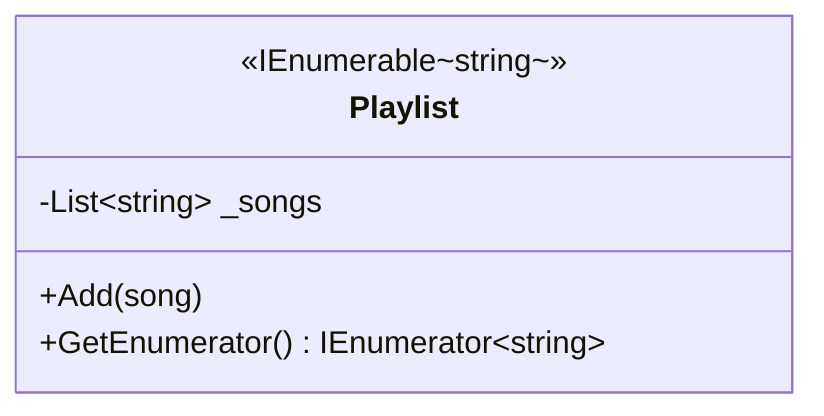
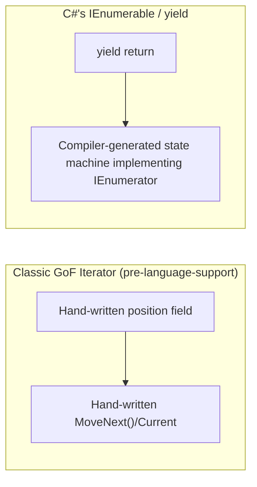

# Iterator Pattern

## Introduction

Before reading this lesson, you should already be comfortable with **[Template Method Pattern](../12-advanced-concepts/12-21-template-method-pattern.md)**. This lesson is unusual among the Gang-of-Four catalog for one honest reason: you have already been using it since Module 03. The **Iterator** pattern's entire intent — provide a way to access the elements of a collection sequentially without exposing how that collection stores them internally — is exactly what `IEnumerable<T>`, `IEnumerator<T>`, and `foreach` give you, natively, in every C# program you've written. This lesson names that shape formally, then shows the one situation where you'd still write a custom iterator by hand: when the traversal order you want to expose is genuinely different from the collection's own internal storage order.

By the end of this lesson, you will be able to:

- State the Iterator pattern's intent and recognize `IEnumerable<T>`/`IEnumerator<T>` as C#'s first-class realization of it
- Explain why C# developers rarely hand-write the classic GoF Iterator/Aggregate class pair anymore
- Build a custom iterator (`BookShelfIterator`) that exposes a traversal order different from a collection's internal storage
- Distinguish an **internal iterator** (`foreach`, LINQ) from an **external iterator** (manually calling `GetEnumerator()`/`MoveNext()`)
- Identify exactly when writing a dedicated iterator class still earns its keep in modern C#

## Iterator — A Layman's Perspective

Picture a museum's guided tour. Deep in the building's storage vaults, every artifact is filed by an internal accession number — a purely administrative scheme reflecting when each piece arrived at the museum, with no relationship whatsoever to the story the museum wants to tell visitors. A visitor wandering into the vaults and reading accession numbers off shelves would learn absolutely nothing meaningful about the collection; the storage order exists purely for the staff's own bookkeeping convenience.

The guided tour, by contrast, walks visitors through the exact same set of artifacts in a completely different order: chronological by historical significance, room by room, building toward a narrative climax. The docent leading that tour doesn't hand visitors a vault map and a stack of accession-numbered folders — she simply says "follow me," and one artifact after another gets presented, in the tour's own order, with the visitor never needing to know or care how any of it is actually shelved back in storage. If the museum ever reorganizes its entire storage vault next year — new shelving, a completely different filing scheme — the guided tour itself doesn't need to change one bit, because the tour was never built on top of the vault's internal layout to begin with. It exposes its own sequence.

Now suppose the museum offers *two* different tours through the same collection: the standard chronological tour, and a separate "highlights" tour that only stops at the dozen most famous pieces, skipping everything else entirely, in an order chosen purely for maximum visual impact. Both tours draw from the exact same underlying vault. Neither tour needs to touch or understand the other. Each is simply its own independent, self-contained sequence layered on top of one shared collection of artifacts.

That's the entire idea behind a custom iterator. A collection's internal storage order is an implementation detail, chosen for the collection's own bookkeeping convenience — a `Dictionary`'s bucket layout, a database table's insertion order, whatever's fastest to store and retrieve. The order a caller actually wants to walk through that data in is frequently a completely different, purpose-built sequence, and a good design lets you build that sequence — sorted by due date, filtered down to highlights only, whatever the situation calls for — as its own self-contained "tour," entirely independent of how the underlying collection happens to be shelved.

The bridge to programming: a museum's storage vault is a collection's private internal representation; a guided tour is an **Iterator** — a separate, purpose-built traversal that hands elements to a caller one at a time, in whatever order the tour was designed to expose, without the caller ever needing to understand the vault's own filing scheme.

## Iterator — A Programming Language Perspective

The **Iterator** pattern's intent is to provide a way to access the elements of an **Aggregate** (a collection) sequentially, without exposing that Aggregate's underlying representation, by delegating traversal to a separate **Iterator** object that tracks its own position and exposes a `Current` element plus a `MoveNext()`-style advance operation. C# realizes this as a first-class language feature rather than a pattern you build from scratch: any type implementing `IEnumerable<T>` — covered in [lesson 03-13](../03-collections-generics/03-13-ienumerable-and-ienumerator.md) — returns an `IEnumerator<T>` whose `Current` and `MoveNext()` members are exactly the GoF Iterator's contract, and `foreach` is compiler sugar over calling those members directly. The `yield return`/`yield break` keywords, covered in [lesson 03-14](../03-collections-generics/03-14-custom-iterators-with-yield.md), go further still: the compiler generates the entire hidden Iterator state-machine class for you from an ordinary-looking method body, so you never hand-write `MoveNext()` or a position field yourself. What remains genuinely useful to write by hand is a custom iterator method that exposes a traversal order — sorted, filtered, or otherwise reshaped — that differs from a collection's own internal storage order, which is exactly this lesson's real-world example.

## How to Write a Custom Iterator in C#

`IEnumerable<T>` requires a `GetEnumerator()` method; implementing it as a `yield return`-based iterator method, rather than delegating to an inner collection's own enumerator, lets a type expose a traversal order entirely of its own choosing.


*Figure 1: `Playlist` stores songs in insertion order internally but implements `GetEnumerator()` to yield them alphabetically — the Iterator pattern's core idea in miniature.*

```csharp
// Program.cs — .NET 10 / C# 14
using System.Collections;

var playlist = new Playlist();
playlist.Add("Yesterday");
playlist.Add("Come Together");
playlist.Add("Let It Be");

Console.WriteLine("Alphabetical playback order:");
foreach (string song in playlist)
{
    Console.WriteLine($"  {song}");
}

class Playlist : IEnumerable<string>
{
    private readonly List<string> _songs = [];

    public void Add(string song) => _songs.Add(song);

    // A custom iterator: exposes alphabetical order, independent of _songs' own
    // insertion order — the traversal sequence lives here, not in the storage.
    public IEnumerator<string> GetEnumerator()
    {
        foreach (string song in _songs.OrderBy(s => s))
        {
            yield return song;
        }
    }

    IEnumerator IEnumerable.GetEnumerator() => GetEnumerator();
}
```

**Console Output:**

```text
Alphabetical playback order:
  Come Together
  Let It Be
  Yesterday
```

`_songs` stores "Yesterday," "Come Together," "Let It Be" — in that insertion order — yet `foreach` never sees that order at all, because `GetEnumerator()` yields the alphabetically sorted sequence instead. The `List<string>` holding the songs and the traversal order a caller experiences are two entirely independent things, exactly as the Iterator pattern intends.

## Real-Time Example: A BookShelfIterator for the Library Catalog

We extend the Library/Inventory Management case study's `Catalog`, which stores active loans internally keyed by loan ID — an arbitrary bookkeeping order with no relationship to when anything is due. `BookShelfIterator` is a dedicated class implementing `IEnumerable<Loan>` that wraps a `Catalog` and exposes its loans sorted by due date instead — the classic GoF shape of a separate Iterator object, built here with a `yield return`-based iterator method rather than a hand-written `MoveNext()`/`Current` pair.

```csharp
// Program.cs — .NET 10 / C# 14 — Real-Time Example (Library/Inventory Management)
using System.Collections;

var catalog = new Catalog();
catalog.AddLoan(new Loan("L0003", "978-0134757599", "Refactoring", "Priya Nair", new DateOnly(2026, 9, 20)));
catalog.AddLoan(new Loan("L0001", "978-0132350884", "Clean Code", "Grace Hopper", new DateOnly(2026, 9, 6)));
catalog.AddLoan(new Loan("L0002", "978-0134494166", "Clean Architecture", "Ada Lovelace", new DateOnly(2026, 9, 12)));

Console.WriteLine("Loans in internal storage order (Dictionary insertion order):");
foreach (Loan loan in catalog.AllLoans)
{
    Console.WriteLine($"  {loan.Title} - due {loan.DueDate:yyyy-MM-dd}");
}

Console.WriteLine();
Console.WriteLine("Loans via BookShelfIterator (sorted by due date):");
var iterator = new BookShelfIterator(catalog);
foreach (Loan loan in iterator)
{
    Console.WriteLine($"  {loan.Title} - due {loan.DueDate:yyyy-MM-dd}");
}

record Loan(string LoanId, string Isbn, string Title, string MemberName, DateOnly DueDate);

class Catalog
{
    // Keyed by LoanId; insertion order here is a Dictionary<TKey,TValue> implementation
    // detail (stable for this small, delete-free example), not a documented guarantee.
    private readonly Dictionary<string, Loan> _activeLoans = [];

    public void AddLoan(Loan loan) => _activeLoans[loan.LoanId] = loan;

    public IEnumerable<Loan> AllLoans => _activeLoans.Values;
}

// The Iterator: a separate object, per the classic GoF shape, holding its own
// traversal logic independent of Catalog's internal storage.
class BookShelfIterator(Catalog catalog) : IEnumerable<Loan>
{
    public IEnumerator<Loan> GetEnumerator()
    {
        foreach (Loan loan in catalog.AllLoans.OrderBy(l => l.DueDate))
        {
            yield return loan;
        }
    }

    IEnumerator IEnumerable.GetEnumerator() => GetEnumerator();
}
```

**Console Output:**

```text
Loans in internal storage order (Dictionary insertion order):
  Refactoring - due 2026-09-20
  Clean Code - due 2026-09-06
  Clean Architecture - due 2026-09-12

Loans via BookShelfIterator (sorted by due date):
  Clean Code - due 2026-09-06
  Clean Architecture - due 2026-09-12
  Refactoring - due 2026-09-20
```

`Catalog.AllLoans` reflects the order loans happened to be added in — *Refactoring* first, despite being due last of the three. `BookShelfIterator` wraps that same `Catalog` and produces an entirely different, purpose-built sequence: earliest due date first, exactly what a librarian checking what's coming due next actually needs. Neither `Catalog` nor `BookShelfIterator` had to change the other to make this work — the separate Iterator object is precisely what let a new traversal order get added without touching `Catalog`'s own storage or its default enumeration at all. In a real circulation desk system, a second iterator sorted by title, or filtered to overdue loans only, could be added the exact same way, with `Catalog` never touched again.

## The Classic GoF Iterator vs C#'s IEnumerable<T>/yield

The Gang of Four described the Iterator pattern for languages — C++, Smalltalk — with no built-in traversal protocol at all: you hand-wrote both an Aggregate interface and a matching Iterator interface, complete with your own position field and `MoveNext()`-equivalent logic, every single time. C# never requires that by-hand construction. `IEnumerable<T>`/`IEnumerator<T>` supply the Aggregate/Iterator contract as a language-level feature, `foreach` and LINQ consume it automatically, and `yield return` generates the hidden state-machine class that used to be entirely your own responsibility to write. A dedicated Iterator *class*, like `BookShelfIterator` above, is still worth writing — just not for the reason the original pattern existed. You write one today to package a specific, reusable, named traversal order, not because C# forces you to build the traversal machinery from nothing.


*Figure 2: What the GoF paper required you to hand-write, `yield return` generates for you automatically.*

| Aspect | Classic GoF Iterator | C#'s `IEnumerable<T>`/`yield` |
|---|---|---|
| Traversal state | A hand-written position field on a hand-written Iterator class | A compiler-generated state machine, hidden from you entirely |
| Language support | None — implemented from scratch every time | First-class: `foreach`, LINQ, and `yield` all built on the same contract |
| Separate Iterator object required? | Always, by the pattern's original definition | Optional — a `yield`-based method can live directly on the Aggregate |
| When you'd still write one explicitly | Every single traversal, out of necessity | To package a specific, reusable, named traversal order — like `BookShelfIterator` above |

## Types and Concepts Around the Iterator Pattern in C#

1. **[IEnumerable\<T\> and IEnumerator\<T\>](../03-collections-generics/03-13-ienumerable-and-ienumerator.md)** — the interfaces that make this pattern first-class in C#, rather than something you assemble by hand.
2. **[Custom Iterators with yield](../03-collections-generics/03-14-custom-iterators-with-yield.md)** — the compiler feature that generates the classic GoF Iterator's state machine for you.
3. **Internal iterators (`foreach`, LINQ) vs external iterators** — calling `GetEnumerator()`/`MoveNext()` manually, both demonstrated in this lesson's examples.
4. **[Template Method Pattern](../12-advanced-concepts/12-21-template-method-pattern.md)** — previous lesson, another behavioral pattern built around a fixed control-flow shape.
5. **[State Pattern](../12-advanced-concepts/12-23-state-pattern.md)** — next lesson.
6. **[Introduction to Generics](../03-collections-generics/03-15-introduction-to-generics.md)** — the type-parameter mechanism that makes `IEnumerable<T>` type-safe for any element type.

## What You've Learned & What's Next

The Iterator pattern's intent — sequential access without exposing internal structure — is exactly what `IEnumerable<T>`, `IEnumerator<T>`, and `yield return` already give every C# collection, so you rarely need to hand-build the classic Aggregate/Iterator class pair from scratch. What still earns its own dedicated class is a named, reusable traversal order different from a collection's internal storage — `BookShelfIterator`'s due-date ordering over a `Catalog` keyed by loan ID being exactly that case.

Continue your learning journey with **[State Pattern](../12-advanced-concepts/12-23-state-pattern.md)**, where an object's behavior changes based on its own internal state — modeled as swappable state objects instead of `if`/`switch` logic scattered across every method.

---
*Applies to: .NET 10 / C# 14. Last reviewed 2026-08-16.*
