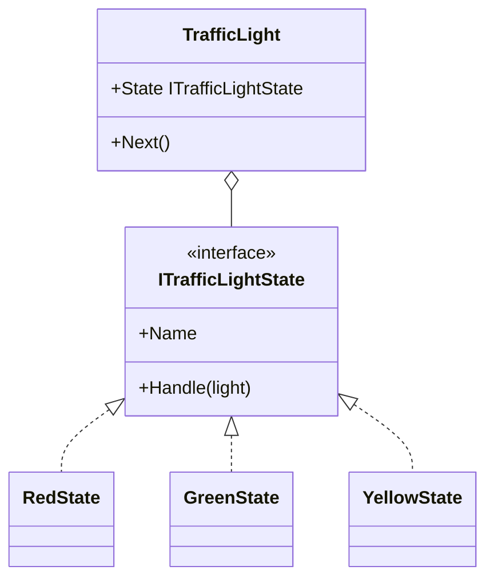
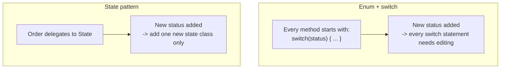

# State Pattern

## Introduction

Before reading this lesson, you should already be comfortable with **[Iterator Pattern](../12-advanced-concepts/12-22-iterator-pattern.md)**. This lesson tackles a problem nearly every business object eventually runs into: behavior that legitimately changes depending on what stage the object is currently in. The obvious first instinct is an enum plus a `switch` statement checked at the top of every method. The **State** pattern replaces that scattered, ever-growing `switch` with a set of small, swappable state objects, each one responsible for exactly one status and exactly the transitions that are legal from it.

By the end of this lesson, you will be able to:

- Explain the State pattern's intent: let an object appear to change its class as its internal state changes
- Recognize the enum-plus-switch alternative and the specific problem it causes as more states and actions are added
- Define a state interface (`IOrderState`) whose members represent every action a stateful object can be asked to perform
- Implement a context object (`Order`) that delegates every action to whichever state object it currently holds, and swaps that reference on a legal transition
- Have each state object reject actions that aren't legal from it, rather than centralizing that validation anywhere else

## State — A Layman's Perspective

Picture a traffic light standing at an intersection. A driver approaching it only ever asks it one implicit question — "what should I do right now?" — and the light answers differently depending entirely on which color is currently lit, without the driver needing to know anything about how the light's internal timer or wiring works. When it's red, the answer is "stop." The exact same physical light, asked the exact same implicit question a minute later, answers "go" instead, because its internal state changed to green. The light itself hasn't been replaced or rewired — it has swapped which "mode" it's currently operating in, and every behavior that matters to a driver flows entirely from that current mode.

Crucially, the light also enforces which transitions are even legal, entirely on its own, without a driver ever needing to request or negotiate them. Nobody pulls up to a red light and requests "please skip straight to green" — the light itself decides, based on its own current state, exactly what the next state is allowed to be: red goes to green, green goes to yellow, yellow goes to red, and nothing else is ever considered, regardless of what any particular driver might prefer in the moment.

Now picture the alternative a poorly designed intersection might use: a single control box with one giant list of rules a technician has to consult by hand every time anything about the light's behavior needs to change — "if the current color variable equals red, do this; else if it equals green, do that; else if it equals yellow, do this other thing." The instant the city wants to add a fourth condition — say, a flashing "caution" mode active only during off-peak hours — every single one of those rules potentially needs to be revisited, because the logic for all colors lives jumbled together in one place instead of being split cleanly by color.

The State pattern is the traffic light's actual design, not the technician's rulebook. Each color is its own small, self-contained unit of behavior, responsible only for itself: what to do while active, and which color comes next. Adding a new color later means writing one new self-contained unit, not re-reading and re-editing a single sprawling rulebook that already handles every other color.

The bridge to programming: an object whose behavior depends on which stage of its lifecycle it's currently in — like an order moving from pending to paid to shipped to delivered — can either check its own status field with a giant `switch` in every method (the technician's rulebook), or delegate every action to a small, swappable state object that represents exactly the current stage and knows exactly which stage comes next (the traffic light's actual design). This lesson builds the second approach.

## State — A Programming Language Perspective

The **State** pattern lets an object alter its behavior when its internal state changes, appearing to the outside world as though the object changed its class entirely. It does this by extracting all state-specific behavior into a family of classes implementing one shared interface — one class per state — and having a **context** object (the stateful object callers actually interact with) hold a reference to whichever state object is currently active, delegating every relevant method call to it. Transitioning between states is nothing more than the context reassigning that reference to a different concrete state instance; no flag is toggled and no `switch` statement is consulted anywhere in the context itself. Each state class decides, entirely on its own, what a legal transition out of it looks like and what happens when an action is requested that doesn't make sense from that particular state — validation logic that a naive enum-plus-`switch` design would otherwise have to repeat inside every single method that checks the object's status.

## How to Apply the State Pattern in C#

The smallest complete version needs a state interface, a handful of classes implementing it — one per state — and a context class holding a mutable reference to whichever state is current, delegating a single action to it.


*Figure 1: `TrafficLight` holds whichever state is current and delegates `Next()` to it; each state decides what the next state is.*

```csharp
// Program.cs — .NET 10 / C# 14

var light = new TrafficLight();
for (int i = 0; i < 4; i++)
{
    Console.WriteLine($"Current light: {light.State.Name}");
    light.Next();
}

interface ITrafficLightState
{
    string Name { get; }
    void Handle(TrafficLight light);
}

class RedState : ITrafficLightState
{
    public string Name => "Red";
    public void Handle(TrafficLight light) => light.State = new GreenState();
}

class GreenState : ITrafficLightState
{
    public string Name => "Green";
    public void Handle(TrafficLight light) => light.State = new YellowState();
}

class YellowState : ITrafficLightState
{
    public string Name => "Yellow";
    public void Handle(TrafficLight light) => light.State = new RedState();
}

class TrafficLight
{
    public ITrafficLightState State { get; set; } = new RedState();

    public void Next() => State.Handle(this);
}
```

**Console Output:**

```text
Current light: Red
Current light: Green
Current light: Yellow
Current light: Red
```

`TrafficLight` never checks a color enum anywhere — `Next()` simply asks whatever `State` currently holds to `Handle` itself, and each concrete state decides, entirely on its own, which concrete state comes next. After three transitions the light is back to `RedState`, exactly as a real signal cycle should behave, and `TrafficLight` itself never grew a single `switch` statement to make that happen.

## Real-Time Example: An Order's Lifecycle in E-Commerce Order Processing

We apply the State pattern to the E-Commerce Order Processing case study's order lifecycle: an `Order` moves from `PendingState` to `PaidState` to `ShippedState` to `DeliveredState`, and each state alone decides which actions are legal from it. Attempting to ship an unpaid order, or deliver an unshipped one, is rejected by the current state itself — no centralized validation logic anywhere else needs to know the full set of rules.

```csharp
// Program.cs — .NET 10 / C# 14 — Real-Time Example (E-Commerce Order Processing)

var order = new Order("ORD-6001");
Console.WriteLine($"[{order.OrderId}] Current state: {order.State.Name}");

order.Ship();     // illegal from Pending
order.Pay();
Console.WriteLine($"[{order.OrderId}] Current state: {order.State.Name}");

order.Deliver();  // illegal from Paid
order.Ship();
Console.WriteLine($"[{order.OrderId}] Current state: {order.State.Name}");

order.Pay();      // already paid
order.Deliver();
Console.WriteLine($"[{order.OrderId}] Current state: {order.State.Name}");

order.Deliver();  // already delivered

interface IOrderState
{
    string Name { get; }
    void Pay(Order order);
    void Ship(Order order);
    void Deliver(Order order);
}

class PendingState : IOrderState
{
    public string Name => "Pending";

    public void Pay(Order order)
    {
        Console.WriteLine($"[{order.OrderId}] Payment received.");
        order.State = new PaidState();
    }

    public void Ship(Order order) => Console.WriteLine($"[{order.OrderId}] Cannot ship - payment not yet received.");
    public void Deliver(Order order) => Console.WriteLine($"[{order.OrderId}] Cannot deliver - order is still pending.");
}

class PaidState : IOrderState
{
    public string Name => "Paid";

    public void Pay(Order order) => Console.WriteLine($"[{order.OrderId}] Already paid.");

    public void Ship(Order order)
    {
        Console.WriteLine($"[{order.OrderId}] Order shipped.");
        order.State = new ShippedState();
    }

    public void Deliver(Order order) => Console.WriteLine($"[{order.OrderId}] Cannot deliver - order hasn't shipped yet.");
}

class ShippedState : IOrderState
{
    public string Name => "Shipped";

    public void Pay(Order order) => Console.WriteLine($"[{order.OrderId}] Already paid.");
    public void Ship(Order order) => Console.WriteLine($"[{order.OrderId}] Already shipped.");

    public void Deliver(Order order)
    {
        Console.WriteLine($"[{order.OrderId}] Order delivered.");
        order.State = new DeliveredState();
    }
}

class DeliveredState : IOrderState
{
    public string Name => "Delivered";

    public void Pay(Order order) => Console.WriteLine($"[{order.OrderId}] Already paid.");
    public void Ship(Order order) => Console.WriteLine($"[{order.OrderId}] Already shipped.");
    public void Deliver(Order order) => Console.WriteLine($"[{order.OrderId}] Already delivered.");
}

class Order(string orderId)
{
    public string OrderId { get; } = orderId;
    public IOrderState State { get; set; } = new PendingState();

    public void Pay() => State.Pay(this);
    public void Ship() => State.Ship(this);
    public void Deliver() => State.Deliver(this);
}
```

**Console Output:**

```text
[ORD-6001] Current state: Pending
[ORD-6001] Cannot ship - payment not yet received.
[ORD-6001] Payment received.
[ORD-6001] Current state: Paid
[ORD-6001] Cannot deliver - order hasn't shipped yet.
[ORD-6001] Order shipped.
[ORD-6001] Current state: Shipped
[ORD-6001] Already paid.
[ORD-6001] Order delivered.
[ORD-6001] Current state: Delivered
[ORD-6001] Already delivered.
```

`Order` never inspects its own status anywhere — `Pay()`, `Ship()`, and `Deliver()` all just forward straight to `State`, and whichever concrete state object is currently assigned decides what happens next. Notice that every "illegal" call — shipping before payment, delivering before shipment — was handled cleanly by the *current* state simply declining to do anything harmful, rather than by a `try`/`catch` or a centralized guard clause somewhere else. Each state class carries only the rules relevant to itself: `PendingState` never needs to know what a delivered order looks like, and `DeliveredState` never needs to know how payment works.

## State Pattern vs Enum + Switch

The naive alternative to this entire pattern is a single `OrderStatus` enum plus a `switch` statement repeated at the top of every method that needs to behave differently by status. That approach works at first, but it concentrates every state's logic into every method, rather than concentrating every method's logic into its own state — the exact inverse of what the State pattern does. Adding a new status later means finding and editing every single `switch` statement across the whole class; forgetting even one is a silent bug. The State pattern instead adds one new class implementing the shared interface, and every existing state class stays completely untouched — a direct application of the Open/Closed Principle to state-dependent behavior.


*Figure 2: A new state costs an edit to every `switch` statement under the naive approach, versus one new, isolated class under the State pattern.*

| Aspect | Enum + switch/if-else | State Pattern |
|---|---|---|
| Where logic lives | Centralized `switch` repeated in every affected method | Distributed — one class owns each state's behavior completely |
| Adding a new state | Edit every existing `switch` statement across the class | Add one new class; every existing state class is untouched |
| Invalid transition handling | An extra conditional branch inside each `switch` arm | Each state class decides for itself, with no external guard needed |
| Risk as the system grows | A handful of giant, increasingly unwieldy `switch` statements | Many small classes to navigate, but each one stays simple |

## Types and Concepts Around the State Pattern in C#

1. **[Strategy Pattern](../12-advanced-concepts/12-18-strategy-pattern.md)** — a very similar interface-plus-swappable-implementation shape, but the caller chooses the strategy up front rather than the object transitioning between states on its own.
2. **[Enums in C#](../01-fundamentals/01-24-enums-in-csharp.md)** — the naive status representation this pattern replaces with swappable objects.
3. **[Switch Statements and Expressions](../01-fundamentals/01-10-switch-statements-and-expressions.md)** — the alternative this lesson's opening problem uses, and exactly what the State pattern avoids repeating everywhere.
4. **[Iterator Pattern](../12-advanced-concepts/12-22-iterator-pattern.md)** — previous lesson.
5. **[Visitor Pattern](../12-advanced-concepts/12-24-visitor-pattern.md)** — next lesson.
6. **[Interfaces in C#](../02-oop/02-15-interfaces-in-csharp.md)** — the mechanism (`IOrderState`) that lets `Order` delegate to whichever concrete state is currently active.

## What You've Learned & What's Next

The State pattern replaces a status field checked by `switch` statements scattered across every method with a family of small state classes, each one owning exactly the behavior — and exactly the legal transitions — for a single state. `Order` never had to know how many statuses existed or what each one's rules were; it only ever delegated to whichever `IOrderState` was currently assigned.

Continue your learning journey with **[Visitor Pattern](../12-advanced-concepts/12-24-visitor-pattern.md)**, where you'll separate an algorithm entirely from the object structure it operates on — and see honestly why modern C# pattern matching has made this particular pattern one of the least commonly reached for in the whole catalog.

---
*Applies to: .NET 10 / C# 14. Last reviewed 2026-08-16.*
