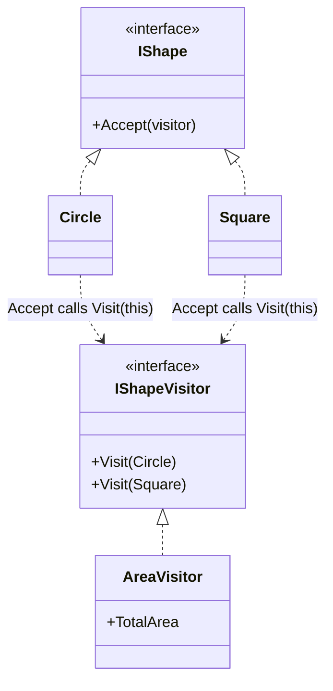
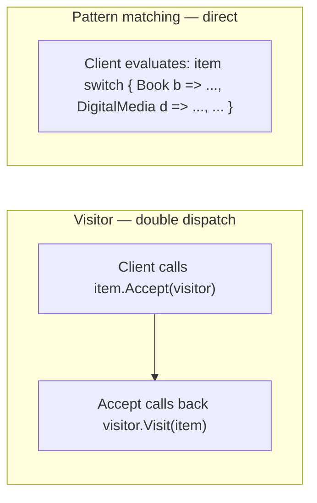

# Visitor Pattern

## Introduction

Before reading this lesson, you should already be comfortable with **[State Pattern](../12-advanced-concepts/12-23-state-pattern.md)**. This lesson covers the Gang-of-Four pattern this curriculum is most honest about: **Visitor** solves a real problem — adding a new operation across a whole family of related classes without modifying any of them — but in modern C#, pattern matching usually solves that same problem with far less ceremony. You should still learn Visitor's shape, because you'll recognize it in older codebases and in the rarer situations (open, plugin-based hierarchies you don't own) where it genuinely remains the better tool.

By the end of this lesson, you will be able to:

- Explain the Visitor pattern's intent: separate an algorithm from the object structure it operates on
- Describe double dispatch — `element.Accept(visitor)` calling back `visitor.Visit(this)` — and why it's needed at all
- Build an `IVisitor`/`IVisitable` pair and a concrete visitor that computes something over a fixed set of unrelated types
- Explain, honestly, why Visitor is rare in modern C# and what usually replaces it
- Recognize Visitor's core tradeoff: adding a new operation is easy, but adding a new element type means touching every existing visitor

## Visitor — A Layman's Perspective

Picture an independent insurance appraiser hired to visit a portfolio of very different properties — a house, a warehouse, a working farm — to assess their value for a policy renewal. None of these properties were built with appraisals in mind; a house doesn't contain any built-in "how much am I worth" logic, and neither does a warehouse or a farm. What each property *does* do, when the appraiser arrives, is let her in and show her around — the property "accepts" the visit, cooperating just enough to be inspected, without needing to understand anything about how appraisals actually work. All of the genuinely specialized knowledge — what makes a house valuable, what makes a warehouse valuable, what makes a working farm valuable — lives entirely inside the appraiser, not scattered across the properties themselves.

Here's the detail that makes this genuinely useful rather than just a walkthrough: the exact same portfolio of properties can be visited by a completely different kind of specialist next month, computing something entirely different, without a single property needing to change anything about itself. A fire-risk assessor visits the same house, the same warehouse, the same farm, and produces fire-risk scores instead of valuations — using entirely different criteria, entirely different reasoning, and yet relying on the exact same "let me in and show me around" cooperation from each property. The properties themselves never had to be rebuilt, extended, or even consulted about what a "valuation" or a "fire-risk score" even means — every new kind of assessment is just a new specialist walking through the same unchanged portfolio.

The tradeoff only shows up the moment the portfolio itself grows a genuinely new *kind* of property — say, the client acquires a marina. Every specialist who's ever visited this portfolio — the valuation appraiser, the fire-risk assessor, and any future specialist yet to be hired — now needs to learn how to assess a marina specifically, because "visit whatever's in the portfolio" quietly meant "know how to handle every kind of property in it." Adding a new *specialist* was free; adding a new *kind of property* was not.

The bridge to programming: a fixed set of unrelated classes (`Book`, `DigitalMedia`, `Magazine`) can each simply "let in" a visitor object via an `Accept` method, cooperating just enough to be inspected, while every bit of specialized algorithm logic — pricing, cataloging, whatever the operation actually is — lives entirely inside the visitor, not inside the classes being visited. And exactly like the appraiser scenario, adding a brand-new kind of *operation* (a new visitor) costs nothing to the existing classes, while adding a brand-new *class* to visit costs an update to every visitor that already exists.

## Visitor — A Programming Language Perspective

The **Visitor** pattern's intent is to represent an operation to be performed on the elements of an object structure, letting you define a new operation without changing the classes of the elements it operates on. It relies on **double dispatch**: each element implements an `Accept(IVisitor visitor)` method whose sole job is to call `visitor.Visit(this)` — and because `this` inside `Accept` is statically typed as the element's own concrete class (e.g., `Book`, not the shared base type), the call to `Visit` resolves, at compile time within that method, to the correctly overloaded `Visit(Book)` member. The net runtime effect is a method chosen based on *both* the element's concrete type and the visitor's concrete type — something a single ordinary virtual method call (which dispatches on only one object's type) cannot achieve alone. Historically, this two-step dance was necessary because C# had no first-class way to switch behavior directly on an object's runtime type. Pattern matching — type-pattern `switch` expressions, matured through recent C# versions — now provides exactly that directly, which is precisely why Visitor sees little use in current, closed C# hierarchies, and remains genuinely justified mainly for open or plugin-based hierarchies you don't control.

## How to Apply the Visitor Pattern in C#

The smallest complete version needs an element hierarchy with an `Accept` method on each type, a visitor interface with one overload per element type, and a concrete visitor implementing an operation over all of them.


*Figure 1: `Accept` on each shape calls back into the visitor with its own concrete type — double dispatch in miniature.*

```csharp
// Program.cs — .NET 10 / C# 14

IShape[] shapes = [new Circle(2), new Square(3)];

var areaVisitor = new AreaVisitor();
foreach (IShape shape in shapes)
{
    shape.Accept(areaVisitor);
}

Console.WriteLine($"Total area: {areaVisitor.TotalArea:F2}");

interface IShapeVisitor
{
    void Visit(Circle circle);
    void Visit(Square square);
}

interface IShape
{
    void Accept(IShapeVisitor visitor);
}

class Circle(double radius) : IShape
{
    public double Radius { get; } = radius;
    public void Accept(IShapeVisitor visitor) => visitor.Visit(this);
}

class Square(double side) : IShape
{
    public double Side { get; } = side;
    public void Accept(IShapeVisitor visitor) => visitor.Visit(this);
}

class AreaVisitor : IShapeVisitor
{
    public double TotalArea { get; private set; }

    public void Visit(Circle circle) => TotalArea += Math.PI * circle.Radius * circle.Radius;
    public void Visit(Square square) => TotalArea += square.Side * square.Side;
}
```

**Console Output:**

```text
Total area: 21.57
```

Neither `Circle` nor `Square` contains a single line of area-calculation logic — that entire algorithm lives inside `AreaVisitor`. Each shape's `Accept` method exists purely to hand itself back to the visitor with its own concrete type intact, which is exactly why `Visit(this)` resolves to the `Circle` overload for a circle and the `Square` overload for a square, without either shape ever needing an `if`/`switch` to figure out what kind of visitor it received.

## Real-Time Example: A PricingVisitor for the Library Catalog

We apply Visitor to the Library/Inventory Management case study's catalog, extended here with three distinct item types — `Book`, `DigitalMedia`, and `Magazine` — each priced completely differently: a book has a flat cover price, digital media costs a per-seat license fee multiplied by how many seats are licensed, and a magazine's value is its issue price multiplied by how many back issues remain in stock. None of these three classes contains any pricing logic at all; `PricingVisitor` computes every total, entirely from the outside.

```csharp
// Program.cs — .NET 10 / C# 14 — Real-Time Example (Library/Inventory Management)

var catalog = new Catalog();
catalog.Add(new Book("Clean Code", 42.00m));
catalog.Add(new DigitalMedia("Refactoring (e-book)", licenseCostPerSeat: 15.00m, licensedSeats: 3));
catalog.Add(new Magazine("IEEE Software", issuePrice: 8.50m, backIssuesInStock: 6));

Console.WriteLine("Computing total replacement value:");
var pricingVisitor = new PricingVisitor();
catalog.AcceptAll(pricingVisitor);
Console.WriteLine($"Total replacement value: {pricingVisitor.TotalReplacementValue:C}");

interface ICatalogItemVisitor
{
    void Visit(Book book);
    void Visit(DigitalMedia media);
    void Visit(Magazine magazine);
}

interface ICatalogItem
{
    void Accept(ICatalogItemVisitor visitor);
}

class Book(string title, decimal coverPrice) : ICatalogItem
{
    public string Title { get; } = title;
    public decimal CoverPrice { get; } = coverPrice;
    public void Accept(ICatalogItemVisitor visitor) => visitor.Visit(this);
}

class DigitalMedia(string title, decimal licenseCostPerSeat, int licensedSeats) : ICatalogItem
{
    public string Title { get; } = title;
    public decimal LicenseCostPerSeat { get; } = licenseCostPerSeat;
    public int LicensedSeats { get; } = licensedSeats;
    public void Accept(ICatalogItemVisitor visitor) => visitor.Visit(this);
}

class Magazine(string title, decimal issuePrice, int backIssuesInStock) : ICatalogItem
{
    public string Title { get; } = title;
    public decimal IssuePrice { get; } = issuePrice;
    public int BackIssuesInStock { get; } = backIssuesInStock;
    public void Accept(ICatalogItemVisitor visitor) => visitor.Visit(this);
}

// All pricing logic lives here — none of it lives in Book, DigitalMedia, or Magazine.
class PricingVisitor : ICatalogItemVisitor
{
    public decimal TotalReplacementValue { get; private set; }

    public void Visit(Book book)
    {
        TotalReplacementValue += book.CoverPrice;
        Console.WriteLine($"  {book.Title} (Book): {book.CoverPrice:C}");
    }

    public void Visit(DigitalMedia media)
    {
        decimal value = media.LicenseCostPerSeat * media.LicensedSeats;
        TotalReplacementValue += value;
        Console.WriteLine($"  {media.Title} (Digital, {media.LicensedSeats} seats): {value:C}");
    }

    public void Visit(Magazine magazine)
    {
        decimal value = magazine.IssuePrice * magazine.BackIssuesInStock;
        TotalReplacementValue += value;
        Console.WriteLine($"  {magazine.Title} (Magazine, {magazine.BackIssuesInStock} back issues): {value:C}");
    }
}

class Catalog
{
    private readonly List<ICatalogItem> _items = [];

    public void Add(ICatalogItem item) => _items.Add(item);

    public void AcceptAll(ICatalogItemVisitor visitor)
    {
        foreach (ICatalogItem item in _items)
        {
            item.Accept(visitor);
        }
    }
}
```

**Console Output:**

```text
Computing total replacement value:
  Clean Code (Book): $42.00
  Refactoring (e-book) (Digital, 3 seats): $45.00
  IEEE Software (Magazine, 6 back issues): $51.00
Total replacement value: $138.00
```

Each item's `Accept` call routed it to its own correctly-overloaded `Visit` method purely through double dispatch — `Catalog.AcceptAll` never once checked what kind of item it was iterating over. If a second operation were needed tomorrow — say, a `ShippingWeightVisitor` for warehouse logistics — it would be a brand-new class implementing `ICatalogItemVisitor`, with `Book`, `DigitalMedia`, and `Magazine` remaining completely untouched. That's the payoff this pattern is built around; the cost, covered honestly next, is what happens the day a fourth item type joins the catalog.

## Visitor Pattern vs Pattern Matching

The exact same `PricingVisitor` logic can be written today as a single `switch` expression over `ICatalogItem`, using type patterns to branch on each concrete type directly — no `Accept` method, no `IVisitor` interface, no double dispatch at all. For a **closed** hierarchy — one where every possible type is known and controlled by the same codebase, which describes nearly every hierarchy in this curriculum — pattern matching gets you the same outcome with dramatically less ceremony, which is exactly why modern, in-house C# code reaches for Visitor far less often than the original 1994 catalog assumed. Visitor still earns its place for genuinely **open** hierarchies — a plugin system where third parties add new element types you don't control — because in that situation, there's no single `switch` expression anyone could ever write that accounts for types that don't exist yet.


*Figure 2: Visitor reaches the right logic through a two-step callback; pattern matching reaches it directly, in one expression.*

| Aspect | Visitor Pattern | Pattern Matching (`switch` expression) |
|---|---|---|
| Adding a new operation | New `IVisitor` implementation — existing element classes untouched | New `case` wherever that operation's `switch` expression lives |
| Adding a new element type | Every existing `IVisitor` implementation needs a new `Visit` overload | Every `switch` expression over the hierarchy needs a new arm — same real cost, less ceremony |
| Boilerplate | `Accept` method on every element, plus a full visitor interface | None — a direct type-pattern `switch`, no extra interfaces |
| Best fit | Open/plugin hierarchies not owned by the caller; many repeated operations | Closed, in-house hierarchies — most real C# codebases, this curriculum included |

## Types and Concepts Around the Visitor Pattern in C#

1. **[Tuples, Deconstruction, and Pattern Matching](../01-fundamentals/01-25-tuples-deconstruction-pattern-matching.md)** — the modern C# feature that replaces most of what Visitor was historically used for.
2. **Double dispatch** — the `Accept`/`Visit` callback mechanism covered in this lesson, contrasted with C#'s normal single-dispatch virtual method resolution.
3. **[State Pattern](../12-advanced-concepts/12-23-state-pattern.md)** — previous lesson.
4. **[Mediator Pattern](../12-advanced-concepts/12-25-mediator-pattern.md)** — next lesson.
5. **[Interfaces in C#](../02-oop/02-15-interfaces-in-csharp.md)** — the mechanism behind both `ICatalogItem` and `ICatalogItemVisitor`.
6. **[Real-Time OOP Design: Modeling the Library Catalog](../02-oop/02-38-real-time-oop-library-catalog.md)** — the earlier Library/Inventory `Catalog` design this lesson adds a brand-new operation to, without modifying it.

## What You've Learned & What's Next

Visitor separates an algorithm from the object structure it runs over, using double dispatch to route each element to the correct overload on a separate visitor object — and its honest cost is that every new element type demands an update to every visitor that already exists. In modern, closed C# hierarchies, pattern matching typically achieves the same outcome with far less machinery, which is why Visitor is one of the least-reached-for patterns in this entire catalog today.

Continue your learning journey with **[Mediator Pattern](../12-advanced-concepts/12-25-mediator-pattern.md)**, where a set of independent objects stop referencing each other directly and instead coordinate everything through a single central hub.

---
*Applies to: .NET 10 / C# 14. Last reviewed 2026-08-16.*
