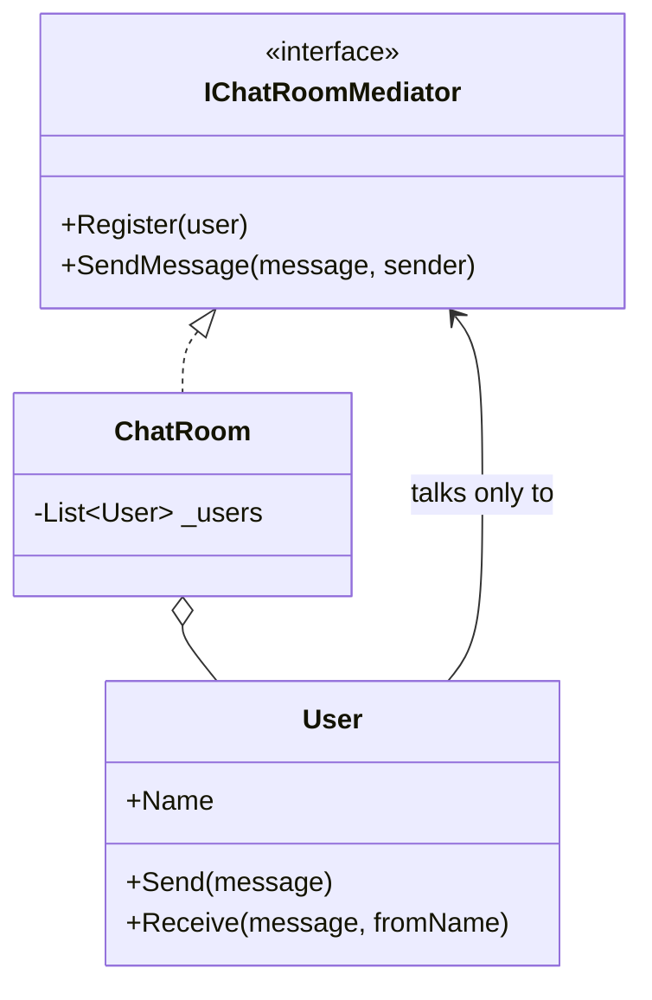
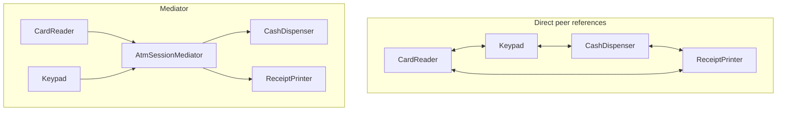

# Mediator Pattern

## Introduction

Before reading this lesson, you should already be comfortable with **[Visitor Pattern](../12-advanced-concepts/12-24-visitor-pattern.md)**. This lesson covers what happens when a group of objects need to coordinate with each other, but wiring every object up with a direct reference to every other object it might need to talk to produces a tangled, brittle web of dependencies. The **Mediator** pattern breaks that web by introducing one central object that every participant talks to instead of talking to each other directly — turning a many-to-many mess into a simple hub-and-spoke shape.

By the end of this lesson, you will be able to:

- Explain the Mediator pattern's intent: centralize how a set of objects communicate so they never reference each other directly
- Contrast a tightly-coupled web of direct peer references with a hub-and-spoke mediator design
- Build an `AtmSessionMediator` that coordinates independent components — a card reader, a keypad, a cash dispenser, a receipt printer — none of which know about each other
- Recognize the pattern's own honest tradeoff: a mediator that accumulates too much logic can become an overloaded "god object"
- Understand how this pattern foreshadows MediatR and CQRS, covered later in this module

## Mediator — A Layman's Perspective

Picture a busy airport with a dozen aircraft approaching, taxiing, and departing at the same time. In theory, every pilot could radio every other pilot directly to negotiate who lands first, who waits, and who taxis where — but that would mean each pilot needs a live channel open to every other aircraft in the sky, constantly renegotiating with all of them simultaneously. As more planes enter the airspace, the number of direct conversations needed explodes combinatorially, and a single pilot missing one relevant radio call could mean a genuine collision. No real airport works this way, for exactly that reason.

Instead, every single aircraft talks to exactly one thing: the control tower. A pilot radios the tower, not the other eleven planes, and the tower alone decides who lands next, who circles, and who's cleared to taxi. No aircraft needs to know how many other planes are even in the airspace, let alone track each one's position and intentions individually — that entire coordination problem lives in one place, the tower, and nowhere else. If a thirteenth plane joins the airspace tomorrow, every existing pilot's job stays exactly the same: still just "talk to the tower." Only the tower itself needs to learn about the new arrival.

There's an honest cost buried in this design, and any air traffic controller would tell you about it immediately: the tower itself now carries enormous responsibility. All of the actual coordination logic — every rule about landing order, spacing, and taxi routing — lives concentrated in one place. A tower that's poorly organized, or that's been handed too many unrelated responsibilities beyond pure traffic coordination, becomes its own kind of problem: a single overloaded point that's hard to reason about, precisely because everything now runs through it.

The bridge to programming: a set of independent components — a card reader, a keypad, a cash dispenser, a receipt printer — could each hold direct references to every other component they might need to trigger, but that produces exactly the same combinatorial mess as pilots radioing each other directly. Instead, each component talks only to a central mediator, which alone knows the full sequence of what happens when a card is inserted, a PIN is entered, or cash is requested. Every component's job shrinks to "tell the mediator what happened"; only the mediator needs to know how all the pieces fit together — and, just as honestly, the mediator itself needs to stay disciplined about scope, or it becomes the tangled mess it was built to prevent.

## Mediator — A Programming Language Perspective

The **Mediator** pattern encapsulates how a set of objects — traditionally called **colleagues** — interact, by having each colleague communicate only through a central mediator object rather than holding direct references to one another. Each colleague typically holds just one dependency: a reference to the mediator (often through a shared interface), turning what would otherwise be a potential many-to-many web of dependencies into a simple hub-and-spoke shape where every edge passes through one node. The mediator alone contains the coordination logic — what should happen, and in what order, when one colleague reports an event — which is precisely why adding a new colleague to the system typically means updating only the mediator, not every existing colleague that might need to react to it. In C#, this is often realized with a lean interface (or sometimes no interface at all, if the concrete mediator is referenced directly), since colleagues generally only need to *call into* the mediator rather than be called back through a generic contract. Lesson 12-41's coverage of **CQRS and MediatR** is a direct, industrial-strength generalization of exactly this idea, applied pervasively across modern ASP.NET Core applications to decouple request handlers from the controllers that trigger them.

## How to Apply the Mediator Pattern in C#

The smallest complete version needs a mediator interface, a handful of colleague classes that each hold only a reference to that mediator, and a concrete mediator that coordinates them.


*Figure 1: Every `User` holds a reference only to the mediator, never to another `User` directly.*

```csharp
// Program.cs — .NET 10 / C# 14

var chatRoom = new ChatRoom();
var alice = new User("Alice", chatRoom);
var bob = new User("Bob", chatRoom);
var carol = new User("Carol", chatRoom);

alice.Send("Hello everyone!");
bob.Send("Hey Alice!");

interface IChatRoomMediator
{
    void Register(User user);
    void SendMessage(string message, User sender);
}

class ChatRoom : IChatRoomMediator
{
    private readonly List<User> _users = [];

    public void Register(User user) => _users.Add(user);

    public void SendMessage(string message, User sender)
    {
        foreach (User user in _users)
        {
            if (user != sender)
            {
                user.Receive(message, sender.Name);
            }
        }
    }
}

class User
{
    public string Name { get; }
    private readonly IChatRoomMediator _mediator;

    public User(string name, IChatRoomMediator mediator)
    {
        Name = name;
        _mediator = mediator;
        _mediator.Register(this);
    }

    public void Send(string message) => _mediator.SendMessage(message, this);
    public void Receive(string message, string fromName) => Console.WriteLine($"  {Name} received from {fromName}: {message}");
}
```

**Console Output:**

```text
  Bob received from Alice: Hello everyone!
  Carol received from Alice: Hello everyone!
  Alice received from Bob: Hey Alice!
  Carol received from Bob: Hey Alice!
```

`User` never holds a reference to any other `User` — every message flows through `ChatRoom`, which alone knows the full list of participants and decides who receives what. Adding a fourth user tomorrow means registering them with the same `ChatRoom`; not one line of `User`'s own code would need to change.

## Real-Time Example: An AtmSessionMediator for Banking/ATM Operations

We apply Mediator to the Banking/ATM case study's most naturally centralized workflow: a single ATM session. `CardReader`, `Keypad`, `CashDispenser`, and `ReceiptPrinter` are four genuinely independent components — none of them holds a reference to any of the others. `AtmSessionMediator` alone tracks whether a card is inserted, whether the PIN has been verified, and whether a requested withdrawal is actually valid, coordinating all four components without any of them needing to know the others exist.

```csharp
// Program.cs — .NET 10 / C# 14 — Real-Time Example (Banking/ATM)

var mediator = new AtmSessionMediator();
var cardReader = new CardReader(mediator);
var keypad = new Keypad(mediator);

cardReader.InsertCard("4111-XXXX-XXXX-9010");
keypad.EnterPin("0000");           // wrong PIN
keypad.EnterAmount(100.00m);       // rejected - PIN not verified

keypad.EnterPin("4321");           // correct PIN
keypad.EnterAmount(700.00m);       // rejected - exceeds available balance
keypad.EnterAmount(200.00m);       // succeeds

interface IAtmMediator
{
    void CardInserted(string cardNumber);
    void PinEntered(string pin);
    void AmountRequested(decimal amount);
}

class CardReader(IAtmMediator mediator)
{
    public void InsertCard(string cardNumber)
    {
        Console.WriteLine($"[CardReader] Card {cardNumber} inserted.");
        mediator.CardInserted(cardNumber);
    }
}

class Keypad(IAtmMediator mediator)
{
    public void EnterPin(string pin)
    {
        Console.WriteLine("[Keypad] PIN entered.");
        mediator.PinEntered(pin);
    }

    public void EnterAmount(decimal amount)
    {
        Console.WriteLine($"[Keypad] Amount entered: {amount:C}");
        mediator.AmountRequested(amount);
    }
}

class CashDispenser
{
    public void Dispense(decimal amount) => Console.WriteLine($"[CashDispenser] Dispensing {amount:C}.");
}

class ReceiptPrinter
{
    public void Print(string cardNumber, decimal amount) =>
        Console.WriteLine($"[ReceiptPrinter] Receipt printed for card {cardNumber}: {amount:C} withdrawn.");
}

// The mediator: the only component that knows about every other component,
// and the only place the full session logic lives.
class AtmSessionMediator : IAtmMediator
{
    private const string CorrectPin = "4321";
    private const decimal AvailableBalance = 500.00m;

    private readonly CashDispenser _cashDispenser = new();
    private readonly ReceiptPrinter _receiptPrinter = new();

    private string? _cardNumber;
    private bool _pinVerified;

    public void CardInserted(string cardNumber)
    {
        _cardNumber = cardNumber;
        _pinVerified = false;
        Console.WriteLine($"[Mediator] Session started for card {cardNumber}.");
    }

    public void PinEntered(string pin)
    {
        if (pin == CorrectPin)
        {
            _pinVerified = true;
            Console.WriteLine("[Mediator] PIN verified.");
        }
        else
        {
            Console.WriteLine("[Mediator] Incorrect PIN. Try again.");
        }
    }

    public void AmountRequested(decimal amount)
    {
        if (!_pinVerified)
        {
            Console.WriteLine("[Mediator] Cannot dispense cash - PIN not verified.");
            return;
        }

        if (amount > AvailableBalance)
        {
            Console.WriteLine($"[Mediator] Cannot dispense {amount:C} - insufficient funds.");
            return;
        }

        _cashDispenser.Dispense(amount);
        _receiptPrinter.Print(_cardNumber!, amount);
    }
}
```

**Console Output:**

```text
[CardReader] Card 4111-XXXX-XXXX-9010 inserted.
[Mediator] Session started for card 4111-XXXX-XXXX-9010.
[Keypad] PIN entered.
[Mediator] Incorrect PIN. Try again.
[Keypad] Amount entered: $100.00
[Mediator] Cannot dispense cash - PIN not verified.
[Keypad] PIN entered.
[Mediator] PIN verified.
[Keypad] Amount entered: $700.00
[Mediator] Cannot dispense $700.00 - insufficient funds.
[Keypad] Amount entered: $200.00
[CashDispenser] Dispensing $200.00.
[ReceiptPrinter] Receipt printed for card 4111-XXXX-XXXX-9010: $200.00 withdrawn.
```

`CardReader` and `Keypad` each hold only a reference to `IAtmMediator` — neither one has ever heard of `CashDispenser` or `ReceiptPrinter`, yet a successful withdrawal triggers both of them correctly, because `AtmSessionMediator` alone knows the full sequence: verify the PIN, check the balance, then dispense and print. The rejected $100 withdrawal and the rejected $700 withdrawal both prove the mediator is genuinely enforcing session rules — not merely relaying calls — and every one of those rules lives in exactly one class, not scattered across four independent components that would otherwise need to coordinate with each other directly.

## Mediator vs Direct Peer-to-Peer References

The alternative to a mediator is letting every component hold direct references to every other component it needs to trigger — `CardReader` holding a reference to `AtmSessionMediator`-equivalent logic itself, `Keypad` needing its own reference to `CashDispenser` and `ReceiptPrinter`, and so on. That approach scales badly: every new component potentially needs wiring into every existing component that might need to call it, and the coordination logic itself ends up duplicated or scattered across whichever component happens to trigger it first. A mediator collapses all of that into one hub, at the honest cost that the mediator itself can become an overloaded "god object" if it's allowed to absorb responsibilities well beyond pure coordination — the same discipline problem a real air traffic control tower has to guard against.


*Figure 2: Direct peer references grow combinatorially as components are added; a mediator keeps every connection running through one hub.*

| Aspect | Direct peer references | Mediator Pattern |
|---|---|---|
| Coupling | Every component knows every other component it talks to | Every component knows only the mediator |
| Adding a new participant | Must be wired into every existing peer that needs to reach it | Only the mediator needs to learn about it |
| Where interaction logic lives | Scattered across whichever component happens to trigger it | Centralized in one mediator class |
| Risk as the system grows | Combinatorial explosion of direct references | The mediator itself can become an overloaded "god object" if not kept focused |

## Types and Concepts Around the Mediator Pattern in C#

1. **[Visitor Pattern](../12-advanced-concepts/12-24-visitor-pattern.md)** — previous lesson.
2. **[Memento Pattern](../12-advanced-concepts/12-26-memento-pattern.md)** — next lesson.
3. **[Strategy Pattern](../12-advanced-concepts/12-18-strategy-pattern.md)** — another behavioral pattern, but Strategy varies one object's own algorithm rather than coordinating several independent participants.
4. **[CQRS and MediatR](../12-advanced-concepts/12-41-cqrs-and-mediatr.md)** — the industrial-strength, ASP.NET Core-focused generalization of everything this lesson introduced.
5. **[Repository and Unit of Work Patterns](../12-advanced-concepts/12-29-repository-and-unit-of-work.md)** — another widely-used pattern beyond the classic 23, covered later in this module.
6. **[Interfaces in C#](../02-oop/02-15-interfaces-in-csharp.md)** — the mechanism behind `IAtmMediator`, letting every colleague depend on an abstraction rather than the concrete mediator class.

## What You've Learned & What's Next

The Mediator pattern replaces a potential many-to-many web of direct object references with a single hub that every participant talks to instead — `CardReader`, `Keypad`, `CashDispenser`, and `ReceiptPrinter` never once referenced each other, yet `AtmSessionMediator` coordinated all four correctly, enforcing session rules no individual component knew about. The honest tradeoff is that the mediator itself concentrates real responsibility, and needs the same discipline any centralized coordinator does to avoid becoming its own tangled mess.

Continue your learning journey with **[Memento Pattern](../12-advanced-concepts/12-26-memento-pattern.md)**, where you'll learn how to capture and restore an object's internal state without violating its encapsulation.

---
*Applies to: .NET 10 / C# 14. Last reviewed 2026-08-16.*
