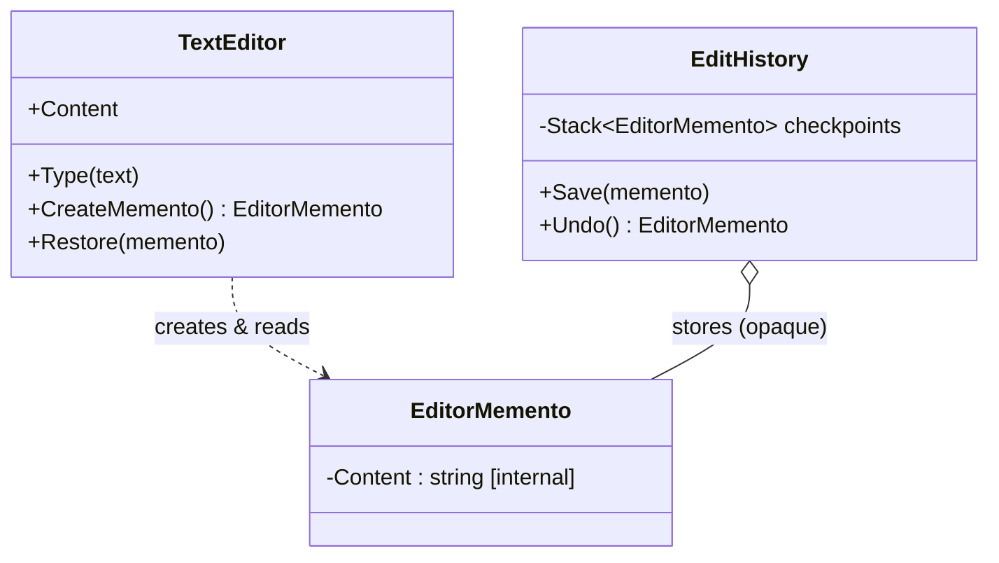
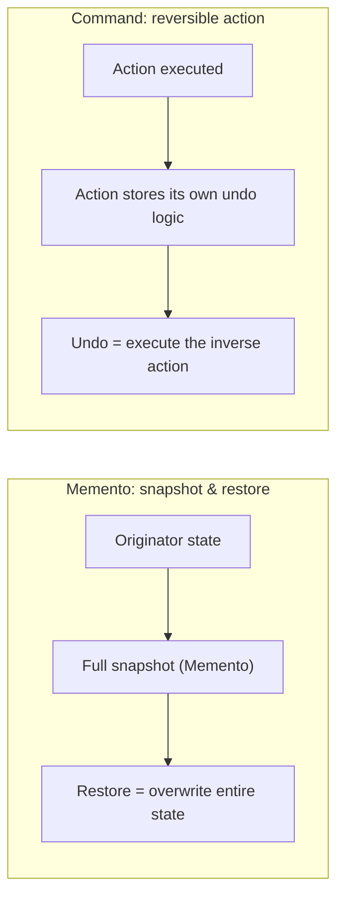

# Memento Pattern

## Introduction

Before reading this lesson, you should already be comfortable with **[Mediator Pattern](../12-advanced-concepts/12-25-mediator-pattern.md)** and with encapsulation from Module 02 — the idea that an object's internal state should only ever change through its own validated methods, never by reaching in and poking its fields directly. This lesson asks an awkward follow-up question: if an object's state is properly locked away like that, how does anything *else* ever get to save a copy of it, so that it can be restored later? That's exactly the problem the **Memento pattern** solves — capturing an object's internal state, externalizing it as a snapshot, and handing that snapshot to something else to hold onto, all without ever exposing the internals that made the snapshot in the first place.

By the end of this lesson, you will be able to:

- Explain the three roles in the Memento pattern: Originator, Memento, and Caretaker
- Implement a memento whose captured state stays inaccessible to whatever is storing it
- Build an undo stack using mementos, restoring an object to a previously saved state
- Contrast Memento's whole-state-snapshot approach against Command's reversible-action approach to undo
- Recognize when a full snapshot is the simpler choice versus when it becomes wasteful

## Memento Pattern — A Layman's Perspective

Think about quicksaving in a video game. You're deep into a level, health low, inventory carefully arranged, and you hit the quicksave button before a risky jump. The game engine bundles up everything about your current situation — position, health, inventory, level state — into a save file, and hands that file off to be stored, usually on a memory card or disk. Here's the detail worth noticing: the memory card doesn't understand any of that. It doesn't know what "health" or "inventory" mean, it doesn't parse the save file's contents, and it definitely doesn't reach in and tweak your health total to make the save more convenient later. It just holds the bytes it was given and hands them back, unchanged, whenever asked. All the *meaning* stays with the game engine that created the save file; the memory card is just a keeper.

Now you make the jump, and you miss it. Character dead, level failed. You load the quicksave, and the game reads that same save file back and rebuilds your exact prior situation — same position, same health, same inventory — as if the failed jump had never happened. The memory card didn't do any of the rebuilding; it just handed back what it was storing, and the game engine, the only thing that ever understood the save file's contents, did all the work of turning it back into your restored state.

This same pattern shows up constantly outside video games. A word processor's undo history works the same way — every checkpoint captures the document's exact prior content, and undoing restores it, without the undo history itself needing to understand grammar or formatting. A photographer's contact sheet of proof prints works similarly too: each tiny proof is a faithful, self-contained record of one shot, stored in a binder that doesn't know or care what's actually pictured — it just keeps the proofs in order and hands back whichever one is asked for.

What all three examples share is a clean separation of duties. One party — the game engine, the word processor, the photographer — is the only one that actually understands the state well enough to create it and later make sense of it again. A second party — the memory card, the undo history, the binder — exists purely to hold onto snapshots and hand them back on request, with zero understanding of what's actually inside them. Neither party needs to trust the other with anything more than that narrow job. The memory card never needs read access to your character's health formula, and your character's health formula never needs to know anything about memory cards at all.

That's the bridge to software: an object that owns some internal state (the **Originator**) can create an opaque snapshot of itself (the **Memento**) and hand it to something else (the **Caretaker**) to store — without that Caretaker ever being able to peek inside or tamper with what it's holding.

## Memento Pattern — A Programming Language Perspective

The Memento pattern defines three collaborating roles. The **Originator** is the object whose internal state needs to be captured and later restored — in C#, this is an ordinary class that exposes two operations: one that produces a memento representing its current state, and one that accepts a previously produced memento and restores itself from it. The **Memento** is the snapshot itself — typically a small class whose state-bearing members are deliberately *not* publicly accessible, so that only the Originator (which knows how to interpret them) can read them meaningfully; an `internal` accessor, or a nested private class, is the usual C# mechanism for this. The **Caretaker** holds onto one or more mementos — often in a `Stack<T>` for a simple undo history — and is responsible only for *when* to save and *when* to restore, never for what the memento's contents mean. Because the Caretaker's stored type exposes no publicly readable state, the Originator's internal representation stays genuinely encapsulated even while a copy of it lives outside the Originator's own instance.

## How to Implement the Memento Pattern in C#

The smallest version of this pattern needs exactly the three roles just described: an Originator that can snapshot and restore itself, a Memento that holds state without exposing it publicly, and a Caretaker that stores mementos without ever reading them. The example below builds a tiny `TextEditor` with an undo history.


*Figure 1: `TextEditor` is the Originator, `EditorMemento` is the Memento, and `EditHistory` is the Caretaker — it stores checkpoints without ever reading their contents.*

```csharp
// Program.cs — .NET 10 / C# 14
var editor = new TextEditor();
var history = new EditHistory();

editor.Type("Hello");
history.Save(editor.CreateMemento());       // checkpoint after "Hello"

editor.Type(", world");
history.Save(editor.CreateMemento());       // checkpoint after "Hello, world"

editor.Type("!!!");
Console.WriteLine($"Current content: {editor.Content}");

editor.Restore(history.Undo());
Console.WriteLine($"After 1st undo: {editor.Content}");

editor.Restore(history.Undo());
Console.WriteLine($"After 2nd undo: {editor.Content}");

class TextEditor
{
    public string Content { get; private set; } = "";

    public void Type(string text) => Content += text;

    public EditorMemento CreateMemento() => new(Content);

    public void Restore(EditorMemento memento) => Content = memento.Content;
}

class EditorMemento
{
    internal string Content { get; }

    internal EditorMemento(string content) => Content = content;
}

class EditHistory
{
    private readonly Stack<EditorMemento> _checkpoints = new();

    public void Save(EditorMemento memento) => _checkpoints.Push(memento);

    public EditorMemento Undo() => _checkpoints.Pop();
}
```

**Console Output:**

```text
Current content: Hello, world!!!
After 1st undo: Hello, world
After 2nd undo: Hello
```

Each `Save` call captures a checkpoint of `Content` at that moment. `EditHistory` never reads `EditorMemento.Content` — it can't, since the property and constructor are both `internal`, readable only from code that already knows what an `EditorMemento` means, which in practice is only `TextEditor` itself. `EditHistory`'s entire job is deciding *when* to push and pop, never *what* the pushed value contains. The two undos peel back the two checkpoints in reverse order, discarding the un-checkpointed `"!!!"` entirely — exactly what a real undo history does.

## Real-Time Example: Undoing the Last Transaction in Banking/ATM Account Processing

We extend the Banking/ATM case study with the scenario this lesson exists to solve: a teller or ATM operator needs to undo the account's most recent transaction — say, a withdrawal keyed in twice by mistake — without the undo history ever being trusted to directly manipulate the account's balance or transaction log. `Account` is the Originator, `AccountMemento` is the Memento (its state visible only internally), and `AccountHistory` is the Caretaker holding a stack of checkpoints.

```csharp
// Program.cs — .NET 10 / C# 14 — Real-Time Example (Banking/ATM)
using System.Globalization;

var account = new Account(startingBalance: 1_000.00m);
var history = new AccountHistory();

history.Snapshot(account.CreateSnapshot());   // checkpoint before the deposit
account.Deposit(200.00m);

history.Snapshot(account.CreateSnapshot());   // checkpoint before the withdrawal
account.Withdraw(500.00m);

Console.WriteLine($"Balance after deposit + withdrawal: {Usd(account.Balance)}");

// The $500 withdrawal was keyed in by mistake — undo it.
AccountMemento? lastCheckpoint = history.UndoLast();
if (lastCheckpoint is not null)
{
    account.RestoreFrom(lastCheckpoint);
}

Console.WriteLine($"Balance after undoing withdrawal:   {Usd(account.Balance)}");
Console.WriteLine("Transaction log:");
foreach (string entry in account.TransactionLog)
{
    Console.WriteLine($"  {entry}");
}

static string Usd(decimal amount) => amount.ToString("C", CultureInfo.GetCultureInfo("en-US"));

class Account(decimal startingBalance)
{
    private readonly List<string> _log = [];

    public decimal Balance { get; private set; } = startingBalance;
    public IReadOnlyList<string> TransactionLog => _log;

    public void Deposit(decimal amount)
    {
        Balance += amount;
        _log.Add($"Deposit {amount:C}");
    }

    public void Withdraw(decimal amount)
    {
        if (amount > Balance)
        {
            throw new InvalidOperationException("Insufficient funds.");
        }

        Balance -= amount;
        _log.Add($"Withdraw {amount:C}");
    }

    public AccountMemento CreateSnapshot() => new(Balance, _log.Count);

    public void RestoreFrom(AccountMemento memento)
    {
        Balance = memento.Balance;
        _log.RemoveRange(memento.LogCount, _log.Count - memento.LogCount);
        _log.Add($"[Undo] Restored balance to {Balance:C}");
    }
}

class AccountMemento
{
    internal decimal Balance { get; }
    internal int LogCount { get; }

    internal AccountMemento(decimal balance, int logCount)
    {
        Balance = balance;
        LogCount = logCount;
    }
}

class AccountHistory
{
    private readonly Stack<AccountMemento> _snapshots = new();

    public void Snapshot(AccountMemento memento) => _snapshots.Push(memento);

    public AccountMemento? UndoLast() => _snapshots.Count > 0 ? _snapshots.Pop() : null;
}
```

**Console Output:**

```text
Balance after deposit + withdrawal: $700.00
Balance after undoing withdrawal:   $1,200.00
Transaction log:
  Deposit $200.00
  [Undo] Restored balance to $1,200.00
```

`AccountHistory` never touches `Balance` or the log directly — it only ever calls `Snapshot` and `UndoLast`, treating each `AccountMemento` as an opaque token. Only `Account` itself, through `CreateSnapshot` and `RestoreFrom`, understands what that token means. One honest caveat: since everything here compiles into a single assembly, `internal` is enforced by the compiler but wouldn't stop another class in that *same* assembly from technically reaching in — a production system that needed a harder guarantee would place `Account`/`AccountMemento` in one library and any caretaker in a separate assembly, so the restriction becomes airtight rather than conventions-based.

## Memento Pattern vs. Command Pattern (Undo)

Memento is one of two common ways to implement undo — the other is the **Command pattern**, which represents each action as an object capable of reversing itself, rather than capturing the whole object's state before and after. Memento's approach is coarse-grained: capture everything about the Originator at a point in time, then restore all of it at once. Command's approach is fine-grained: represent "deposit $200" or "withdraw $500" each as its own reversible action object, and undo by executing that specific action's inverse (or by replaying history from scratch). Memento pays its cost up front, in the size of each snapshot; Command pays its cost in complexity, since every action type has to know how to undo itself correctly, including edge cases a snapshot would sidestep automatically.

Neither approach is universally better. Memento shines when state is small and simple to copy wholesale — exactly this lesson's `Account`, whose entire state is one decimal and a short list. Command shines when state is large but actions are simple and composable — undoing one keystroke in a huge document is far cheaper as "delete the character I just inserted" than as "restore the entire multi-megabyte document from before that keystroke."


*Figure 2: Memento restores by replacing the whole state at once; Command undoes by executing a specific action's inverse.*

| Aspect | Memento Pattern | Command Pattern (Undo) |
|---|---|---|
| What's captured | The Originator's full state at a point in time | One discrete action plus how to reverse it |
| Undo mechanism | Overwrite current state with the saved snapshot | Execute the action's own inverse operation |
| Memory cost | Scales with the size of the state being copied | Scales with the number of actions recorded |
| Who does the work | The Originator itself (`CreateSnapshot`/`RestoreFrom`) | Each Command object, individually |
| Best fit | Small, simple state; coarse-grained checkpoints | Large state, simple/composable actions |

## Types and Variants of the Memento Pattern in C#

A handful of variations on this lesson's shape come up in real systems:

1. **Originator / Memento / Caretaker roles** — the three-part structure this lesson builds from, present in every variant below.
2. **Command Pattern (undo via reversible actions)** — contrasted above; the fine-grained alternative to Memento's whole-state snapshots.
3. **Serialized/persisted mementos** — writing a snapshot to JSON, a file, or a database row instead of keeping it only in memory, so an undo history survives a process restart.
4. **Undo/redo double stack** — pairing an undo stack with a second redo stack, pushing onto the redo stack whenever an undo is performed, so a redone action doesn't need to be replayed from scratch.
5. **[Chain of Responsibility Pattern](../12-advanced-concepts/12-27-chain-of-responsibility-pattern.md)** — next lesson, shifting from "restore a single object's past state" to "pass one request through a sequence of independent handlers."
6. **[Mediator Pattern](../12-advanced-concepts/12-25-mediator-pattern.md)** — the previous lesson, where multiple objects coordinate through a central mediator rather than any one of them holding onto another's history.

## What You've Learned & What's Next

The Memento pattern lets an Originator externalize a snapshot of its own state to a Caretaker, without that Caretaker ever needing (or being able) to understand what's inside the snapshot — `Account.CreateSnapshot()` and `Account.RestoreFrom()` did all of the real work, while `AccountHistory` only ever pushed and popped opaque tokens.

Continue your learning journey with **[Chain of Responsibility Pattern](../12-advanced-concepts/12-27-chain-of-responsibility-pattern.md)**, where instead of one object managing its own history, a request gets passed along a sequence of independent handlers until one of them decides to handle it.

---
*Applies to: .NET 10 / C# 14. Last reviewed 2026-08-16.*
