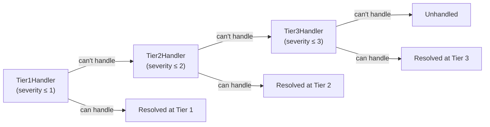
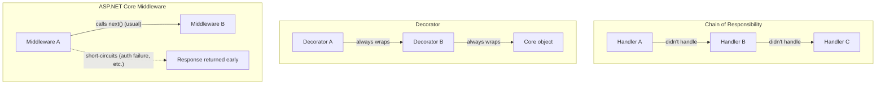

# Chain of Responsibility Pattern

## Introduction

Before reading this lesson, you should already be comfortable with **[Memento Pattern](../12-advanced-concepts/12-26-memento-pattern.md)**, where a single object managed its own history. This lesson moves from one object looking after itself to several independent objects cooperating on a single request: the **Chain of Responsibility pattern** links a series of handler objects together and passes a request down that chain until one of them decides to act on it — or, in a variant this lesson also covers, until one of them decides to reject it outright. If you've written ASP.NET Core middleware, the shape will look immediately familiar, and part of this lesson's job is being precise about where that resemblance holds and where it doesn't.

By the end of this lesson, you will be able to:

- Explain the Chain of Responsibility pattern's structure: a linked sequence of handlers, each deciding whether to act or forward the request
- Implement a "first handler that can resolve it wins" chain
- Implement a "first handler that rejects it stops everything" veto chain
- Distinguish Chain of Responsibility from the structurally similar Decorator pattern
- Explain precisely how ASP.NET Core middleware resembles — and differs from — both patterns

## Chain of Responsibility Pattern — A Layman's Perspective

Picture calling a large company's general customer support line with a billing question. The first person who picks up is a front-line agent equipped to handle the most common issues — a forgotten password, a simple address change. If your billing question is more complicated than that, the agent doesn't pretend to solve it; they say "let me transfer you," and you're passed to a billing specialist. If your issue turns out to be a complex fraud dispute even the billing specialist isn't authorized to resolve, you get transferred once more, to a fraud investigations team. At no point does the front-line agent need to know anything about fraud investigation procedures, and the fraud team never has to field simple address-change calls — each link in that chain only needs to know two things: can I handle this myself, and if not, who's next?

Notice what you, the caller, never have to do: you never dial a specific extension for "fraud investigations" yourself, and you never have to know in advance how many people you'll be transferred through. You called one number, and the chain of people behind that number sorted out, among themselves, who was actually going to help you. That's the essence of this pattern — the caller (the request) doesn't know or care how many handlers exist or which one will ultimately deal with it; it just enters the chain at the front and travels along it until someone takes responsibility.

A second, subtly different version of this same idea shows up in a hospital's triage process. Before a patient is treated, they might pass through several sequential checks — an intake nurse checks vitals, an allergy screener checks for drug interactions, insurance verifies coverage. But this chain works differently: it's not "whoever can help, does" — it's "if any single check turns up a serious problem, the whole process stops right there," even if a later check might otherwise have gone fine. A red flag at intake stops the patient from ever reaching the allergy screener at all. That's the same chain-of-linked-handlers shape, but functioning as a series of *gates*, where any single gate can veto everything downstream of it, rather than a series of *specialists*, where exactly one of them ultimately does the work.

Both versions share the core mechanical idea: a request travels through a sequence of independent participants, each one deciding — without knowing anything about the ones ahead or behind it — whether it's the one to act, whether to pass the request along, or whether to stop things entirely. Neither the caller nor the patient needs to understand the internal org chart; they just experience one sequential process that concludes with either a resolution or a rejection.

## Chain of Responsibility Pattern — A Programming Language Perspective

The Chain of Responsibility pattern links a series of handler objects, each holding a reference to the next handler in the sequence, and each implementing the same operation for processing a request. In C#, this is typically modeled as an abstract base class (or an interface plus a base implementation) exposing a `SetNext(handler)` method to build the chain and a `Handle(request)` (or similarly named) method that first checks whether *this* handler applies, and if not, forwards the request to `Next.Handle(request)` — recursion, not iteration, is the natural shape, since each handler's forwarding call is itself a call to the same method on the next link. Two distinct termination conditions are both valid variants of this same pattern: a chain can stop because a handler successfully *resolved* the request (the support-ticket shape below), or because a handler *rejected* it and the chain deliberately halts rather than continuing (the order-approval shape in this lesson's Real-Time Example). Either way, no handler needs a reference to any handler beyond the very next one, keeping each link decoupled from the chain's overall length or composition.

## How to Implement the Chain of Responsibility Pattern in C#

The clearest starting shape is "the first handler that can resolve this, does" — a support-ticket escalation chain, where each tier handles tickets up to a severity threshold and forwards anything higher to the next tier.


*Figure 1: Each tier either resolves the ticket or forwards it to the next; the chain ends in "Unhandled" only if no tier can take it.*

```csharp
// Program.cs — .NET 10 / C# 14
var tier1 = new Tier1Handler();
var tier2 = new Tier2Handler();
var tier3 = new Tier3Handler();
tier1.SetNext(tier2).SetNext(tier3);

SupportTicket[] tickets =
[
    new(Id: 101, Severity: 1),
    new(Id: 102, Severity: 3),
    new(Id: 103, Severity: 5)
];

foreach (SupportTicket ticket in tickets)
{
    tier1.Handle(ticket);
}

record SupportTicket(int Id, int Severity);

abstract class SupportHandler
{
    private SupportHandler? _next;

    public SupportHandler SetNext(SupportHandler next)
    {
        _next = next;
        return next;
    }

    public void Handle(SupportTicket ticket)
    {
        if (CanHandle(ticket))
        {
            Resolve(ticket);
        }
        else if (_next is not null)
        {
            _next.Handle(ticket);
        }
        else
        {
            Console.WriteLine($"[Unhandled] Ticket #{ticket.Id} (severity {ticket.Severity}) escalated beyond all tiers.");
        }
    }

    protected abstract bool CanHandle(SupportTicket ticket);
    protected abstract void Resolve(SupportTicket ticket);
}

class Tier1Handler : SupportHandler
{
    protected override bool CanHandle(SupportTicket ticket) => ticket.Severity <= 1;
    protected override void Resolve(SupportTicket ticket) =>
        Console.WriteLine($"[Tier 1] Resolved ticket #{ticket.Id} (severity {ticket.Severity}).");
}

class Tier2Handler : SupportHandler
{
    protected override bool CanHandle(SupportTicket ticket) => ticket.Severity <= 2;
    protected override void Resolve(SupportTicket ticket) =>
        Console.WriteLine($"[Tier 2] Resolved ticket #{ticket.Id} (severity {ticket.Severity}).");
}

class Tier3Handler : SupportHandler
{
    protected override bool CanHandle(SupportTicket ticket) => ticket.Severity <= 3;
    protected override void Resolve(SupportTicket ticket) =>
        Console.WriteLine($"[Tier 3] Resolved ticket #{ticket.Id} (severity {ticket.Severity}).");
}
```

**Console Output:**

```text
[Tier 1] Resolved ticket #101 (severity 1).
[Tier 3] Resolved ticket #102 (severity 3).
[Unhandled] Ticket #103 (severity 5) escalated beyond all tiers.
```

Ticket #101 stops at the very first link. Ticket #102 is too severe for Tier 1 or Tier 2, so it travels two links before Tier 3 resolves it. Ticket #103 exceeds every tier's threshold, falls off the end of the chain, and is reported unhandled — `tier1`, the only object the calling code ever talks to, has no idea in advance which of these three outcomes will occur.

## Real-Time Example: An Order-Approval Chain in E-Commerce Order Processing

We extend the E-Commerce Order Processing case study with a variant of this pattern: an order-approval chain where `FraudCheckHandler`, `InventoryCheckHandler`, and `CreditLimitHandler` each perform one independent check, and — unlike the support-ticket example — *every* handler must pass for the order to be approved. Any single handler can reject the order and stop the chain immediately, without the remaining checks ever running.

```csharp
// Program.cs — .NET 10 / C# 14 — Real-Time Example (E-Commerce Order Processing)
using System.Globalization;

var fraudCheck = new FraudCheckHandler();
var inventoryCheck = new InventoryCheckHandler();
var creditCheck = new CreditLimitHandler();
fraudCheck.SetNext(inventoryCheck).SetNext(creditCheck);

Order[] orders =
[
    new("ORD-4001", Total: 150.00m, ItemsInStock: 5, CustomerCreditLimit: 500.00m, FlaggedForFraud: false),
    new("ORD-4002", Total: 80.00m, ItemsInStock: 0, CustomerCreditLimit: 500.00m, FlaggedForFraud: false),
    new("ORD-4003", Total: 900.00m, ItemsInStock: 3, CustomerCreditLimit: 500.00m, FlaggedForFraud: false),
    new("ORD-4004", Total: 60.00m, ItemsInStock: 2, CustomerCreditLimit: 500.00m, FlaggedForFraud: true)
];

foreach (Order order in orders)
{
    ApprovalResult result = fraudCheck.Approve(order);
    string status = result.Passed ? "APPROVED" : "REJECTED";
    Console.WriteLine($"{order.Id}: {status} — {result.Message}");
}

static class Money
{
    public static string Usd(decimal amount) => amount.ToString("C", CultureInfo.GetCultureInfo("en-US"));
}

record Order(string Id, decimal Total, int ItemsInStock, decimal CustomerCreditLimit, bool FlaggedForFraud);

record ApprovalResult(bool Passed, string Message)
{
    public static ApprovalResult Ok(string message) => new(true, message);
    public static ApprovalResult Fail(string message) => new(false, message);
}

abstract class OrderApprovalHandler
{
    private OrderApprovalHandler? _next;

    public OrderApprovalHandler SetNext(OrderApprovalHandler next)
    {
        _next = next;
        return next;
    }

    public ApprovalResult Approve(Order order)
    {
        ApprovalResult result = Check(order);
        if (!result.Passed)
        {
            return result;
        }

        return _next is not null ? _next.Approve(order) : ApprovalResult.Ok("All checks passed.");
    }

    protected abstract ApprovalResult Check(Order order);
}

class FraudCheckHandler : OrderApprovalHandler
{
    protected override ApprovalResult Check(Order order) =>
        order.FlaggedForFraud
            ? ApprovalResult.Fail($"Order {order.Id} rejected: flagged for suspected fraud.")
            : ApprovalResult.Ok("Fraud check passed.");
}

class InventoryCheckHandler : OrderApprovalHandler
{
    protected override ApprovalResult Check(Order order) =>
        order.ItemsInStock <= 0
            ? ApprovalResult.Fail($"Order {order.Id} rejected: item out of stock.")
            : ApprovalResult.Ok("Inventory check passed.");
}

class CreditLimitHandler : OrderApprovalHandler
{
    protected override ApprovalResult Check(Order order) =>
        order.Total > order.CustomerCreditLimit
            ? ApprovalResult.Fail($"Order {order.Id} rejected: total {Money.Usd(order.Total)} exceeds credit limit {Money.Usd(order.CustomerCreditLimit)}.")
            : ApprovalResult.Ok("Credit limit check passed.");
}
```

**Console Output:**

```text
ORD-4001: APPROVED — All checks passed.
ORD-4002: REJECTED — Order ORD-4002 rejected: item out of stock.
ORD-4003: REJECTED — Order ORD-4003 rejected: total $900.00 exceeds credit limit $500.00.
ORD-4004: REJECTED — Order ORD-4004 rejected: flagged for suspected fraud.
```

`ORD-4004` never reaches the inventory or credit checks at all — `FraudCheckHandler` rejects it on the very first link, and the chain stops immediately. `ORD-4001` is the only order that satisfies all three handlers, so it's the only one that reaches the end of the chain and receives the generic "All checks passed" approval. Adding a fourth check — say, a shipping-address verification — means writing one new handler class and inserting it with one more `SetNext` call; none of the three existing handlers need to change.

## Chain of Responsibility vs. Decorator vs. ASP.NET Core Middleware

Chain of Responsibility and the Decorator pattern share an easily confused shape: both link a series of objects together, and both forward a call from one link to the next. The difference is in *intent*. Chain of Responsibility's links are **alternatives** — exactly one of them (or none) ultimately does the real work, and the others are bypassed once that happens. Decorator's links are **additive** — every decorator in the stack normally *does* run, each one wrapping additional behavior around the call to the next, and the final result reflects every layer's contribution, not just one layer's. A logging decorator around a payment processor always logs, every time, regardless of what the payment processor decides; a fraud-check handler in a chain runs only until something upstream of it already stopped the chain.

ASP.NET Core's middleware pipeline, covered in Module 10, is genuinely a hybrid of both. Structurally, it's built exactly like a Chain of Responsibility chain — each middleware component holds a reference to a `next` delegate representing "the rest of the pipeline." But in typical use, most middleware behaves like a Decorator: authentication, logging, and exception-handling middleware usually *do* call `next()` and simply wrap additional behavior around the rest of the pipeline, rather than acting as one-of-many alternatives. The Chain-of-Responsibility half of its personality shows up specifically when a middleware component chooses *not* to call `next()` — an authentication failure short-circuiting the pipeline with a 401 response, for instance — which is precisely the "any link can stop everything downstream" behavior this lesson's order-approval example demonstrated.


*Figure 2: Chain of Responsibility selects one alternative; Decorator additively wraps every layer; middleware normally behaves like Decorator but keeps Chain of Responsibility's ability to short-circuit.*

| Aspect | Chain of Responsibility | Decorator | ASP.NET Core Middleware |
|---|---|---|---|
| Intent | Find the one handler (or veto) that applies | Add behavior around every call, additively | Cross-cutting request/response processing |
| Do all links normally run? | No — stops once resolved or rejected | Yes — every decorator contributes | Usually yes, but any link may short-circuit |
| Each link knows about | Only the next link | Only the object it wraps | Only the next delegate in the pipeline |
| Typical use here | Order approval, ticket escalation | Adding logging/caching around a component | Auth, logging, routing, exception handling |

## Types and Variants of the Chain of Responsibility Pattern in C#

1. **First-capable-handler chain** — as in this lesson's support-ticket example, where the chain stops at the first handler able to fully resolve the request.
2. **Veto/validation chain** — as in this lesson's order-approval example, where the first handler to reject the request stops the chain outright.
3. **[The Middleware Pipeline](../10-aspnetcore/10-06-the-middleware-pipeline.md)** — ASP.NET Core's own request-handling chain, discussed in the comparison above.
4. **[Writing Custom Middleware](../10-aspnetcore/10-07-writing-custom-middleware.md)** — where that pipeline's chain-of-handlers shape is built and extended by hand.
5. **Decorator Pattern** — contrasted above; wraps and additively augments a call rather than choosing one alternative handler.
6. **[Interpreter Pattern](../12-advanced-concepts/12-28-interpreter-pattern.md)** — next lesson, where the focus shifts from routing a request through handlers to evaluating a small grammar of rules.

## What You've Learned & What's Next

Chain of Responsibility passes a request along a sequence of independent handlers, each deciding to act, forward, or — in the veto variant this lesson also covered — reject and stop everything. `fraudCheck.SetNext(inventoryCheck).SetNext(creditCheck)` built that chain in one line, and adding, removing, or reordering a check never requires touching the handlers that remain.

Continue your learning journey with **[Interpreter Pattern](../12-advanced-concepts/12-28-interpreter-pattern.md)**, the least commonly used pattern in this entire catalog, where we build a tiny grammar and interpreter for evaluating simple discount rules.

---
*Applies to: .NET 10 / C# 14. Last reviewed 2026-08-16.*
