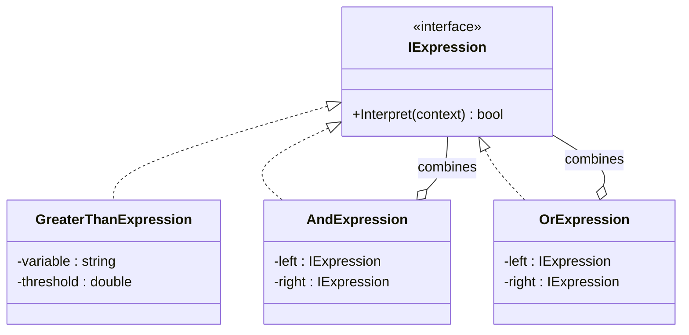
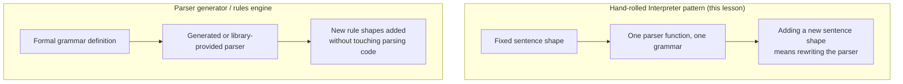

# Interpreter Pattern

## Introduction

Before reading this lesson, you should already be comfortable with **[Chain of Responsibility Pattern](../12-advanced-concepts/12-27-chain-of-responsibility-pattern.md)**. This lesson covers the **Interpreter pattern**: defining a small grammar for a simple language and building a set of classes that can evaluate — "interpret" — sentences written in it. Right up front, an honest disclaimer this lesson won't walk back later: of the twenty-three original Gang of Four patterns, Interpreter is the one you are least likely to reach for in ordinary, day-to-day C# business code. It's covered here for catalog completeness and because the underlying idea — representing a tiny rule language as a tree of objects — genuinely does show up, in miniature, inside rules engines, validation frameworks, and configuration-driven business logic. But if you finish this lesson and never write another `IExpression` class again, that's a perfectly reasonable outcome; most production teams reach for a parser library or a rules engine long before they'd hand-roll this pattern themselves.

By the end of this lesson, you will be able to:

- Explain the Interpreter pattern's structure: terminal expressions, composite (nonterminal) expressions, and a shared context
- Build a small composite expression tree that evaluates conditions against a context object
- Parse a tiny textual rule into that expression tree
- Honestly assess when hand-rolling an interpreter is worth it versus reaching for a real parser or rules engine
- Recognize Interpreter's place as this catalog's least commonly used pattern, and why that's a fair assessment rather than a criticism

## Interpreter Pattern — A Layman's Perspective

Think about how a simple recipe card works. "If the sauce is too thin, add a tablespoon of flour" is a tiny rule — a condition ("the sauce is too thin") and an action ("add a tablespoon of flour"). A home cook doesn't need a professional culinary certification to follow it; they just check whether the condition currently describes what's in the pot, and if it does, they perform the action. A recipe card might have several of these small rules stacked together — "if too thin, add flour; if too salty, add a potato; if too bland, add more seasoning" — and the cook works through them one at a time, each one independently checkable against what's actually happening in the pot right now.

Now picture a slightly more elaborate rule: "if the sauce is too thin AND it's been simmering for over twenty minutes, reduce the heat and add flour." That's still something an ordinary cook can evaluate directly, but notice it's now built out of two smaller conditions joined by "AND" — the whole rule is only checkable by first checking each smaller piece, then combining the results. A cookbook author didn't invent an entirely new sentence structure for this; they just combined existing small conditions using ordinary words like "and," "or," and "if," the same connecting words used everywhere else in the language.

This is exactly the shape of a tiny business rule like "if the order total is over $100, apply a 10% discount." Someone writing that rule wants to write it in something close to plain language, not by opening up C# source code and editing an `if` statement buried inside a larger method. The Interpreter pattern is the toolkit for building software that can read a small, rule-like sentence like that and actually act on it — checking the condition against real data, the same way the home cook checks whether the sauce is actually too thin before reaching for the flour.

The part that makes this a distinct pattern, rather than just "parsing text," is how the checking gets built: each small piece of the rule — "total is over 100," "AND," "OR" — becomes its own tiny object that knows how to evaluate just that one piece, and larger rules are trees built by combining those small objects together, the same way "too thin AND simmering over twenty minutes" was built from two smaller, independently checkable conditions joined by one connecting word.

## Interpreter Pattern — A Programming Language Perspective

The Interpreter pattern represents each rule in a small grammar as an object implementing a common interface — conventionally called `IExpression` or `AbstractExpression` — with a single `Interpret` method that evaluates the expression against a **context** (an object or dictionary holding the values the rule needs to check). **Terminal expressions** are the grammar's leaves: an atomic condition, like "a numeric field exceeds a threshold," that can be evaluated directly against the context with no further decomposition. **Nonterminal expressions** (sometimes called composite expressions) combine other expressions — an `AndExpression` or `OrExpression` holds two child expressions and evaluates its own result by combining theirs, forming a tree exactly the way a larger sentence in the grammar is built out of smaller ones. Evaluating the whole tree means recursively calling `Interpret` from the root down to the leaves. Nothing about this requires parsing actual text at all — the tree can be built directly in code — but a real "little language" implementation typically pairs this pattern with a small parser that turns a textual sentence into the corresponding expression tree, which is exactly what this lesson's Real-Time Example does in miniature.

## How to Implement the Interpreter Pattern in C#

The clearest version of this pattern needs a context, one terminal expression type representing an atomic condition, and at least one composite type combining smaller expressions. The example below evaluates a small weather-advisory rule — "temperature is high, OR (humidity is high AND wind is high)" — against several sets of readings.


*Figure 1: `GreaterThanExpression` is a terminal expression; `AndExpression` and `OrExpression` are composite expressions built out of other expressions, all sharing the `IExpression` interface.*

```csharp
// Program.cs — .NET 10 / C# 14
IExpression heatAdvisory = new OrExpression(
    new GreaterThanExpression("Temperature", 90),
    new AndExpression(
        new GreaterThanExpression("Humidity", 80),
        new GreaterThanExpression("WindSpeed", 20)));

Dictionary<string, double>[] readings =
[
    new() { ["Temperature"] = 95, ["Humidity"] = 50, ["WindSpeed"] = 5 },
    new() { ["Temperature"] = 75, ["Humidity"] = 85, ["WindSpeed"] = 25 },
    new() { ["Temperature"] = 70, ["Humidity"] = 60, ["WindSpeed"] = 10 }
];

foreach (Dictionary<string, double> reading in readings)
{
    bool advisoryInEffect = heatAdvisory.Interpret(reading);
    Console.WriteLine(
        $"Temp={reading["Temperature"]}, Humidity={reading["Humidity"]}, Wind={reading["WindSpeed"]} => Advisory: {advisoryInEffect}");
}

interface IExpression
{
    bool Interpret(IDictionary<string, double> context);
}

class GreaterThanExpression(string variable, double threshold) : IExpression
{
    public bool Interpret(IDictionary<string, double> context) =>
        context.TryGetValue(variable, out double value) && value > threshold;
}

class AndExpression(IExpression left, IExpression right) : IExpression
{
    public bool Interpret(IDictionary<string, double> context) =>
        left.Interpret(context) && right.Interpret(context);
}

class OrExpression(IExpression left, IExpression right) : IExpression
{
    public bool Interpret(IDictionary<string, double> context) =>
        left.Interpret(context) || right.Interpret(context);
}
```

**Console Output:**

```text
Temp=95, Humidity=50, Wind=5 => Advisory: True
Temp=75, Humidity=85, Wind=25 => Advisory: True
Temp=70, Humidity=60, Wind=10 => Advisory: False
```

`heatAdvisory` is one composite tree built once and reused across all three readings. The first reading trips the advisory purely through the temperature leaf; the second trips it purely through the humidity-and-wind branch, with temperature never satisfying its own leaf at all; the third satisfies neither branch, so the whole tree evaluates to `false`. Every `Interpret` call recurses down to the leaves and combines results back up — no single class needed to understand the whole rule, only its own small piece of it.

## Real-Time Example: A Discount-Rule Interpreter in E-Commerce Order Processing

We extend the E-Commerce Order Processing case study with a tiny discount-rule interpreter that parses rules written as plain text — `"IF total > 100 THEN discount 10%"` — into an expression tree, then evaluates each rule against real orders. To keep this honest about scope, the parser below supports exactly one grammar shape and one field name; a production rules engine would need a real tokenizer and a far richer grammar, which is precisely this lesson's point about Interpreter's practical limits.

```csharp
// Program.cs — .NET 10 / C# 14 — Real-Time Example (E-Commerce Order Processing)
using System.Globalization;

DiscountRule bigOrderDiscount = ParseRule("IF total > 100 THEN discount 10%");
DiscountRule loyaltyDiscount = ParseRule("IF total > 500 THEN discount 20%");
DiscountRule[] rules = [bigOrderDiscount, loyaltyDiscount];

Order[] orders =
[
    new("ORD-5001", Total: 45.00m, ItemCount: 2),
    new("ORD-5002", Total: 150.00m, ItemCount: 3),
    new("ORD-5003", Total: 650.00m, ItemCount: 6)
];

foreach (Order order in orders)
{
    decimal totalDiscountPercent = 0m;
    foreach (DiscountRule rule in rules)
    {
        if (rule.Condition.Interpret(order))
        {
            totalDiscountPercent += rule.DiscountPercent;
            Console.WriteLine($"{order.Id}: rule matched — \"{rule.Description}\"");
        }
    }

    decimal finalPrice = order.Total - (order.Total * totalDiscountPercent / 100m);
    Console.WriteLine($"{order.Id}: total {Money.Usd(order.Total)}, discount {totalDiscountPercent}%, final price {Money.Usd(finalPrice)}");
    Console.WriteLine();
}

static DiscountRule ParseRule(string ruleText)
{
    // Deliberately minimal grammar: "IF total > <number> THEN discount <number>%"
    string[] parts = ruleText.Split(["IF ", " THEN discount ", "%"], StringSplitOptions.RemoveEmptyEntries);
    string conditionText = parts[0].Trim();
    decimal discountPercent = decimal.Parse(parts[1].Trim());

    string[] conditionTokens = conditionText.Split(' ', StringSplitOptions.RemoveEmptyEntries);
    string field = conditionTokens[0];
    decimal threshold = decimal.Parse(conditionTokens[2]);

    IConditionExpression condition = field switch
    {
        "total" => new TotalGreaterThanExpression(threshold),
        _ => throw new NotSupportedException($"Unknown field '{field}' in rule: {ruleText}")
    };

    return new DiscountRule(ruleText, condition, discountPercent);
}

static class Money
{
    public static string Usd(decimal amount) => amount.ToString("C", CultureInfo.GetCultureInfo("en-US"));
}

interface IConditionExpression
{
    bool Interpret(Order order);
}

class TotalGreaterThanExpression(decimal threshold) : IConditionExpression
{
    public bool Interpret(Order order) => order.Total > threshold;
}

record DiscountRule(string Description, IConditionExpression Condition, decimal DiscountPercent);

record Order(string Id, decimal Total, int ItemCount);
```

**Console Output:**

```text
ORD-5001: total $45.00, discount 0%, final price $45.00

ORD-5002: rule matched — "IF total > 100 THEN discount 10%"
ORD-5002: total $150.00, discount 10%, final price $135.00

ORD-5003: rule matched — "IF total > 100 THEN discount 10%"
ORD-5003: rule matched — "IF total > 500 THEN discount 20%"
ORD-5003: total $650.00, discount 30%, final price $455.00

```

`ORD-5003` matches both rules and stacks their discounts to 30%, while `ORD-5001` matches neither and pays full price — each `DiscountRule` was built once, by parsing a plain-text sentence, and reused against every order without any rule needing to know how many other rules exist. Adding a third rule means writing one more string and calling `ParseRule` again; no existing rule or order-processing code changes.

## Interpreter Pattern vs. a Real Parser or Rules Engine

This lesson's `ParseRule` function is intentionally naive — it recognizes exactly one sentence shape and one field name, and it would need to be rewritten from scratch to support a second field, a different comparison operator, or nested `AND`/`OR` combinations in the text itself. That's not a corner this lesson cut carelessly; it's the honest, general shape of hand-rolling Interpreter's grammar side. A real "little language" — anything beyond a handful of fixed sentence shapes — needs actual tokenizing and parsing logic, and at that point most teams stop hand-rolling and reach for either a parser generator (like ANTLR) to produce the parsing code, or a dedicated rules engine library (such as NRules, RulesEngine, or a vendor product) that already handles rule composition, conflict resolution, and performance concerns that a hand-rolled tree of `IExpression` classes doesn't address at all.

The pattern itself — terminal and composite expressions sharing one interface — still shows up *inside* those more serious tools, just as an implementation detail rather than something application code writes directly. That's the honest resolution of this lesson's opening disclaimer: Interpreter is rarely something you'd choose to hand-roll for a real production grammar, but the tree-of-small-evaluable-objects idea it teaches is genuinely present, one layer down, inside the tools you'd actually reach for instead.


*Figure 2: A hand-rolled Interpreter grows brittle as the grammar grows; a real parser generator or rules engine absorbs that growth instead.*

| Aspect | Hand-Rolled Interpreter Pattern | Parser Generator / Rules Engine |
|---|---|---|
| Grammar complexity handled | A handful of fixed, simple sentence shapes | Arbitrary, formally defined grammars |
| Effort to add a new rule shape | Often a parser rewrite | Usually a grammar or config change only |
| Performance at scale | Fine for a handful of rules | Built for many rules, with conflict resolution |
| Where it actually shows up in production | Rare as application-level code | Common; the pattern lives inside the tool |
| When it's genuinely the right choice | A tiny, fixed, unlikely-to-grow rule set | Anything with a real or growing grammar |

## Types and Variants of the Interpreter Pattern in C#

1. **Terminal expressions** — atomic, directly evaluable conditions, like this lesson's `GreaterThanExpression` and `TotalGreaterThanExpression`.
2. **Nonterminal (composite) expressions** — combinators like `AndExpression` and `OrExpression` that combine other expressions into larger rules.
3. **Context objects** — the data a tree is evaluated against, here a `Dictionary<string, double>` in the How-To section and an `Order` in the Real-Time Example.
4. **Parser generators and rules engines** — the production-grade alternative discussed above, for grammars too large or too changeable to hand-roll.
5. **[Chain of Responsibility Pattern](../12-advanced-concepts/12-27-chain-of-responsibility-pattern.md)** — the previous lesson, where a request travels through a sequence of handlers rather than being evaluated against a grammar tree.
6. **[Repository and Unit of Work Patterns](../12-advanced-concepts/12-29-repository-and-unit-of-work.md)** — next lesson, and this sub-area's capstone, recapping the full 24-lesson pattern catalog.

## What You've Learned & What's Next

The Interpreter pattern represents a small grammar as a tree of terminal and composite expression objects, each implementing one shared `Interpret` operation — `ParseRule` turned a plain-text sentence into exactly that kind of tree, and `rule.Condition.Interpret(order)` evaluated it against real orders. It's also, by design, this lesson's most heavily caveated pattern: genuinely useful in miniature, but rarely something you'd hand-roll once a grammar grows past a handful of fixed shapes.

Continue your learning journey with **[Repository and Unit of Work Patterns](../12-advanced-concepts/12-29-repository-and-unit-of-work.md)**, the capstone of this entire Design Patterns sub-area, where we look back across all twenty-four patterns covered and ask when a Repository layer over EF Core is worth its extra ceremony — and when it isn't.

---
*Applies to: .NET 10 / C# 14. Last reviewed 2026-08-16.*
