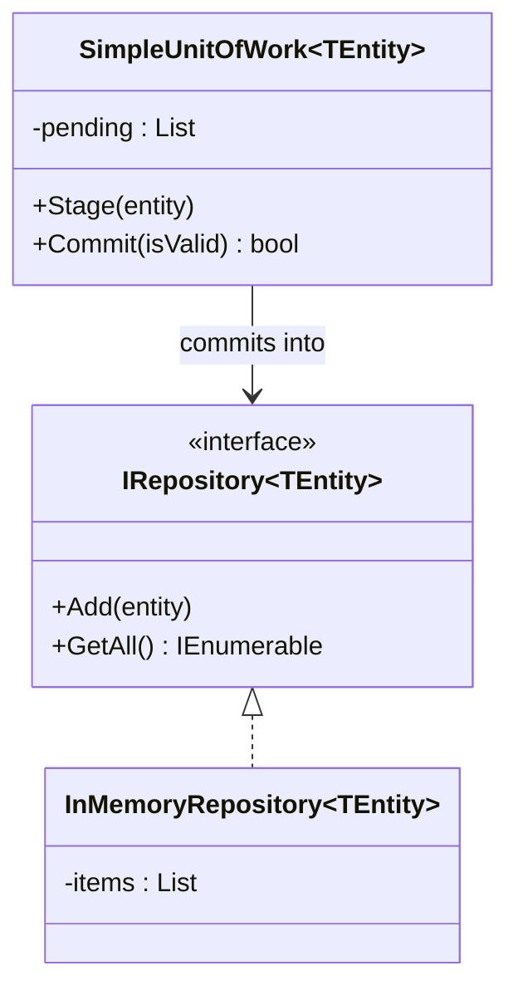
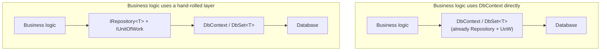

# Repository and Unit of Work Patterns

## Introduction

Before reading this lesson, you should already be comfortable with **[Interpreter Pattern](../12-advanced-concepts/12-28-interpreter-pattern.md)** and, more importantly, with Module 11's EF Core coverage and **[Dependency Inversion Principle](../12-advanced-concepts/12-05-dependency-inversion-principle.md)** — the SOLID principle stating that business logic should depend on abstractions, not concrete implementations. This lesson is the capstone of this entire Design Patterns sub-area: it covers the **Repository pattern**, which abstracts data access behind a technology-agnostic interface, and the **Unit of Work pattern**, which coordinates several repository operations into one atomic commit. It also asks the question every honest treatment of these two patterns has to ask: if you're using EF Core, isn't `DbContext` already both of these things? The answer is yes, mostly — and this lesson spends real time on when wrapping another layer around it is worth the ceremony, and when it isn't.

By the end of this lesson, you will be able to:

- Explain what the Repository pattern abstracts away, and why business code depending on `IRepository<T>` rather than a concrete data-access type matters
- Explain what the Unit of Work pattern coordinates, and what "atomic commit" means for a group of related changes
- Implement a small generic repository and a unit of work with all-or-nothing commit semantics
- Honestly assess why EF Core's `DbContext`/`DbSet<T>` already implements most of both patterns, and when adding a hand-rolled layer on top is genuinely justified
- Recap all twenty-four patterns this sub-area covered, from Module 12's first SOLID principle through this capstone

## Repository and Unit of Work — A Layman's Perspective

Imagine you need groceries from three different stores — a bakery for bread, a butcher for meat, a farm stand for vegetables — because no single store near you carries everything. You could visit each one yourself, learn each shop's particular counter system, and pay each one separately. Or you could hire a personal shopper: you tell them "get me a loaf of sourdough, a pound of chicken, and a bag of carrots," and they handle the specifics of which store sells what and how each till works. You never had to know or care that the bakery uses a different register system than the butcher — the personal shopper absorbed that detail entirely. That's the Repository pattern: your business logic says "get me a book," "save this loan," and the repository absorbs whatever specific technology is actually fetching or storing that data underneath.

Now suppose your shopping list isn't independent items at all — it's one coordinated task, like "buy the ingredients for tonight's dinner, all of it, or don't buy any of it," because a half-finished dinner with the meat but not the bread isn't useful to you. A personal shopper who understood this would collect everything at each stop, but hold off actually paying and committing to any of it until the whole trip is assembled — if the butcher turns out to be sold out of chicken, the shopper cancels the whole run rather than coming home with just bread and carrots and no plan for dinner. That single, all-or-nothing commit at the end of the whole trip is the Unit of Work pattern: several related operations — several purchases — treated as one atomic unit that either all happen together, or none of them do.

Here's the honest twist this lesson leans into. If you only ever shop at exactly one store — a large supermarket that already sells bread, meat, and vegetables all under one roof, with one checkout line and one single receipt for your whole cart — hiring a separate personal shopper on top of that supermarket doesn't actually buy you anything new. The supermarket already *is* your personal shopper and your one-receipt checkout, combined. Adding another person whose entire job is "go to the one store I already go to, and hand me back exactly what it already handed you" is just an extra layer of indirection around a job that was already being done.

That's precisely the situation a lot of C# applications are in with EF Core. `DbContext` already fetches and stores data behind a clean, unified API (`DbSet<T>`), and `SaveChanges()` already commits every tracked change across every entity type in that context as one atomic database transaction. Wrapping a hand-rolled Repository and Unit of Work around `DbContext`, in an application that only ever talks to one database through EF Core, is very often exactly like hiring that redundant personal shopper for the supermarket you already shop at exclusively. The pattern only earns its keep when there's a genuine second store somewhere down the line — a real reason the abstraction might one day point somewhere else.

## Repository and Unit of Work — A Programming Language Perspective

The Repository pattern defines an interface — conventionally `IRepository<TEntity>` — exposing operations like `Add`, `Remove`, and query methods, so that business logic depends on that interface rather than on a concrete data-access technology; this is Dependency Inversion Principle applied specifically to persistence, matching how Module 11's EF Core lessons already used `DbContext` as an injected dependency rather than something business logic constructs directly. The Unit of Work pattern coordinates multiple repositories (or multiple operations against one repository) so that their changes are committed together, typically through a single `Commit()` (or `CommitAsync()`) method; in a database-backed implementation, this usually means every repository shares the same underlying connection or `DbContext` instance, so one commit call flushes every pending change as a single transaction. Generic constraints (`where TEntity : class`) commonly restrict a generic repository to reference types, matching EF Core's own `DbSet<TEntity>` constraint. Critically, C# doesn't require any special language feature for either pattern — both are pure interface-and-composition designs, achievable with the same classes, interfaces, and generics this curriculum has used from Module 02 onward.

## How to Implement Repository and Unit of Work in C#

The clearest version of this pattern needs a generic repository interface, an in-memory implementation of it (standing in for whatever real storage technology would sit behind it), and a unit of work that stages changes and commits them all together or not at all.


*Figure 1: `SimpleUnitOfWork` stages entities and only pushes them into the repository, all at once, when every staged item passes validation.*

```csharp
// Program.cs — .NET 10 / C# 14
var repository = new InMemoryRepository<Note>();
var unitOfWork = new SimpleUnitOfWork<Note>(repository);

unitOfWork.Stage(new Note("Buy milk"));
unitOfWork.Stage(new Note("Renew passport"));
bool firstCommit = unitOfWork.Commit(note => !string.IsNullOrWhiteSpace(note.Text));
Console.WriteLine($"First commit succeeded: {firstCommit}, notes saved so far: {repository.GetAll().Count()}");

unitOfWork.Stage(new Note("Call the dentist"));
unitOfWork.Stage(new Note(""));   // invalid — empty text
bool secondCommit = unitOfWork.Commit(note => !string.IsNullOrWhiteSpace(note.Text));
Console.WriteLine($"Second commit succeeded: {secondCommit}, notes saved so far: {repository.GetAll().Count()}");

record Note(string Text);

interface IRepository<TEntity> where TEntity : class
{
    void Add(TEntity entity);
    IEnumerable<TEntity> GetAll();
}

class InMemoryRepository<TEntity> : IRepository<TEntity> where TEntity : class
{
    private readonly List<TEntity> _items = [];

    public void Add(TEntity entity) => _items.Add(entity);
    public IEnumerable<TEntity> GetAll() => _items;
}

class SimpleUnitOfWork<TEntity>(IRepository<TEntity> repository) where TEntity : class
{
    private readonly List<TEntity> _pending = [];

    public void Stage(TEntity entity) => _pending.Add(entity);

    public bool Commit(Func<TEntity, bool> isValid)
    {
        if (!_pending.All(isValid))
        {
            _pending.Clear();   // all-or-nothing: discard the whole batch
            return false;
        }

        foreach (TEntity entity in _pending)
        {
            repository.Add(entity);
        }

        _pending.Clear();
        return true;
    }
}
```

**Console Output:**

```text
First commit succeeded: True, notes saved so far: 2
Second commit succeeded: False, notes saved so far: 2
```

The first commit stages two valid notes and both are saved together. The second commit stages one perfectly valid note — "Call the dentist" — alongside one invalid, empty note, and because they were staged as one batch, *neither* is saved: the valid note doesn't sneak through on its own merit. That's the entire point of Unit of Work's atomic commit — a group of related changes lives or dies together, never partially.

## Real-Time Example: Checking Out a Book in Library/Inventory Management

We apply this lesson's patterns to the Library/Inventory Management case study: checking out a book needs two changes to happen together — decrementing the book's available-copy count and recording a new `Loan` — and neither should happen without the other. `BookRepository` and `LoanRepository` each implement `IRepository<TEntity>`, and `LibraryUnitOfWork` coordinates both behind one `TryCheckOutBook` operation.

```csharp
// Program.cs — .NET 10 / C# 14 — Real-Time Example (Library/Inventory Management)
var bookRepository = new BookRepository();
var loanRepository = new LoanRepository();
var unitOfWork = new LibraryUnitOfWork(bookRepository, loanRepository);

bookRepository.Add(new Book { Id = 1, Title = "Clean Code", AvailableCopies = 1 });
bookRepository.Add(new Book { Id = 2, Title = "Refactoring", AvailableCopies = 0 });

DateOnly today = new(2026, 8, 16);

foreach ((int bookId, string member) in new[] { (1, "Alice"), (2, "Bob"), (1, "Carol") })
{
    bool checkedOut = unitOfWork.TryCheckOutBook(bookId, member, today, out string message);
    Console.WriteLine($"{(checkedOut ? "OK" : "FAILED")}: {message}");
}

Console.WriteLine();
Console.WriteLine("Loans recorded:");
foreach (Loan loan in loanRepository.GetAll())
{
    Console.WriteLine($"  {loan.MemberName} checked out book #{loan.BookId} on {loan.CheckedOutOn:yyyy-MM-dd}");
}

class Book
{
    public required int Id { get; init; }
    public required string Title { get; init; }
    public int AvailableCopies { get; set; }
}

class Loan
{
    public required int BookId { get; init; }
    public required string MemberName { get; init; }
    public required DateOnly CheckedOutOn { get; init; }
}

interface IRepository<TEntity> where TEntity : class
{
    void Add(TEntity entity);
    IEnumerable<TEntity> GetAll();
}

class BookRepository : IRepository<Book>
{
    private readonly List<Book> _books = [];

    public void Add(Book entity) => _books.Add(entity);
    public IEnumerable<Book> GetAll() => _books;
    public Book? Find(int id) => _books.FirstOrDefault(b => b.Id == id);
}

class LoanRepository : IRepository<Loan>
{
    private readonly List<Loan> _loans = [];

    public void Add(Loan entity) => _loans.Add(entity);
    public IEnumerable<Loan> GetAll() => _loans;
}

class LibraryUnitOfWork(BookRepository books, LoanRepository loans)
{
    public bool TryCheckOutBook(int bookId, string memberName, DateOnly today, out string message)
    {
        Book? book = books.Find(bookId);
        if (book is null)
        {
            message = $"Book {bookId} not found.";
            return false;
        }

        if (book.AvailableCopies <= 0)
        {
            message = $"\"{book.Title}\" has no available copies.";
            return false;
        }

        // Both changes below happen together — the atomic commit this pattern promises.
        book.AvailableCopies--;
        loans.Add(new Loan { BookId = bookId, MemberName = memberName, CheckedOutOn = today });

        message = $"\"{book.Title}\" checked out to {memberName}.";
        return true;
    }
}
```

**Console Output:**

```text
OK: "Clean Code" checked out to Alice.
FAILED: "Refactoring" has no available copies.
FAILED: "Clean Code" has no available copies.

Loans recorded:
  Alice checked out book #1 on 2026-08-16
```

Alice's checkout succeeds, decrementing `AvailableCopies` and recording her `Loan` together. Bob's fails outright because "Refactoring" already had zero copies. Carol's fails for the same reason Alice's succeeded — Alice's checkout already consumed the one copy "Clean Code" had, so `AvailableCopies` is back to zero by the time Carol's request runs. In a real EF-Core-backed version of `LibraryUnitOfWork`, both the decrement and the `Loan` insert would be tracked by the same `DbContext` and flushed together in one `SaveChangesAsync()` call — if that database write failed for any reason, neither change would persist, exactly matching this in-memory version's all-or-nothing shape.

## Repository + Unit of Work vs. EF Core's DbContext Directly

Here's the comparison this lesson has been building toward. `DbSet<TEntity>` already behaves like a repository: `Add`, `Remove`, and LINQ queries are exactly the shape `IRepository<TEntity>` re-invents. `DbContext.SaveChanges()` already behaves like a unit of work: every tracked change, across every `DbSet` in that context, commits together as one database transaction — add a `Book`, add a `Loan`, change `AvailableCopies`, and one `SaveChanges()` call commits all three or none of them, with no extra `IUnitOfWork` interface required to get that guarantee.

So when does a hand-rolled layer on top of `DbContext` genuinely earn its ceremony? Three honest cases: first, when the persistence technology might really change — today's EF Core swapped for a document store, a legacy stored-procedure layer, or a third-party API — and business logic needs to depend on a stable interface rather than `DbContext` directly. Second, when unit tests need to run without any database at all, and faking a plain `IRepository<T>` (as this lesson's `InMemoryRepository<T>` demonstrates) is simpler than mocking `DbContext`/`DbSet<T>`'s wider surface. Third, when query logic — soft-delete filtering, tenant scoping, consistent sorting — needs to be centralized in one place rather than repeated across every LINQ query site. Absent all three, a Repository/Unit-of-Work layer over a single-database, single-technology EF Core app is often ceremony without payoff — and worse, it tends to leak EF-Core-specific concerns like `IQueryable` and `.Include()` through the supposedly "abstract" interface anyway, quietly defeating the abstraction it was meant to provide.


*Figure 2: The hand-rolled layer sits on top of an abstraction — `DbContext` — that was already doing both jobs; it only earns its keep when that extra seam is genuinely needed.*

| Aspect | `DbContext`/`DbSet<T>` Directly | Hand-Rolled Repository + Unit of Work |
|---|---|---|
| Query abstraction | `DbSet<T>` + LINQ (EF-Core-specific) | Custom interface, technology-agnostic on paper |
| Atomic commit | `SaveChanges()` across all tracked entities | Custom `Commit()`, usually calling `SaveChanges()` underneath anyway |
| Testability without a database | Requires EF Core's in-memory/SQLite provider, or mocking `DbSet` | Easier to fake with a plain in-memory list, as this lesson showed |
| Genuine extra payoff | None — it already is both patterns | Real, if persistence technology might change or query logic needs centralizing |
| Common failure mode | N/A | `IQueryable`/`.Include()` leaking through the "abstract" interface anyway |

## Types and Variants of Repository and Unit of Work in C#

1. **Generic repository (`IRepository<TEntity>`)** — one interface shape reused for every entity type, as shown in this lesson's How-To section.
2. **Specific/per-aggregate repository (`BookRepository`, `LoanRepository`)** — a dedicated interface and implementation per entity, allowing entity-specific query methods like `Find(id)`, as shown in the Real-Time Example.
3. **Async Unit of Work (`Task<bool> CommitAsync()`)** — the realistic shape for anything backed by a real database, wrapping an async `SaveChangesAsync()` call.
4. **EF Core's `DbContext`/`DbSet<T>`** — the built-in implementation of both roles at once, discussed in the comparison above.
5. **[Dependency Inversion Principle](../12-advanced-concepts/12-05-dependency-inversion-principle.md)** — the SOLID principle this entire pattern rests on: business logic depends on `IRepository<T>`, never on a concrete EF Core or ADO.NET type.
6. **[Interpreter Pattern](../12-advanced-concepts/12-28-interpreter-pattern.md)** — the previous lesson, recapped in full below alongside this sub-area's other twenty-three patterns.

## What You've Learned & What's Next

Repository abstracts *where* data comes from behind one interface; Unit of Work makes sure a group of related changes commits — or fails — together, never halfway. And the honest capstone lesson of this whole sub-area: if you're already using EF Core against a single database, `DbContext` and `DbSet<T>` largely *are* both patterns, so the real skill isn't reflexively wrapping another layer around them — it's recognizing the specific, genuine reasons (a real second storage technology, database-free unit testing, centralized query rules) that justify doing so anyway.

That closes out this sub-area's twenty-four lessons. It opened with the five **SOLID principles** — Single Responsibility, Open/Closed, Liskov Substitution, Interface Segregation, and Dependency Inversion — the foundation every pattern since has leaned on. From there, the **creational patterns** (Singleton, Factory Method, Abstract Factory, Builder, Prototype) covered controlled object creation; the **structural patterns** (Adapter, Bridge, Composite, Decorator, Facade, Flyweight, Proxy) covered composing objects into larger structures without their classes depending on each other directly; and the **behavioral patterns** (Chain of Responsibility, Command, Interpreter, Iterator, Mediator, Memento, Observer, State, Strategy, Template Method, Visitor) covered how objects communicate and share responsibility for a single request or piece of state — from Memento's undo snapshots, through Chain of Responsibility's handler chains, to Interpreter's small rule grammars. This lesson's Repository and Unit of Work, not part of the original Gang of Four catalog but ubiquitous in real C# codebases, closes the sub-area by tying every pattern's real payoff back to one question: does this abstraction earn its ceremony, or does it just add a layer around one that already existed?

Continue your learning journey with **[Benchmarking with BenchmarkDotNet](../12-advanced-concepts/12-30-benchmarking-with-benchmarkdotnet.md)**, where Module 12 shifts from design and structure to measurement — proving, with real numbers, whether a design decision actually performs the way you'd expect.

---
*Applies to: .NET 10 / C# 14. Last reviewed 2026-08-16.*
