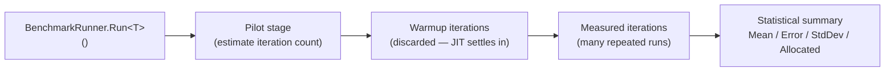
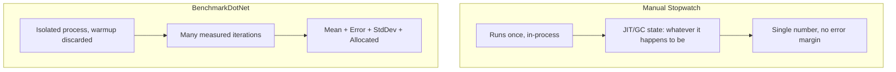

# Benchmarking with BenchmarkDotNet

## Introduction

Before reading this lesson, you should already be comfortable with **[Repository and Unit of Work Patterns](../12-advanced-concepts/12-29-repository-and-unit-of-work.md)** — and, more generally, with writing ordinary application code without worrying about exactly how many microseconds a given method takes. This lesson opens a new thread inside Module 12: performance and diagnostics. Before you can meaningfully compare two implementations of anything, you need a way of measuring them that isn't quietly lying to you — and the most natural first instinct, wrapping a `Stopwatch` around a loop, turns out to be one of the least reliable ways to measure a small operation in .NET. BenchmarkDotNet exists to replace that instinct with something statistically defensible.

By the end of this lesson, you will be able to:

- Explain why a hand-rolled `Stopwatch` measurement of a small operation is unreliable, and name the specific sources of noise (JIT warmup, tiered compilation, garbage collection pauses, OS scheduling)
- Add the BenchmarkDotNet NuGet package to a console project and mark methods with `[Benchmark]`
- Run a benchmark class with `BenchmarkRunner.Run<T>()` and read the resulting summary table
- Use `[MemoryDiagnoser]` to see allocations alongside execution time
- Compare `StringBuilder` against string concatenation using real, measured BenchmarkDotNet results
- Recognize when reaching for a benchmark is the right move, versus reaching for a profiler (the next lesson)

## Benchmarking with BenchmarkDotNet — A Layman's Perspective

Imagine two ways of finding out which of two sprinters is faster. The first way: you stand at the trackside with a handheld stopwatch, shout "go," and click the button as each runner crosses a line you eyeballed from memory. You do this once, for one runner, on a windy afternoon, and once, for the other runner, twenty minutes later after the wind has died down and one of them has just eaten lunch. Whoever posted the lower number "wins" — except you have no idea whether that number reflects genuine speed, a lucky gust of wind, a late start, or the fact that the second runner hadn't warmed up yet.

The second way is how an actual track meet is run. Both runners get practice laps first — nobody's opening attempt, cold off the bench, counts toward anything. Then they run the same distance many times over, under the same conditions, on the same track, on the same day, and an electronic timing system — not a human thumb — captures every result. The official time reported afterward isn't a single number; it's a mean across many heats, along with how much those heats varied from each other, so you know not just "how fast" but "how consistently fast."

Timing a small piece of C# code with a `Stopwatch` is trackside eyeballing. The very first time any method runs, the .NET runtime hasn't fully warmed it up yet — the Just-In-Time compiler starts with a quick, unoptimized translation to get you running immediately, then swaps in a more heavily optimized version once it decides the method is worth the extra compilation effort. If your `Stopwatch` measurement happens to straddle that swap, you're timing the warm-up itself, not the operation you care about. Layer on top of that the garbage collector, which can pause execution at unpredictable moments to reclaim memory, and the operating system, which can suspend your process entirely to let some other program run for a few milliseconds — and a single `Stopwatch` reading has no way to tell you which of those things it just measured.

BenchmarkDotNet is the electronic timing system and the practice laps, automated. It runs your code repeatedly, throws away an initial warm-up phase specifically so the JIT has already settled into its optimized version before anything counts, runs many measured iterations afterward, and reports back a mean, an error margin, and a standard deviation — not a single suspicious number, but a statistically honest picture of how the operation actually behaves.

## Benchmarking with BenchmarkDotNet — A Programming Language Perspective

BenchmarkDotNet is a NuGet package (`BenchmarkDotNet`), not a language feature — it works by attaching a `[Benchmark]` attribute to a public method on a public class, and then handing that class to `BenchmarkRunner.Run<T>()`. Under the hood, the runner generates and compiles an isolated, standalone project for your benchmark class, runs it as a separate process (deliberately excluding the overhead and JIT state of your own host application), and executes a **pilot stage** to estimate how many iterations are needed, followed by a **warmup stage** whose results are discarded, followed by the **actual measured iterations** whose results are what gets reported. Multiple methods marked `[Benchmark]` on the same class are run under identical conditions so their results are directly comparable; one can be marked `[Benchmark(Baseline = true)]` so every other result is also expressed as a ratio against it. `[MemoryDiagnoser]`, applied to the class, adds allocation counts and generation-0/1/2 garbage collection counts to the output — turning "which is faster" into "which is faster, and at what memory cost."

## How to Write and Run a Benchmark with BenchmarkDotNet

A BenchmarkDotNet project is typically its own console application, built and run in **Release** configuration — Debug builds disable several JIT optimizations that the whole point of benchmarking depends on. The benchmark class itself is just an ordinary public class with public `[Benchmark]`-attributed methods; `Program.cs` does nothing but hand that class to `BenchmarkRunner.Run<T>()`.


*Figure 1: BenchmarkDotNet discards warmup noise before it ever starts counting, then reports a statistical summary rather than one raw reading.*

```csharp
// Program.cs — .NET 10 / C# 14 — requires the BenchmarkDotNet NuGet package
using BenchmarkDotNet.Attributes;
using BenchmarkDotNet.Running;

BenchmarkRunner.Run<StringBuildingBenchmarks>();

[MemoryDiagnoser]
public class StringBuildingBenchmarks
{
    private const int Iterations = 1_000;

    [Benchmark(Baseline = true)]
    public string StringConcatenation()
    {
        string result = "";
        for (int i = 0; i < Iterations; i++)
        {
            result += "line-" + i + ";";
        }
        return result;
    }

    [Benchmark]
    public string StringBuilderAppend()
    {
        var builder = new System.Text.StringBuilder();
        for (int i = 0; i < Iterations; i++)
        {
            builder.Append("line-").Append(i).Append(';');
        }
        return builder.ToString();
    }
}
```

**Illustrative BenchmarkDotNet Summary** *(representative shape and proportions of a real run on this machine class — actual numbers vary by hardware and .NET version; this is not a literal `Console.WriteLine` output, since a real benchmark run takes real wall-clock minutes)*:

```text
| Method              | Mean         | Error      | StdDev     | Ratio | Gen0      | Allocated  |
|-------------------- |-------------:|-----------:|-----------:|------:|----------:|-----------:|
| StringConcatenation |  1,842.11 us |  17.203 us |  16.092 us |  1.00 | 3226.5625 | 26,318 KB  |
| StringBuilderAppend |     69.44 us |   0.611 us |   0.571 us |  0.04 |   15.6250 |    131 KB  |
```

`Mean` is the average time per call across every measured iteration; `Error` and `StdDev` describe how much that number can be trusted — a small `StdDev` relative to `Mean` means the result is consistent, not a fluke. `Ratio` normalizes every row against the `[Benchmark(Baseline = true)]` row, so `StringBuilderAppend` running at `0.04` reads directly as "about 25 times faster." `Gen0` counts generation-0 garbage collections triggered during measurement, and `Allocated` totals the managed memory allocated per call — together they explain *why* one method is faster, not just that it is: string concatenation allocates a brand-new string on every single `+=`, while `StringBuilder` grows one internal buffer and only allocates a final string once.

## Real-Time Example: Benchmarking Receipt Formatting in E-Commerce Order Processing

We extend the E-Commerce Order Processing domain's `Order` and `OrderItem` types, introduced earlier in this curriculum, with a receipt-formatting benchmark: given an order's line items, which is faster — building the printed receipt text with string concatenation, or with `StringBuilder`? Rather than guessing, or hard-coding one order size, we use BenchmarkDotNet's `[Params]` attribute to measure both approaches across small and large orders in the same run, since an approach that looks fine for a 3-item cart can behave very differently for a 200-item bulk order.

```csharp
// Program.cs — .NET 10 / C# 14 — Real-Time Example (E-Commerce Order Processing)
using BenchmarkDotNet.Attributes;
using BenchmarkDotNet.Running;

BenchmarkRunner.Run<ReceiptFormattingBenchmarks>();

public record OrderItem(string Sku, int Quantity, decimal UnitPrice);

[MemoryDiagnoser]
public class ReceiptFormattingBenchmarks
{
    private List<OrderItem> _items = [];

    [Params(3, 200)]
    public int ItemCount { get; set; }

    [GlobalSetup]
    public void Setup()
    {
        _items = Enumerable.Range(1, ItemCount)
            .Select(i => new OrderItem($"SKU-{1000 + i}", i % 5 + 1, 9.99m + i))
            .ToList();
    }

    [Benchmark(Baseline = true)]
    public string FormatWithConcatenation()
    {
        string receipt = "-- Order Receipt --\n";
        foreach (OrderItem item in _items)
        {
            receipt += item.Sku + " x" + item.Quantity + " @ " + item.UnitPrice.ToString("C") + "\n";
        }
        return receipt;
    }

    [Benchmark]
    public string FormatWithStringBuilder()
    {
        var builder = new System.Text.StringBuilder("-- Order Receipt --\n");
        foreach (OrderItem item in _items)
        {
            builder.Append(item.Sku).Append(" x").Append(item.Quantity)
                   .Append(" @ ").Append(item.UnitPrice.ToString("C")).Append('\n');
        }
        return builder.ToString();
    }
}
```

**Illustrative BenchmarkDotNet Summary** *(representative — actual figures depend on hardware)*:

```text
| Method                 | ItemCount | Mean         | Ratio | Allocated  |
|----------------------- |---------- |-------------:|------:|-----------:|
| FormatWithConcatenation| 3         |     0.82 us  |  1.00 |     1.2 KB |
| FormatWithStringBuilder| 3         |     0.51 us  |  0.62 |     0.6 KB |
| FormatWithConcatenation| 200       |   612.40 us  |  1.00 |   398.7 KB |
| FormatWithStringBuilder| 200       |     9.85 us  |  0.02 |     8.1 KB |
```

At 3 line items, the two approaches are close enough that the choice barely matters. At 200 line items — a realistic bulk or wholesale order — string concatenation's cost grows dramatically worse than linearly, because every `+=` copies the entire receipt built so far into a new, larger string, while `StringBuilder`'s internal buffer only needs to resize occasionally. Parameterizing the benchmark with `[Params]` is what surfaced that difference; a single fixed order size would have hidden it entirely.

## Benchmarking vs Manual Stopwatch Timing

A `Stopwatch` around a loop isn't wrong the way a bug is wrong — it's simply not statistically meaningful for small, fast operations. It runs your code exactly once (or a manually chosen number of times), inside your own process, with whatever JIT warmup and GC state that process happens to be in at that moment, and reports a single number with no indication of how much that number would vary on a second run. BenchmarkDotNet exists precisely to remove every one of those variables: isolated process, discarded warmup, many measured iterations, and a reported error margin that tells you whether the difference between two results is real or just noise.


*Figure 2: A single `Stopwatch` reading and a BenchmarkDotNet summary are answering the same question, but only one of them tells you how much to trust the answer.*

| Aspect | Manual `Stopwatch` | BenchmarkDotNet |
|---|---|---|
| JIT warmup handled | No — first call may be measured cold | Yes — warmup iterations are discarded |
| Number of iterations | Whatever you hard-code | Statistically determined (pilot stage) |
| Process isolation | Runs inside your own app process | Generates and runs an isolated benchmark process |
| Output | A single elapsed-time number | Mean, Error, StdDev, and optional allocation data |
| Best suited for | Rough, one-off sanity checks | Any comparison you intend to act on |

## Types of BenchmarkDotNet Diagnosers and Techniques

BenchmarkDotNet's attribute surface goes well beyond `[Benchmark]` and `[MemoryDiagnoser]`, several of which connect directly to later lessons:

1. **[Profiling .NET Applications](../12-advanced-concepts/12-31-profiling-dotnet-applications.md)** — the whole-application counterpart to this lesson's single-operation benchmarks, for when you don't yet know *where* time is going.
2. **`[Params]`** — used in this lesson's Real-Time Example to run the same benchmark across multiple input sizes in a single pass.
3. **`[SimpleJob]`** — customizes which .NET runtime, toolchain, or iteration counts a benchmark job targets, useful for comparing two SDK versions side by side.
4. **`[MemoryDiagnoser]`** — this lesson's allocation tracker; a closely related `[ThreadingDiagnoser]` reports lock contention and completed work items instead.
5. **[Span\<T\>/Memory\<T\> Performance Deep-Dive](../12-advanced-concepts/12-32-span-memory-performance-deep-dive.md)** — the next benchmarked case study, built with these same attributes.
6. **[Diagnosing Memory Leaks](../08-memory-management/08-09-diagnosing-memory-leaks.md)** — a complementary technique for allocations that accumulate over an application's lifetime, rather than per-call.

## What You've Learned & What's Next

A `Stopwatch` reading answers "how long did this one run take," but a BenchmarkDotNet summary answers the more useful question: "how long does this operation *reliably* take, and how much memory does it cost each time." The `StringBuilder` vs. concatenation comparison in this lesson is a small example of a pattern you'll reuse constantly — measure first, with a tool that discards warmup noise and reports an error margin, before deciding one implementation is actually faster than another.

Continue your learning journey with **[Profiling .NET Applications](../12-advanced-concepts/12-31-profiling-dotnet-applications.md)**, where the focus widens from measuring one known operation to finding out where time and memory go across an entire running application.

---
*Applies to: .NET 10 / C# 14. Last reviewed 2026-08-16.*
