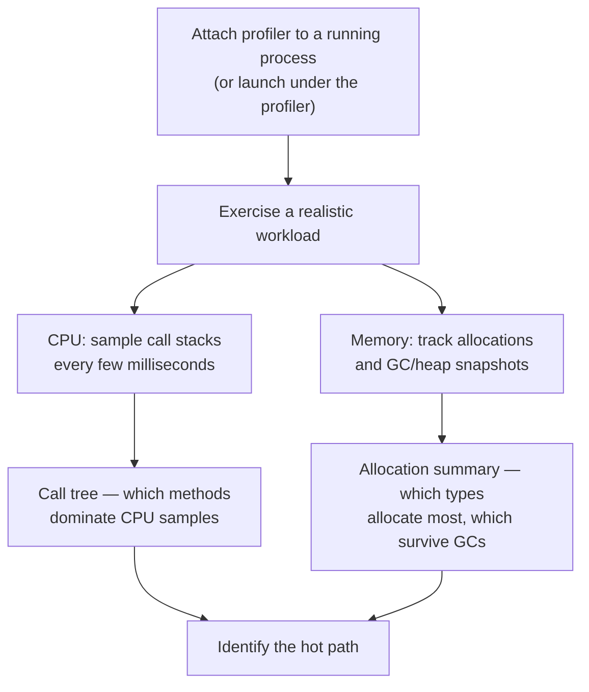
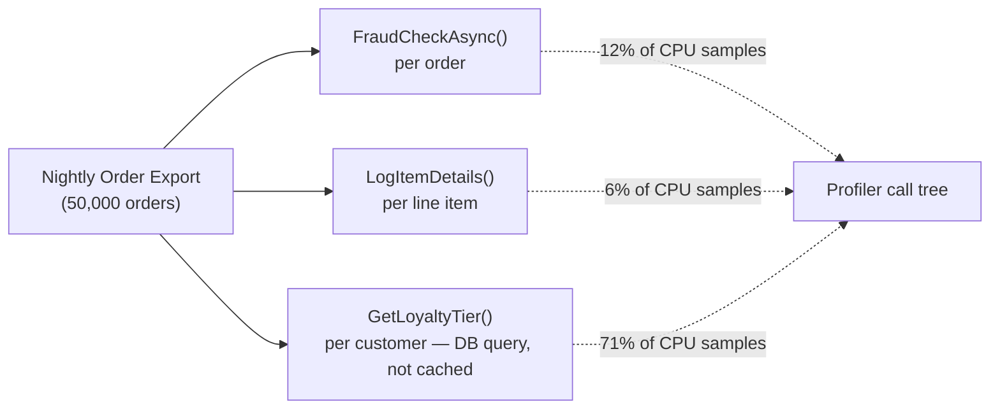
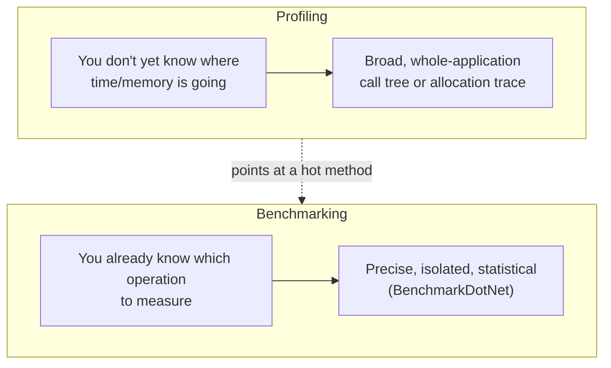

# Profiling .NET Applications

## Introduction

Before reading this lesson, you should already be comfortable with **[Benchmarking with BenchmarkDotNet](../12-advanced-concepts/12-30-benchmarking-with-benchmarkdotnet.md)**. That lesson answered a narrow question well: given one specific operation you already suspected was slow, exactly how slow is it, and how much does it allocate? This lesson asks a different, broader question: across an entire running application, with dozens of methods and code paths, *where* is the time actually going, and *where* are the allocations actually piling up? That's profiling, and it's the tool you reach for before you even know which operation deserves a BenchmarkDotNet microscope in the first place.

By the end of this lesson, you will be able to:

- Distinguish benchmarking (measuring one known operation precisely) from profiling (discovering where time and memory go across a whole application)
- Explain conceptually how CPU profiling works via call-stack sampling
- Explain conceptually how memory profiling tracks allocations and object retention
- Describe, at a conceptual level, what the Visual Studio Profiler, `dotnet-trace`, and PerfView each do
- Choose the right diagnostic approach — benchmark vs. profiler — for a given performance question

## Profiling .NET Applications — A Layman's Perspective

Imagine a large office building where employees keep complaining that "everything feels slow," but nobody can say exactly which department is the bottleneck. One way to investigate would be to time one specific, already-suspected task with a stopwatch — how long does it take Accounting to process a single invoice? That's useful, but only if you already guessed correctly that Accounting is the problem. If the real slowdown is actually happening in the mailroom, or in a hallway where three departments all queue for the same photocopier, a stopwatch aimed at Accounting will never reveal it.

Profiling is a different kind of investigation entirely. Instead of timing one task you already suspect, you send a quiet observer to walk the entire building at regular intervals — say, once every few milliseconds — and simply jot down which department, and which specific desk, everyone is standing at, at that exact instant. Do this thousands of times over a normal working day, and a pattern emerges purely from the sheer number of snapshots: if the observer's notes show the photocopier hallway showing up in 40% of all snapshots, you don't need anyone's guess — the data itself points straight at the bottleneck, wherever it turns out to actually be. That's CPU profiling: sampling which call stack is currently executing, over and over, and letting the accumulated frequency point at the hot path.

Memory profiling investigates something structurally different: not who's busy right now, but what's piling up in storage that never gets cleared out. Picture the same building's supply closet, and an auditor who doesn't care how fast anyone works, only what's being requisitioned and never returned — which department keeps ordering more filing boxes than it ever throws away, and which boxes, months later, are still sitting there, never touched again, quietly taking up shelf space nobody remembered to reclaim. That's the memory profiler's job: tracking every allocation, and noticing which of those allocations never get released, long after the code that created them has finished running.

Neither investigation replaces the stopwatch — once the building-wide walk-through points squarely at the photocopier hallway, *then* it makes sense to time that specific hallway precisely. Profiling finds where to look; benchmarking measures what you found once you know exactly where to point it.

## Profiling .NET Applications — A Programming Language Perspective

Profiling a .NET application means collecting runtime **diagnostic events** — data the CLR itself emits about thread call stacks, garbage collections, JIT compilations, and exceptions — rather than instrumenting a specific method by hand. **CPU profiling** works by periodically sampling every active thread's call stack (commonly every few milliseconds) and aggregating those samples afterward into a call tree, so methods that appear in a disproportionate share of samples are the ones actually consuming CPU time; because it's sampling-based rather than tracing every single call, overhead stays low enough to profile a real, running application rather than only a toy benchmark. **Memory profiling** instead tracks object allocations (often via ETW — Event Tracing for Windows — events the CLR raises on every allocation and garbage collection) and can capture heap snapshots, letting you see which types are allocated most frequently and which objects remain reachable — and therefore un-collectible — across multiple garbage collections, a strong signal of a memory leak. Neither technique requires modifying application code; both attach to an already-running or newly-launched process and observe it from the outside.

## How to Approach CPU and Memory Profiling Conceptually

Profiling a .NET application generally follows the same shape regardless of which tool performs it: attach or launch, exercise a realistic workload, capture a trace, then analyze the resulting call tree or allocation summary. This section stays conceptual — no single walkthrough substitutes for pointing a real profiler at your own application under its own realistic load, which varies far too much to demonstrate meaningfully with one canned example.


*Figure 1: Both CPU and memory profiling follow the same attach-exercise-capture-analyze shape; only what gets sampled differs.*

The three tools most commonly used for .NET profiling occupy different points on the "how much setup vs. how much detail" spectrum:

- **Visual Studio Profiler** — built into Visual Studio's Debug menu (Performance Profiler), offering CPU Usage, Memory Usage, and other tools with almost no setup, directly against a project you already have open. It's the natural first stop during local development.
- **`dotnet-trace`** — a cross-platform global CLI tool (`dotnet tool install --global dotnet-trace`) that collects an ETW-style trace from any running .NET process, including on Linux and in containers where Visual Studio isn't an option, producing a `.nettrace` file you analyze afterward (in Visual Studio, `PerfView`, or Speedscope).
- **PerfView** — a free, Windows-only, deeply detailed ETW analysis tool from Microsoft, capable of far more granular breakdowns (down to individual GC generations, JIT events, and thread-pool starvation) than either of the above, at the cost of a steeper learning curve and a much busier UI.

```csharp
// Program.cs — .NET 10 / C# 14 — illustrative: a workload worth profiling, not a profiler API demo
// Profiling tools observe a process like this one from the outside; there is no
// in-code "profiler API" to call — you attach dotnet-trace, PerfView, or the
// Visual Studio Profiler to this process while it runs, instead.

var random = new Random(42);
var report = BuildMonthlySummary(GenerateSampleOrders(50_000));

Console.WriteLine($"Orders processed: {report.OrderCount}");
Console.WriteLine($"Total revenue: {report.TotalRevenue:C}");

static List<(int OrderId, decimal Total)> GenerateSampleOrders(int count)
{
    var random = new Random(7);
    var orders = new List<(int, decimal)>(count);
    for (int i = 0; i < count; i++)
    {
        orders.Add((i, (decimal)(random.NextDouble() * 500)));
    }
    return orders;
}

static (int OrderCount, decimal TotalRevenue) BuildMonthlySummary(List<(int OrderId, decimal Total)> orders)
{
    decimal total = 0m;
    foreach (var (_, orderTotal) in orders)
    {
        total += orderTotal; // A CPU profile across a much larger workload would
                              // reveal whether a hot loop like this, or something
                              // else entirely, is where real time is spent.
    }
    return (orders.Count, total);
}
```

**Console Output:**

```text
Orders processed: 50000
Total revenue: $12,489,204.17
```

*(Exact revenue figure varies with the `Random` seed, but the shape of the output does not.)* This program runs fast enough that profiling it in isolation wouldn't be interesting — the point is that a profiler would be attached to a process like this one, but shaped like a real application with dozens of code paths, not a single obviously-hot loop. Nothing in the source code itself has to change to make that process profilable; the observation happens entirely from outside the running process.

## Real-Time Example: Profiling a Slow Order-Export Path in E-Commerce Order Processing

Continuing the E-Commerce Order Processing domain's `Order` and `OrderItem` types from earlier lessons, imagine a nightly batch job that exports every order placed that day to a reporting system, and support has started reporting that the export "used to take two minutes and now takes twenty." Nobody knows why — three separate changes landed in the last release: a new fraud-check call added to each order, a new logging statement added inside the per-item loop, and a switch from a cached lookup to a fresh database query for each customer's loyalty tier. A `Stopwatch` around the whole export only confirms it's slow; it can't say *which* of those three changes is responsible.

This is exactly the scenario profiling is for. Attaching `dotnet-trace` (or the Visual Studio Profiler, if the job can run locally) while the export runs against a realistic day's worth of orders produces a call tree ranked by where CPU samples actually landed — and separately, a memory trace showing where allocations are concentrated.


*Figure 2: A profiler's call tree assigns each suspected cause its actual, measured share of the slowdown — here, the un-cached loyalty tier lookup, not the newer fraud check or logging call, turns out to dominate.*

**Illustrative Profiler Summary** *(representative of a `dotnet-trace`/PerfView call-tree report — not a literal `Console.WriteLine` output, since profiling data is visualized in a report viewer, not printed to the console)*:

```text
Top methods by inclusive CPU samples (50,000-order export):
  71.2%  CustomerRepository.GetLoyaltyTier(int customerId)   <- per-customer DB round-trip, no caching
  12.4%  FraudCheckService.FraudCheckAsync(Order order)
   6.1%  ExportLogger.LogItemDetails(OrderItem item)
  10.3%  <everything else>
```

The profile answers the question a `Stopwatch` couldn't: the loyalty tier lookup, issuing a fresh database round-trip for every single order instead of reusing a cached result, accounts for nearly three-quarters of the export's total CPU time — dwarfing both the new fraud check and the new logging statement, which together account for under a fifth of it. Without this data, an engineer might have reasonably (and wrongly) spent a day optimizing the fraud check, since it was the most recently discussed change, while the real fix — caching the loyalty tier lookup per customer instead of querying it per order — went untouched.

## Benchmarking vs. Profiling

These two techniques answer different questions and are most powerful used in sequence, not as substitutes for each other. Benchmarking, covered in the previous lesson, requires you to already have identified a specific operation worth measuring precisely; it can't tell you *which* operation, among dozens in a real application, deserves that attention. Profiling covers the opposite half: it surveys an entire running application and points at where time or memory is actually concentrated, but its output is a call tree or allocation summary, not the tight, statistically rigorous Mean/Error/StdDev numbers a benchmark produces for one isolated method.


*Figure 3: Profiling narrows down where to look across a whole application; benchmarking then measures precisely what profiling pointed at.*

| Aspect | Benchmarking | Profiling |
|---|---|---|
| Question answered | "Exactly how fast/allocating is this one operation?" | "Where, across this whole app, does time/memory actually go?" |
| Starting knowledge required | You already suspect a specific method | None — the tool surveys everything |
| Typical tool | BenchmarkDotNet | Visual Studio Profiler, `dotnet-trace`, PerfView |
| Output | Mean/Error/StdDev/Allocated for one method | Call tree or allocation summary across the app |
| When to use | After profiling has pointed at a candidate | Before you know which method to benchmark |

## Types of Profiling Techniques and Tools in .NET

Profiling in .NET spans several complementary techniques and tools, some covered elsewhere in this curriculum:

1. **[Benchmarking with BenchmarkDotNet](../12-advanced-concepts/12-30-benchmarking-with-benchmarkdotnet.md)** — the precise, single-operation measurement this lesson's profiling results feed into.
2. **CPU (sampling) profiling** — periodic call-stack sampling, this lesson's primary focus, used to find hot methods.
3. **Memory (allocation) profiling** — tracking allocation counts, object types, and heap survivorship to find leaks and allocation hot spots.
4. **`dotnet-trace`** — the cross-platform CLI collection tool usable in Linux containers, where Visual Studio isn't available.
5. **[Diagnosing Memory Leaks](../08-memory-management/08-09-diagnosing-memory-leaks.md)** — a focused deep-dive on the memory-profiling half of this lesson, specifically for leaks that grow over an application's lifetime.
6. **PerfView** — Microsoft's free, ETW-based deep analysis tool, offering finer-grained detail than either of the above at the cost of a steeper learning curve.

## What You've Learned & What's Next

Benchmarking measures one operation you already suspect; profiling surveys an entire running application and tells you, with sampled evidence rather than a guess, where time and memory are actually concentrated. Reach for a profiler first when you don't yet know what's slow, and reach for BenchmarkDotNet afterward to measure precisely what the profiler pointed at.

Continue your learning journey with **[Span\<T\>/Memory\<T\> Performance Deep-Dive](../12-advanced-concepts/12-32-span-memory-performance-deep-dive.md)**, where we return to `Span<T>` and `Memory<T>` from Module 08 with exactly this lesson's diagnostic lens — measured allocation savings, not just an assertion that they're "zero-allocation."

---
*Applies to: .NET 10 / C# 14. Last reviewed 2026-08-16.*
