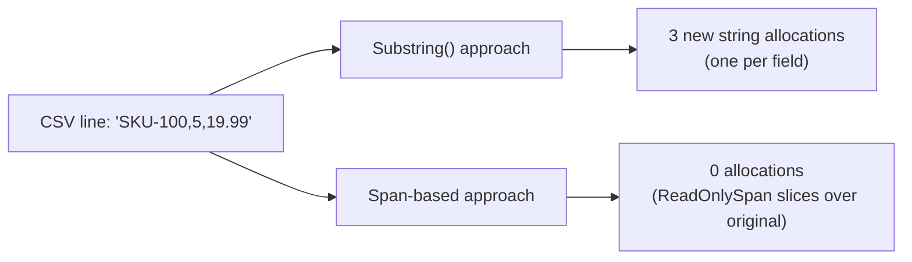
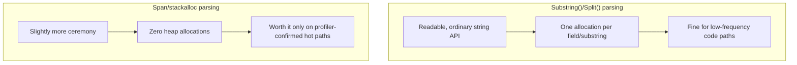

# Span<T>/Memory<T> Performance Deep-Dive

## Introduction

Before reading this lesson, you should already be comfortable with **[Profiling .NET Applications](../12-advanced-concepts/12-31-profiling-dotnet-applications.md)**, and with `Span<T>`/`Memory<T>` themselves from **[Span\<T\> and Memory\<T\>](../08-memory-management/08-06-span-t-and-memory-t.md)** back in Module 08. That earlier lesson asserted, through analogy, that slicing with `Span<T>` avoids allocating new strings or arrays. This lesson stops asserting and starts measuring: we put `Span<T>`-based CSV parsing and `Substring()`-based CSV parsing side by side in BenchmarkDotNet and look at the actual `Allocated` column, then do the same for a small `stackalloc` buffer against its heap-allocated equivalent.

By the end of this lesson, you will be able to:

- Explain why `Substring()`-based parsing allocates a new string on every single field, while `Span<T>`-based parsing allocates none
- Write a CSV field parser using `ReadOnlySpan<char>` and compare it against a `Substring()`-based equivalent using BenchmarkDotNet
- Use `stackalloc` for a small, fixed-size buffer and measure its allocation savings over an equivalent heap-allocated array
- Read a `Gen0`/`Allocated` BenchmarkDotNet column and connect it directly back to garbage collection pressure
- Recognize the size and lifetime limits that make `stackalloc` appropriate for some buffers and wrong for others

## Span<T>/Memory<T> Performance Deep-Dive — A Layman's Perspective

Picture a delivery company that has always shipped every single order in a brand-new cardboard box, even when the order is simply a repackaged handful of items already sitting, fully labeled, inside one larger box in the warehouse. Every time a customer only wants three items out of a bulk shipment, a worker walks over, takes a fresh box off the stack, carefully copies the three items into it, seals it, and ships it. The company has been doing this for so long nobody questions it — until someone finally tallies up exactly how much cardboard, tape, and labor goes into that unnecessary repackaging over a single month, and the number turns out to be enormous.

The alternative the company eventually adopts doesn't touch the original bulk box at all. Instead, a worker slaps a "look here only — items 3 through 5" sticky note directly onto the *existing* box and ships that same box onward, sticky note and all. No new cardboard. No copying. No tape. The recipient still gets exactly the three items they ordered, reads them straight off the original box through the window the sticky note marks out, and the warehouse's cardboard bill for that batch of orders drops to nearly nothing.

This lesson is the point where the delivery company actually weighs both approaches on a scale, rather than just describing the sticky-note idea and moving on. It counts, precisely, how many boxes got manufactured under the old approach versus the new one, for the exact same batch of orders — and that count, not just the analogy, is what tells you the sticky-note approach was worth adopting in the first place. `Substring()` is the fresh cardboard box, copying characters into a brand-new string every time; `Span<T>` is the sticky note, pointing at the same characters that were already there. The point of measuring is to stop taking that savings on faith.

## Span<T>/Memory<T> Performance Deep-Dive — A Programming Language Perspective

`string.Substring(start, length)` allocates a brand-new `string` object on the managed heap and copies the requested characters into it, every single time it's called — even when the substring is only ever read once and immediately discarded. `ReadOnlySpan<char>`, by contrast, is a `readonly ref struct` holding only a reference to the original string's backing character data plus an offset and length; slicing it with a range indexer (`text[start..end]`) or `.Slice()` produces another `ReadOnlySpan<char>` over that *same* underlying data, with no new character array ever created. `stackalloc` extends the same zero-allocation idea to entirely new, short-lived buffers: `Span<int> buffer = stackalloc int[8]` reserves eight integers' worth of space directly on the current stack frame rather than the managed heap, so that memory is reclaimed automatically the instant the method returns, without any garbage collector involvement at all — but only for buffers small enough and short-lived enough to belong on the stack safely, which is why `stackalloc` is typically reserved for buffers in the tens, not thousands, of elements.

## How to Measure Span-Based Parsing Against Substring-Based Parsing

CSV parsing is a natural place to see this savings directly: splitting one line into fields is either done with `Substring()`, producing one new string per field, or with `ReadOnlySpan<char>` slicing, producing zero new strings until a field is deliberately materialized as one. BenchmarkDotNet's `[MemoryDiagnoser]`, from the earlier lesson in this module, makes the difference visible in the `Allocated` column rather than leaving it as an assertion.


*Figure 1: Splitting the same CSV line either allocates one new string per field, or none at all, depending purely on which slicing API is used.*

```csharp
// Program.cs — .NET 10 / C# 14 — requires the BenchmarkDotNet NuGet package
using BenchmarkDotNet.Attributes;
using BenchmarkDotNet.Running;

BenchmarkRunner.Run<CsvParsingBenchmarks>();

[MemoryDiagnoser]
public class CsvParsingBenchmarks
{
    private const string Line = "SKU-1029,5,19.99,Warehouse-B,Backordered";

    [Benchmark(Baseline = true)]
    public int ParseWithSubstring()
    {
        string[] fields = Line.Split(',');
        int total = 0;
        foreach (string field in fields)
        {
            total += field.Length; // Forces use of each allocated substring.
        }
        return total;
    }

    [Benchmark]
    public int ParseWithSpan()
    {
        ReadOnlySpan<char> remaining = Line;
        int total = 0;
        while (!remaining.IsEmpty)
        {
            int commaIndex = remaining.IndexOf(',');
            ReadOnlySpan<char> field = commaIndex >= 0 ? remaining[..commaIndex] : remaining;
            total += field.Length; // No allocation — just reads the slice's length.
            remaining = commaIndex >= 0 ? remaining[(commaIndex + 1)..] : [];
        }
        return total;
    }
}
```

**Illustrative BenchmarkDotNet Summary** *(representative — actual figures depend on hardware and .NET version)*:

```text
| Method            | Mean       | Ratio | Gen0   | Allocated |
|------------------ |-----------:|------:|-------:|----------:|
| ParseWithSubstring |   142.3 ns |  1.00 | 0.0546 |     344 B |
| ParseWithSpan      |    38.7 ns |  0.27 |      - |       0 B |
```

`ParseWithSubstring` allocates 344 bytes and triggers `Gen0` collection pressure, because `Line.Split(',')` allocates both the returned array and one new `string` per field. `ParseWithSpan` shows a literal `0 B` in the `Allocated` column and a dash in `Gen0` — no managed allocation happened at all, because every `remaining[..commaIndex]` slice is a view over the same original `Line` data. The nearly four-times speedup in `Mean` isn't a coincidence; it's a direct, measurable consequence of skipping every one of those allocations.

## Real-Time Example: Measuring stackalloc Savings in Library/Inventory Management

We extend the Library/Inventory Management domain's barcode-scanning workflow: each scan produces a short, fixed-format code (`"BC-" + a 6-digit sequence number`, e.g. `"BC-004821"`) that needs to be validated and its numeric portion extracted, thousands of times per hour during a busy circulation-desk shift. Because the buffer needed is always small and short-lived — never outliving the single validation call — it's a natural candidate for `stackalloc` instead of a small heap-allocated `char[]`.

```csharp
// Program.cs — .NET 10 / C# 14 — Real-Time Example (Library/Inventory Management)
using BenchmarkDotNet.Attributes;
using BenchmarkDotNet.Running;

BenchmarkRunner.Run<BarcodeValidationBenchmarks>();

[MemoryDiagnoser]
public class BarcodeValidationBenchmarks
{
    private const string Barcode = "BC-004821";

    [Benchmark(Baseline = true)]
    public bool ValidateWithHeapArray()
    {
        char[] digits = new char[6];
        Barcode.AsSpan(3, 6).CopyTo(digits);
        return IsAllDigits(digits);
    }

    [Benchmark]
    public bool ValidateWithStackalloc()
    {
        Span<char> digits = stackalloc char[6];
        Barcode.AsSpan(3, 6).CopyTo(digits);
        return IsAllDigits(digits);
    }

    private static bool IsAllDigits(ReadOnlySpan<char> candidate)
    {
        foreach (char c in candidate)
        {
            if (!char.IsAsciiDigit(c)) return false;
        }
        return true;
    }
}
```

**Illustrative BenchmarkDotNet Summary** *(representative — actual figures depend on hardware)*:

```text
| Method                  | Mean      | Ratio | Gen0   | Allocated |
|------------------------ |----------:|------:|-------:|----------:|
| ValidateWithHeapArray   |  18.92 ns |  1.00 | 0.0102 |     64 B  |
| ValidateWithStackalloc  |   7.15 ns |  0.38 |      - |      0 B  |
```

At the scale of a single validation call, 64 bytes looks trivial — but a circulation desk validating several thousand barcodes per hour turns that per-call allocation into a steady stream of `Gen0` garbage collections that never needed to happen. `stackalloc char[6]` reserves exactly six characters directly on the current method's stack frame; that memory disappears automatically the instant `ValidateWithStackalloc` returns, with the garbage collector never once involved. The six-character buffer is small and never outlives the method that created it — exactly the profile `stackalloc` is meant for, and exactly why it's inappropriate for anything larger or longer-lived, where stack space itself becomes the constraint instead.

## Zero-Allocation Parsing vs. Convenience-First Parsing

`Substring()`-based and `Split()`-based parsing remain the right default for most application code: they're immediately readable, work with every existing string-based API, and their allocation cost is genuinely irrelevant outside a hot path executed thousands or millions of times. `Span<T>`-based parsing and `stackalloc` earn their added complexity specifically where a profiler (from the previous lesson) has already shown allocations or GC pressure dominating a measured hot path — reaching for them everywhere, by default, trades away readability for a performance gain that, most of the time, nothing in the application actually needed.


*Figure 2: Convenience-first parsing and zero-allocation parsing solve the same problem; the profiler is what tells you which one a given code path actually needs.*

| Aspect | `Substring()`/`Split()` | `Span<T>`/`stackalloc` |
|---|---|---|
| Readability | Higher — ordinary string methods | Slightly lower — range indexers, manual loops |
| Allocations per parse | One `string` per field (plus the split array) | Zero, for slicing; zero, for small stack buffers |
| GC pressure at scale | Grows directly with call frequency | Effectively none |
| When it's the right choice | Low-frequency code, startup/config parsing, readability-first code | Profiler-confirmed hot paths: high-throughput parsing, tight loops |
| Buffer size/lifetime limits | None — heap handles any size | `stackalloc` limited to small, short-lived buffers only |

## Types of Zero-Allocation Techniques to Explore Next

Several related zero-allocation and low-allocation techniques extend what this lesson measured:

1. **[Span\<T\> and Memory\<T\>](../08-memory-management/08-06-span-t-and-memory-t.md)** — this lesson's foundation, revisited here with actual BenchmarkDotNet evidence instead of analogy alone.
2. **[Benchmarking with BenchmarkDotNet](../12-advanced-concepts/12-30-benchmarking-with-benchmarkdotnet.md)** — the measurement technique this entire lesson depends on.
3. **[`stackalloc` and Stack-Allocated Memory](../13-reflection-sourcegen-lowlevel/13-10-stackalloc-and-stack-memory.md)** — a full deep-dive on `stackalloc`'s syntax and stack-safety rules.
4. **[Advanced Span\<T\>/Memory\<T\> Usage](../13-reflection-sourcegen-lowlevel/13-12-advanced-span-memory-usage.md)** — `MemoryPool<T>` and pipeline-level techniques building on this lesson's results.
5. **`ArrayPool<T>`** — a complementary technique for reusing heap-allocated buffers too large or long-lived for `stackalloc`.
6. **[Diagnosing Memory Leaks](../08-memory-management/08-09-diagnosing-memory-leaks.md)** — the profiling-driven counterpart for allocations that accumulate over an application's full lifetime.

## What You've Learned & What's Next

`Span<T>`-based parsing didn't just sound faster in Module 08's analogy — measured with BenchmarkDotNet, it eliminated allocations entirely on both the CSV-parsing and barcode-validation benchmarks in this lesson, while `Substring()`-based and heap-allocated equivalents kept triggering `Gen0` collection pressure that grows directly with call frequency. `stackalloc` earns the same zero-allocation result for small, short-lived buffers specifically, by trading heap memory and GC involvement for stack space that's reclaimed automatically.

Continue your learning journey with **[JIT vs Native AOT Compilation](../12-advanced-concepts/12-33-jit-vs-native-aot.md)**, where the performance lens widens one more level — from allocations inside a running method to how the entire application gets compiled and started in the first place.

---
*Applies to: .NET 10 / C# 14. Last reviewed 2026-08-16.*
