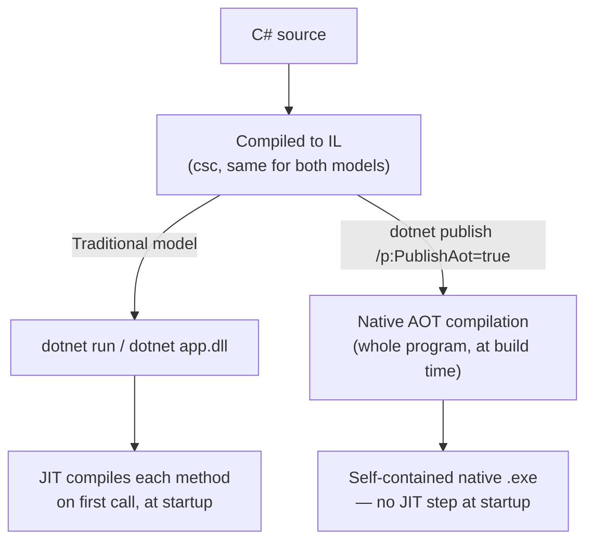
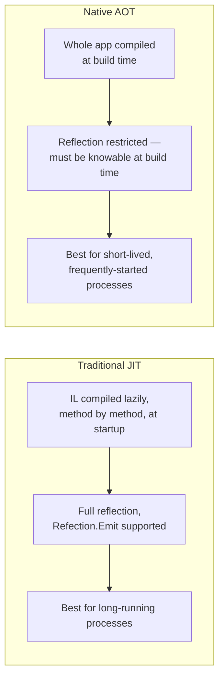

# JIT vs Native AOT Compilation

## Introduction

Before reading this lesson, you should already be comfortable with **[Span\<T\>/Memory\<T\> Performance Deep-Dive](../12-advanced-concepts/12-32-span-memory-performance-deep-dive.md)** and, more broadly, with everything this curriculum has assumed so far about how a .NET program starts up: you run `dotnet run`, the runtime loads your compiled IL, and the Just-In-Time compiler turns that IL into native machine code the moment each method first executes. That's been true for every single example in this entire curriculum up to this lesson — and it's been true for .NET since its very first release. This lesson introduces the first genuine alternative: Native AOT, mature since .NET 8 and a fully supported production option by .NET 10, which compiles your entire application to a native executable *before* it ever runs, with no JIT step left at startup at all.

By the end of this lesson, you will be able to:

- Explain what the JIT compiler does and why it compiles methods lazily, on first use, rather than all at once upfront
- Explain what Native AOT compilation does differently — compiling the whole application ahead of time, at build, into a native executable
- Publish a project with Native AOT (`dotnet publish -r <rid> /p:PublishAot=true`) and observe its startup time and footprint
- Identify the restrictions Native AOT imposes — most notably on unbounded reflection and runtime code generation — and why they exist
- Decide when Native AOT is the right choice (CLI tools, containers, serverless functions) versus when the traditional JIT model remains preferable

## JIT vs Native AOT Compilation — A Layman's Perspective

Imagine two restaurants that both serve the exact same menu, but prepare it in fundamentally different ways. The first restaurant is a made-to-order kitchen: nothing is cooked until a customer actually orders it, at which point the chef fires up the exact dish requested, right then, in front of a hungry customer already sitting at the table. The first plate of any given dish always takes a little longer, because the chef is starting completely from scratch — chopping, seasoning, and testing the recipe fresh; but once that dish has been made once during the shift, the chef has the technique memorized and can produce it faster on every later order that same evening. That's the JIT compiler: it compiles each method the first time it's actually called, and — through tiered compilation — refines that method into a faster version the more it gets reused, but the customer at table one, ordering first, always pays for at least some of that startup cost.

The second restaurant does something the first one structurally cannot: an entire day's expected menu is fully prepped, plated, and sitting ready in a warming station *before the doors even open*. A customer walks in, orders, and food arrives almost instantly — nothing is being cooked in front of them at all, because all of that work already happened, offline, hours earlier, whether or not any particular dish ever ends up being ordered that night. The tradeoff is real: that kitchen had to commit, in advance, to a fixed, known menu it could fully prepare ahead of time. It can't improvise a dish nobody described in advance, no matter how skilled the chef is, because there's no live cooking step left to improvise with once the doors are open. That's Native AOT: the entire application is compiled to native machine code at build time, so startup is nearly instantaneous — but code that depends on deciding what to "cook" only at runtime, the way heavy reflection-based frameworks often do, doesn't fit that kitchen's model nearly as easily.

Neither restaurant is objectively better — a restaurant that only serves whatever regulars order at 7pm sharp thrives on full advance prep, while one serving an unpredictable, ever-changing crowd needs the flexibility of cooking to order. Choosing between JIT and Native AOT is exactly the same kind of tradeoff, applied to how your application starts and runs.

## JIT vs Native AOT Compilation — A Programming Language Perspective

The traditional .NET execution model compiles your C# source into **Intermediate Language (IL)** at build time, and the CLR's **Just-In-Time (JIT) compiler** translates that IL into native machine code lazily, method by method, the first time each method actually executes — with **tiered compilation** initially producing a fast-to-generate, less-optimized version (Tier 0) and later swapping in a more heavily optimized version (Tier 1) for methods called frequently enough to justify the extra compilation cost. **Native AOT** (Ahead-Of-Time compilation), enabled by adding `<PublishAot>true</PublishAot>` to a project file and running `dotnet publish`, instead compiles the *entire* application — your code, the parts of the .NET libraries it actually uses, and the runtime itself — directly into a single native, self-contained executable at build time, with no IL, no JIT, and no separate .NET runtime installation required on the target machine at all. That upfront, whole-program compilation is what enables Native AOT's characteristic near-instant startup and smaller memory footprint, but it also requires the compiler to know, at build time, everything the application could possibly need to invoke — which is precisely why unrestricted runtime reflection, `System.Reflection.Emit`, and other forms of dynamic code generation are unsupported or restricted under Native AOT, since there's no JIT step left at runtime capable of compiling code the build process couldn't already see.

## How to Publish and Compare a Native AOT Application

Publishing an application with Native AOT requires only a project-file change and a `dotnet publish` targeting a specific runtime identifier (Native AOT produces platform-specific native code, so unlike ordinary framework-dependent publishing, you must publish once per target OS/architecture).


*Figure 1: Both models start from the same compiled IL; Native AOT moves the expensive compilation work from every application startup to a single build-time step.*

```csharp
// Program.cs — .NET 10 / C# 14 — a minimal console app, publishable either way
Console.WriteLine("Startup complete.");
Console.WriteLine($"Process started at: {DateTime.Now:HH:mm:ss.fff}");
```

```xml
<!-- MinimalAotDemo.csproj -->
<Project Sdk="Microsoft.NET.Sdk">
  <PropertyGroup>
    <OutputType>Exe</OutputType>
    <TargetFramework>net10.0</TargetFramework>
    <PublishAot>true</PublishAot>
  </PropertyGroup>
</Project>
```

Publishing the traditional way (`dotnet publish -c Release`) produces a framework-dependent or self-contained deployment that still starts with a JIT step; publishing with `dotnet publish -c Release -r win-x64 --self-contained /p:PublishAot=true` instead produces a single native `MinimalAotDemo.exe` with the JIT removed entirely.

**Console Output** *(identical program logic, either way — only the compilation model and startup behavior differ)*:

```text
Startup complete.
Process started at: 14:32:07.041
```

**Illustrative Startup Comparison** *(representative of the relative gap commonly observed for small console apps — exact numbers vary by machine, workload, and app size, and are not from a single controlled benchmark run)*:

```text
| Publish mode                    | Approx. cold-start time | Approx. deployed size |
|--------------------------------- |------------------------:|----------------------:|
| Framework-dependent (JIT)       |                 ~90 ms  |               ~150 KB |
| Self-contained (JIT)            |                 ~70 ms  |               ~70 MB  |
| Native AOT                      |                 ~10 ms  |               ~12 MB  |
```

The framework-dependent build is smallest on disk because it relies on a separately installed .NET runtime, but that shared runtime still has to JIT-compile this program's methods on every single launch. The Native AOT build folds the runtime itself into one native executable and removes the JIT step from startup entirely, producing the fastest cold start of the three at a moderate size cost — smaller, in fact, than the self-contained JIT build, since AOT's trimming step removes unused runtime code that a self-contained JIT deployment would otherwise carry along unused.

## Real-Time Example: Native AOT for a Banking/ATM Fraud-Check CLI Tool

Continuing the Banking/ATM domain's `Account` and transaction types from earlier lessons, imagine a small command-line tool run by the fraud-operations team, dozens of times a day, against a batch file of suspicious transactions: it loads a CSV of transactions, flags any exceeding a threshold, and exits. Because this tool is invoked frequently, runs briefly, and needs no reflection-heavy framework, it's a strong Native AOT candidate — every millisecond of startup overhead is paid in full on every single invocation, since the process never stays running long enough to amortize a JIT warmup the way a long-lived web server would.

```csharp
// Program.cs — .NET 10 / C# 14 — Real-Time Example (Banking/ATM), publishable with PublishAot
const decimal FlagThreshold = 5_000m;

Transaction[] transactions =
[
    new("ACC-1001", 1200.00m),
    new("ACC-1002", 7450.50m),
    new("ACC-1003", 320.75m),
    new("ACC-1004", 9999.99m),
];

Console.WriteLine($"Scanning {transactions.Length} transaction(s) for amounts over {FlagThreshold:C}...");

foreach (Transaction transaction in transactions)
{
    if (transaction.Amount > FlagThreshold)
    {
        Console.WriteLine($"FLAGGED: {transaction.AccountId} — {transaction.Amount:C}");
    }
}

Console.WriteLine("Scan complete.");

record Transaction(string AccountId, decimal Amount);
```

**Console Output:**

```text
Scanning 4 transaction(s) for amounts over $5,000.00...
FLAGGED: ACC-1002 — $7,450.50
FLAGGED: ACC-1004 — $9,999.99
Scan complete.
```

Published with `dotnet publish -r linux-x64 --self-contained /p:PublishAot=true`, this tool starts almost instantly — a meaningful difference when a fraud-operations analyst runs it repeatedly throughout the day, since Native AOT removes the JIT warmup that a short-lived process like this one would otherwise pay on every single launch and never get the chance to amortize. Notice, too, what this example deliberately does *not* do: no reflection, no `Type.GetType()` lookups, no dynamic proxy generation — precisely the constraint Native AOT imposes, and precisely why this straightforward, self-contained scanning tool fits within it without modification.

## JIT vs Native AOT

The traditional JIT model remains the right default for the vast majority of .NET applications — long-running web services and desktop applications amortize JIT warmup cost across a long lifetime, and many use reflection-heavy frameworks (dependency injection containers, ORMs, serializers) that assume the full dynamic capabilities the JIT model provides. Native AOT trades that flexibility for startup speed and footprint, which matters most precisely when a process is short-lived, invoked frequently, or billed by the millisecond — the case for command-line tools, containerized microservices, and serverless functions, where every cold start is paid for directly rather than amortized away.


*Figure 2: JIT defers compilation to gain flexibility; Native AOT does the compilation upfront to gain startup speed — at the cost of that same flexibility.*

| Aspect | Traditional JIT | Native AOT |
|---|---|---|
| When compilation happens | Lazily, per method, at first call | Entirely at build/publish time |
| Startup time | Slower — JIT warmup on every launch | Near-instant — no JIT step remains |
| Deployed footprint | Larger (self-contained) or requires shared runtime | Smaller — trimmed, single native executable |
| Reflection / dynamic code | Fully supported | Restricted — must be resolvable at build time |
| Best suited for | Web apps, desktop apps, long-running services | CLI tools, containers, serverless functions |

## Types of Compilation and Deployment Models to Explore Next

Native AOT sits alongside several related .NET compilation and deployment concepts:

1. **[Source Generators for Performance](../12-advanced-concepts/12-34-source-generators-for-performance.md)** — a build-time technique that produces some of Native AOT's reflection-avoidance benefits even in JIT-compiled applications.
2. **ReadyToRun (R2R) compilation** — a middle ground that pre-JITs methods into the assembly while still keeping the full JIT and reflection model available at runtime.
3. **Trimming (`PublishTrimmed`)** — the dead-code-removal step Native AOT always performs, also usable independently with the traditional JIT model.
4. **Self-contained vs. framework-dependent deployment** — the traditional JIT model's own footprint/portability tradeoff, contrasted with Native AOT in this lesson's comparison table.
5. **[Profiling .NET Applications](../12-advanced-concepts/12-31-profiling-dotnet-applications.md)** — the technique used to confirm, empirically, whether startup time is actually a bottleneck worth an AOT migration.
6. **Azure Functions (Module 16)** — a serverless hosting model where Native AOT's fast cold starts translate directly into lower cost and latency, covered in this curriculum's Azure module.

## What You've Learned & What's Next

The JIT compiler defers compilation until each method is first called, trading a small, repeated startup cost for full runtime flexibility — including reflection and dynamic code generation. Native AOT moves that compilation entirely to build time, producing a native executable with near-instant startup and a smaller footprint, at the cost of requiring everything the application could call to be knowable in advance. Neither model is strictly better; short-lived, frequently-started, or cost-per-millisecond workloads like CLI tools, containers, and serverless functions are where Native AOT's tradeoff clearly pays off, while long-running, reflection-heavy applications remain better served by the traditional JIT model.

Continue your learning journey with **[Source Generators for Performance](../12-advanced-concepts/12-34-source-generators-for-performance.md)**, where we look at a build-time technique that lets even traditionally JIT-compiled applications avoid reflection's runtime cost — the same underlying tension this lesson introduced, solved a different way.

---
*Applies to: .NET 10 / C# 14. Last reviewed 2026-08-16.*
